# 并发
## 多线程编程
### 线程
并发的基本单位是**线程(thread)**
**线程：共享内存的执行流**，拥有独立的上下文和栈帧列表，共享全局变量、堆空间

左边是共享的部分，包括Heap, Global variables, Code
**TCB**(Thread Control Block)维护着线程的状态，寄存器，堆栈等信息，此外还有一个**栈**，线程切换时需要保存和恢复这些信息
线程可以访问**shared state**里面的全局的堆、变量、代码段等
操作系统可以通过**TCB**来管理线程，调度线程的执行

从状态机的角度看，多个线程就是多个共享内存的状态机，线程切换就是状态机的切换
初始状态是线程创建时候的状态，状态迁移是调度器任意选择一个线程执行一步，发生状态转移
因为有共享内存，所以线程之间的状态迁移是相互影响的，线程切换可能会导致共享内存的状态发生变化，导致其他线程的状态发生变化


### Posix基本线程API
- pthread_create: 创建一个新的线程，并让它从 start_routine(arg) 开始执行
- pthread_exit(void *retval)：当前线程主动结束，并把返回值交给将来 pthread_join 它的人（线程函数 start_routine 直接 return 也会结束线程，效果类似）
- pthread_join(pthread_t thread, void **retval)：阻塞自己，等待线程thread结束，并且把thread返回的值放到retval所指定的内存中
- pthread_yield：主动让出 CPU，让调度器先运行别的线程。这个接口基本被废弃，通常用 sched_yield()
- pthread_detach(pthread_t thread)：把线程thread设为“分离态”，该线程结束后资源由系统自动回收，即使主进程结束也不被杀死，不能再被其他线程join

### 线程的生存周期

经历初始化、就绪、运行、等待和结束的周期


## Heisenbug

Heisenbug：在多线程程序中，bug的出现和消失是随机的，无法重现的，这种bug被称为Heisenbug
不确定的**线程调度**（到底选哪一个线程进行下一步），以及可能“被迫”改变的线程状态（由于**共享内存**），会使得程序非常容易出现BUG，并且这些BUG往往很微妙、难以捉摸（不是每一次执行都能确定捕捉）

根因是以下三个挑战：原子性丧失、顺序化丧失和全局一致化丧失

### 原子性丧失

原子性：一个原子性的操作即是一个在其“更高”的层面上无法感知到它的实现是由多个部分组成的，一般来说，其具有**两个属性**：

- **All or nothing**: 一个原子性操作要么会按照预想那样一次全部执行完毕，要么一点也不做，不会给外界暴露**中间态**;
- **Isolation**: 一个原子性的操作在操作共享变量时**中途**不会被其他操作干扰，其他所有关于这个共享变量的操作要么在这个原子性操作之前，要么在其之后
  
  
  在这个程序里面，线程1和线程2都执行sum++，sum++的操作不是原子性的
  sum++的汇编代码如下：

```
mov $rax, [sum]  ; 将sum的值加载到rax寄存器中
add $rax, 1      ; 将rax寄存器的值加1
mov [sum], $rax  ; 将rax寄存器的值保存回sum变量
```

不同线程的$rax寄存器也是不同的，线程切换时会保存和恢复寄存器的值，所以每个线程都有自己的$rax寄存器状态，所以这样出来的结果就是错的，原子性丧失了
这样重复2N次，我们需要的是sum=2N，但是sum的最小值是2，原因如下


这样违反了All or nothing的属性，sum++的操作要么全部执行完毕，要么一点也不做，但是现在它**暴露了中间态**，sum++的操作被打断了，导致结果不正确

即使让sum++**变成原子性**的，变成一个单指令的一行代码，也不能保证正确，因为sum++的执行顺序可能会被打乱，导致结果不正确


类比流水线中的数据冒险，会产生数据竞争(data race)，指令重排可能会导致sum++的执行顺序被打乱，导致结果不正确，违背了Isolation的属性

实现原子性是重要主题，加锁。

### 顺序化丧失

顺序性：程序语句按照既定的顺序执行
然而，只要不影响语义，其实指令是否按照顺序执行并不重要
‣ 编译器就会通过**reorder instructions**来优化程序，因为编译器会优化程序的性能，**指令重排**是编译器优化的一种手段，可以让程序运行得更快
‣ 这些优化在单线程下往往没有问题，但一旦到了多线程，很多逻辑就错了
编译器是单线程的逻辑

##### 例子

对于代码

```c
#define N 1000000000
#define NUMBER_OF_THREADS 2
long sum = 0;

void *T_sum(void* nothing) {
    for (int i = 0; i < N; i++) {
        sum++; // 循环内对共享变量sum自增
    }
    return NULL;
}
```

如果打开-O1选项，编译器会把循环不变式外提，因为编译器发现sum是一个全局变量并且只有++这个操作，所以把sum++移出循环，原来的循环变成空的，函数部分的代码变成：

```c
void *T_sum(void* nothing) {
    sum += N; // 循环外对共享变量sum自增N次
    return NULL;
}
```

这样优化之后，确实结果是对的，但是顺序性丧失了，代码的语义发生了改变，原来的代码是每次循环都对sum进行自增，而现在的代码是直接对sum进行一次自增N次，这样就违反了顺序性的属性
是的，这样代码更正确，因为结果是对的，但是他违背了我本来想要的代码逻辑
保持顺序性，不是为了 “结果对”，而是为了代码的行为必须和我写的一致
这样的优化不是解决了并发问题，而是消灭了并发的行为
如果不保持顺序性，比如我要先检查状态是否ready，再进行下一步操作，如果编译器把这两步的顺序打乱了，那么就可能导致错误的结果，他可能先进行下一步操作，再检查状态是否ready，这样就违反了顺序性的属性

而且还违反了Isolation的属性，虽然每个线程只对这个共享变量写一次，竞争非常小，但是并发错误没有消失，两个线程还是可能会同时对sum进行写操作，依然是data race

#### 另一个例子


在这个程序里，我本来希望线程A看到done变成true了之后退出循环，线程2的作用就是把done设为true。
但是编译器把`while(!done)`的代码优化`if(!done) while(1)`，也就是把循环不变式外提了，这样线程A就永远看不到done变成true了，导致死循环了
这是一个典型的并发错误示意：数据竞争 + 编译器重排/优化，导致程序行为和期望不一致。

## **（重要）内存一致性模型（一道选择题）**

现代处理器往往允许指令乱序执行，但是这种乱序会导致多个处理器看到不一致的访存顺序
内存一致性模型（Memory Consistency Model，简称内存模型）明确定义了不同核心对于共享内存操作需要遵循的顺序

### 顺序一致性模型

顺序一致性模型保证：

- 首先，不同核心看到的访存操作顺序完全一致，这个顺序称为**全局顺序**（IRIW，假如说核心1改了x，核心2改了y，核心3先读x再读y，核心4先读y再读x，那么如果核心3读到x是新值y是旧值，就判断核心1发生在核心2之前，但是如果核心4读到y是新值x是旧值，就判断核心2发生在核心1之前，这就会导致不同核心看到的顺序不一致。如果有缓冲区的存在，IRIW很可能发生，看TSO模型就懂了）;
- 其次，在这个全局顺序中，每个核心自己的读写操作可见顺序必须与其程序顺序保持一致（对某个核心自己写的代码来说，代码里先写的操作，在这条全局线里也必须先出现；后写的操作必须后出现）
  程序顺序就是代码文本里的先后顺序，可见顺序是其他核心观察到这些代码的读写时候的先后顺序
  
  这个shared memory就是一个时间线
  
  
  对于这样的一个代码，只要对于每个线程保证他自己的读写操作的顺序和程序顺序一致，就可以，因此有多种可能的执行结果


16798 次输出 0 0
65322 次输出 0 1
17878 次输出 1 0
2 次输出 1 1
要支持顺序一致，很难，顺序一致性是一个理想化模型
那么能输出0,0吗？

### TSO(Total Store Ordering)内存模型


这里在说明的是，在顺序一致的模型之下，输出0,0是完全不可能的，因为如果线程1先执行了x=1，那么线程2就一定会看到x=1
如果两边都读到了0，意味着，线程1读y发生在线程2写y之前，线程2读x发生在线程1写x之前，这样就违反了全局一致性的属性了

TSO 一致性模型中，其保证对不同地址且无依赖的“读读”、“读写”、“写写”操作之间的全局可见顺序，但不保证“写读”的全局可见顺序 （X86支持的就是这个模型）

TSO 允许的：A 的写还卡在 A 的缓冲里时，A（或别人）的读先生效了 → 写读错位。
TSO 仍然禁止的：A、B 两个核心对"谁的写先生效"产生分歧
其实就是TSO多了一个buffer，每次写的时候先写到当前核心的buffer里面，等buffer刷出的时候才更新写的值
所以这样写读的顺序就可能出问题，打印出0,0的情况就是因为写的新值都还在buffer里面，读到的是对方的旧值0

### 宽松内存模型


宽松内存模型（Relaxed Memory Model）的核心：不同地址、彼此没有依赖关系的访存操作，不保证顺序
图中，线程里的 W 是写，R 是读
图中不同的 Memory 1/2/3/4/5 表示不同内存位置
在这种模型下，线程对这些内存的读写，不一定按写代码的顺序对外可见
所以“先写 A 再写 B”不等于别的核心一定先看到 A 再看到 B

这是一个典型的消息传递的并发，线程 A 先写数据，再用 flag 通知线程 B；线程 B 先等 flag，再读数据。
然而，在宽松内存模型下，可能会出错（写写全局顺序不一致），TSO模型下是正确的，因为TSO只不保证写读
A 里“写 data”和“写 flag”的可见顺序，可能对别的核心不一致，那么有可能B 已经看到 flag=READY，但 data 还没真正对它可见

要想在宽松内存模型下正确运行，需要在写 flag 之前插入一个 Store Barrier，确保数据写入的顺序对其他核心可见；在读 flag 之后插入一个 Load Barrier，确保读到 flag 的值后，能看到之前的数据写入。（内存屏障）

## **（重要）互斥**

### 一些术语

临界区：访问共享资源的**代码段**
竞态条件：出现在多个执行线程大致同时进入临界区时，它们**都试图更新**共享的数据结构，导致非预期的结果
当一个程序有一个或者多个竞态条件，程序的输出会因运行而异，具体取决于哪些线程在何时运行，导致**不确定**的结果
如何设计机制使得临界区**避免出现竞态条件**是“并发”的重要主题

#### 安全性和活性

安全性：没有坏事发生
安全性要求执行中的任何有限步骤内都保持这个性质

活性：最终会发生好事
活性要求只要在**最终**能满足要求即可，一个隐含的要求是执行中不能发生**不可挽回**的步骤
比如要求程序能最终结束，那么程序不能死循环，否则就无法满足活性要求

#### 临界区问题的解决方案需满足的条件

在并发系统中，多个进程/线程会共享数据或共享设备（比如内存变量、文件、打印机），而访问这些共享资源的那段代码叫临界区。
如果多个进程同时进入各自临界区，就可能导致数据不一致、结果错误，这就形成了“临界区问题”。

1. 互斥(Mutual Exclusion)：在任何时刻，最多只能有一个线程可以进入临界区(safety property)
2. 行进(Progress)：如果没有线程在临界区内，并且有一些线程想要进入临界区，那么最终那些线程中的一个会进入临界区(liveness property)
3. 有界等待(bounded waiting): 如果某个线程想要进入临界区，那么其等待的**期限有限**（期间其他线程进入该临界区次数有上限），不可一直排队等待(Fairness/No starvation)
   ‣ 如果这个上限没有被指定，那么这就是一个`Liveness property`，其最终会进入！
   ‣ 如果这个上限被指定具体数字，那么这就是一个`Safety property`，因为任何一次执行的有限步骤内，其等待进入的次数只要超过这个上限就发生了“坏事”！

除此之外，还有一个临界区问题的解决方案所需要关心的，那就是性能（performance）
**进入和退出**该临界区的两个操作应该相对于在该临界区内做的计算而言尽可能的小

经验法则(Rule of thumb): 当设计并发算法时，优先考虑安全性！(but don't forget liveness and performance).


printf是临界区代码，因为涉及共享的输出流

### 锁（Lock）

锁是一个**变量**，其保存了锁在某一时刻的状态。
它要么是**可用的**available，或unlocked，或free），表示没有线程持有锁，要么是**被占用的**（acquired，或locked，或held），表示有一个线程持有锁，**正处于临界区**

两个配对操作：

- lock()/acquire(): 如果没有其他线程持有锁，那么该线程获取锁，进入临界区。如果锁已经被占用，则调用线程会被阻塞，直到锁变为可用并拿到锁
- unlock()/release(): 释放锁，使其变为可用状态。如果有其他线程正在等待该锁，那么**其中一个线程**将被唤醒，获取锁并进入临界区

锁为程序员提供了最小程度的调度控制，通过给临界区加锁，保证临界区内**只有一个活跃变量**（互斥）

例子：

```c
long sum = 0; // 共享变量sum
void *T_sum(void* nothing) { 
 for (int i = 0; i < N; i++) { 
 lock(); // 进入临界区
 sum++; 
 unlock(); // 离开临界区
 } 
}
```

如何实现这样的锁？

#### 尝试1：关中断

能否使当前程序状态机独占计算机系统？
‣ 单处理器系统中 “其他任何事”：仅有中断！
一条指令就可以实现原子性（lock() -> disable interrupt）
unlock()就是再次打开打开中断

但是这样有问题。

- 临界区的代码死循环了，会导致整个系统也卡死了
- 中断关闭时间过长会导致很多其他重要的外界响应丢失（比如错过了磁盘I/O的完成事件）
- 关中断是特权指令，用户态的应用是无法执行的，只有**操作系统**有这个权限！
- 多处理器系统中，中断是每个处理器内部状态，每个处理器有独立的寄存器组，关中断只能保证当前处理器上的线程独占计算机系统，但其他处理器上的线程仍然可以执行，无法实现互斥

#### 尝试2: 通过软件(Lock标志)

一个简单的想法：使用一个标志flag来表达此时锁的状态，比如：为1就是已被占用，为0就是可用的。对应的lock() 和 unlock()

```c
int flag = 0; 
void lock(){ 
 while (flag == 1); //自旋的观测flag
 flag = 1; //设置
} 
void unlock(){ 
 flag = 0; 
}
```

这里必须假设读取一个变量并判断它的值是**原子的**
也就是像 if (flag == 1) 这种“先把 flag 读出来再判断”的过程是原子的
还有设置一个变量也是原子的
也就是像 flag = 1 或 flag = 0 这种赋值操作是原子的
但是在多处理器系统中，这些操作都不是原子的，可能会被打断，导致竞态条件的发生

这个方法不过是把共享变量存在的竞态条件转移到了flag的这个状态变量上而已
‣ 完全存在两个线程同时发现flag为0，然后都进入临界区的可能！ (not safe)


因为“先检查 flag==0，再把 flag=1”这两步不是一个不可分割的原子操作，两个线程可能出现这样的交错执行

- 线程 A 先读到 flag=0
- 线程 B 也在这时读到 flag=0
- A 认为锁空闲，进入临界区，并把 flag 设为 1
- B 也已经“以为”锁空闲了，于是同样进入临界区
结果就是：两个线程同时进入临界区，互斥失败

#### 尝试3：互斥的test（互斥的判定条件）

如果每个线程都是采用同一个判定：test flag == 1，那么完全存在所有的线程都可能得到同样的True
那么如果每个线程都采用不同的判定，使得一个线程回答true的同时其他线程回答false，那么就可以保证互斥了

如果flag是这个线程unlock设置的值，那么就一直忙等（自旋）

也就是说，当线程 A 退出临界区并执行 unlock 时，系统会把机会交给线程 B，A 下次再来申请 lock 时，条件通常不满足，所以会被挡住，只有 B 先进入、再退出，A 才有可能在之后变成“轮到自己了”

所以这个方法存在一个问题：一个线程能否得到一个锁完全依赖于另外一个线程是否先进入了临界区


### Peterson算法

主要思想就是之前尝试3中的test的改进：除了测试flag之外，还看看是否有别的线程要进入临界区（这个部分可以避免之前尝试出现的可能没有“行进”问题）

- 因此，除了有一个全局变量来进行 flag == i 判定，还得有一个全局变量 intents 来记录是否有其他线程要进入临界区
- Peterson原始算法只能在两个线程上工作，不过该算法很容易拓展到N个线程上（当然，N必须提前知道）

下面是一个正确的实现：

```c
int intents[2] = {0, 0}; //进入意图
int flag = 0; // 当前是谁可以获得锁 (thread 0 or 1)
int self = i; //当前的线程ID，0,1中的一个
void lock() { 
 intents[self] = 1; // 标记自己想要进入临界区
 flag = self; //轮转到下一位，提早设置flag，这样就能保证如果另一个线程也想进入了，那么它就会被挡住，直到当前线程进入并退出了临界区
 while ( (intents[1 - self] == 1) //别人想不想要进来
 && (flag == self) ); // 如果别人也想进来，就再看看是否当前“轮转”到自己了
} 
void unlock() { 
 intents[self] = 0; //标记自己不再想要进入临界区
}
```

### 自旋锁的一个改进

当一个线程在**自旋等待**（也叫忙等待，busy waiting）时，它一定能够最终进入临界区吗？

- 不一定，如果一直有其他线程要进入临界区，并且这些其他线程一直被优先调度进入临界区（我们不能假定调度策略），那这个线程就可能会一直等在那里（**违背了有界等待**）
- 解决方法也很简单：排队

每次尝试进入临界区就拿一个“号”（下一个尝试的“号”加一），等待“叫号”

```c
typedef struct  lock_ticket { 
int ticket; //当前发放的最大票号 
int turn;   //当前应该进入的票号 
} lock_t; 
lock_t flag; 
void lock_init() { 
flag.ticket = 0; 
flag.turn   = 0; 
}
```

排号自旋锁（Tick Lock）的加锁和解锁, 通过原子的 “fetch_and_add”实现
ticket：发号器，记录“下一个可分配的号”
turn：叫号器，记录“当前轮到哪个号进入临界区”

```c
void lock() { 
int myturn = 1; // 表示我要将ticket加1，然后flag.ticket的旧值就是我这个线程的号
//atomic fetch-and-add 
//equal to myturn = __sync_fetch_and_add (&flag.ticket, 1); 
   // 等价于 flag.ticket += 1，并返回flag.ticket的“旧”值给myturn 
asm volatile ( 
            "lock xaddl %0, %1"
            : "+r" (myturn),  "+m" (flag.ticket)           
            :                          
            : "memory", "cc" 
    ); 
while (flag.turn != myturn); // 如果还没叫到我的号，就一直spin
}
void unlock() { 
int value = 1; 
asm volatile ( 
        "lock xaddl %0, %1" // 等价于 flag.turn += 1
        :"+r"(value), 
        "+m" (flag.turn) 
        :                       
        : "memory", "cc" 
    ); 
}
// 这样更新了flag.turn，就可以叫新的号
```

并不是所有线程都“彼此”需要互斥，我们应该给需要彼此互斥的线程集他们独有的“锁”, 更加“细粒度”的锁可以提高并发性能


### 在内核中实现自旋锁的问题

内核的实现中会出现很多需要访问共享资源的情况（毕竟，操作系统就是资源的管理者）
• 因此内核中使用**互斥锁**的情况非常普遍
‣ 比如线程利用系统调用访问共享的终端输出时(write)，OS会用锁来互斥各个线程
• 内核可能会在各个部分用到自旋锁，除了系统调用程序外，还有中断处理程序中也可能用到(用户程序没有这个部分)，如果临界区非常短，直接睡眠再唤醒反而更慢

互斥锁的特点是，线程拿不到锁会**被阻塞**，交出 CPU，等锁可用时再**被唤醒**。它适合锁持有时间较长、竞争可能较多的场景，因为不会白白消耗 CPU。

自旋锁的特点是，线程拿不到锁就**一直循环检查**，原地等待，不会睡眠。它适合锁持有时间很短、上下文切换代价比等待更高的场景，因为避免了睡眠和唤醒的开销。

互斥锁：等不到就睡觉
自旋锁：等不到就一直转

在内核里用自旋锁时，如果处理中断不当，会出现“永远转圈”的死锁。考虑如下情况：

- 一个线程利用系统调用访问一个共享变量，kernel在访问这个共享变量时上了锁
- 此时一个中断发生了，CPU强制转向**中断处理程序**，这个中断处理程序也需要访问这个共享变量，因此尝试获得锁，但是发现这个锁已经被持有了，因此**自旋等待**
- 中断处理程序的优先级一般很高，要高过系统调用
- 因此该中断处理程序就会一直等待一个不再可能发生的事情，产生死锁

### 应用程序里的使用互斥锁问题

内核中的临界区一般都为“短”临界区

自旋锁本身的问题：
除了进入临界区的线程，其他处理器上的线程都在空转，浪费CPU资源
如果临界区执行时间过长（用户线程的常态），其他线程浪费的CPU很多
此外，如果发生**中断**将临界区的线程切出去了，计算资源浪费更加严重，然而用户态无法通过关闭中断来解决问题

一个简单解决方案：yield
利用系统调用sched_yield()直接让出CPU，让其他线程获得CPU使用

```c
void yield_lock(spinlock_t *lk) { 
    // xchg是一个原子操作，尝试用xchg拿锁，如果拿不到就一直循环
    while (xchg(&lk->locked, 1)) { // 尝试用xchg拿锁，如果拿不到就一直循环
        //a wrapper of sched_yield() 
        syscall(SYS_yield); // yield() on AbstractMachine
        // 因为拿不到锁，所以让出CPU，等其他线程运行完了之后再来尝试拿锁，这样就不会一直空转了 
  } 
} 
void yield_unlock(spinlock_t *lk) { 
xchg(&lk->locked, 0);  // 释放锁
}
```
sched_yield()什么时候返回？调度器决定。
但是这样还是有问题。yield只是暂时让出CPU，该线程还处在"ready"的阶段，随时可以被再次调度。
在获得锁之前，反复的"被调度—>让出CPU"会带来大量的不必要的context switches
也就是他仍然是一个自旋，会反复尝试拿锁，拿不到就yield，yield之后又被调度回来就会继续尝试拿锁，如果拿不到就又会yield
这样就会有大量的**上下文切换**，虽然比纯自旋要好，但是还是不够好。

**解决方案**
用户使用和释放锁应该和OS调度程序配合：
互斥锁
- mutex_lock(&lk): 试图获得lk，如果失败(lk已被持有)，利用系统调用**阻塞**该线程（此时不是就绪态了，无法被调度），让出CPU并将其加入**等待锁的队列**之中。否则，成功获得锁进入临界区。
- mutex_unlock(&lk): 释放锁，如果等待该锁的队列里有线程就利用系统调用选择一个唤醒，使其变成**就绪态**（ready），从这个等待队列删除，并进入就绪的队列，可以被再次调度。
- 操作系统需要对一个锁维持一个与其相关的**队列**

没那么简单。
看下面的实现有没有问题

```c
void mutex_lock(spinlock_t *lk) {
    int got;
    do {
        got = atomic_xchg(lk->status, LOCKED);
        if (got != UNLOCK) {
            // 将当前线程加入等待队列，并标记为阻塞, 释放cpu
            wait(lk->wait_list);
        } else {
            break;
        }
    }
}
void mutex_unlock(spinlock_t *lk) {
    atomic_xchg(lk->status, UNLOCKED);
    if (!is_empty(lk->wait_list)) {
        // 等待队列中的一个线程移出队列，标记为就绪
        wakeup(lk->wait_list);
    }
}
```


Thread 1 发现锁不是 UNLOCK，准备去等待队列睡眠。
但它还没真正进入等待队列时，Thread 2 执行了解锁：先把锁状态改成 UNLOCKED，检查等待队列是否为空，如果不空就 wakeup
Thread 2 检查时，等待队列“此刻是空的”，所以没有唤醒任何线程。
随后 Thread 1 才执行 wait(...) 进入睡眠。
结果：这次唤醒机会已经错过了，Thread 1 可能一直睡下去。

我们可以利用Linux Futex (“Fast Userspace muTEX”) syscalls来实现互斥锁

- `futex_wait(int *addr, int expected)`: 原子地test，如果*addr == expected，就阻塞，等待被唤醒，否则立即返回给用户线程，使其可以立马再次尝试lock
- `futex_wake(int *addr, int num)`: 唤醒一个等待address指向的锁的线程

```c
#define UNLOCK    0 // 锁空闲
#define ONE_HOLD  1 // 锁被持有，无等待者
#define WAITERS   2 // 锁被持有，而且已经有等待线程

void mutex_unlock(spinlock_t *lk) {
    // state can only be ONE_HOLD or WAITERS
    if (atomic_dec(lk) != ONE_HOLD) {
        // 如果返回值不是 ONE_HOLD，说明除了当前持有者之外还有等待者
        lk = UNLOCK; // 把状态设为 UNLOCK
        futex_wake(lk); // 调用 futex_wake 唤醒等待线程
    } else {
        // 说明没人等
        return;  // the fast path unlock
    }
}

void mutex_lock(spinlock_t *lk) {
    // 这一行干两件事：
    // Return old value of state;
    // if lk == UNLOCK, set state = ONE_HOLD （返回的依旧是旧值）
    int c = cmpxchg(lk, UNLOCK, ONE_HOLD);

    if (c != UNLOCK) {
        // Previous state is either ONE_HOLD or WAITERS. 进入循环处理竞争
        do {
            if (c == WAITERS ||
                // If previous state is ONE_HOLD,
                // now it has one more waiter.
                // And it is possible the lock is released now.
                cmpxchg(lk, ONE_HOLD, WAITERS) != 0) {
                futex_wait(lk, WAITERS); // 只有当当前值仍等于 WAITERS 才睡眠，否则立刻返回，尝试抢锁
            }
            // Repeat checking whether the lock is released.
        } while ((c = cmpxchg(lk, UNLOCK, WAITERS)) != 0);
    } else {
        return;  // the fast path lock，直接拿到锁
    }
}
```


## **（重要）同步**
### 受控制的线程：同步
并发的困难：“未来”可能性太多，并发程序的语句执行顺序是不确定的
为了达成/避免一些状态，我们需要线程受控制，其往往需要：
- 不能太快（比某些线程快）到达某个状态 （比如在某个线程出临界区之前不能提前进入临界区这个状态）
- 不能太慢（比如某个状态达成了，就得行进下去）

同步：控制并发，使得两个或两个以上随时间变化的量在变化过程中保持一定的**相对关系**
互斥也是一种同步

简单的互斥（加锁、解锁）并不能控制线程的执行顺序

### 生产者-消费者问题
• 一个或多个线程**共享**一个数据缓冲区问题，该缓冲区**容量有上限**（有界缓冲区）
• 线程分为两类：一类生产数据（**生产者**），一类消费数据（**消费者**）
• 该问题由Dijkstra首先给出，可以代表绝大部分并发问题


一个简化版问题（打印括号）：
生产=打印左括号，消费=打印右括号，缓冲区=括号的嵌套深度
比如： 
- `(((`  意味着在缓冲区生产了三个未被消费的括号
- `((())((`  也意味缓冲区生产了三个未被消费的括号：一开始生产了3个，然后被消费了两个，接着又生产了2个
```c
void produce() { printf("("); } 
void consume() { printf(")"); }
```

然而：不是所有的打印括号序列都是合法的，比如在缓冲区容量为3的前提下： 
`(()))`是非法的，此时缓冲区没有数据了，无法消费 
`(((())))` 也是非法的，生产了超过缓冲区容量的数据

我们要实现同步，其实就是需要生产者和消费者不能不受控制的打印括号，而是在某些“条件”满足的情况下才能允许打印：**受控的线程**

判断括号的深度很简单：每打印一个左括号，深度加1；每打印一个右括号，深度减1
真正难的是如何实现wait_until(condition)这个函数

#### 没学过并发编程的尝试
- 生产者直接判断depth < n，为真意味着缓冲区有空间，打印`(`，并标记使用缓冲区的数量增加1，否则什么都不做然后自旋等待
- 消费者直接判断depth > 0,  为真意味着缓冲区有数据，打印`)`，并标记使用缓冲区的数量减少1，否则什么都不做然后自旋等待

这样显然是不对的，因为对共享变量depth的访问没有互斥，可能会出现竞态条件，违背安全性

#### 解决尝试1
使用互斥锁保护depth变量
```c
void produce() { 
    while(1) { 
    retry:  
        mutex_lock(&lk); 
        int ready = (depth < n);  
        mutex_unlock(&lk); 
        if (!ready) goto retry; 
        mutex_lock(&lk); 
        printf(“(”); 
        depth++;  
        mutex_unlock(&lk); 
    } 
}
void consume(){ 
    while(1){ 
    retry: 
        mutex_lock(&lk); 
        int ready = (depth > 0); 
        mutex_unlock(&lk); 
        if (!ready) goto retry; 
        mutex_lock(&lk); 
        printf(")"); 
        depth--; 
        mutex_unlock(&lk); 
    } 
}
```
在produce里面，当我算出ready是true的时候，ready不会改了，但是注意第54和55行代码之间，depth可能会被别的线程修改了，所以ready可能不再是true了，导致produce错误地打印了一个`(`

在consume函数里面是一样的逻辑。

#### 解决尝试2
之前的问题在于unlock和再次判断可能被打扰，那么我们直接把unlock推迟？
‣ 虽然正确，但是会有性能问题

```c
void produce() {
    while (1) {
    retry:
        mutex_lock(&lk);
        int ready = (depth < n);
        if (!ready) { // 自旋忙等，有性能问题
            mutex_unlock(&lk);
            goto retry;
        }
        printf("("); // printf在锁内，可能比较慢，会导致别的线程无法获得锁，性能问题
        depth++;
        mutex_unlock(&lk);
    }
}

void consume() {
    while (1) {
    retry:
        mutex_lock(&lk);
        int ready = (depth > 0);
        if (!ready) { // 自旋忙等，有性能问题
            mutex_unlock(&lk);
            goto retry;
        }
        printf(")"); // printf在锁内，可能比较慢，会导致别的线程无法获得锁，性能问题
        depth--;
        mutex_unlock(&lk);
    }
}
```

#### 解决尝试3
解决这个性能问题的方法我们也已经知晓：利用操作系统的调度进行阻塞(wait)和唤醒(wakeup)
以produce为例
```c
void produce() { 
    while(1) { 
    retry:  
        mutex_lock(&lk); 
        int ready = (depth < n);  
        if (!ready){ 
            mutex_unlock(&lk); 
            wait(&producer_waiting_list); 
            goto retry; 
        } 
        printf(“(”); 
        depth++;  
        wakeup(&consumer_waiting_list); 
        mutex_unlock(&lk); 
    } 
}
```
但是有唤醒丢失的老问题。
- 线程A检查条件不满足，准备等待。
- A先解锁。
- 在A还没进入等待队列前，线程B把条件改成满足，并发出唤醒。
- 由于此时等待队列里还没有A，这次唤醒等于打空。
- A进入等待队列，等待被唤醒，但B已经发出唤醒了，所以A永远等下去。

#### 解决尝试4
采用futex解决唤醒丢失问题
```c
int cnd1 = 0;  //类比版本号
int cnd2 = 0;
void produce() { 
    while(1) { 
    retry:  
        mutex_lock(&lk); 
        int ready = (depth < n);  
        if (!ready){ 
            int val = cnd1; // 先记下当前条件的值，再解锁
            mutex_unlock(&lk); 
            futex_wait(&cnd1, val); // 如果在wait之前cnd1的值被consume函数修改，那么wait就会失败，直接返回，不会进入睡眠状态，避免了唤醒丢失问题
            // 只有&cnd1==val时才会进入睡眠状态，是原子的
            goto retry; 
        } 
        printf(“(”); 
        depth++;  
        atomic_add(&cnd2, 1); 
        futex_wake(&cnd2); 
        mutex_unlock(&lk); 
    } 
}
```

#### 条件变量
这样，我们就实现了条件变量。
条件变量：用于标记某个用于**同步条件**的变量，其有两个相关的操作
- cond_wait(cond_t *cv, mutex_t *lk)
    - 调用之前调用线程必须先lock(lk)
    - 调用之后原子地阻塞线程和释放锁，必须让出锁
    - 被唤醒时重新acquire the lk

- cond_signal(cond_t *cv)
    - 唤醒一个等在条件变量cv上的一个阻塞线程
    - 如果没有线程阻塞在这个条件变量上，什么也不做


```c
typedef struct condtional_varaible { 
unsigned value; 
}cond_t; // 条件变量的实现可能会比较复杂，这是一个简化的版本
void cond_wait(cond_t *cv, mutex_t *lk) 
{ 
    int val = atomic_load(&cv->value); 
    mutex_unlock(lk); // 先解锁，如果在持有锁的情况下睡眠，会导致死锁，因为其他线程无法获得锁来修改条件变量的值并唤醒这个线程。只有其他线程能够获得锁并修改条件变量的值，才能唤醒这个线程继续执行。
    futex_wait(&cv->value, val); 
    mutex_lock(lk); // 被唤醒时重新acquire the lk，如果不重新acquire the lk，那么这个线程就不会获得锁，这可能会导致竞态条件和数据不一致的问题。
}
void cond_signal(cond_t *cv) 
{ 
    atomic_fetch_add(&cv->value, 1); // 这里存在一个微妙的可能错误（包括之前的解决方案4）：整数会溢出，因此实际实现更加复杂

    futex_wake(&cv->value); 
}
```

#### 用条件变量解决生产者-消费者问题
以produce函数为例：（consume函数类似）
```c
cond_t cv_p = COND_INIT();
cond_t cv_c = COND_INIT();
mutex_t lk = MUTEX_INIT();

void produce() {
    while (1) {
        mutex_lock(&lk);// 互斥锁
        if (!(depth < n)) {// 条件: depth < n
            cond_wait(&cv_p, &lk);// 如果条件不满足，等待在cv_p上，并释放锁，wait
        }
        // 条件满足，继续执行
        printf("(");
        depth++;
        cond_signal(&cv_c);// 唤醒一个在cv_c上等待的线程（如果有的话）
        mutex_unlock(&lk);// 解锁
    }
}

```
尽管该实现看上去十分正确，但是存在问题。
考虑如下情况：一个生产者，两个消费者 $C_1$ 和 $C_2$ ，首先消费者 $C_1$ 等待一个空的buffer，然后生产者生产一个数据，调用signal函数唤醒 $C_1$，但此时如果 $C_2$ 抢先一步进入临界区（在C1拿到锁之前先抢到锁），并消费掉了数据后返回，然后 $C_1$ 才被真正唤醒进入临界区，
但此时，临界区已经没有数据可以消费了，错误！

产生的上述问题的原因是由于调用Signal通知某个线程，和那个线程wait被唤醒**不是原子**的，这就是Hansen (or Mesa) 语义
**Hansen语义**：
当一个线程A调用signal函数时，操作系统会选择一个等待在条件变量上的线程B进行唤醒，A不会立即把执行权交给等待线程 B。
B 只是从阻塞态变成“可运行态”，之后还要重新竞争锁，这就可能导致其他线程抢先一步进入临界区，修改了条件变量的状态，从而导致被唤醒的线程B在继续执行时发现条件不满足，出现错误。

与之相对的，Tony Hoare提出了另一种语义，即cond_signal和cond_wait之间是原子的，
cond_signal程序将互斥锁转移到被唤醒的程序，并阻塞自己（只有等被唤醒的程序返回或者再次阻塞才会返回该signal线程，当然互斥锁也需要一并转移回它），因此其他线程无法再进入临界区
‣ 这保证了被唤醒线程所等待的那个条件是保持的！

#### Hansen/Mesa  VS  Hoare
在 **Hoare 语义**下，signal 的那一刻会“立刻把锁和执行权交给被唤醒线程”，这个交接是原子的。
所以被唤醒线程一恢复执行时，它之前等待的条件仍然成立，不会被其他线程趁机改掉。
也就是因为这个原因，在Hoare语义下其实之前的解决方案是正确的，在 Hoare 语义里，被唤醒后通常可以直接往下执行，不需要再次检查条件是否满足了。

因此Hoare语义下很多程序性质非常容易证明，深受program language研究人士欢迎，但不受操作系统业界人士欢迎，因为要实现Hoare语义是复杂的
• 相应的Hansen/Mesa虽然不保证安全性，但是实现简单
• 因此Hansen/Mesa是目前大部分系统的默认实现

#### Hansen语义下的正确解决方案
在 Hansen/Mesa 语义下，“被唤醒”不等于“条件仍然成立”，因此我们需要在被唤醒后再次检查条件是否满足，如果不满足就继续等待，这样就避免了之前的错误。
**唤醒后重新尝试**判断条件是否满足

用 if 的问题：
线程**只在进入等待前**检查一次条件。
被 signal 唤醒后，线程会直接往下执行，不再确认条件，因为不是一个循环。
也就是，被signal唤醒之后，线程会从 cond_wait 调用返回之后的下一条语句继续运行
因此如果用while，会回到while循环体的判断条件中再执行一次判断条件是否成立

因此我们只要在判定条件那里使用**while**，而不是if，就可以正确地处理被唤醒后条件不满足的情况了。

```c
void produce() { 
    while(1) { 
    mutex_lock(&lk); 
    while(!(depth < n)){ // 使用while来使得唤醒之后依旧会检查条件是否满足，而不是if
        cond_wait(&cv_p, &lk); 
    }

    printf("("); 
    depth++;  
    cond_signal(&cv_c); 
    mutex_unlock(&lk); 
    } 
}
void consume() { 
    while(1) { 
        mutex_lock(&lk); 
        while(!(depth > 0)){ 
            cond_wait(&cv_c, &lk); 
        } 
        printf(")"); 
        depth--;  
        cond_signal(&cv_p); 
        mutex_unlock(&lk); 
    } 
}
```

#### 一定要用两个条件变量吗？
两个函数用到了两个条件变量，分别是cv_p和cv_c，分别用于生产者和消费者的等待和唤醒
如果我只用一个条件变量cv呢？ 

考虑如下情形：
- 有三个线程：消费者 $C_1$、$C_2$ 和生产者 $P_1$，此时 $C_1$、$C_2$ 首先依次进入临界区，发现数据为空，都阻塞等待
- 然后 $P_1$ 进入临界区，生产一个item之后唤醒一个线程，比如 $C_1$，在 $C_1$ 唤醒之前，$P_1$再次抢先一步进入临界区（hansen语义，抢到了锁），发现没有空间（假设缓冲区为1），阻塞自己
- $C_1$ 此时醒了并进入临界区，消费了这个数据之后，试图唤醒其他线程，但唤醒谁是**没有保障**的（因为都是同一个条件变量）
- 如果唤醒的是 $C_2$，那么 $C_2$ 进入临界区，发现数据为空，阻塞等待，然后 $C_1$ 也尝试进入临界区，阻塞等待, 而 $P_2$ 没有人唤醒它，也处于阻塞等待状态


多个条件变量可以解决这个问题，但是设计上较为复杂，而单个条件变量逻辑上又会出错，有没有比较好的办法？

使用 `broadcast`（条件覆盖）来唤醒所有等待的线程，力大砖飞

一次唤醒所有线程即可，那些需要被正确唤醒的自然会醒来做相应的事情，而那些不该唤醒的，反正需要while循环一次在此判定是否符合条件，不符合条件就再“睡”即可，因此不会影响正确性

#### 条件覆盖（broadcast）解决生产者消费者问题
```c
void produce() { 
    while(1) { 
        mutex_lock(&lk); 
        while(!(depth < n)){ 
            cond_wait(&cv, &lk); 
        } 
        printf("("); 
        depth++;  
        cond_broadcast(&cv); 
        mutex_unlock(&lk); 
    } 
}
```
但是性能上会有问题


### 信号量Semaphore
条件变量是无记忆的，signal不会累计，因此需要程序员手动进行额外的条件判定


如果没有线程在等，sem_post 仍然会把 value 加一，这个唤醒的信号会被记下来，尽管可能没有线程真正醒来。
以后线程调用 sem_wait 会直接通过并 value--。
对比条件变量本身：signal 没人等就丢了，不会累计。
这里靠 value 把历史 post 记住了。


X应该是1，初始值必须要有1个许可，第一个进入的线程就可以直接执行，不用wait


X应该是0，因为在T1里面init这个信号量，要让T2先执行，所以先不给T1许可


也就是理解成许可数


前面我们说信号量的P和V之间因为释放了锁，导致中间的临界区没有锁保护，为什么这里用P(mutex)和V(mutex)就可以呢？
因为这里的mutex用value这个条件变量的值来保护了，mutex内部的互斥锁确实在P和V之后会释放，但是因为前后P和V是对同一个信号量，如果有别人想插进来就发现value的那个条件不成立，所以继续沉睡
所以我们可以发现，二值信号量可以当互斥锁使用，只要满足下面条件：
- 同一个信号量
- 初值为 1
- P和V之间没有其他的P和V操作，进临界区之前P，出来之后V，一减一加

# 虚拟化
## 进程
拥有独立地址空间的运行实体， 可以包含一个或多个线程

与线程的线程控制块（Thread Control Block, TCB）一样，进程也需要一些元信息，用来描述（抽象）进程，方便操作系统管理，即进程控制块（Process Control Block）PCB
PCB、TCB都存储在内核空间，由内核维护
Linux系统的实现中并不刻意区分进程和线程，而是将其统一存储在被称作task_struct的数据结构中。当两个task_struct**共享同一个地址空间**时，它们就是同一个进程的两个线程。


### 进程树
一个进程是被某个进程所创建的，一个进程也可以创建多个进程
- 因此操作系统的进程可以构成一个进程树（Process Tree），其中父进程节点指向其所创建的子进程
- linux下可以通过命令pstree得到当前进程树

第一个进程init
CPU reset → Firmware代码执行 → 加载操作系统并初始化 → 加载第一个进程

init进程加载完之后，操作系统已经完成了所需要资源的管理，并“躺”在后台等待用户命令（syscall）或者中断的发生，来调度进程的执行

### 进程的生命周期
进程创建之后就开始了其运行，直到终止，其生命周期可以描述为如下几个状态(和线程类似)


终止之后的进程的“资源”会被操作系统回收，并通知其父进程其终止状态
为什么要通知？
- 父进程PCB中有指针指向子进程PCB，如果终止之后PCB被回收，指针就指向一个已经被释放的内存
- 已终止但其PCB信息还没被回收的进程被称为“僵尸进程”
- 父进程调用wait系统调用会得到子进程的退出通知（子进程退出前会阻塞父进程）和其退出状态，同时移除该子进程的PCB

但并不是每个父进程都老老实实的wait子进程的，其完全可能在子进程终止前就终止了：这时的子进程是没有父进程的！
‣ 该状态下（没有父进程）的进程被称为“孤儿进程”（Orphan Process）
‣ linux会让init进程重新接管这些孤儿进程，从而能够在这些孤儿进程终止时回收PCB资源

### 进程最重要的三个系统调用
#### fork
创建一个新的（子）进程
‣ 通过做一份当前进程完整的复制 (内存、寄存器现场)
‣ 子进程和父进程会各自独立地继续执行fork之后的指令
如何区分父子进程？
‣ fork的返回值不同: 子进程返回 0,  父进程返回子进程的process ID, 
‣ fork出错返回-1，errno 会返回错误原因 (man fork)
```c
#include <unistd.h>
pid_t fork(void);
```


文件描述符是一个指向操作系统内部对象的指针，比如PCB/TCB、文件对象、socket对象等
对象只能通过操作系统允许的方式访问
‣ 从 0 开始编号 (0, 1, 2 分别是 stdin, stdout, stderr)
‣ 可以通过 open 取得；close 释放； dup 复制；
‣ 对于数据文件，文件描述符会 “记住” 上次访问文件的位置
需要及时关闭不再使用的文件描述符，否则会造成**资源泄漏**


fork 会连缓冲区一起复制,而缓冲方式不同导致结果不同


#### execve
很多时候，父子进程并不是同样的逻辑，子进程有自己的逻辑，比如shell创建进程并不是为了子进程来作为一个shell，而是“加载”某个可执行文件进行运行，变成另一个程序
```c
#include <unistd.h>  
int execve(const char *pathname, char *const argv[], char *const envp[]);
```
execve系统调用会用pathname指定的可执行文件替换当前进程的内存空间（代码段、数据段、堆栈等），并从该可执行文件的入口点开始执行
- pathname: 可执行文件的路径
- argv: 可执行文件的命令行参数
- envp: 可执行文件的环境变量

execve语义：将当前进程重置成一个可执行文件描述状态机的初始状态
- 加载pathname指定的可执行文件（数据段、代码段）
- 重新初始化堆和栈
- PCB中相应的memory mappings也会改变
- 将PC寄存器设置到可执行文件代码段定义的入口点，该入口点最终会调用main函数


execve不会改变PCB中的文件描述符，那些打开的文件描述符还会保持打开


所以在这个pipe创建之后，把父进程的读端关闭，子进程的写端关闭

但如果是父进程打开了一个普通文件，在地址空间里有一个相应的file变量索引，但你的子进程重置了整个地址空间，因此那个文件描述符对应的file变量也没有了，此时你无法close这个文件了！
这会造成资源的泄漏，当然这些资源（PCB）都会随着进程的终止而最终被回收，但在运行期间还是有一些资源的损耗
"文件句柄"(file handle)是一个泛指的概念:它是程序用来"抓住"一个已打开文件的凭据


```c
// 方式一:open 时直接带上 O_CLOEXEC 标志
int fd = open("a.txt", O_RDONLY | O_CLOEXEC);

// 方式二:打开后用 fcntl 设置
fcntl(fd, F_SETFD, FD_CLOEXEC);
```

环境变量：应用程序执行的环境，可以使用env命令查看当前环境变量
export可以给当前shell设置环境变量，export VAR=value

**写时复制(Copy-On-Write, COW)**
fork后面往往跟着execve来加载子进程，那么fork的过程还必要吗？
早期的操作系统在fork时会复制父进程的整个地址空间，**效率非常低下**
- 有些内存是只读的(read-only)，⽐如代码段、共享代码库(libc)，这些没必要复制
- 此外，⽴即执行execve会加载新的可执行文件，重置地址空间，因此，之前的内存拷贝完全没有意义

对于那些可以改变的内存，人们给出了一个聪明的设计：写时拷贝
- 即两个进程共享**同一份物理内存**
- 只有当一个进程尝试去写这个物理内存时才会真正在物理内存中复制一份副本用来给这个进程去写

问题是，写自己的内存是一个“用户态”事件，内核又怎么知道呢？
标记这个共享的内存为“只读”，一旦发生“写”操作会发生权限错误**陷入内核**，操作系统获知这是一个**COW事件**，复制内存！


#### exit
除了创建进程外，进程也需要能够终止：清理其所占内存空间（包括代码区、堆、栈），这个过程需要系统调用来做
Linux中，进程一般有5种退出机制

##### exit()
```c
void exit(int status);
```
是C标准库函数，也是最常用的进程退出函数
- 调用atexit()注册的函数；使得我们可以指定在程序终止时执行自己的清理动作。(atexit()最多可以注册32个函数，调用顺序与注册顺序相反)
- 关闭所有打开的流(stdio)，这将导致写所有被缓冲的输出
- 移除所有的临时文件
- 最后调用_exit()函数终止进程
所以exit函数永远不会返回，而是直接终止进程

##### return from main()
从main函数返回是最常见的终止方式
main函数的返回值和调用exit()的传入参数int status是同样的语义
0是函数是符合预期终止，非0是函数出现了错误终止
在很多编译器中，用下面的方式实现
```c
void _start(void) { 
  /* ... */ 
exit(main(argc, argv)); 
}
```
因为_start 才是程序真正的入口点(entry point)，而不是main。_start 在做完一些准备工作后,调用你的 main 函数,并把命令行参数 argc、argv 传进去。运行完之后，拿到main的返回值，调用exit来终止进程

##### _exit()
- 所有属于这个进程的文件描述符都会被关闭
- 所有该进程的子进程都会被init进程接管
- 向该进程的父进程发送SIGCHLD信号，通知该父进程其已经终止


##### 异常退出
abort()系统调用会导致系统异常终止
- atexit注册的函数不会调用
- io流不会关闭
- 其行为就是产生一个SIGABRT信号发送给调用abort()的进程，然后该进程就会异常终止
- 不会被ignore掉

### 信号(Signal)
Linux操作系统提供了一种可以通知进程发生了某个事件的机制：信号（Signal），注：**不要和并发的singal原语混淆，也不要和“信号量”（Semaphore）混淆**
其本质上是对中断的模拟, 命令kill -l 可以查看有多少信号， man 7 signal查看信号的具体信息
发生某个中断事件之后，用户程序也想获知并处理（而不只是在内核态由操作系统透明的处理）

```c
#include <signal.h>
signal(SIGNAL_NUMBER, handler);
```

signal函数可以注册信号处理函数，只要传入相应的信号和函数名即可
handler设为SIG_IGN时表示忽略这个信号，比如signal(SIGCHLD,SIG_IGN) 就表示忽略掉子进程的终止信号，此时子进程结束会直接被内核完全清除（而不必先变为僵尸进程，然后再被回收）
handler设为SIG_DFL时表示采用linux默认的处理函数

有了信号机制，可以完成很多异步的操作：
- 比如signal(SIGCHLD， handler)，可以在handler里进行wait，而不是在main函数里wait/waitpid从而阻塞父进程
- 比如signal(SIGIO, handler)可以不用等待I/O完成，可以先做其他事情，如果文件描述符所指向的数据传输完成，会产生SIGIO的事件，就可以通过回调函数handler来处理

## 调度
为了满足既定目标，对计算任务进行资源分配的行为，称为**调度**（Scheduling）。

### 调度指标
- CPU利用率(CPU utilization): CPU被进程所使用的时间在所有CPU时间的占比（越大越好）
- 公平(Fairness): 同等优先级下的进程获得的CPU使用时间应该尽可能相等
- 吞吐量（throughput）：单位时间内完成执行的进程数（越大越好）
- 周转时间（turnaround time）：某个进程需要完成的时间（越小越好）
- 等待时间（waiting time）：某个进程在就绪队列的时间（越小越好）
    - 等待时间 = 周转时间 - 获得CPU执行的时间
    - 一个进程可能会多次放到就绪队列中，因此等待时间是这些等待的时间的总和
- 响应时间（response time）：从发出申请执行到**第一次**获得响应执行的时间（越小越好）

### 调度时机
CPU回到操作系统的掌控之中的时候，就会进行调度。CPU回到操作系统的掌控之中有以下几种情况：
- 发生**系统调用**
- 某个运行的进程被**阻塞**
- 发生**中断**
这些事件的发生都意味着系统的状态发生了变化，可能和既定的目标发生了偏离，需要调整（调度）来让系统往既定的目标靠近

### 机制与策略的分离
操作系统中的一个重要设计思想：**机制与策略的分离**（Separation of mechanism and policy），这种设计是一个典型的模块化思想，可以有效降低系统的复杂度
- 机制（Mechanism）: 怎么做
- 策略（Policy）: 做什么
在一个已有的机制上，可以考虑的问题是，有哪些策略？有没有“最优”的策略？
在给定一个策略的基础上，可以考虑的问题是，实现这个策略需要什么样的机制？已有机制是否具备这个能力？实现效果是否理想？
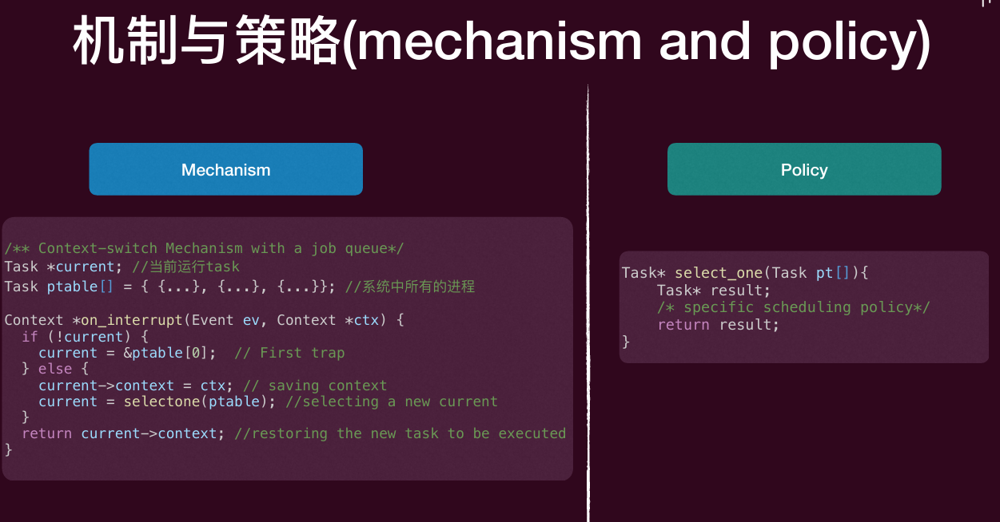
比如上面的图，我们有了context switch的机制，再维护一个PCB（TCB）的队列，当发生一个时间中断时，就可以从这个队列中挑选一个进行执行
不同的挑选的策略都可以在这个机制上运行：
- 随机的调度
- 按照队列的**先后顺序**依次调度，执行完之后再放回队尾
- 我们还可以按照队列的反向顺序调度（类似栈）
但是，在这个机制之下，最好的调度策略是什么？（基于某一个调度指标而言）
如果我们想实现一个按照进程的**执行所需时间**进行调度的策略，上面的机制就不行了，因为我们没有存储每个进程所需要的执行时间
因此，需要一个新的机制，每个进程维护一个其所需执行时间的变量，使得内核可以访问
但是显然不现实！用户无法预判程序完整运行时长

### 调度策略
调度策略大体可以分为如下几类任务
- 批处理任务的调度
- 交互性任务的调度
- 实时任务的调度

#### 批处理任务的调度

##### 先来先服务（First Come First Serve, FCFS）
按照到达系统（就绪）的先后顺序进行调度，也叫先进先出(First In First Out, FIFO)
**护航效应**(convoy effect)：短运行时间的进程排在长运行时间的后面，导致平均等待时间过长的现象。
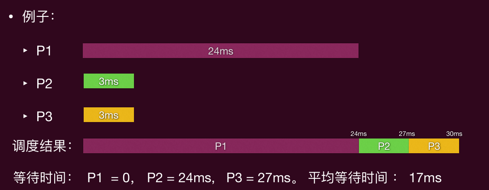
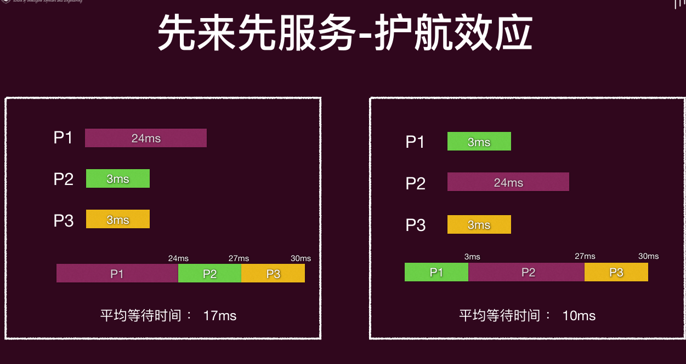

##### 最短作业优先（Shortest Job First, SJF）
- 将每个任务与其需要运行时间关联
- 需要运行时间最短的优先被调度
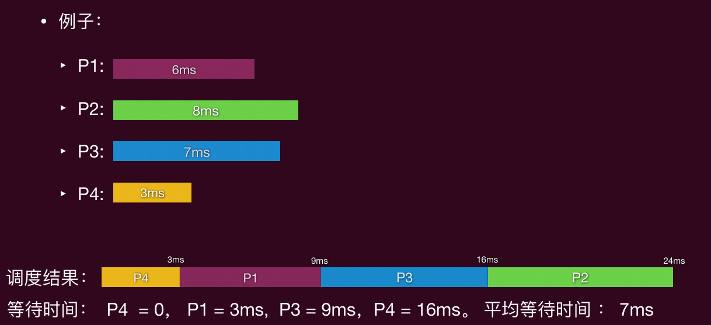
命题：就平均等待时间而言，SJF是最优的
如何证明？
证明思路:
‣ 给定一任意进程排列顺序 S 的平均等待时间
‣ 给出一个将该序列变为按执行时间降序排列的过程，比如冒泡排序
‣ 证明该过程是单调的，即每一步都会导致平均等待时间变长

##### 最短剩余时间优先（Shortest Remaining Time First, SRTF）
一个**非抢占式**调度算法选择一个进程来运行，然后就让它一直运行，直到它被阻塞（无论是在I/O操作上还是等待另一个进程），或者自愿释放CPU。
一个**抢占式**调度算法选择一个进程，并允许其运行一段固定的**最长时间**。如果在时间间隔结束时它仍在运行，则被挂起，调度器选择另一个进程来运行。（需要时间中断的机制支持）

最短剩余时间优先是最短任务优先的**可抢占**（Preemptive）版本
‣ 始终选择剩下需要时间最短的进程进行运行
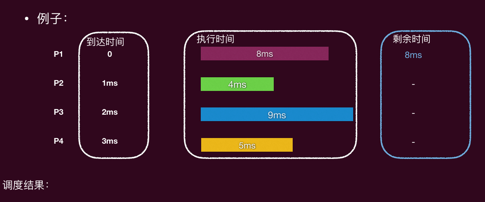
P1先到达，然后执行1ms
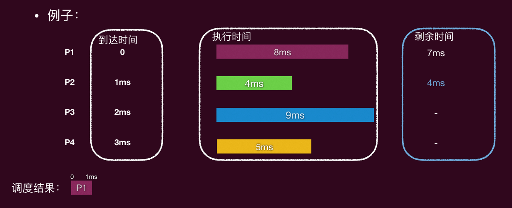
然后P2到达，P2是剩余时间最少的，所以P1被抢占，P2开始执行
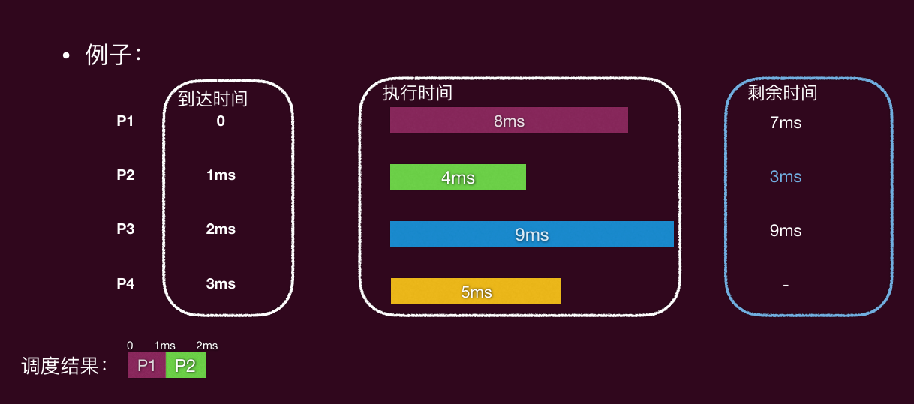
后面P3P4也到达，所以有显示剩余时间，但是P2的剩余时间最少，所以P2继续执行
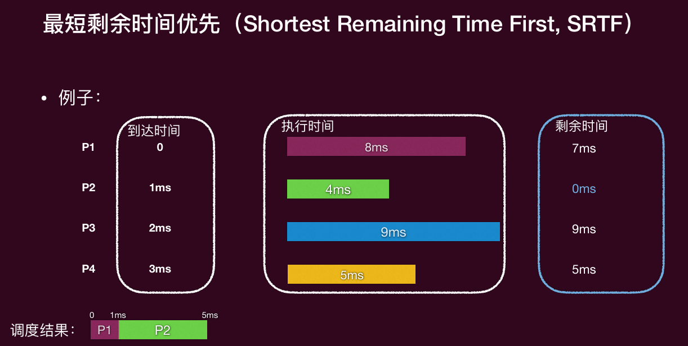
现在P4最少
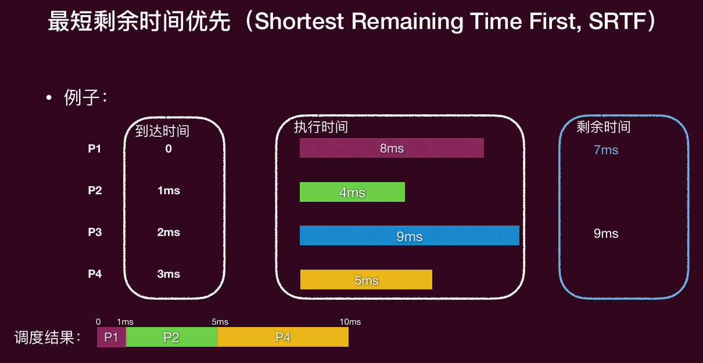
然后P1最少，P1继续执行，然后P1执行完了，P3继续执行
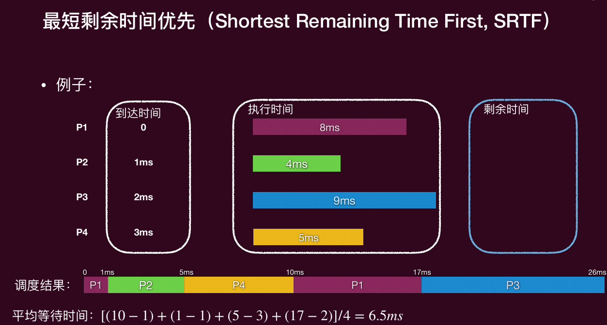
计算这个平均等待时间，像P1这种执行了之后又被抢占的进程，等待时间就要加上被抢占的时间
像其他的，按照从第几ms进来的来计算等待时间

##### 时间预测算法
思想：下一次运行时间应该与之前一次类似


‣ $t_n$：第 n 次实际运行时间

‣ $\tau_{n+1}$: 预测的下一次（n+1）的执行时间
‣ $\alpha$：相关系数
‣ $\tau_n$：上一次预测的执行时间
‣ $\tau_{n+1} = \alpha t_n + (1 - \alpha) \tau_n$
展开$\tau_{n+1}$，可以得到$\tau_{n+1} = \alpha t_n + \alpha (1 - \alpha) t_{n-1} + \alpha (1 - \alpha)^2 t_{n-2} + ... + (1 - \alpha)^{n+1} \tau_0$
由于$\alpha$和$1 - \alpha$都是小于1的数，所以多项式里面每一项都比后面一项的权重更大，这也就是说最近一步的执行时间会更加影响当前推测
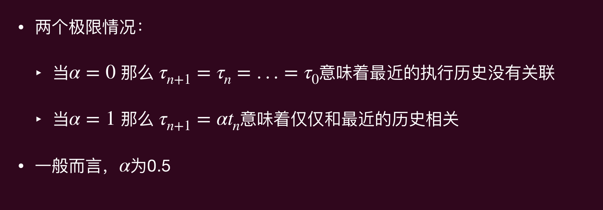

##### SJF的一些缺陷
- 并不公平
- 等待时间差异大，可能会饿死
- 进程的执行时间难以预测
- 最重要的，可能会被愚弄

**愚弄(Gaming)**
将自己切割成很多份“非常”短执行时间的小任务，然后再批量运行这些小任务
把一个长任务分解为大量非常短的作业/任务，然后批量提交或循环运行这些短任务，就会造成不公平

#### 交互性任务的调度
批处理以**吞吐量/周转**为主；交互性以**延迟/响应**为主，调度目标不同。
在调度策略中，有两类进程会被区别对待：计算密集型和I/O密集型 （当然也有混合型）
- 计算密集型：主要消耗CPU计算资源，例如数学运算、图形处理或数据分析等任务。这些程序通常会在 CPU 上执行大部分时间的计算和逻辑判断等操作，而不需要等待外部资源（如磁盘读写或网络通信）完成。
- I/O密集型：系统大部分的时间在等待 I/O（硬盘/内存/键盘）的读取/写入操作（即和外界进行频繁交互的进程），此时 CPU 负载并不高，需要消耗CPU计算的时间很少


##### 时间片轮转调度(Round-Robin, RR)
每个任务都会获得一段固定时间的资源（**时间片**, time-slicing）。
如果任务没有完成，它将重新回到队列中。
- 时间片应该比上下文切换时间略大，否则开销会太高！当然时间片也不能过大，否则就蜕变为FCFS调度了
- 一般来说时间片大概设置为10ms到100ms (context switch一般小于10 ms)
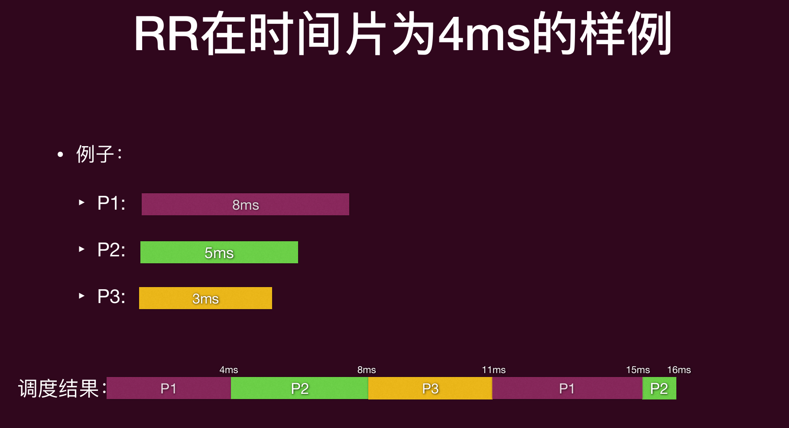
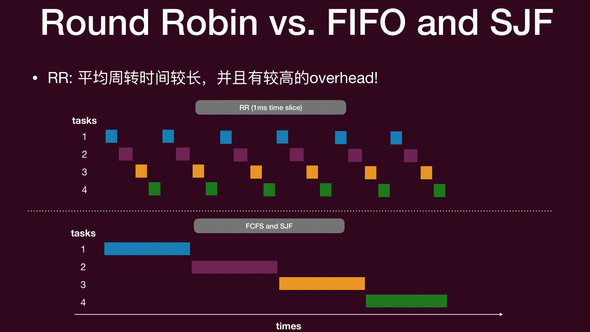
在操作系统/调度里，overhead（开销）指的是为管理、调度和维护系统状态而消耗的时间或资源
RR还有另外一个问题
在运行既有 I/O 密集型任务又有计算密集型任务的情况下，当 I/O 密集型任务执行 I/O 操作时，它会让出处理器（由于需要的CPU计算很短，没有用完时间片就让出CPU了）。
这时即使 I/O 操作很快完成（比如你正在用VIM打字），也必须等待重新分配处理器，直到其他计算密集型任务用完他们完整的CPU切片。
结果就是交互性任务的响应变慢，用户感到延迟
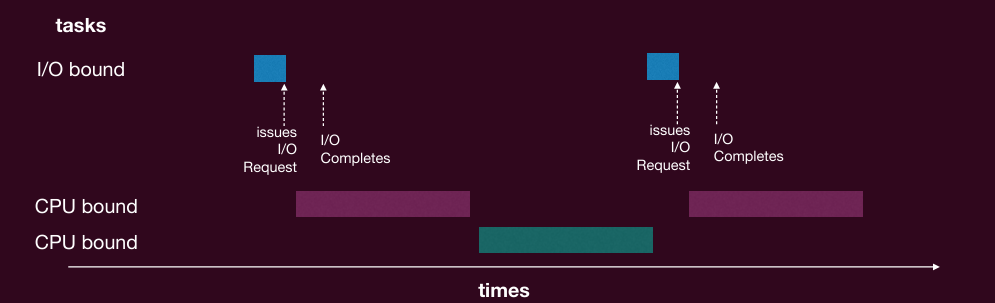

##### 基于优先级的调度(Priority Scheduling)
I/O-bound和CPU-bound的优先级不同，我们需要基于优先级的调度：
- 每个进程都关联有一个优先级数（整数）。
- 每次发生调度时，CPU被分配给具有最高优先级的进程。
• SJF（Shortest Job First）就可以看成是一种优先级调度算法，其中每个进程的优先级与预测其下一个CPU执行时间的倒数成正比。
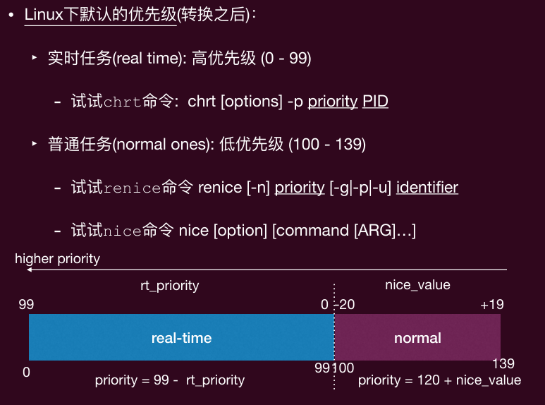
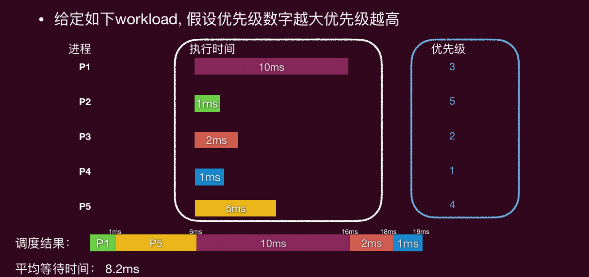

优先级调度会有问题，就是饿死(Starvation)，低优先级的进程可能永远不会执行。
解决方案：老化(Aging)，随着时间的推移增加进程的优先级。
需要一种能动态改变优先级的策略，如：多级反馈队列（multilevel feedback queue）

##### 多级反馈队列(Multilevel Feedback Queue, MFQ)
一个进程可以在各个队列（代表不同优先级）之间移动。
多级反馈队列调度器由以下参数定义：
- 队列的数量
- 每个队列的**调度算法**
- 确定何时将进程**升优先级**的方法
- 确定何时将进程**降优先级**的方法
- 确定当某个进程需要服务时该将进入哪个队列的方法

一个典型的多级反馈队列是**一组**轮转队列：
- 每个队列都有单独的优先级。
- 高优先级队列拥有短的时间片。
- 低优先级队列拥有长的时间片。
调度器选择最高优先级队列中的第一个进程。进程加载到内存中时初始在最高优先级队列中。如果时间片到期，任务会降低一个级别。
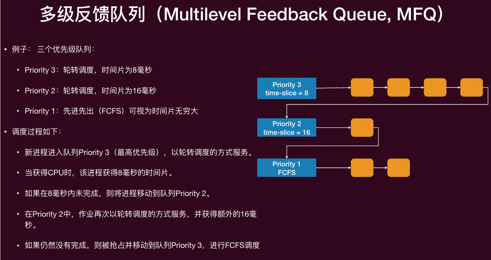
当使用多级反馈队列（MFQ）时：
‣ CPU密集型进程将下沉到长时间片的优先级队列。
- 如果使用完时间片，进程会下降一个优先级。
- 较大的时间片可以减少上下文切换的开销。
‣ I/O 密集型进程将保持在高优先级队列中。
- 如果一个进程没有完成其时间片（即，它在 I/O 操作上被阻塞），那么它将保持在相同的优先级水平。
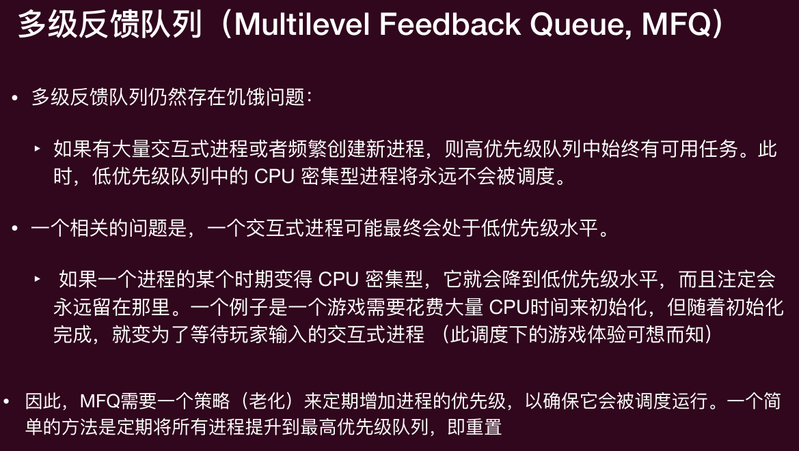

MFQ调度器可以在周转时间、低开销和公平性之间取得平衡。 事实上，它被大多数商业和现实操作系统（包括Windows、MacOS和Linux）使⽤（作为一种策略）
但是他还是可以被愚弄的
⽐如一个恶意攻击者了解调度器的工作原理，那么他/她可以编写代码，在时间片到期之前强制系统在某些低延迟的 I/O 操作上阻塞（例如，睡眠几毫秒）
这样，即使进程反复消耗大部分时间片，它也会因为没有使用完时间片而受到奖励（不被降低优先级），从而始终保持在高优先级水平。

解决方案 — 追踪：
‣ 不仅仅是简单地检查进程是否使用完了它的时间片，调度器会跟踪进程在较长时间间隔（几个时间片）内运行的总时间。 
‣ 每个优先级队列将有一个与之关联的最大CPU时间分配。超出使用的分配则降低优先级。


#### 实时任务的调度
实时系统中时间扮演着至关重要的角色
‣ 某些任务必须在**截止日期**（deadline）之前得到服务；
‣ 截止日期过期后才得到服务与根本没有服务一样。 
• 周期性（Periodic）任务：截止日期以规律的间隔发生
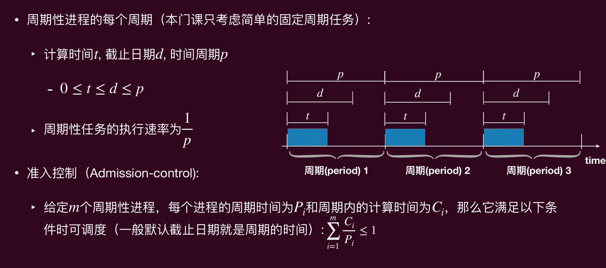

##### 单调速率调度(Rate Monotonic Scheduling, RMS)
根据其速率（即周期的倒数）分配优先级。
‣ 周期较短的任务具有较高的优先级，而周期较长的任务具有较低的优先级。 
- 例如，有两个进程P1和P2，它们的周期分别是50和100，那么P1首先被调度，然后是P2，P1可以抢占P2。
• 这种策略背后的理念是为需要更频繁占用CPU的任务分配更高的优先级。
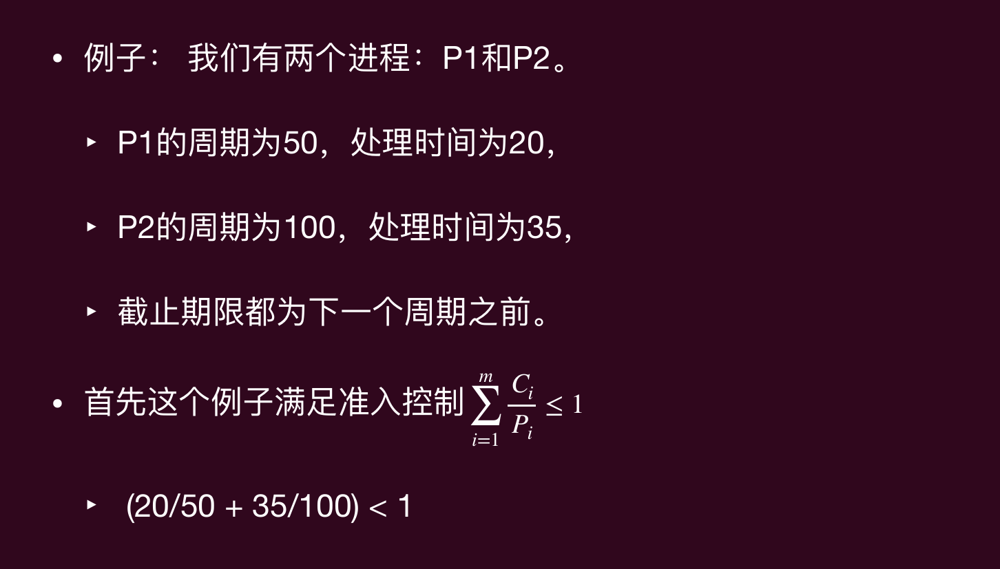

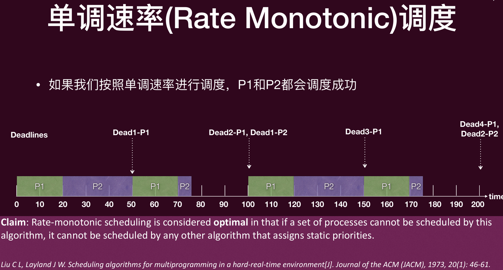
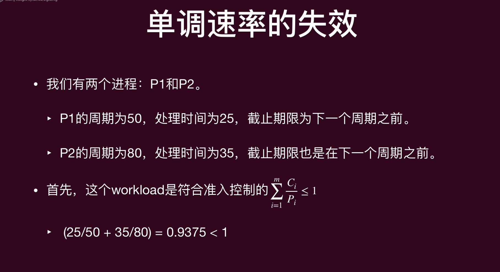
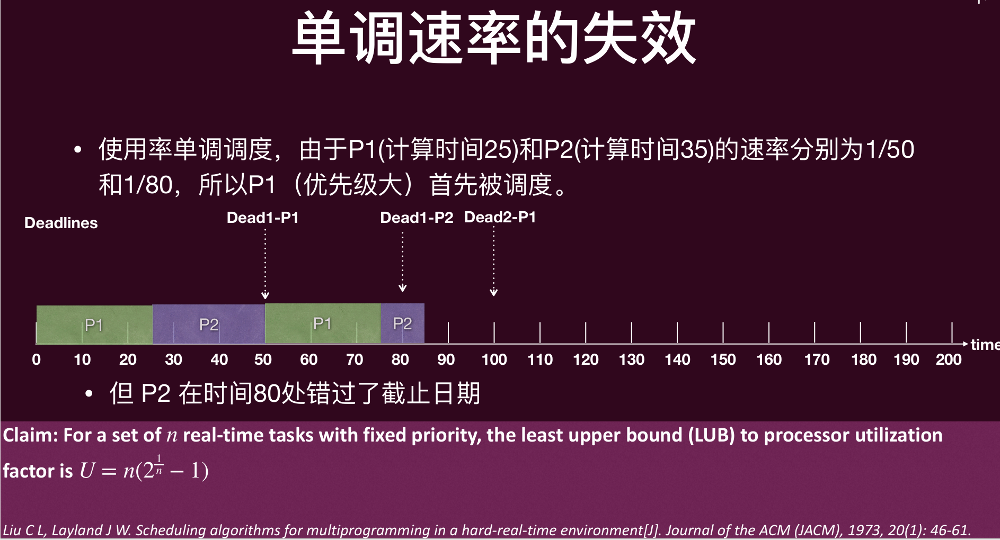

##### 最早截止日期优先调度(Earliest Deadline First, EDF)
根据截止期限分配优先级：
‣ 截止期限越早，优先级越高。
‣ 截止期限越晚，优先级越低。
• 注意：这与速率单调调度不同，速率单调调度中优先级是固定的(周期不变)，而最早截止期限优先调度根据任务的截止期限调整优先级。
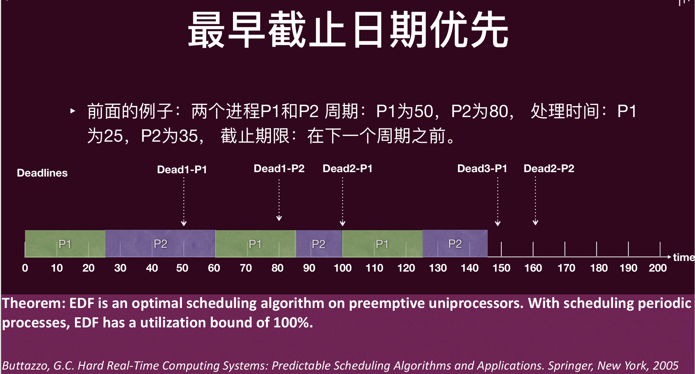

## 内存管理
### 虚拟内存抽象
以虚拟内存抽象为核心的内存管理
，CPU:支持虚拟内存功能，新增了虚拟地址空间（通过Memory Management Unit, MMU单元）
，操作系统: 配置并使能虚拟内存机制
，所有软件: 均使用虚拟地址，无法直接访问物理地址

虚拟地址会被硬件自动转换成物理地址，应用程序不需要关心这个过程
每个应用程序有独立的虚拟地址空间
- 应用程序认为自己独占整个内存(透明性)
- 应用程序不再看到物理地址
- 应用程序加载时不用再为地址增加一个偏移量

### 地址翻译


，保护：让不同的进程映射到不同的区域即可（即两个进程的映射函数的值域不相交）
，可重定位：进程被映射到的物理地址可以在运行时不断变化（运行时，不是编译时，因此是动态重定位）
，数据共享：将不同进程的不同虚拟地址映射到同一个物理地址
，构建连续空间假象：虚拟地址中的连续地址空间（编程友好），映射到物理内存可以不必连续

### 连续内存分配
最简单的内存分配方式，进程（包括操作系统内核）被分配一个**连续的物理内存地址**
利用基址和界限机制隔离用户进程之间的地址空间，以及防止用户进程修改操作系统的代码和数据

多个进程时需要将物理内存进行分割，每个进程占据一个连续的物理内存分区，有两种分割方式
，固定分区：物理内存一开始就被分为“固定”大小的区域，各个区域的大小可以相同，也可以不同，一个进程选择一个空闲区域进行分配
，可变分区：每个分区大小不固定，分区数不固定

#### 固定分区

问题是：如果一个进程所需要的空间非常大，这种固定分区就不合适了
如果某个进程需要的内存超过所有分区中最大的那个，就无法放入该内存分区，进程无法运行
此外，进程的size各种各样，但只能选择一个分区存放，这个分区大于进程的部分就是一个内部碎片（internal fragmentation），其无法被其他进程占用，自己也不用
此外，固定的分区数也限制了可以同时放入内存的进程数

#### 可变分区

鉴于大多数进程在运行时会增长，在加载进程时会分配一些额外的内存。
此外，如果给进程所分配的区域用完，那么该进程将可能： 
，被移动到一个有足够空间的空闲区域中 
，被交换（Swap）出内存（到磁盘），直到能够创建一个足够大的空洞 
，或者直接被终止（OOM Killer）

**碎片**：无法被分配的未使用内存
，外部碎片（空洞）：由于分散的小的不连续的空闲空间导致的内存浪费，发生在分区之间，通常是由于进程的不断加载和释放造成
，内部碎片：由于分区大小和加载的进程大小之间的差异（即进程小于分配的分区）导致的内存浪费，发生在分区内

对于外部碎片，进程终止或暂时交换出磁盘，可以释放内存，可能会合并一些碎片形成大的可分配区域
通过**紧缩**（compaction）减少外部碎片化 
，重排内存内容以将所有空闲内存放在一起 
，时间复杂度较高（一般在系统实在没有内存的情况下才会做，内存分配slow path的一部分）


#### 空闲内存管理
为了实现动态可变分区内存分配，操作系统应维护以下信息：
，已分配的分区
，空闲的分区（空洞）

一种简单的办法：Bitmap
，内存被划分为分配单元（几字节到几千字节）
，每个分配单元对应位图中的一位，如果该单元空闲则该位为0，如果被占用则该位为1（或反过来）


一个更加常用的做法：空闲内存链表

我们还需要跟踪已分配区域的大小，这样free(*p)时才能正确的返回一个正确的空闲节点


### 基本分配策略
空闲内存列表有很多，都可以分配给一个内存的申请需求，只要大于等于申请的空间即可，那么选择哪个呢？不同的策略会影响分配和回收的性能和有效性（比如碎片数量）
，Best-fit：分配最小的足够大的空闲区域（尽可能物尽其用），需要遍历整个列表，但可能导致产生微小且无用的外部碎片
，Worst-fit：分配最大的空闲区域，剩余的部分最大，可以为其他进程所占用，而不是形成碎片，但同样遍历整个列表
，First-fit：分配第一个足够大的空闲区域（尽可能少搜索）
，Next-fit：跟踪上次适配的位置，并从上次搜索结束的地方开始搜索 （尽可能均匀的搜索整个空间）


但是性能是个大问题，链表找还是太费力了，其搜索的算法复杂度是 $O(n)$

用更好的数据结构，比如：红黑树，结点存放的空闲内存的大小，这样就可以以 $O(\log n)$ 的复杂度搜索相应的内存
但还有一个问题，当free之后，如何合并？
- 在地址上，相邻的空闲块才能合并，因此空闲的结点链表应该按照地址进行链接，然后free的时候扫描整个链表
- 有没有更加方便的合并？

#### 伙伴系统
从包含物理上连续页面的固定大小段中分配内存，使用2的幂分配器power-of-2 allocator 分配内存
，按2的幂大小单位满足请求：请求向上舍入到下一个最高的2的幂
，当需要比可用空间更小的分配时，当前块被分割为两个下一个较低2的幂的伙伴
，持续进行直到有适当大小的块可用


Buddy System已经是linux内部分配大粒度的连续的物理页面的方法了，但还是存在一些问题：
- 内部碎片
，只允许分配2的整数次幂大小的空闲块（实际上，伙伴系统分配的最小单位是4K，即一个物理页），因此如果不是2的整数次幂的大小，会有**内部碎片**
，比如刚刚的例子中有 32K-21K无法使用（属于该进程，但该进程没有使用他们，也不能被其他进程使用）

#### Segregated List(Slab Allocator)分配器
操作系统里面的结构体大小常为几十、几百字节
- Buddy System来分配的话会产生大量的碎片

此外，一个经验观察：
，系统频繁分配的对象大小相对比较较小且固定
，小对象分配/回收的 scalability 是System内存分配的主要瓶颈

目标:快速分配小内存对象
解决方案：SLAB 
，从伙伴系统获得大块内存
，进一步细分成**固定大小的小块内存**进行管理
，块大小通常是 $2^n$ 个字节(一般来说，3 ≤n≤12)
    ，可以额外增加特殊大小(一些频繁使用的特定数据结构大小)如198字节从而减小内部碎片


1. 每种块大小用独立的资源池
32、64、128 字节各自维护自己的链表，互不干扰。好处是同一规格的块大小一致，可以紧凑排列、复用，几乎没有碎片，分配/释放就是简单的链表操作，非常高效。
2. 采用 best fit（最佳适配）定位资源池
当你请求一块内存时，分配器会挑能装下你、且最接近你需求的那个规格。比如你要 50 字节，它会跳过 32（装不下），选 64（刚好够且最省），而不是用 128。这样能减少每次分配的内存浪费。

每个 slab 是一整块内存，被切成若干等大的格子（对象槽）。按「用了多少」分三种状态：

空闲格子多、还没满 → 属于 partial
格子全部用完 → 属于 full，全是黑色
格子全部空着 → 可以整块还给系统

Fast path
- Per CPU从当前slab中取出一个适合大小的块（快速，没有和其他CPU的竞争）
low path
- 需要从一个全局的partial里去找一个作为当前的slab，不巧的话（paritial里也没空闲内存），甚至需要从buddy system里重新分配连续空间，再次分割为可用的slab

如果直接分配给进程内存的话，stack和heap中间的部分都被浪费了
- 内部碎片无法避免
• 无法和其他进程共享内存（比如代码和glibc）
- 主要是保护机制粗糙，整体空间的保护，没有精细到具体的部分内存
### 分页
更**细粒度**的内存管理
- 物理内存被划分成连续的、等长的物理页（也叫帧frame），大小一般为2的幂，⽐如默认是4KB （ $2^{12}$B的size）
- 虚拟内存也被划分为相同大小虚拟块——虚拟页（Page）
- 任意虚拟页可以映射到任意物理页，非常灵活，不需要是连续的空间
- 由于都是按照页为单位分配内存，所以没有外部碎片


#### 页表
页表最简单的形式称为**线性页表**（一个数组），存储在物理内存中
页表项（PTE）的具体布局⾼度依赖于机器
- 需要足够的位来标识物理页
- 应包括一些控制位
页表项中的常见控制位
- 有效位（Valid bit）：转换是否有效（支持稀疏空间）
- 存在位（Present bit）：页面是否实际存储在内存中
- 保护位（Protection bits）：页面是否可以被读取、写入或执行
- 引用位（Reference bit）：页面是否已被访问
- 脏（修改）位（Dirty/modified bit）：页面自被载入内存以来是否已被修改


#### 多级页表
若使用单级页表结构，一个页表有多大？
- 32位地址空间，页4K，页表项4B，页表大小: $\frac{2^{32}}{4K} \times 4B = 4MB$
- 64位地址空间，页4K，页表项8B，页表大小: $\frac{2^{64}}{4K} \times 8B = 33,554,432 GB$

使用**多级页表**减少空间占用
- 若某级页表中的某条目为空，那么对应的下一级页表无需存在
- 实际应用的虚拟地址空间大部分都未被使用，因此无需分配页表    


Null 项 = 多级页表省内存的核心
看第 0 级页表：110、101、011 这几项是 Null。这对应虚拟空间中间那段没用到的大空白（Heap 和 Stack 之间）。Null 的意思是"这一支根本没分配下级页表"。
这正是多级页表相对单级页表的最大好处：用不到的地址区域，连页表都不用建。 如果是单级页表，无论用没用都得为每个页留一个表项；多级页表则可以整支"剪掉"。
多级页表的基本构造单元——**页表页**
每一个独立的页表方框，就是一个"页表页"。具体对上：
第 0 级那个框（标着 Page Table (Level 0)，里面是 000~111 八项）——这是唯一的**顶层页表页**。对应上一张幻灯片说的"第 0 级有且仅有一个页表页"。
第 1 级那几个小框（标着 Page Table (Level 1)，每个里面是 00~11 四项）——每一个都是一个独立的页表页。图里画了 4 个，分别服务 Stack、Heap、Data、Code。


#### 倒排页表
一个问题是：太多虚拟页了，而物理页是少的！
解决方案：倒排页表
- 不再为每个进程分别维护多个页表，而是保留一个单一的页表，每个物理页对应一个条目
每个页表条目包括：
- 使用该物理页的进程(Pid)
- 该进程的哪个虚拟页映射到该物理页
• 减少了存储页表所需的内存，但增加了在发生页引用时查找表所需的时间
- 使用哈希表来加速查找
• 此外一个问题就是无法共享


### Translation Look-aside Buffers（TLB） 
地址转换旁路缓冲
如何加速分页的地址转换？
观察：大多数程序倾向于对少量页面进行大量引用
使用一种特殊的快速查找硬件缓存，称为翻译后备缓冲器（TLB）或联想存储器（在内存管理单元中）
- 缓存最近的地址转换
- 如果TLB命中，直接转换（fast path）
- 否则，如果TLB未命中，则在页表中查找映射（页表遍历），并更新TLB (slow path)


### 局部性原理
TLB背后的理念是利用指令和数据引用的局部性
- 时间局部性：如果某个数据被访问过，那么在**不久的将来**它可能会再次被访问
- 空间局部性：如果某个数据被访问过，那么它**附近**的数据在不久的将来也可能会被访问。
TLB通常很小，包含64到1024个条目
- 存储最可能被多的选中的地址翻译才能高效发挥TLB的作用
- 支持某些条目可以固定下来以便永久快速访问


### 交换
如果没有足够的空间来容纳所有进程怎么办？ 
- 一个进程可以被暂时换出内存到后备存储
- 然后在需要继续执行时再换回内存 
- 进程的总物理内存空间可以超过物理内存
交换指的是把整个进程的内存镜像在**内存和磁盘**之间来回搬运。当内存不够时，把暂时不运行的进程整体"换出"到磁盘；需要它运行时再"换入"内存。

- 交换时间主要取决于**磁盘传输时间**
    - 交换的瓶颈在磁盘 I/O，而不是 CPU。搬运的数据量越大，时间越长，两者成正比
- 系统维护一个就绪队列
    - 队列里存的是那些"镜像已经在磁盘上、随时可以运行"的进程
- 换出 + 换入导致上下文切换时间飙升
    - 如果调度器选中的下一个进程当前不在内存里，系统就得：先把内存中某个进程换出到磁盘 → 再把目标进程从磁盘换入内存

假设进程发起了一个 I/O 操作（比如 DMA 正往它的缓冲区里写数据），而这个 I/O 缓冲区就在进程的地址空间内：

如果此时把进程换出到磁盘，物理内存被腾出来给别的进程用了；
但 DMA 控制器还在往原来那块物理地址写数据 → 写到了别人的内存上，造成 I/O 失败或数据丢失。
所以一般涉及I/O的页需要被**锁定**在内存中，不能被换出到磁盘。

交换通常是禁用的。当分配的内存超过阈值（当可用内存极低时）才会启动交换。一旦内存需求减少到低于阈值时，交换再次被禁用。


### 虚拟内存
每个进程都有一个大的地址空间的幻觉。 
支持多个并发运行的进程使用大的虚拟地址空间：只将常用的页面保留在内存中（此时内存可以看成是所有pages的一个cache）


虚拟内存具备"部分"加载程序的执行能力
意思是程序不必整个加载进内存就能开始执行，只加载当前需要的那部分页，其余按需换入。
1. 程序不再受物理内存限制，可以运行大小超过物理内存的程序
2. 每个程序运行时占用更少内存 → 能同时跑更多程序
3. 加载/交换所需的 I/O 更少 → 启动更快

如何实现按需加载？
使用存在/不存在位（在页表项中）来跟踪哪些页面存在于物理内存中。 
当程序引用其地址空间的一部分时： 
- 如果页面在物理内存中，存在位是1，则直接进行地址转换
- 如果不在，存在位是0，则发生**缺页异常**（Page Fault），操作系统被调用来处理该异常，检测并将页面加载到内存中，然后重新执行指令(引用该地址空间的指令)

### 缺页异常


处理缺页异常的三个主要活动：
- 服务中断：一般只需要几百条指令
- 读取页面：需要大量时间
- 恢复进程：需要少量时间


### 页面置换
何时将页面调入内存？
按需分页（Demand Paging），出现缺页异常后进行调入页面
最简单的方法。为了提高效率，调入是**异步**进行的：中断处理程序应快速响应，只需启动磁盘I/O并阻塞该进程，让其他进程运行。
预取(Prefetching)：猜测即将使用哪些页面，因此提前将其调入内存，往往是基于历史的缺页记录来预测

如果没有空闲的帧会发生什么？ 
- 页面置换：找到内存中的一个页面（一般来说该页面近期最不可能再次被访问），将其换出。
- 选择一个**受害者帧**（victim frame）进行驱逐，将所需的页面入（新）空闲帧。

当一个页面必须被换出时
- 更新页表：找到所有引用旧页面的页表项（因为帧可以共享），并将每个设置为不可见
- 移除任何TLB条目，TLB关机：在多处理器系统中，必须从所有处理器的TLB中消除TLB条目
- 将页面写回磁盘（如果需要，页表项中的脏位）
- 重新启动引发陷阱的指令：（需要备份指令）


哪个帧应该被替换？ 
目标是实现最低的缺页异常率（尽量减少从磁盘获取页面的次数）。 
- 如果选择一个不常被使用的页面，系统性能会更好。
- 如果删除一个频繁使用的页面，它可能很快就需要被重新调入

#### FIFO


#### Optimal


#### LRU(Least Recently Used)

为了跟踪哪些页面最近最少被使用（将每个页面的最后一次使用时间与之关联），操作系统必须在每次内存引用时进行一些计时工作。 
计数器实现
- 每个页面都有一个对应的计数器项。 
- 每次页面被引用时，通过硬件将时钟寄存器的值复制到计数器中。
- 当需要更换页面时，查看计数器以找到最⼩的值。
但是开销太⼤！

#### 近似LRU
通过引用位来近似LRU（即二次机会算法，Second Chance）：寻找一个在最近的时钟周期内没有被引用的老页面。
- 系统中每个页面有一个引用位（R）。 
- 每当引用页面（即读取或写入），引用位被设置为1（由硬件完成）。 
- 如果要被替换的页面：
    - R = 1：将引用位设置为0；将其放在FIFO队列的末尾；并检查下一个页面。
    - R = 0：替换它。 
- 如果所有页面都被引用，那么第二次机会算法等于FIFO。


#### NRU(Not Recently Used)


#### 抖动
如果一个进程没有足够的页面，缺页率可能会非常高。
‣ 假设引用页面编号顺序为0 1 2 3 0 1 2 3 0 1 2 3 0 1 2 3，但有三个可用帧，当运行FIFO / LRU，此时⼤部分 CPU 时间都被用来处理缺页异常
等待缓慢的磁盘 I/O 操作，仅剩⼩部分的时间用于执行真正有意义的工作


#### 工作集模型


#### 本地和全局策略
替换页帧是全局（从所有进程中选择）还是本地（只挑自己的页帧）？


# 持久化
## 设备管理
### 谁来控制数据传输命令(DMA)
1. 由CPU来控制，也就是 Programmed I/O(PIO，程序控制 I/O)
每一个字节都由 CPU 执行一条指令搬过去。CPU 用上一张讲的两种访问方式中的指令:
- 端口映射的话用 in / out
- 内存映射的话用 load / store
优点:硬件简单,易于编程
但是消耗与数据大小成比例的**处理器周期**(因为每个数据的 in/out 都要一个指令)
此外,CPU 会一直接收到 interrupt,速度变慢，设备每准备好一个(或一小批)数据,就发一次中断叫 CPU 来搬。结果是中断**频繁触发**

2. 由DMA控制，也就是 Direct Memory Access(直接内存访问)
"给控制器访问内存和总线的权限"——平时只有 CPU 能当总线主控(bus master),DMA 让控制器也能临时接管总线、自己发地址读写内存。
CPU 只下一个"搬这一整块"的命令,具体的逐字节搬运由 DMA 干,而且是**整块(block)**地搬,不是一字节一指令。
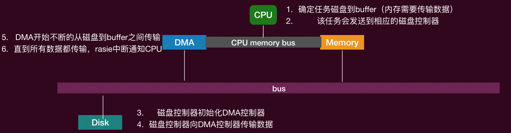
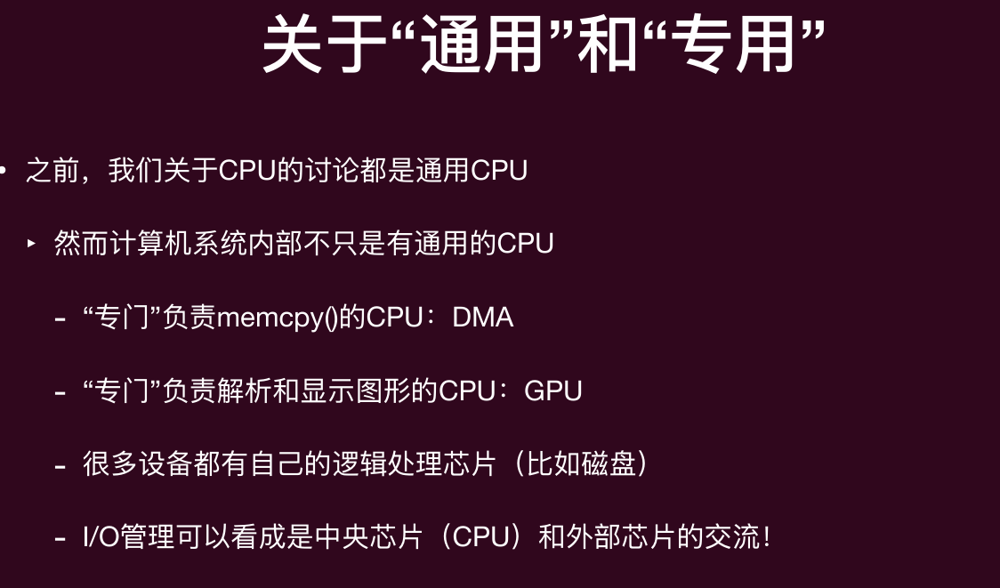

### 硬盘/磁盘
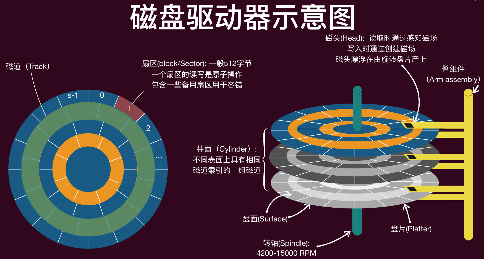

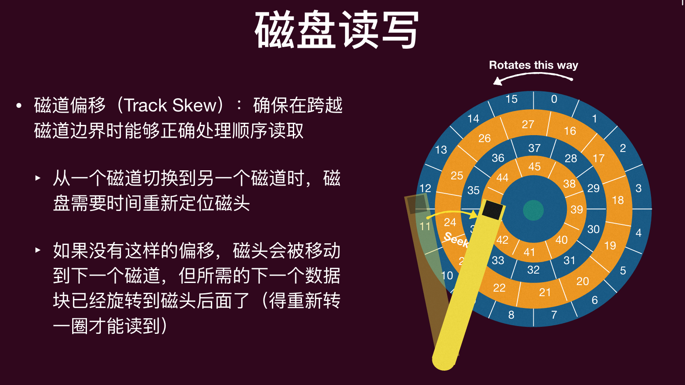
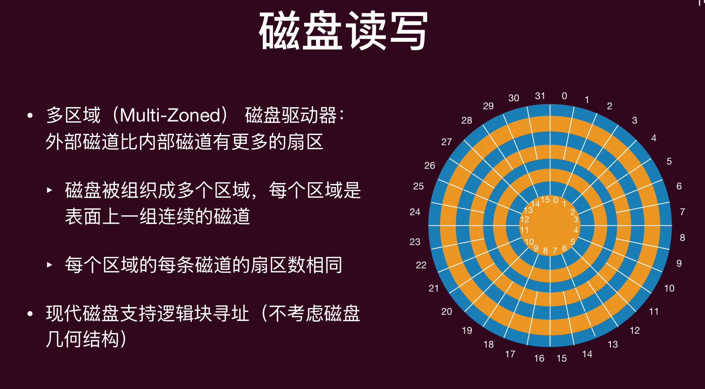


#### 磁头调度
由于 I/O 成本⾼，操作系统历来在决定发往磁盘的 I/O 顺序方面发挥了作用。
面对一组 I/O 请求，磁盘调度程序会检查这些请求并决定下一个调度哪个请求。
目标：通过磁头调度来最小化磁头移动，从而最⼤化磁盘 I/O 吞吐量

##### FCFS（First-Come, First-Served，先来先服务）
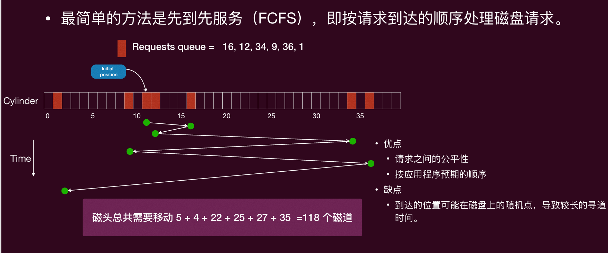

##### SSTF（Shortest Seek Time First，最短寻道时间优先）
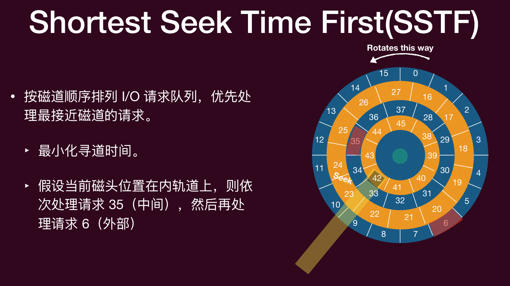
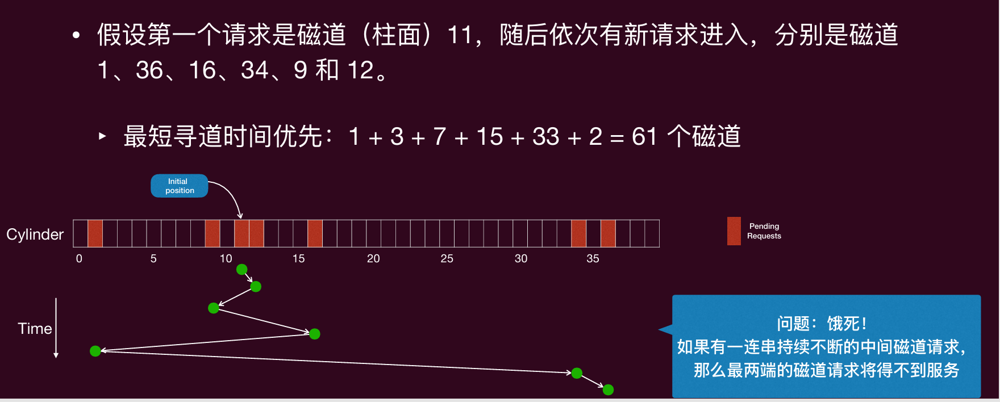

##### 电梯算法
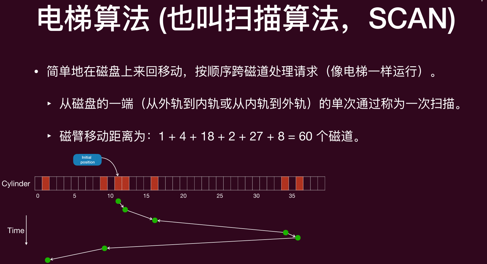
有多种变体可用：
- F-SCAN：在执行扫描时暂时冻结要处理的队列（避免远距离请求的饥饿）。
- C-SCAN：只从外轨到内轨扫描，然后重置到外轨重新开始。更平均的等待时间，即对内轨和外轨更公平

##### SPTF（Shortest Positioning Time First，最短定位时间优先）
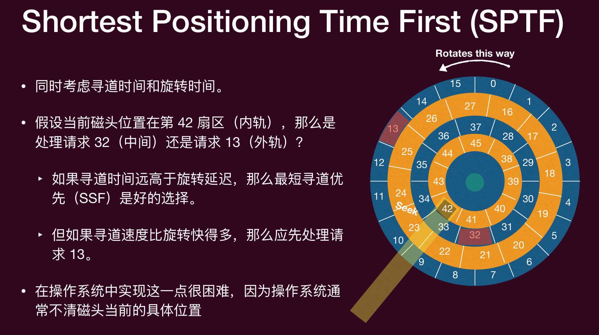

过去的操作系统非常注重磁盘请求调度。
• 目前的做法是将许多请求发送到磁盘，让磁盘自行调度。如今的磁盘更智能，并且拥有较大的缓存。

#### 固态硬盘(Solid State Drive, SSD)
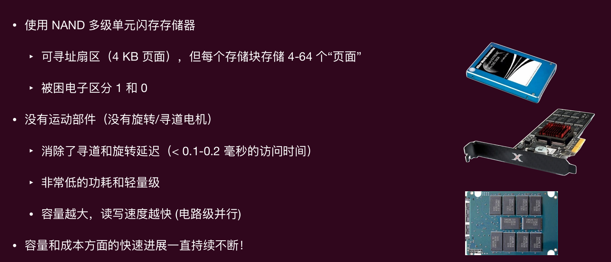
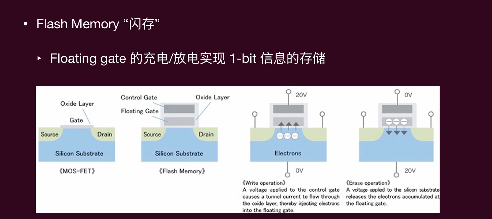


## 文件系统
文件系统是在操作系统内核中实现的**持久化存储抽象**。
- 用户程序通过系统调用(open/read/write)与文件系统进行交互。
- 文件系统负责维护路径、目录、inode、权限、空闲空间和文件到磁盘块的映射
- 设备驱动程序负责把文件系统发出的块读写请求转换为具体设备操作。

文件系统解决的四个问题：
- 持久性和**命名**数据：文件和目录（给人看的，所以命名，与内存不同，内存给进程看所以不需要命名）
    - 存储在系统中直到显式删除为止
    - 可以通过文件系统关联的可读标识符访问
- 访问和保护：提供打开、读取、写入和其他操作；调节不同用户对文件的访问。
- 磁盘空间管理：公平有效地利用磁盘空间
    - 分配空间给文件，并跟踪空闲空间
    - 快速访问文件
- 可靠性：不得丢失文件数据

### 文件
文件是操作系统创建的逻辑存储单元，用于存储信息
‣ 可以是数据库、音频、视频、网页等内容。
‣ 它是一组数据集合（类型由用户定义）
‣ 可以创建、读取、写入和删除
‣ 提供了一种在磁盘上存储信息并随后读取的**抽象机制**

#### 文件命名
**命名**是文件系统抽象的一个重要特征
‣ 提供人类可读的名称，用一个具有意义的单一名称来引用任意大小的数据
‣ 帮助用户组织大量的存储空间。
‣ 信息存储的细节（低级结构）以及磁盘的实际工作方式被屏蔽了。

文件的命名规则因系统而异
‣ 长度和特殊字符， 字母大小写
文件扩展名：例如.txt，.c
‣ 表示文件内容的某些类型，为应用程序或操作系统提供文件合理操作的提示

#### 文件类型
许多操作系统支持多种类型的文件
‣ 普通文件(‘-’)：bit流，用于存储实际的用户信息，如文本、源码、图像或可执行程序
‣ 目录(‘d’)：用于维护文件系统结构的系统文件
‣ 符号链接文件（‘l’） 
‣ 命名管道文件或简称管道文件（‘p’）
‣ 块文件（‘b’） 
‣ 字符设备文件（‘c’）
‣ 套接字文件（‘s’）

#### 文件元数据（属性）
除了文件的名称和数据外，操作系统还会保留文件的额外信息：
‣ 数据块位置（文件对应哪些磁盘块）
‣ 大小：文件的大小（当前大小或最大大小）
‣ 时间：文件的创建时间、最近访问时间和最近修改时间
‣ 所有者：文件的当前所有者
‣ 保护信息（权限）
‣ 链接信息

文件用inode的号来标识

#### 文件访问
顺序访问：按顺序读取或写入数据
‣ 读取下一个/写入下一个
‣ 最常见的访问模式（例如，复制文件，编译器读取和写入文件）
‣ 速度快（可以达到磁盘的峰值传输速率）
随机（直接）访问：随机寻址任意块
‣ 读取[n] 写入[n]  寻址[n]
‣ 文件操作包括块号作为参数
‣ 速度慢（寻址时间和旋转延迟）


### 文件描述符
文件描述符（句柄）：操作系统分配给**一个进程**打开的文件的一个**唯一数字**（每个进程私有），用于引用该文件。
‣ 持有该文件描述符，才可以对对应的文件执行特定操作
‣ 避免在**每次访问**时解析文件名（在目录中搜索文件名）和检查权限
‣ 一个文件可以以不同方式多次打开

这3个是特殊的文件描述符。0和1可以重定向，比如1重定向到文件就可以把输出写到文件里了

### 文件偏移
对于进程打开的每个文件，操作系统都会跟踪一个**文件偏移量**，该偏移量决定下一次读取或写入将从何处开始。
- 隐式更新：当进行N字节的读取或写入时，N会被添加到当前偏移量。
- 显式更新：使用lseek()函数。

### 打开文件表
当进程打开一个文件时，操作系统应该创建一些额外的**数据结构**（在内存中），用于存储关于进程打开文件的信息。
每个进程都维护一个**打开文件表**
‣ 一个由文件描述符索引的**数组**
‣ 表中的每个条目跟踪文件描述符所引用的底层文件，当前偏移量以及其他相关细节（例如文件大小、位置、权限等）


文件描述符对应的一个全局的文件打开表，里面有offset等信息，文件描述符表里存储了文件描述符和全局打开文件表的索引
比如这里0和86有不同的offset，他们指向同一个inode，说明是同一个文件被打开了两次
这个时候offset不会共享，除非对文件进行了写操作，否则两个不会互相影响


这种是fork，不一样，offset是共享的，会互相影响

在同一个进程里面，与fork类似的是dup
offset也是共享的，会互相影响

### **（重要）共享文件**

有了链接之后，就由树变成了有向无环图

#### 硬链接
硬链接：在目录中创建另一个名称，并将其指向原始文件的相同 inode 号

硬链接本质上是 inode 号的别名，因此，当创建一个文件时，
‣ 首先，创建一个结构（inode），该结构将跟踪关于文件的所有相关信息
‣ 其次，将一个人类可读的名称链接到该文件，并将该链接放入目录中
要从文件系统中删除文件，调用 unlink()
‣ 每个 inode 有一个引用计数（链接计数器）
‣ 删除链接时，引用计数减一；如果计数达到 0，目标文件将被删除

但不能链接到另一个文件系统上的文件，因为 inode 号只在一个文件系统内，是唯一的
不允许链接到目录（简化管理）
‣ 这防止了在目录层次结构中创建**循环**，避免有环图
‣ 避免了父目录的不明确性，比如如果多个父目录有指向同一子目录的链接，那么该目录中的 “..” 指向什么？

#### 软链接

符号（软）链接是**路径名的别名**，因此可以链接到目录，或跨文件系统链接
当需要解析路径名时符号链接被**解析**
- 找到目标文件的名称，并使用新名称打开
- 目标可以是另一个符号链接（递归解析）
- 比硬链接效率低
当删除符号链接时，目标文件保持不变
当目标文件被删除时，产生**引用悬空**（dangling reference），该链接指向一个已不存在的路径