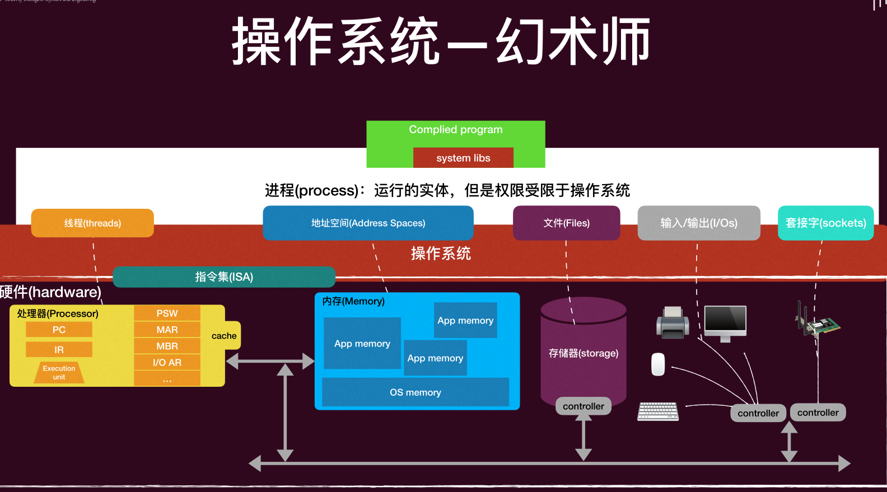
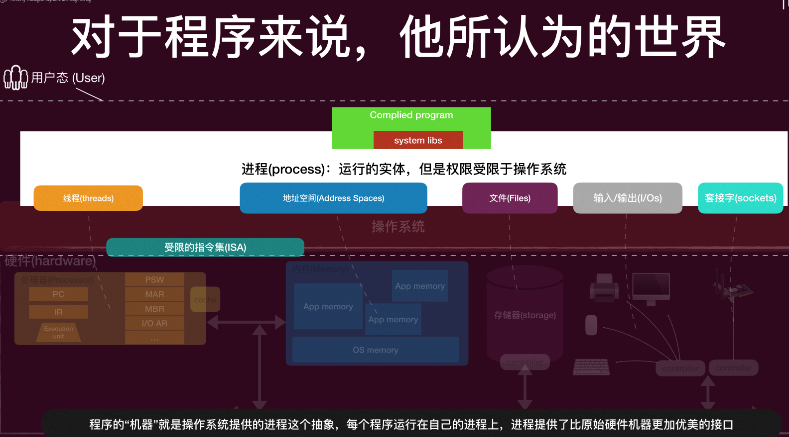
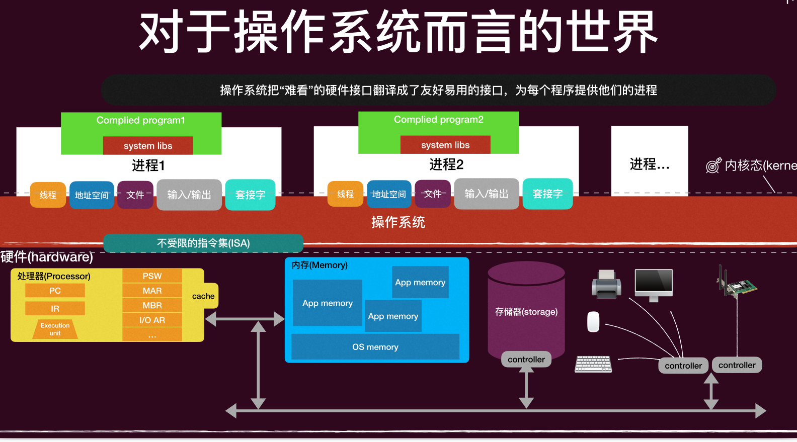
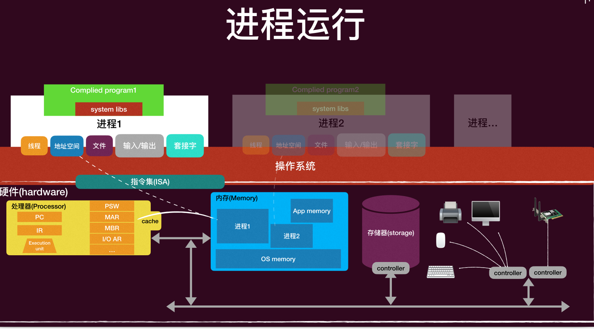
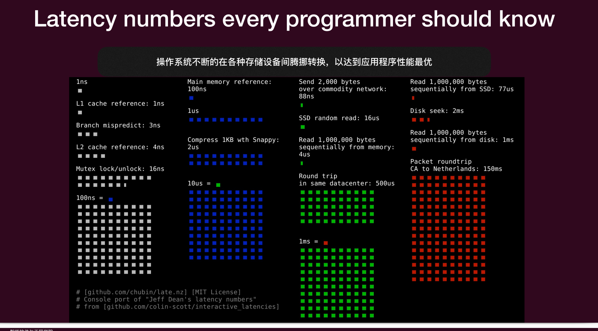

# Lec1: Intro
## 什么是操作系统
三个重要的线索
‣ 硬件（计算机）
‣ 软件 （程序）
‣ 操作系统（管理硬件和软件的软件）

操作系统是对硬件进行管理的软件。它充当了硬件和软件之间的**中介**，使得程序可以更容易地与计算机进行交互。

没有操作系统，程序将直接与硬件交互，是非统一接口，含有大量细节，编写程序将变得非常复杂和困难。操作系统提供了一个**抽象层**，使得程序员可以更容易地编写应用程序，而不需要关心底层的硬件细节.

操作系统的功能：
- 幻术师 提供简洁的物理层抽象：
    - 拥有无限内存/专属的机器
    - 高级的对象：文件 进程 信号
    - 屏蔽限制
进程(process)：运行的实体，但是权限受限于操作系统
操作系统将复杂的硬件接口翻译成友好易用的接口

对操作系统而言，他有控制所有硬件的权限
当前运行的状态就叫做内核态(kernel mode)，当程序运行在内核态时，它可以访问所有的硬件资源和执行特权指令。当程序运行在用户态(user mode)时，它只能访问受限的资源和执行非特权指令。

需要运行高级权限的操作系统功能时，程序需要通过**系统调用**(system call)来请求操作系统的服务。
执行system call时，程序会从**用户态切换到内核态**，操作系统会执行相应的系统调用处理程序来完成请求的操作。完成后，程序会切换回用户态继续执行.

- 裁决人 资源的管理
    - 分配
    - 保护
    - 分享

操作系统将进程彼此隔离，操作系统将自己和进程隔离
只能访问自己的资源，不能访问其他进程的资源
操作系统通过**内存管理**来实现进程之间的隔离和保护。

- 性能优化员 操作系统的底线是支持应用程序的运行
    - 自身是次要的
    - 理想情况下操作系统的资源开支不大
    - 应用程序运行应该尽量快

## 操作系统的发展历程
- 真空管时代
- 晶体管和批处理系统（操作系统的概念开始形成，成批管理程序）
- 集成电路和分时系统（处理器更快，虚拟存储出现）
- 个人计算机时代
- 移动计算时代

Unix: 第一个可移植的操作系统，使用C语言编写，成为了现代操作系统的基础。