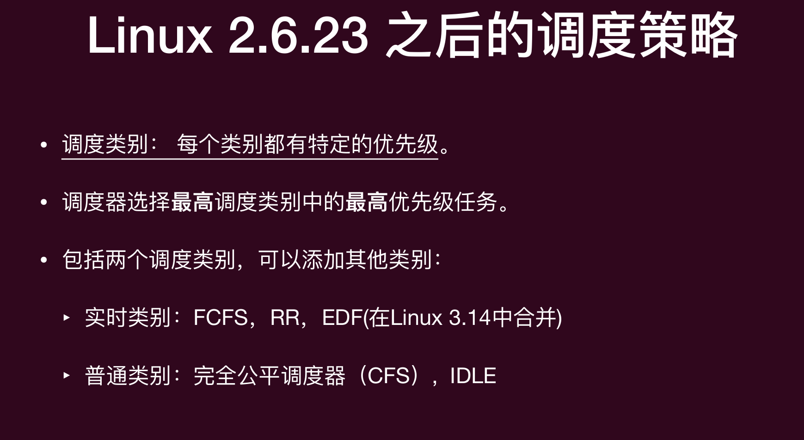
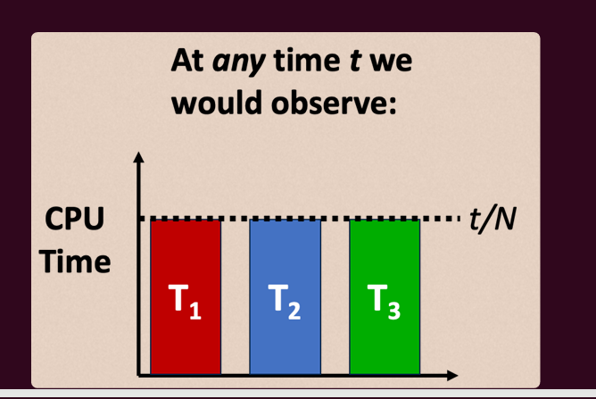
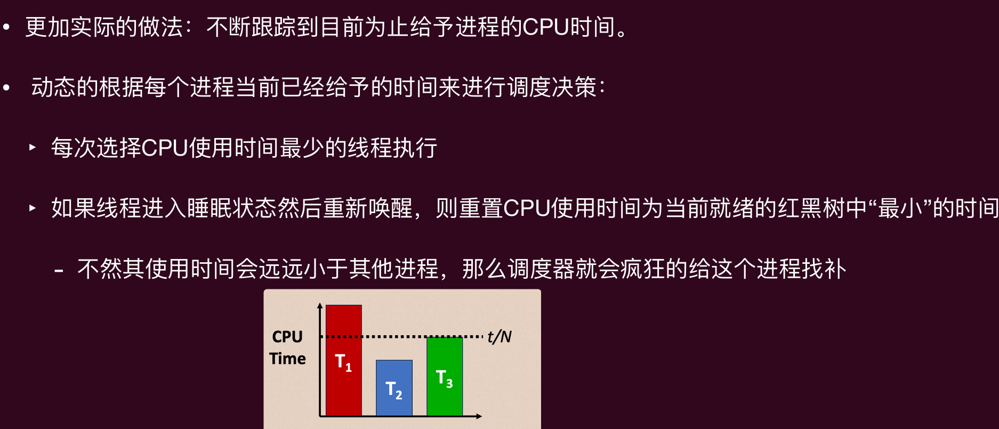
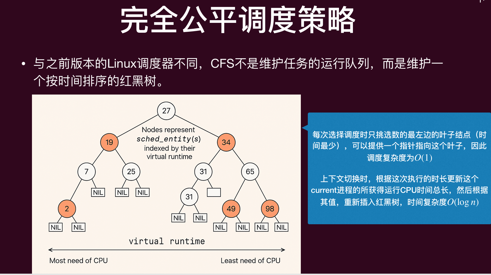
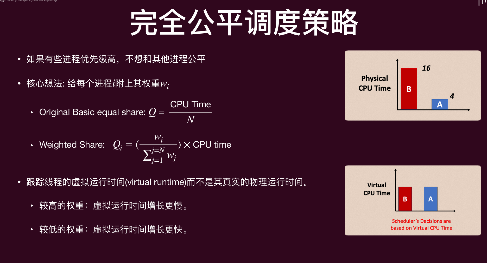

# Lec10: Scheduling
## 调度
为了满足既定目标，对计算任务进行资源分配的行为，称为**调度**（Scheduling）。

### 调度指标
- CPU利用率(CPU utilization): CPU被进程所使用的时间在所有CPU时间的占比（越大越好）
- 公平(Fairness): 同等优先级下的进程获得的CPU使用时间应该尽可能相等
- 吞吐量（throughput）：单位时间内完成执行的进程数（越大越好）
- 周转时间（turnaround time）：某个进程需要完成的时间（越小越好）
- 等待时间（waiting time）：某个进程在就绪队列的时间（越小越好）
    - 等待时间 = 周转时间 - 获得CPU执行的时间
    - 一个进程可能会多次放到就绪队列中，因此等待时间是这些等待的时间的总和
- 响应时间（response time）：从发出申请执行到**第一次**获得响应执行的时间（越小越好）

### 调度时机
CPU回到操作系统的掌控之中的时候，就会进行调度。CPU回到操作系统的掌控之中有以下几种情况：
- 发生**系统调用**
- 某个运行的进程被**阻塞**
- 发生**中断**
这些事件的发生都意味着系统的状态发生了变化，可能和既定的目标发生了偏离，需要调整（调度）来让系统往既定的目标靠近

### 机制与策略
操作系统中的一个重要设计思想：**机制与策略的分离**（Separation of mechanism and policy），这种设计是一个典型的模块化思想，可以有效降低系统的复杂度
- 机制（Mechanism）: 怎么做
- 策略（Policy）: 做什么
在一个已有的机制上，可以考虑的问题是，有哪些策略？有没有“最优”的策略？
在给定一个策略的基础上，可以考虑的问题是，实现这个策略需要什么样的机制？已有机制是否具备这个能力？实现效果是否理想？

比如上面的图，我们有了context switch的机制，再维护一个PCB（TCB）的队列，当发生一个时间中断时，就可以从这个队列中挑选一个进行执行
不同的挑选的策略都可以在这个机制上运行：
- 随机的调度
- 按照队列的**先后顺序**依次调度，执行完之后再放回队尾
- 我们还可以按照队列的反向顺序调度（类似栈）
但是，在这个机制之下，最好的调度策略是什么？（基于某一个调度指标而言）
如果我们想实现一个按照进程的**执行所需时间**进行调度的策略，上面的机制就不行了，因为我们没有存储每个进程所需要的执行时间
因此，需要一个新的机制，每个进程维护一个其所需执行时间的变量，使得内核可以访问
但是显然不现实！用户无法预判程序完整运行时长

## 调度策略
调度策略大体可以分为如下几类任务
- 批处理任务的调度
- 交互性任务的调度
- 实时任务的调度

### 批处理任务的调度

#### 先来先服务（First Come First Serve, FCFS）
按照到达系统（就绪）的先后顺序进行调度，也叫先进先出(First In First Out, FIFO)
**护航效应**(convoy effect)：短运行时间的进程排在长运行时间的后面，导致平均等待时间过长的现象。

#### 最短作业优先（Shortest Job First, SJF）
- 将每个任务与其需要运行时间关联
- 需要运行时间最短的优先被调度

命题：就平均等待时间而言，SJF是最优的
如何证明？
证明思路:
‣ 给定一任意进程排列顺序 S 的平均等待时间
‣ 给出一个将该序列变为按执行时间降序排列的过程，比如冒泡排序
‣ 证明该过程是单调的，即每一步都会导致平均等待时间变长

#### 最短剩余时间优先（Shortest Remaining Time First, SRTF）
一个**非抢占式**调度算法选择一个进程来运行，然后就让它一直运行，直到它被阻塞（无论是在I/O操作上还是等待另一个进程），或者自愿释放CPU。
一个**抢占式**调度算法选择一个进程，并允许其运行一段固定的**最长时间**。如果在时间间隔结束时它仍在运行，则被挂起，调度器选择另一个进程来运行。（需要时间中断的机制支持）

最短剩余时间优先是最短任务优先的**可抢占**（Preemptive）版本
‣ 始终选择剩下需要时间最短的进程进行运行

P1先到达，然后执行1ms

然后P2到达，P2是剩余时间最少的，所以P1被抢占，P2开始执行

后面P3P4也到达，所以有显示剩余时间，但是P2的剩余时间最少，所以P2继续执行

现在P4最少

然后P1最少，P1继续执行，然后P1执行完了，P3继续执行

计算这个平均等待时间，像P1这种执行了之后又被抢占的进程，等待时间就要加上被抢占的时间
像其他的，按照从第几ms进来的来计算等待时间

#### 时间预测算法
思想：下一次运行时间应该与之前一次类似

‣ $t_n$：第 n 次实际运行时间

‣ $\tau_{n+1}$: 预测的下一次（n+1）的执行时间
‣ $\alpha$：相关系数
‣ $\tau_n$：上一次预测的执行时间
‣ $\tau_{n+1} = \alpha t_n + (1 - \alpha) \tau_n$
展开$\tau_{n+1}$，可以得到$\tau_{n+1} = \alpha t_n + \alpha (1 - \alpha) t_{n-1} + \alpha (1 - \alpha)^2 t_{n-2} + ... + (1 - \alpha)^{n+1} \tau_0$
由于$\alpha$和$1 - \alpha$都是小于1的数，所以多项式里面每一项都比后面一项的权重更大，这也就是说最近一步的执行时间会更加影响当前推测

#### SJF的一些缺陷
- 并不公平
- 等待时间差异大，可能会饿死
- 进程的执行时间难以预测
- 最重要的，可能会被愚弄

**愚弄(Gaming)**
将自己切割成很多份“非常”短执行时间的小任务，然后再批量运行这些小任务
把一个长任务分解为大量非常短的作业/任务，然后批量提交或循环运行这些短任务，就会造成不公平

### 交互性任务的调度
批处理以**吞吐量/周转**为主；交互性以**延迟/响应**为主，调度目标不同。
在调度策略中，有两类进程会被区别对待：计算密集型和I/O密集型 （当然也有混合型）
- 计算密集型：主要消耗CPU计算资源，例如数学运算、图形处理或数据分析等任务。这些程序通常会在 CPU 上执行大部分时间的计算和逻辑判断等操作，而不需要等待外部资源（如磁盘读写或网络通信）完成。
- I/O密集型：系统大部分的时间在等待 I/O（硬盘/内存/键盘）的读取/写入操作（即和外界进行频繁交互的进程），此时 CPU 负载并不高，需要消耗CPU计算的时间很少

#### 时间片轮转调度(Round-Robin, RR)
每个任务都会获得一段固定时间的资源（**时间片**, time-slicing）。
如果任务没有完成，它将重新回到队列中。
- 时间片应该比上下文切换时间略大，否则开销会太高！当然时间片也不能过大，否则就蜕变为FCFS调度了
- 一般来说时间片大概设置为10ms到100ms (context switch一般小于10 ms)

在操作系统/调度里，overhead（开销）指的是为管理、调度和维护系统状态而消耗的时间或资源
RR还有另外一个问题
在运行既有 I/O 密集型任务又有计算密集型任务的情况下，当 I/O 密集型任务执行 I/O 操作时，它会让出处理器（由于需要的CPU计算很短，没有用完时间片就让出CPU了）。
这时即使 I/O 操作很快完成（比如你正在用VIM打字），也必须等待重新分配处理器，直到其他计算密集型任务用完他们完整的CPU切片。
结果就是交互性任务的响应变慢，用户感到延迟

#### 基于优先级的调度(Priority Scheduling)
I/O-bound和CPU-bound的优先级不同，我们需要基于优先级的调度：
- 每个进程都关联有一个优先级数（整数）。
- 每次发生调度时，CPU被分配给具有最高优先级的进程。
• SJF（Shortest Job First）就可以看成是一种优先级调度算法，其中每个进程的优先级与预测其下一个CPU执行时间的倒数成正比。

优先级调度会有问题，就是饿死(Starvation)，低优先级的进程可能永远不会执行。
解决方案：老化(Aging)，随着时间的推移增加进程的优先级。
需要一种能动态改变优先级的策略，如：多级反馈队列（multilevel feedback queue）

#### 多级反馈队列(Multilevel Feedback Queue, MFQ)
一个进程可以在各个队列（代表不同优先级）之间移动。
多级反馈队列调度器由以下参数定义：
- 队列的数量
- 每个队列的**调度算法**
- 确定何时将进程**升优先级**的方法
- 确定何时将进程**降优先级**的方法
- 确定当某个进程需要服务时该将进入哪个队列的方法

一个典型的多级反馈队列是**一组**轮转队列：
- 每个队列都有单独的优先级。
- 高优先级队列拥有短的时间片。
- 低优先级队列拥有长的时间片。
调度器选择最高优先级队列中的第一个进程。进程加载到内存中时初始在最高优先级队列中。如果时间片到期，任务会降低一个级别。

当使用多级反馈队列（MFQ）时：
‣ CPU密集型进程将下沉到长时间片的优先级队列。
- 如果使用完时间片，进程会下降一个优先级。
- 较大的时间片可以减少上下文切换的开销。
‣ I/O 密集型进程将保持在高优先级队列中。
- 如果一个进程没有完成其时间片（即，它在 I/O 操作上被阻塞），那么它将保持在相同的优先级水平。

MFQ调度器可以在周转时间、低开销和公平性之间取得平衡。 事实上，它被大多数商业和现实操作系统（包括Windows、MacOS和Linux）使⽤（作为一种策略）
但是他还是可以被愚弄的
⽐如一个恶意攻击者了解调度器的工作原理，那么他/她可以编写代码，在时间片到期之前强制系统在某些低延迟的 I/O 操作上阻塞（例如，睡眠几毫秒）
这样，即使进程反复消耗大部分时间片，它也会因为没有使用完时间片而受到奖励（不被降低优先级），从而始终保持在高优先级水平。

解决方案 — 追踪：
‣ 不仅仅是简单地检查进程是否使用完了它的时间片，调度器会跟踪进程在较长时间间隔（几个时间片）内运行的总时间。 
‣ 每个优先级队列将有一个与之关联的最大CPU时间分配。超出使用的分配则降低优先级。

### 实时任务的调度
实时系统中时间扮演着至关重要的角色
‣ 某些任务必须在**截止日期**（deadline）之前得到服务；
‣ 截止日期过期后才得到服务与根本没有服务一样。 
• 周期性（Periodic）任务：截止日期以规律的间隔发生

#### 单调速率调度(Rate Monotonic Scheduling, RMS)
根据其速率（即周期的倒数）分配优先级。
‣ 周期较短的任务具有较高的优先级，而周期较长的任务具有较低的优先级。 
- 例如，有两个进程P1和P2，它们的周期分别是50和100，那么P1首先被调度，然后是P2，P1可以抢占P2。
• 这种策略背后的理念是为需要更频繁占用CPU的任务分配更高的优先级。

#### 最早截止日期优先调度(Earliest Deadline First, EDF)
根据截止期限分配优先级：
‣ 截止期限越早，优先级越高。
‣ 截止期限越晚，优先级越低。
• 注意：这与速率单调调度不同，速率单调调度中优先级是固定的(周期不变)，而最早截止期限优先调度根据任务的截止期限调整优先级。

## 真实操作系统调度器

### 完全公平调度器（Completely Fair Scheduler, CFS）
目标：每个进程获得相等份额的CPU时间（公平性）

‣ N个线程下，每个线程在任意时刻获得等份的CPU时间 $\frac{t}{N}$。
‣ 无法在实际硬件上实现这一点

