# Lec11&12: Memory Management
## 物理内存
物理内存没有其他意义，只是存储（易失）运行信息的一个物理介质
- 连续字节/字（Byte）的数组，每行都有自己的地址（n 位地址总共有 $2^n$ 个字节）
- 通过地址可以写/读相应的字节
- 地址和数据分别通过地址总线和数据总线进行传播

## 保护
有了进程抽象，内存就有了语义
- 其代表了当前进程的“状态”
- 而这个“状态”应该遵循状态机（即进程）的规约而改变
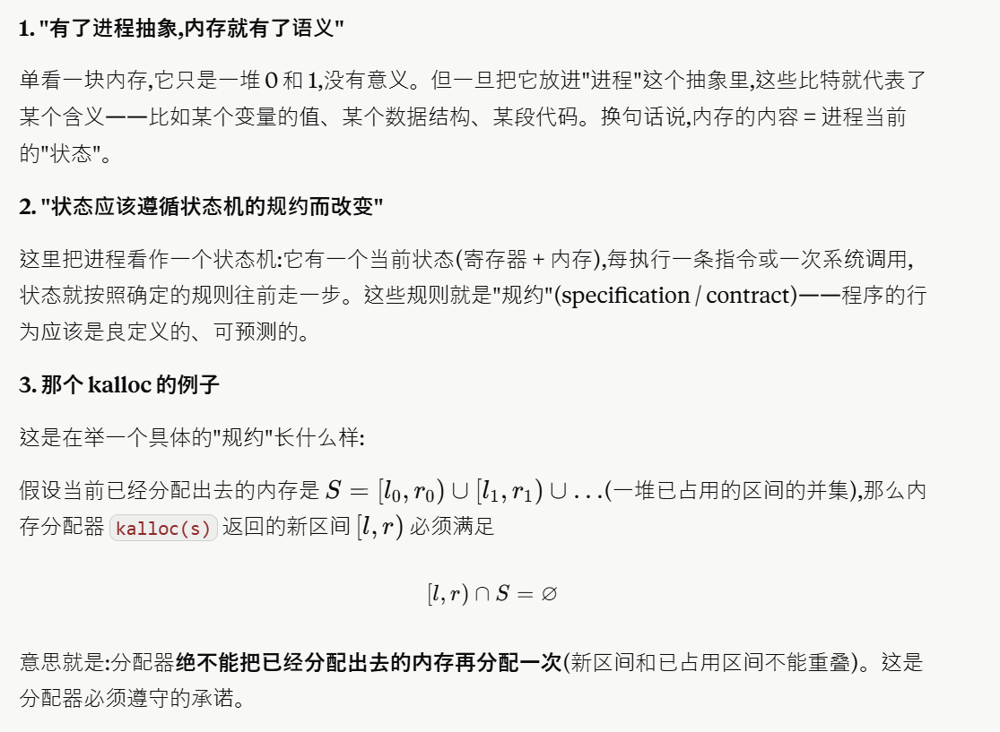
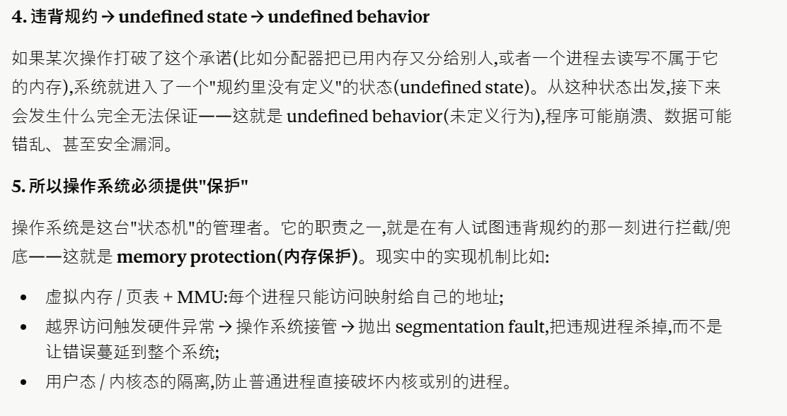
到底哪些"状态改变"操作是非法的(需要被保护拦截)？

保护不是一开始就有的，在单道程序设计(Uniprogramming)年代，一次只能跑一个程序，应用程序总是装载到物理内存中的同一个位置，所以不需要保护机制。
多道程序设计(Multiprogramming)允许内存中有多个进程
既然内存里有多个进程，CPU 就可以在它们之间快速来回切换: 跑一会儿 A,保存 A 的状态(寄存器等),切去跑 B……
这个"保存/恢复状态再切换"的动作就是**上下文切换(**context switch)。
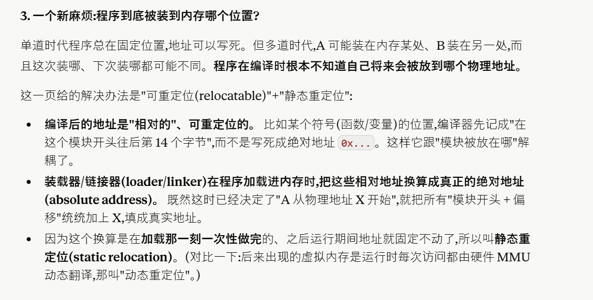
但早期的多道程序设计没有保护机制，一个程序中的bug会导致其他程序也crash（包括 OS crash），程序也没有被禁止访问其他进程的地址
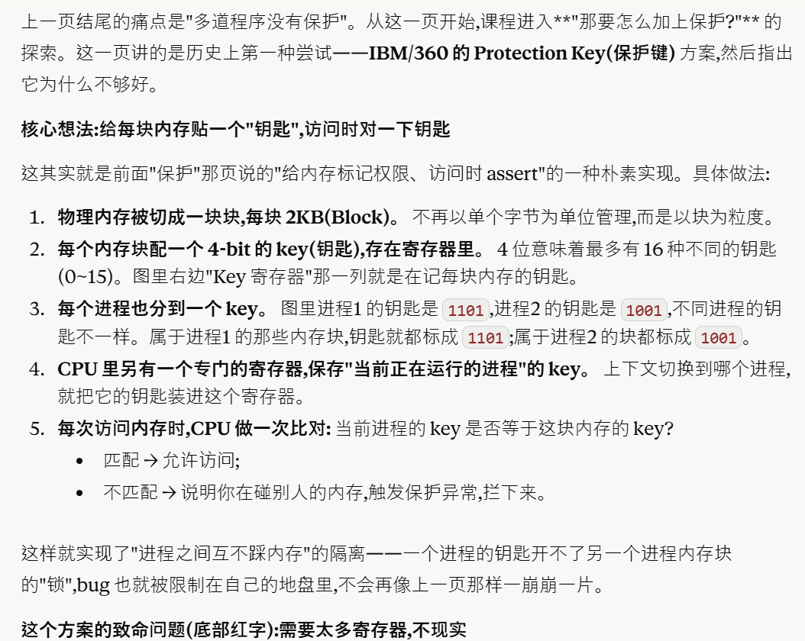

一种通用的保护机制是**基于地址的保护机制**，用基址和界限来保护各自的内存
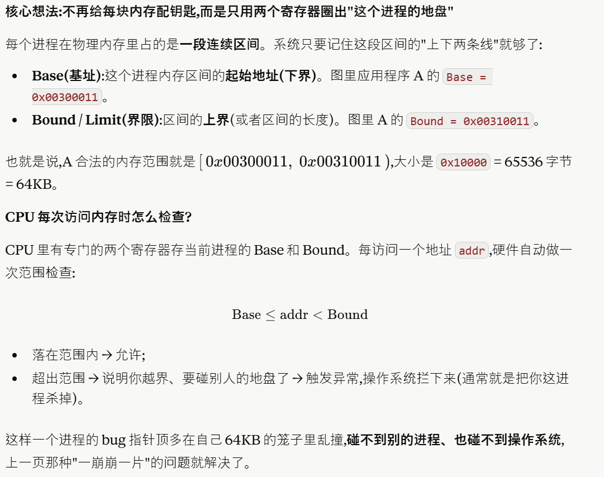
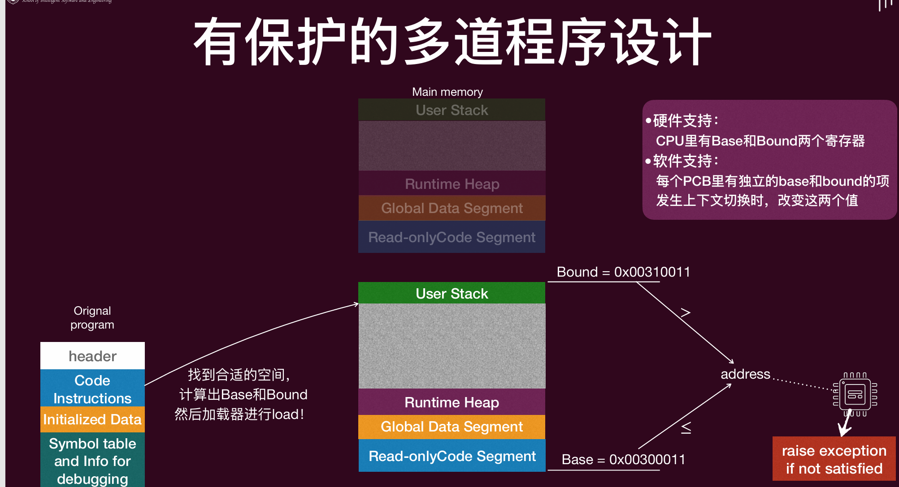
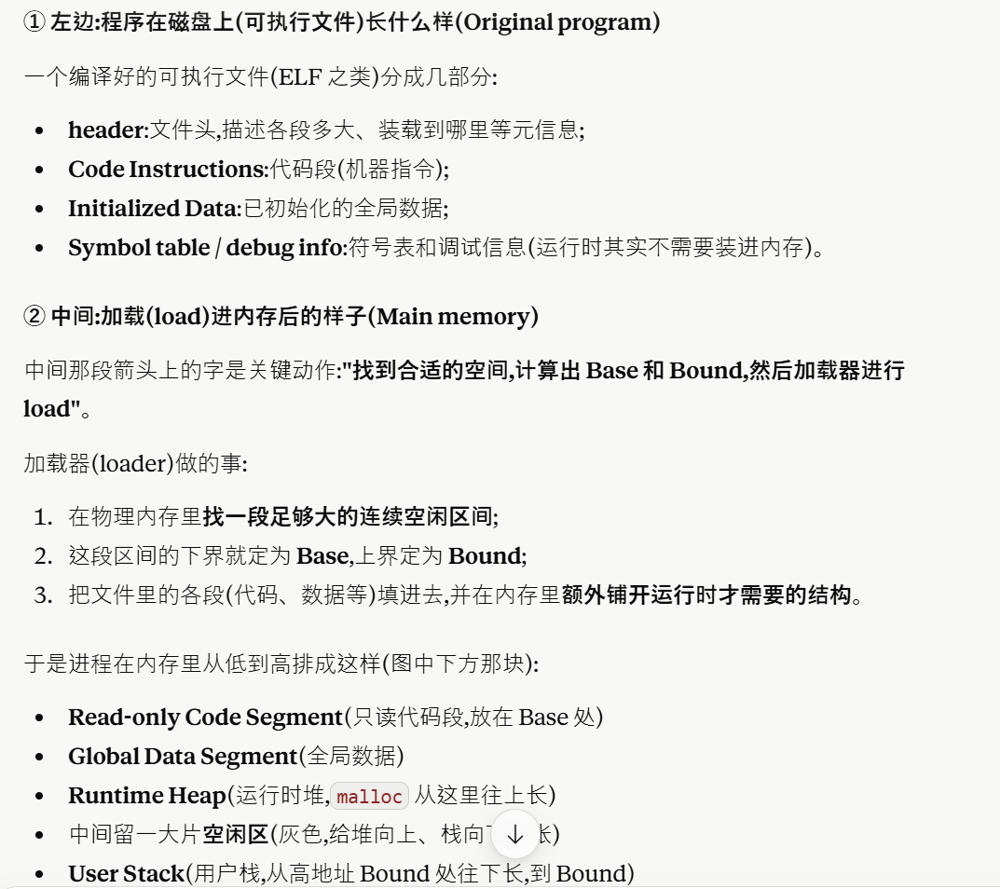
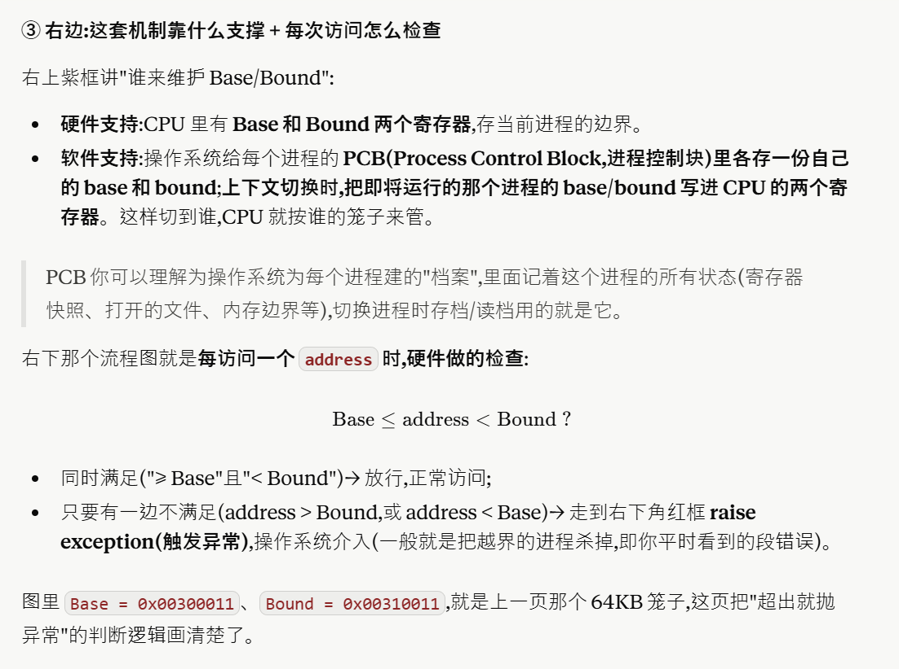
但是使用物理地址有缺点
物理地址对应用是可知的，导致：
，一个应用会因其他应用的加载而受到影响(loader加载器压力骤增)
，一个应用可通过自身的内存地址，猜测出其他应用的加载位置
是否可以让应用看不见物理地址？
，“看不见”，指应用对物理地址不可知
，一个进程不用关心其他进程占了什么地址，不受其他进程的影响
，看不见其他进程的信息，带来更强的隔离和保护能力

## 虚拟内存抽象
以虚拟内存抽象为核心的内存管理
，CPU:支持虚拟内存功能，新增了虚拟地址空间（通过Memory Management Unit, MMU单元）
，操作系统: 配置并使能虚拟内存机制
，所有软件: 均使用虚拟地址，无法直接访问物理地址

虚拟地址会被硬件自动转换成物理地址，应用程序不需要关心这个过程
每个应用程序有独立的虚拟地址空间
- 应用程序认为自己独占整个内存(透明性)
- 应用程序不再看到物理地址
- 应用程序加载时不用再为地址增加一个偏移量

### Linux虚拟地址空间
1. Process（进程）→ task_struct
每个进程在内核里都用一个 task_struct 来表示,它保存了进程的全部信息(PID、状态、寄存器等)。
2. Address space（地址空间)→ mm_struct
mm 指向 mm_struct,它描述整个进程的内存布局。图里列出的几个字段:
    ，start_code:代码段起始地址
    ，start_stack:栈的起始地址
    ，start_brk:堆(heap)的起始地址
可以理解成一张"地图的总览",记录各个区域大致从哪里开始。
3. Virtual memory segment(虚拟内存区域)→ vm_area_struct
每一块连续且属性相同的内存区域(简称 VMA),用一个 vm_area_struct 描述:
    ，vm_start / vm_end:这块区域的起止地址
    ，vm_flags:权限标志(可读/可写/可执行)
    ，vm_file:如果这块区域是映射某个文件,就指向那个文件
    ，vm_pgoff:在文件中的偏移量
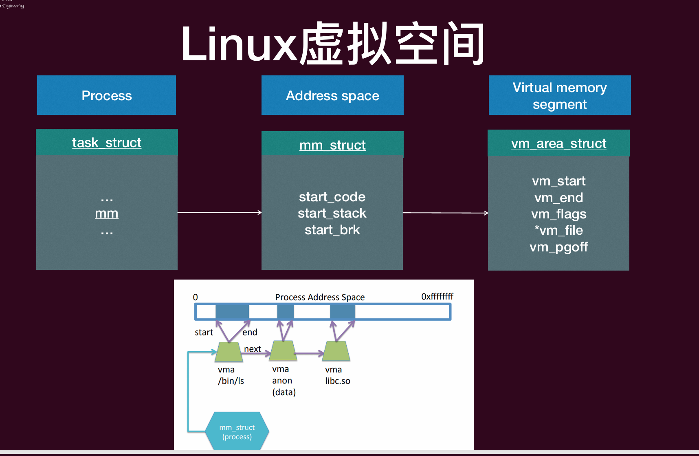
一个进程的地址空间(从 0 到 0xffffffff)被划分成若干块。每一块(深蓝色)对应一个 VMA

这些 VMA 通过 next 指针串成一个链表(图中绿色梯形之间的箭头),每个 VMA 用 start、end 指向它在地址空间里覆盖的范围。整个链表由底部的 mm_struct 统一管理。
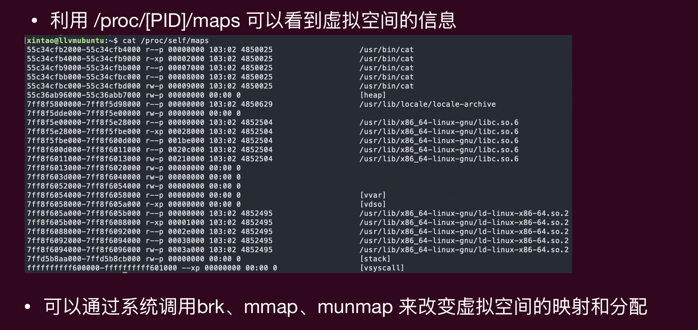

### 地址翻译
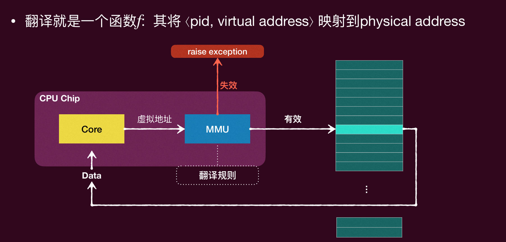
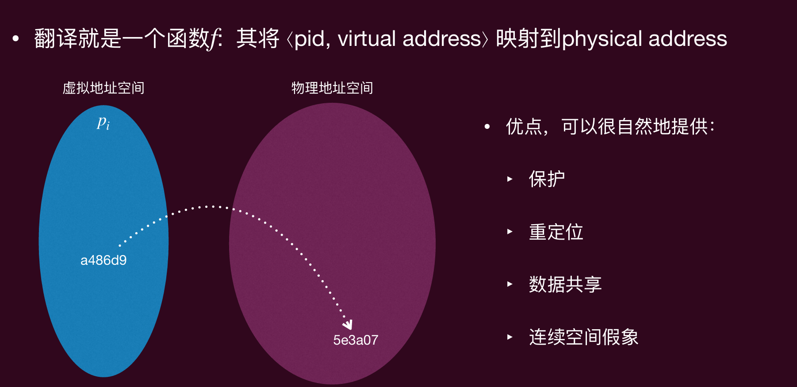
，保护：让不同的进程映射到不同的区域即可（即两个进程的映射函数的值域不相交）
，可重定位：进程被映射到的物理地址可以在运行时不断变化（运行时，不是编译时，因此是动态重定位）
，数据共享：将不同进程的不同虚拟地址映射到同一个物理地址
，构建连续空间假象：虚拟地址中的连续地址空间（编程友好），映射到物理内存可以不必连续

## 连续内存分配
最简单的内存分配方式，进程（包括操作系统内核）被分配一个**连续的物理内存地址**
利用基址和界限机制隔离用户进程之间的地址空间，以及防止用户进程修改操作系统的代码和数据
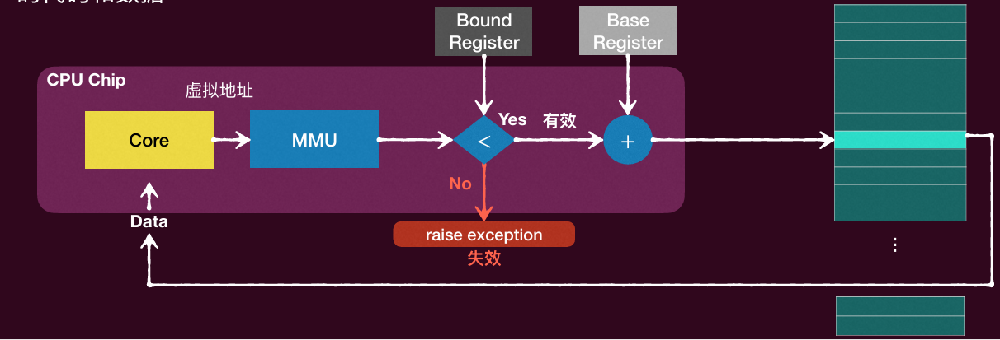
多个进程时需要将物理内存进行分割，每个进程占据一个连续的物理内存分区，有两种分割方式
，固定分区：物理内存一开始就被分为“固定”大小的区域，各个区域的大小可以相同，也可以不同，一个进程选择一个空闲区域进行分配
，可变分区：每个分区大小不固定，分区数不固定

### 固定分区
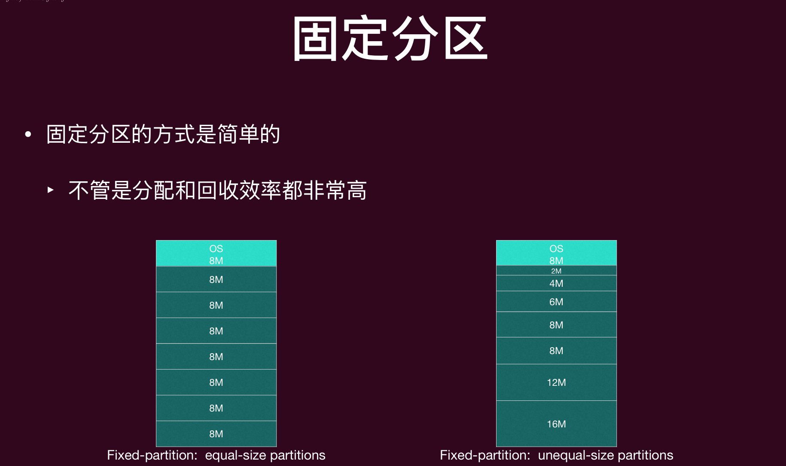
问题是：如果一个进程所需要的空间非常大，这种固定分区就不合适了
如果某个进程需要的内存超过所有分区中最大的那个，就无法放入该内存分区，进程无法运行
此外，进程的size各种各样，但只能选择一个分区存放，这个分区大于进程的部分就是一个内部碎片（internal fragmentation），其无法被其他进程占用，自己也不用
此外，固定的分区数也限制了可以同时放入内存的进程数

### 可变分区
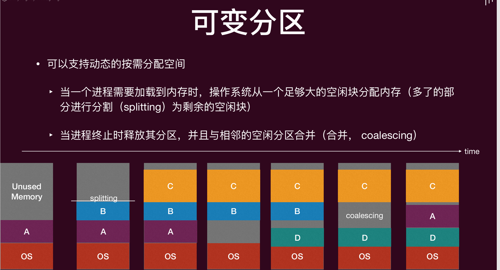
鉴于大多数进程在运行时会增长，在加载进程时会分配一些额外的内存。
此外，如果给进程所分配的区域用完，那么该进程将可能： 
，被移动到一个有足够空间的空闲区域中 
，被交换（Swap）出内存（到磁盘），直到能够创建一个足够大的空洞 
，或者直接被终止（OOM Killer）

**碎片**：无法被分配的未使用内存
，外部碎片（空洞）：由于分散的小的不连续的空闲空间导致的内存浪费，发生在分区之间，通常是由于进程的不断加载和释放造成
，内部碎片：由于分区大小和加载的进程大小之间的差异（即进程小于分配的分区）导致的内存浪费，发生在分区内
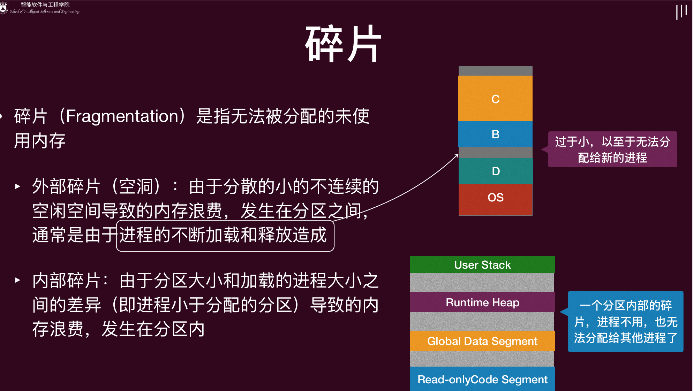
对于外部碎片，进程终止或暂时交换出磁盘，可以释放内存，可能会合并一些碎片形成大的可分配区域
通过**紧缩**（compaction）减少外部碎片化 
，重排内存内容以将所有空闲内存放在一起 
，时间复杂度较高（一般在系统实在没有内存的情况下才会做，内存分配slow path的一部分）
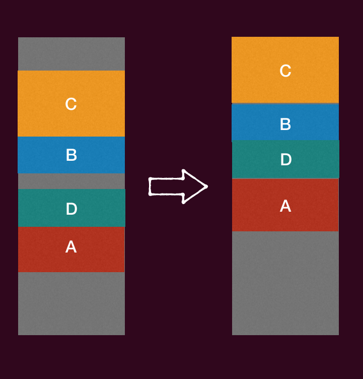

#### 空闲内存管理
为了实现动态可变分区内存分配，操作系统应维护以下信息：
，已分配的分区
，空闲的分区（空洞）

一种简单的办法：Bitmap
，内存被划分为分配单元（几字节到几千字节）
，每个分配单元对应位图中的一位，如果该单元空闲则该位为0，如果被占用则该位为1（或反过来）
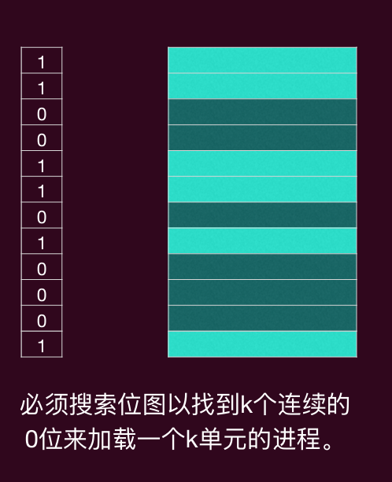

一个更加常用的做法：空闲内存链表
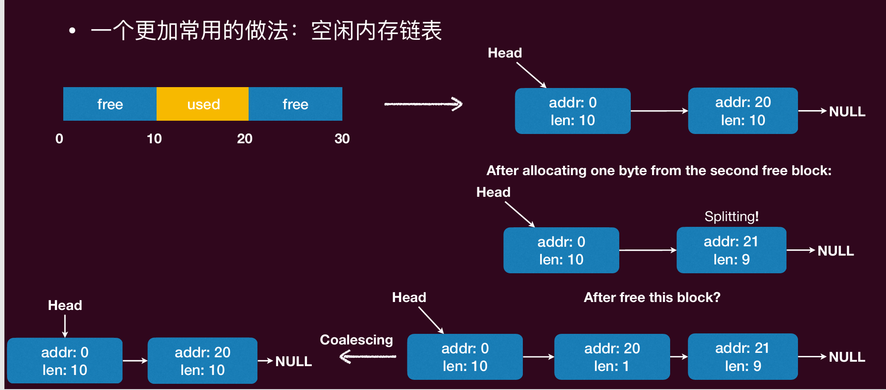
我们还需要跟踪已分配区域的大小，这样free(*p)时才能正确的返回一个正确的空闲节点

### 基本分配策略
空闲内存列表有很多，都可以分配给一个内存的申请需求，只要大于等于申请的空间即可，那么选择哪个呢？不同的策略会影响分配和回收的性能和有效性（比如碎片数量）
，Best-fit：分配最小的足够大的空闲区域（尽可能物尽其用），需要遍历整个列表，但可能导致产生微小且无用的外部碎片
，Worst-fit：分配最大的空闲区域，剩余的部分最大，可以为其他进程所占用，而不是形成碎片，但同样遍历整个列表
，First-fit：分配第一个足够大的空闲区域（尽可能少搜索）
，Next-fit：跟踪上次适配的位置，并从上次搜索结束的地方开始搜索 （尽可能均匀的搜索整个空间）

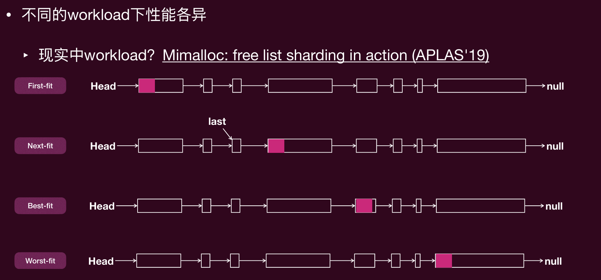
但是性能是个大问题，链表找还是太费力了，其搜索的算法复杂度是 $O(n)$

用更好的数据结构，比如：红黑树，结点存放的空闲内存的大小，这样就可以以 $O(\log n)$ 的复杂度搜索相应的内存
但还有一个问题，当free之后，如何合并？
- 在地址上，相邻的空闲块才能合并，因此空闲的结点链表应该按照地址进行链接，然后free的时候扫描整个链表
- 有没有更加方便的合并？

#### 伙伴系统
从包含物理上连续页面的固定大小段中分配内存，使用2的幂分配器power-of-2 allocator 分配内存
，按2的幂大小单位满足请求：请求向上舍入到下一个最高的2的幂
，当需要比可用空间更小的分配时，当前块被分割为两个下一个较低2的幂的伙伴
，持续进行直到有适当大小的块可用
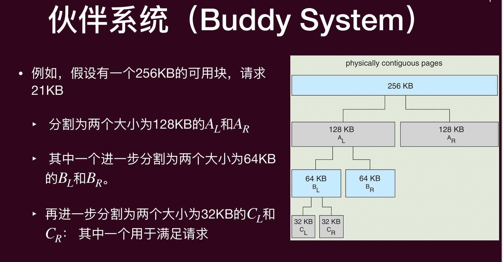
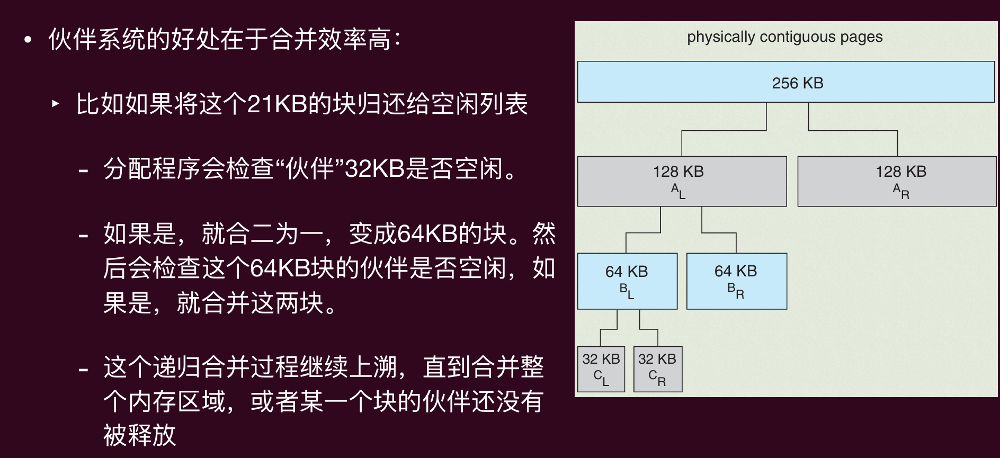

Buddy System已经是linux内部分配大粒度的连续的物理页面的方法了，但还是存在一些问题：
- 内部碎片
，只允许分配2的整数次幂大小的空闲块（实际上，伙伴系统分配的最小单位是4K，即一个物理页），因此如果不是2的整数次幂的大小，会有**内部碎片**
，比如刚刚的例子中有 32K-21K无法使用（属于该进程，但该进程没有使用他们，也不能被其他进程使用）

#### Segregated List(Slab Allocator)分配器
操作系统里面的结构体大小常为几十、几百字节
- Buddy System来分配的话会产生大量的碎片

此外，一个经验观察：
，系统频繁分配的对象大小相对比较较小且固定
，小对象分配/回收的 scalability 是System内存分配的主要瓶颈

目标:快速分配小内存对象
解决方案：SLAB 
，从伙伴系统获得大块内存
，进一步细分成**固定大小的小块内存**进行管理
，块大小通常是 $2^n$ 个字节(一般来说，3 ≤n≤12)
    ，可以额外增加特殊大小(一些频繁使用的特定数据结构大小)如198字节从而减小内部碎片
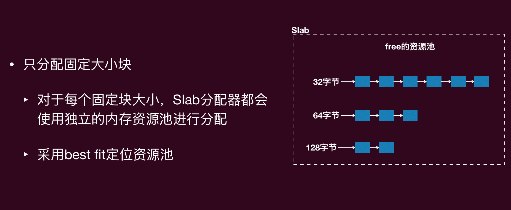

1. 每种块大小用独立的资源池
32、64、128 字节各自维护自己的链表，互不干扰。好处是同一规格的块大小一致，可以紧凑排列、复用，几乎没有碎片，分配/释放就是简单的链表操作，非常高效。
2. 采用 best fit（最佳适配）定位资源池
当你请求一块内存时，分配器会挑能装下你、且最接近你需求的那个规格。比如你要 50 字节，它会跳过 32（装不下），选 64（刚好够且最省），而不是用 128。这样能减少每次分配的内存浪费。
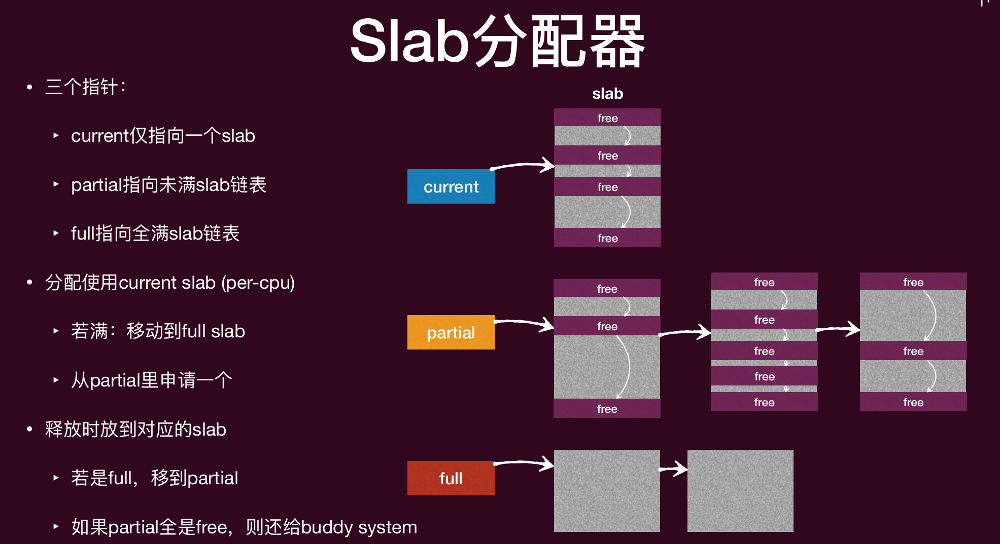
每个 slab 是一整块内存，被切成若干等大的格子（对象槽）。按「用了多少」分三种状态：

空闲格子多、还没满 → 属于 partial
格子全部用完 → 属于 full，全是黑色
格子全部空着 → 可以整块还给系统
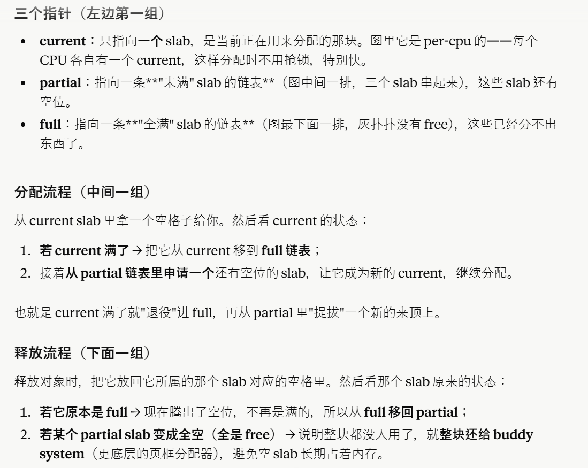
Fast path
- Per CPU从当前slab中取出一个适合大小的块（快速，没有和其他CPU的竞争）
low path
- 需要从一个全局的partial里去找一个作为当前的slab，不巧的话（paritial里也没空闲内存），甚至需要从buddy system里重新分配连续空间，再次分割为可用的slab

如果直接分配给进程内存的话，stack和heap中间的部分都被浪费了
- 内部碎片无法避免
• 无法和其他进程共享内存（比如代码和glibc）
- 主要是保护机制粗糙，整体空间的保护，没有精细到具体的部分内存

## 分段
用户视角的内存管理
，将程序视为一组段（segments）
，段是虚拟内存空间的连续区域，是一个逻辑单元，例如代码段、栈、堆等，按照这样的段分配内存

### 分段机制
虚拟地址空间被分成若干大小不同的段。系统需要一张表来记录"每个段实际放在物理内存的哪里、有多大"，这就是段表：

，每个进程一张：每个进程的内存布局不同，所以各自有**独立的段表**（和页表一个道理）；
，由**段号**索引：第几个段就查表里第几项；
，供 MMU 查询：MMU（内存管理单元）是硬件，地址转换由它在运行时自动完成。
每个段表项里存两个关键信息：

，**段基址**（Segment Base）：这个段在物理内存中的起始地址；
，**段界限**（Segment Bound）：这个段的大小（用来做越界检查）

虚拟地址分为: 段号(segment number) + 段内地址(偏移, Offset)
物理内存也是以段为单位进行分配，虚拟地址空间中相邻的段，对应的物理内存可以不相邻
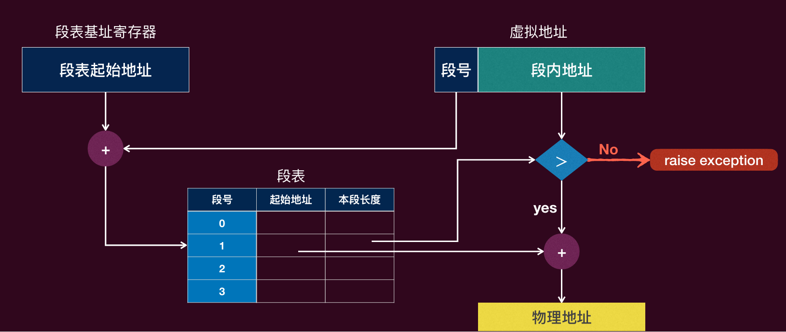

### 支持共享
多个虚拟地址空间可以映射到内存中的**同一物理段**
比如：只读代码的一个副本在进程间共享，一个可执行文件被加载多次
• 段表需要增加**保护位**，指示程序是否具有相应段的读/写/执行权限
同一段被多个进程用，权限必须可控。所以段表项除了基址、界限，还要加一个保护位，标明这个段是否可读/写/执行。
• 每个进程仍然认为它在访问自己的私有内存（透明性）
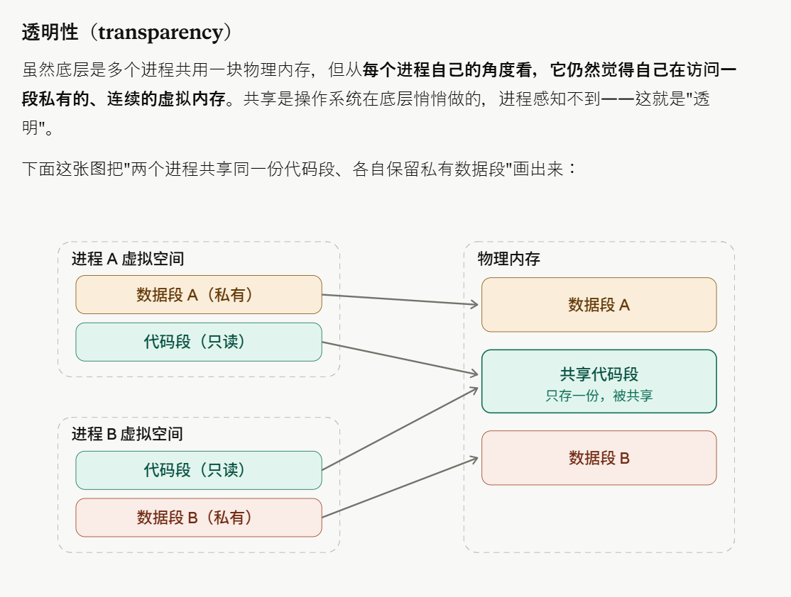

存在问题
- 分配的粒度太粗，随着时间的推移会产生外部碎片

## 分页
更**细粒度**的内存管理
- 物理内存被划分成连续的、等长的物理页（也叫帧frame），大小一般为2的幂，⽐如默认是4KB （ $2^{12}$B的size）
- 虚拟内存也被划分为相同大小虚拟块——虚拟页（Page）
- 任意虚拟页可以映射到任意物理页，非常灵活，不需要是连续的空间
- 由于都是按照页为单位分配内存，所以没有外部碎片
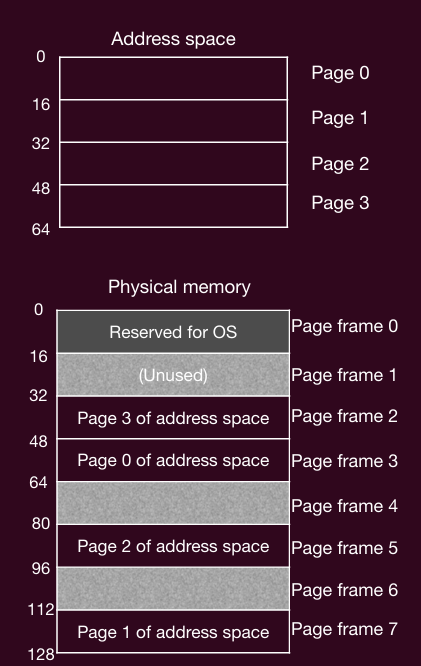
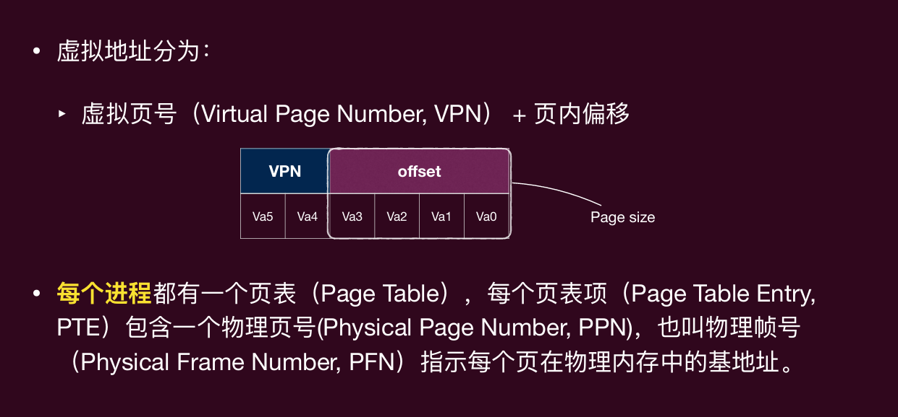
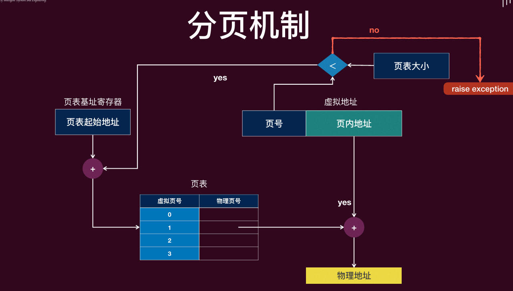
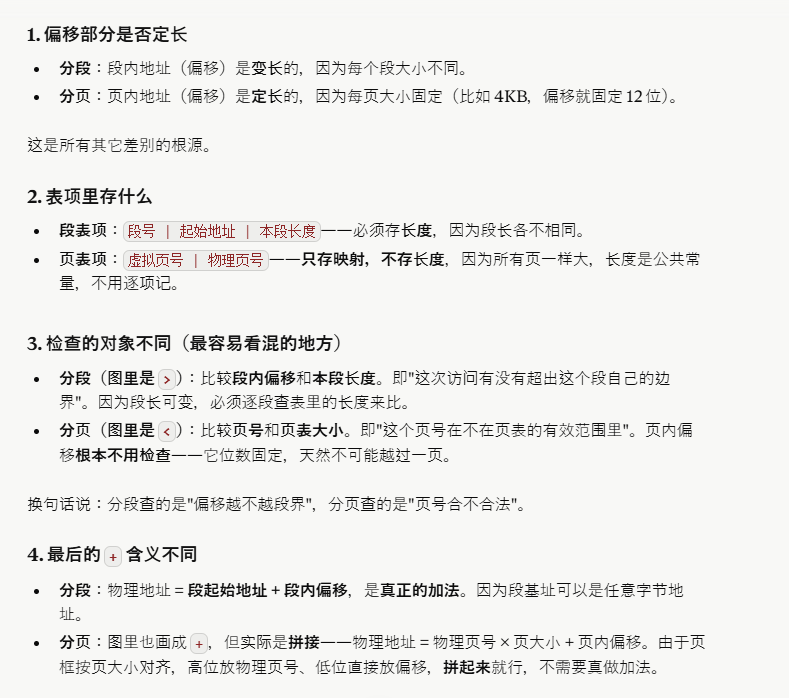

### 页表
页表最简单的形式称为**线性页表**（一个数组），存储在物理内存中
页表项（PTE）的具体布局⾼度依赖于机器
- 需要足够的位来标识物理页
- 应包括一些控制位
页表项中的常见控制位
- 有效位（Valid bit）：转换是否有效（支持稀疏空间）
- 存在位（Present bit）：页面是否实际存储在内存中
- 保护位（Protection bits）：页面是否可以被读取、写入或执行
- 引用位（Reference bit）：页面是否已被访问
- 脏（修改）位（Dirty/modified bit）：页面自被载入内存以来是否已被修改
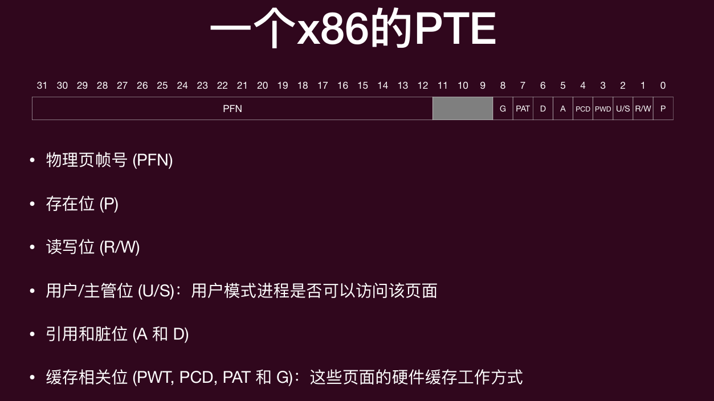
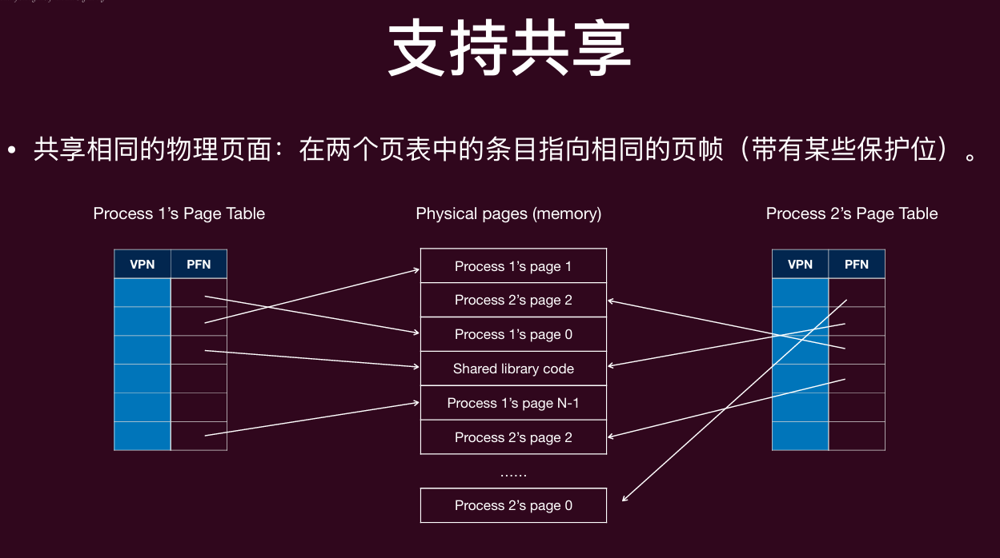

### 多级页表
若使用单级页表结构，一个页表有多大？
- 32位地址空间，页4K，页表项4B，页表大小: $\frac{2^{32}}{4K} \times 4B = 4MB$
- 64位地址空间，页4K，页表项8B，页表大小: $\frac{2^{64}}{4K} \times 8B = 33,554,432 GB$

使用**多级页表**减少空间占用
- 若某级页表中的某条目为空，那么对应的下一级页表无需存在
- 实际应用的虚拟地址空间大部分都未被使用，因此无需分配页表    
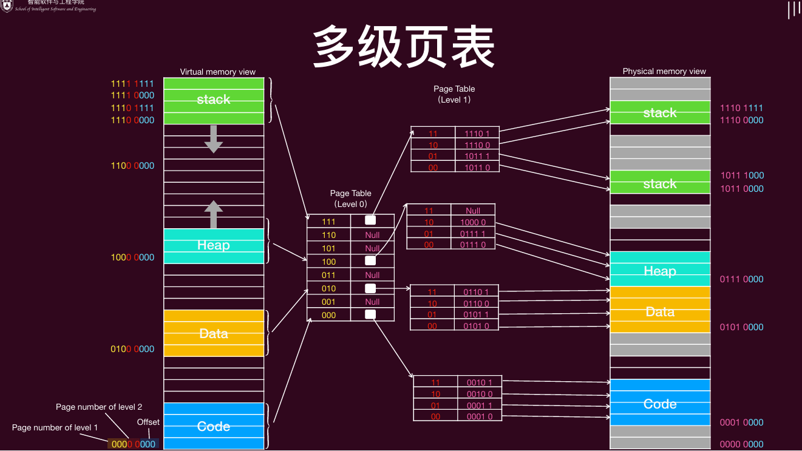

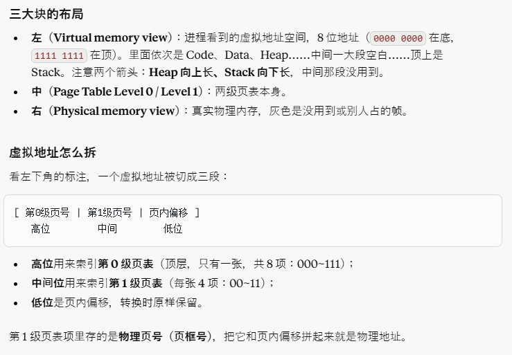
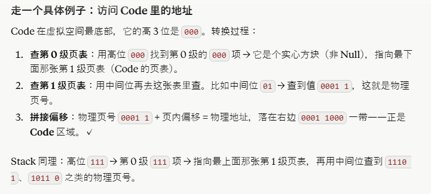
Null 项 = 多级页表省内存的核心
看第 0 级页表：110、101、011 这几项是 Null。这对应虚拟空间中间那段没用到的大空白（Heap 和 Stack 之间）。Null 的意思是"这一支根本没分配下级页表"。
这正是多级页表相对单级页表的最大好处：用不到的地址区域，连页表都不用建。 如果是单级页表，无论用没用都得为每个页留一个表项；多级页表则可以整支"剪掉"。
多级页表的基本构造单元——**页表页**
每一个独立的页表方框，就是一个"页表页"。具体对上：
第 0 级那个框（标着 Page Table (Level 0)，里面是 000~111 八项）——这是唯一的**顶层页表页**。对应上一张幻灯片说的"第 0 级有且仅有一个页表页"。
第 1 级那几个小框（标着 Page Table (Level 1)，每个里面是 00~11 四项）——每一个都是一个独立的页表页。图里画了 4 个，分别服务 Stack、Heap、Data、Code。
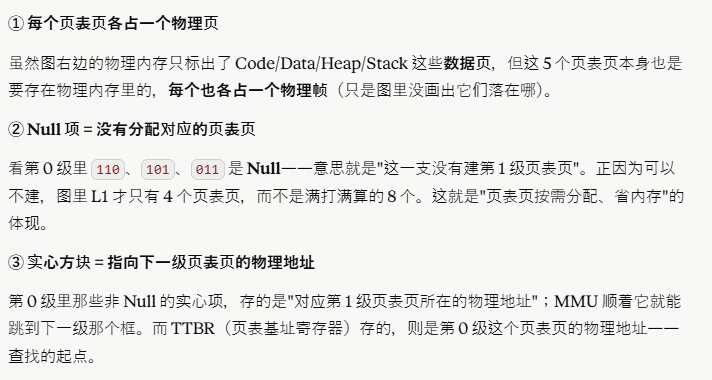

### 倒排页表
一个问题是：太多虚拟页了，而物理页是少的！
解决⽅案：倒排页表
- 不再为每个进程分别维护多个页表，而是保留一个单一的页表，每个物理页对应一个条目
每个页表条目包括：
- 使用该物理页的进程(Pid)
- 该进程的哪个虚拟页映射到该物理页
• 减少了存储页表所需的内存，但增加了在发生页引用时查找表所需的时间
- 使用哈希表来加速查找
• 此外一个问题就是无法共享

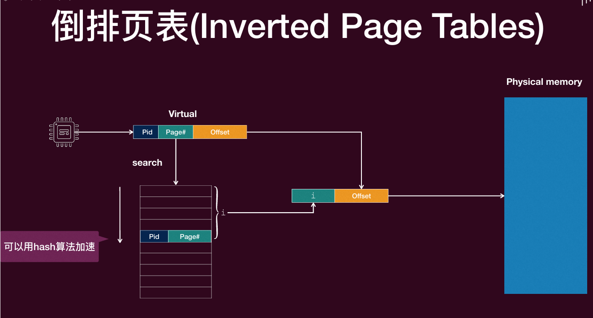

## 段页

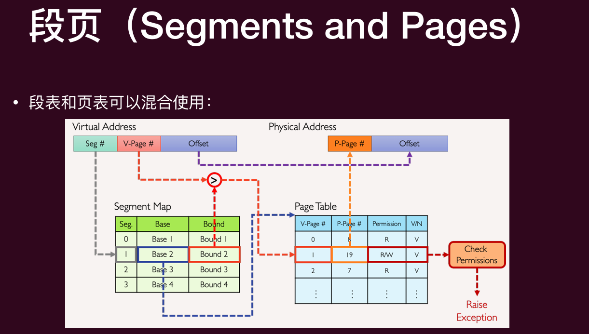

## Translation Look-aside Buffers（TLB） 
地址转换旁路缓冲
如何加速分页的地址转换？
观察：大多数程序倾向于对少量页面进行大量引用
使用一种特殊的快速查找硬件缓存，称为翻译后备缓冲器（TLB）或联想存储器（在内存管理单元中）
- 缓存最近的地址转换
- 如果TLB命中，直接转换（fast path）
- 否则，如果TLB未命中，则在页表中查找映射（页表遍历），并更新TLB (slow path)
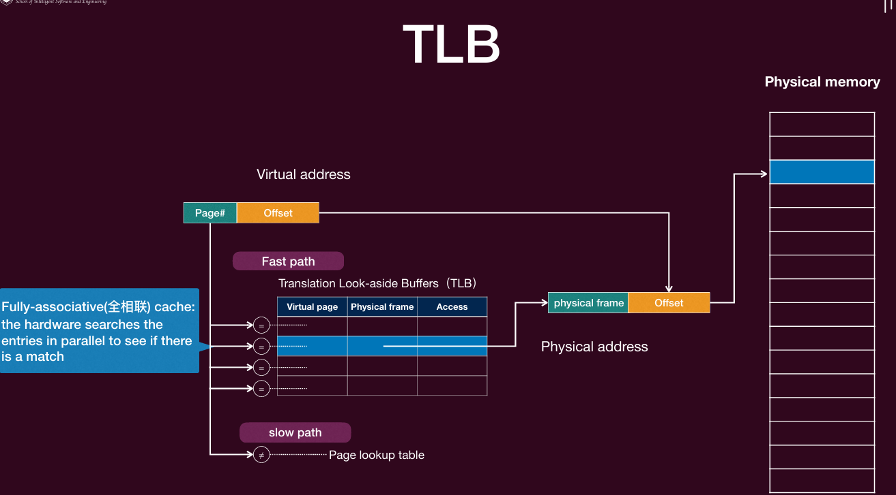
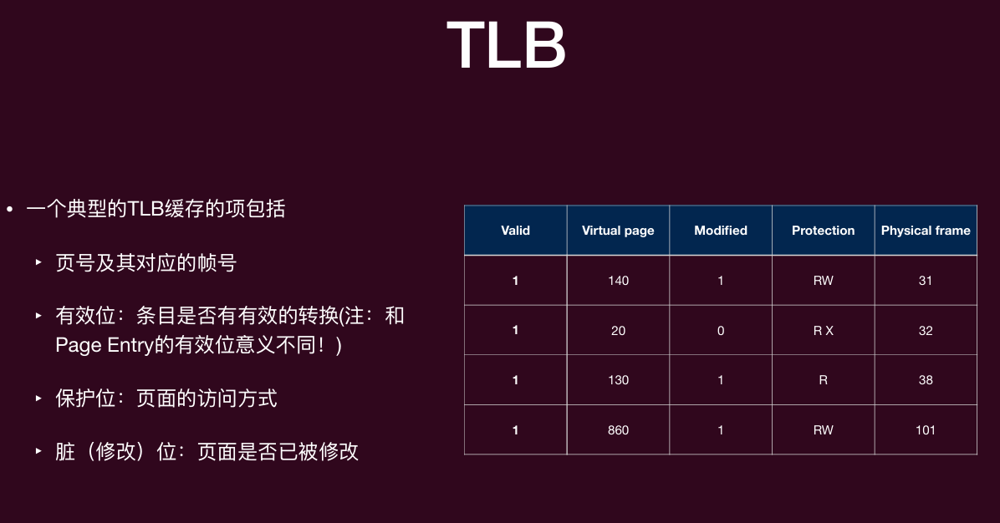

### 局部性原理
TLB背后的理念是利用指令和数据引用的局部性
- 时间局部性：如果某个数据被访问过，那么在**不久的将来**它可能会再次被访问
- 空间局部性：如果某个数据被访问过，那么它**附近**的数据在不久的将来也可能会被访问。
TLB通常很小，包含64到1024个条目
- 存储最可能被多的选中的地址翻译才能高效发挥TLB的作用
- 支持某些条目可以固定下来以便永久快速访问
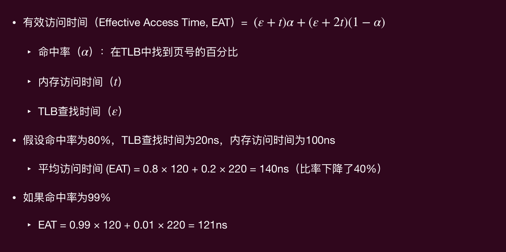

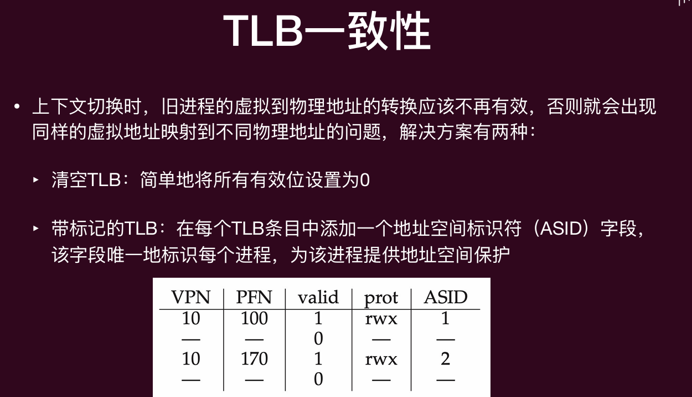

### 交换
如果没有足够的空间来容纳所有进程怎么办？ 
- 一个进程可以被暂时换出内存到后备存储
- 然后在需要继续执行时再换回内存 
- 进程的总物理内存空间可以超过物理内存
交换指的是把整个进程的内存镜像在**内存和磁盘**之间来回搬运。当内存不够时，把暂时不运行的进程整体"换出"到磁盘；需要它运行时再"换入"内存。

- 交换时间主要取决于**磁盘传输时间**
    - 交换的瓶颈在磁盘 I/O，而不是 CPU。搬运的数据量越大，时间越长，两者成正比
- 系统维护一个就绪队列
    - 队列里存的是那些"镜像已经在磁盘上、随时可以运行"的进程
- 换出 + 换入导致上下文切换时间飙升
    - 如果调度器选中的下一个进程当前不在内存里，系统就得：先把内存中某个进程换出到磁盘 → 再把目标进程从磁盘换入内存

假设进程发起了一个 I/O 操作（比如 DMA 正往它的缓冲区里写数据），而这个 I/O 缓冲区就在进程的地址空间内：

如果此时把进程换出到磁盘，物理内存被腾出来给别的进程用了；
但 DMA 控制器还在往原来那块物理地址写数据 → 写到了别人的内存上，造成 I/O 失败或数据丢失。
所以一般涉及I/O的页需要被**锁定**在内存中，不能被换出到磁盘。

交换通常是禁用的。当分配的内存超过阈值（当可用内存极低时）才会启动交换。一旦内存需求减少到低于阈值时，交换再次被禁用。

## 虚拟内存
每个进程都有一个大的地址空间的幻觉。 
支持多个并发运行的进程使用大的虚拟地址空间：只将常用的页面保留在内存中（此时内存可以看成是所有pages的一个cache）
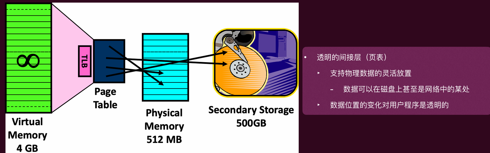

虚拟内存具备"部分"加载程序的执行能力
意思是程序不必整个加载进内存就能开始执行，只加载当前需要的那部分页，其余按需换入。
1. 程序不再受物理内存限制，可以运行大小超过物理内存的程序
2. 每个程序运行时占用更少内存 → 能同时跑更多程序
3. 加载/交换所需的 I/O 更少 → 启动更快

如何实现按需加载？
使用存在/不存在位（在页表项中）来跟踪哪些页面存在于物理内存中。 
当程序引用其地址空间的一部分时： 
- 如果页面在物理内存中，存在位是1，则直接进行地址转换
- 如果不在，存在位是0，则发生**缺页异常**（Page Fault），操作系统被调用来处理该异常，检测并将页面加载到内存中，然后重新执行指令(引用该地址空间的指令)

## 缺页异常
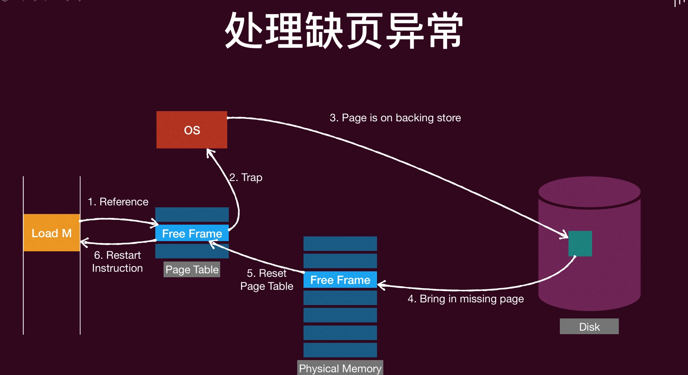
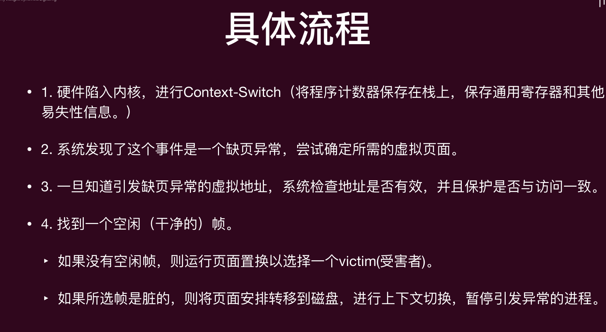

处理缺页异常的三个主要活动：
- 服务中断：一般只需要几百条指令
- 读取页面：需要大量时间
- 恢复进程：需要少量时间

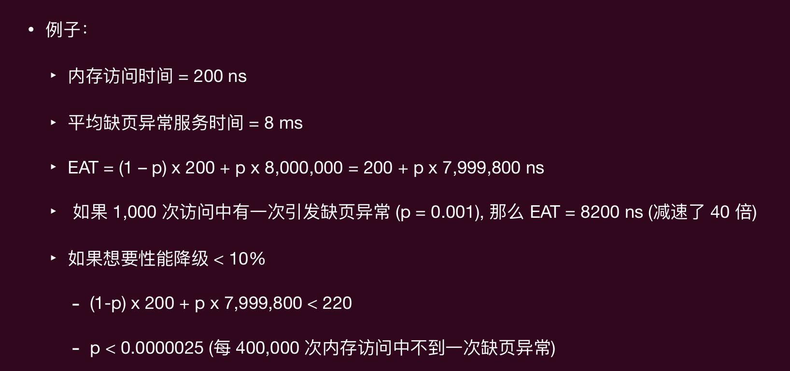
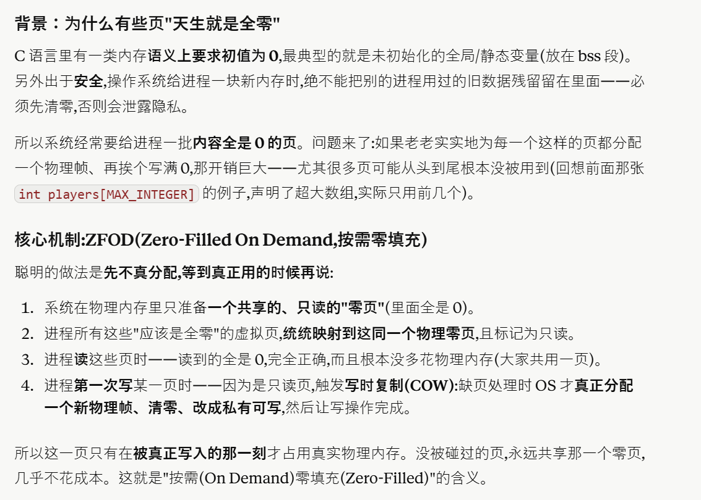
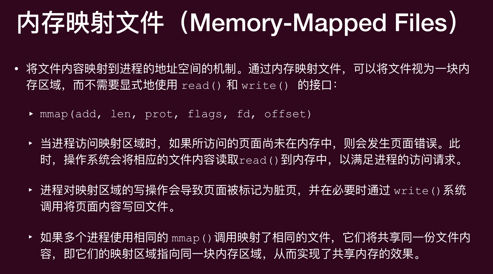

## 页面置换
何时将页面调入内存？
按需分页（Demand Paging），出现缺页异常后进行调入页面
最简单的方法。为了提高效率，调入是**异步**进行的：中断处理程序应快速响应，只需启动磁盘I/O并阻塞该进程，让其他进程运行。
预取(Prefetching)：猜测即将使用哪些页面，因此提前将其调入内存，往往是基于历史的缺页记录来预测

如果没有空闲的帧会发生什么？ 
- 页面置换：找到内存中的一个页面（一般来说该页面近期最不可能再次被访问），将其换出。
- 选择一个**受害者帧**（victim frame）进行驱逐，将所需的页面入（新）空闲帧。

当一个页面必须被换出时
- 更新页表：找到所有引用旧页面的页表项（因为帧可以共享），并将每个设置为不可见
- 移除任何TLB条目，TLB关机：在多处理器系统中，必须从所有处理器的TLB中消除TLB条目
- 将页面写回磁盘（如果需要，页表项中的脏位）
- 重新启动引发陷阱的指令：（需要备份指令）

哪个帧应该被替换？ 
⽬标是实现最低的缺页异常率（尽量减少从磁盘获取页面的次数）。 
- 如果选择一个不常被使用的页面，系统性能会更好。
- 如果删除一个频繁使用的页面，它可能很快就需要被重新调入

### FIFO
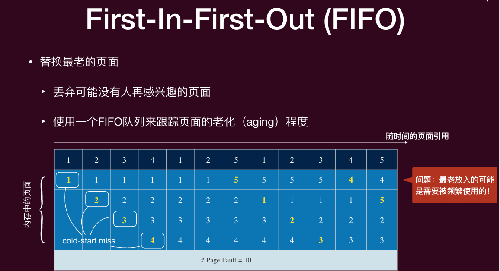

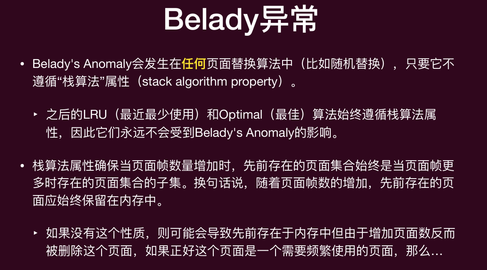

### Optimal
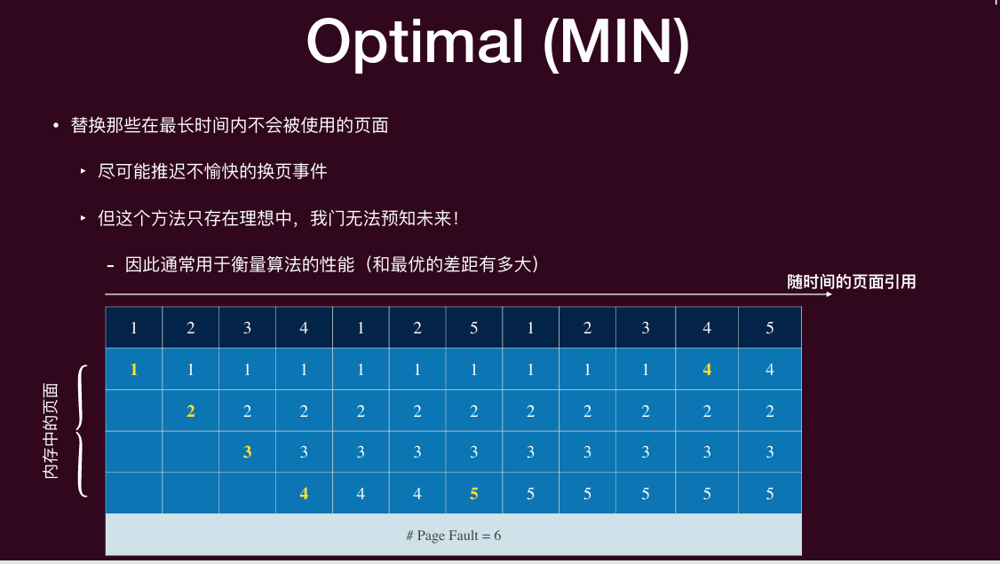

### LRU(Least Recently Used)
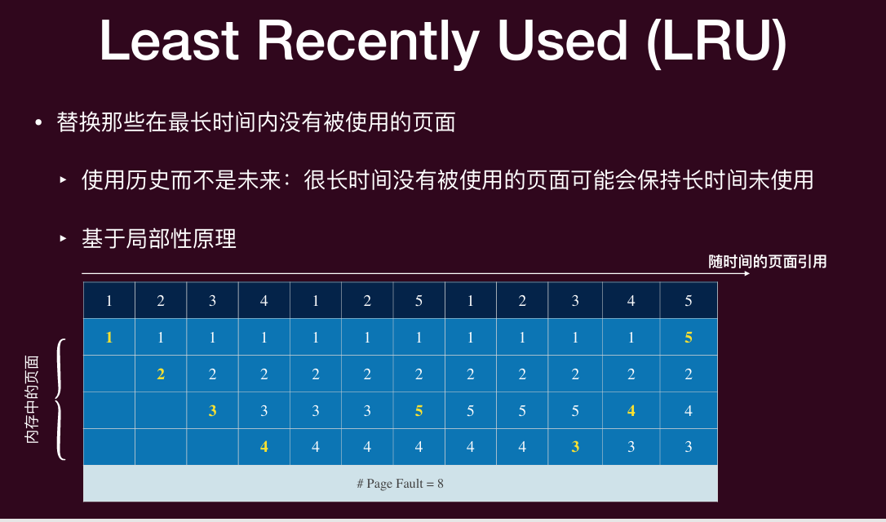
为了跟踪哪些页面最近最少被使用（将每个页面的最后一次使用时间与之关联），操作系统必须在每次内存引用时进行一些计时工作。 
计数器实现
- 每个页面都有一个对应的计数器项。 
- 每次页面被引用时，通过硬件将时钟寄存器的值复制到计数器中。
- 当需要更换页面时，查看计数器以找到最⼩的值。
但是开销太⼤！

### 近似LRU
通过引用位来近似LRU（即二次机会算法，Second Chance）：寻找一个在最近的时钟周期内没有被引用的老页面。
- 系统中每个页面有一个引用位（R）。 
- 每当引用页面（即读取或写入），引用位被设置为1（由硬件完成）。 
- 如果要被替换的页面：
    - R = 1：将引用位设置为0；将其放在FIFO队列的末尾；并检查下一个页面。
    - R = 0：替换它。 
- 如果所有页面都被引用，那么第二次机会算法等于FIFO。
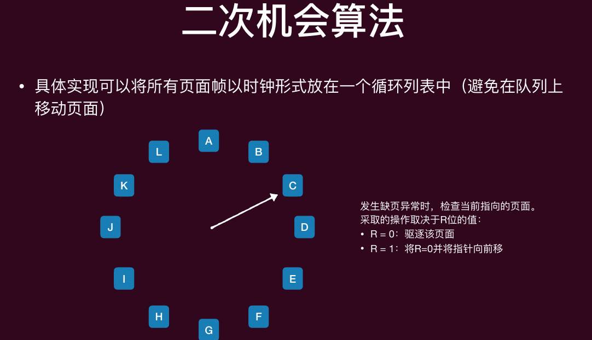

### NRU(Not Recently Used)
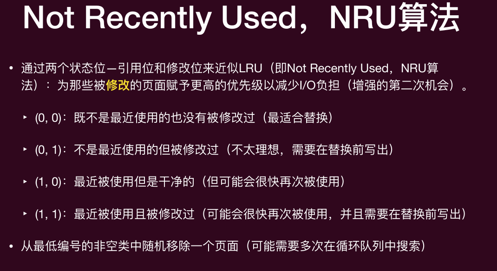

### 抖动
如果⼀个进程没有足够的页面，缺页率可能会非常高。
‣ 假设引用页面编号顺序为0 1 2 3 0 1 2 3 0 1 2 3 0 1 2 3，但有三个可用帧，当运行FIFO / LRU，此时⼤部分 CPU 时间都被用来处理缺页异常
等待缓慢的磁盘 I/O 操作，仅剩⼩部分的时间用于执⾏真正有意义的⼯作
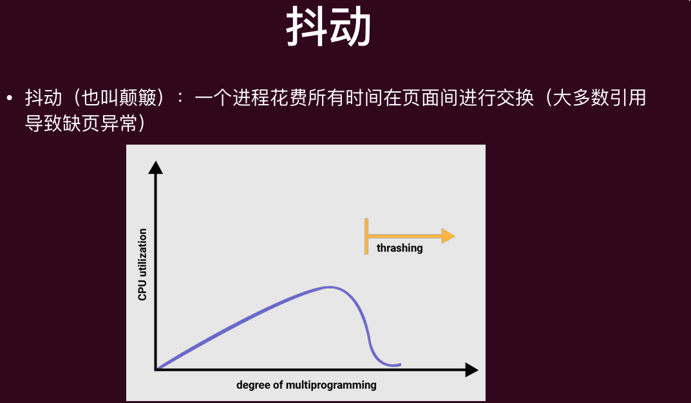

### 工作集模型

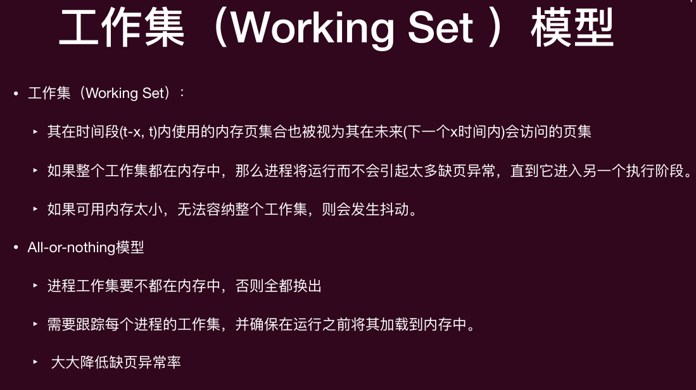

### 本地和全局策略
替换⻚帧是全局（从所有进程中选择）还是本地（只挑⾃⼰的⻚帧）？

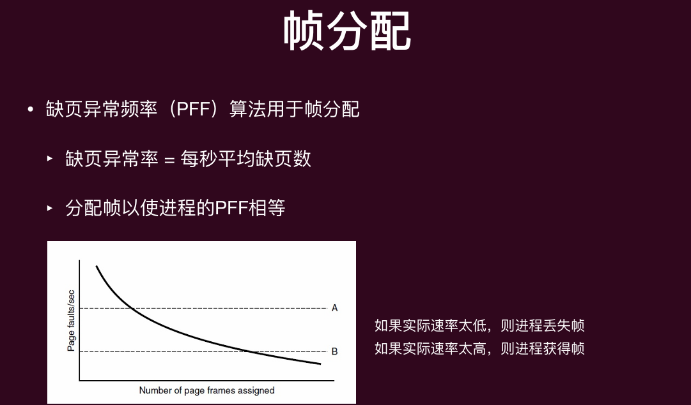
