# Lec13: Device Management
## 系统架构
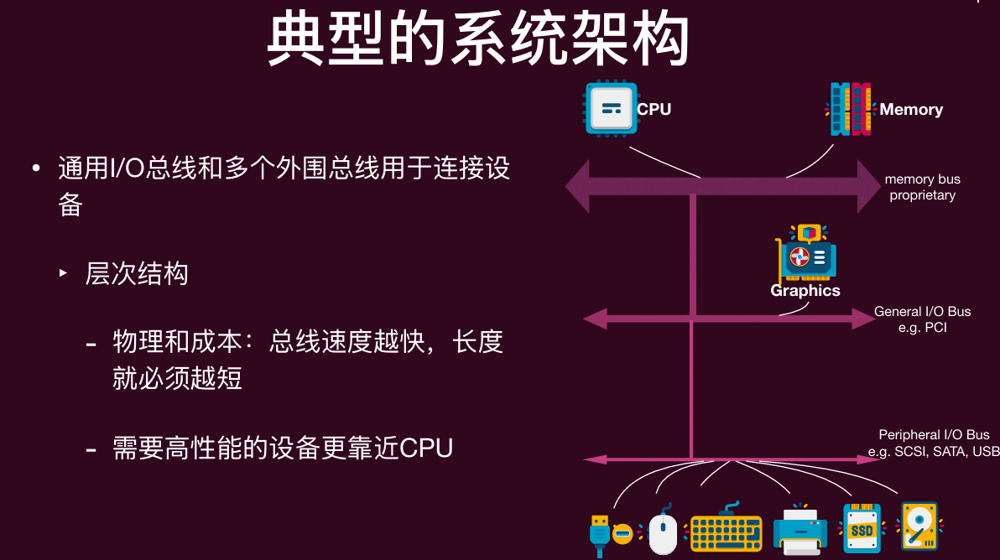
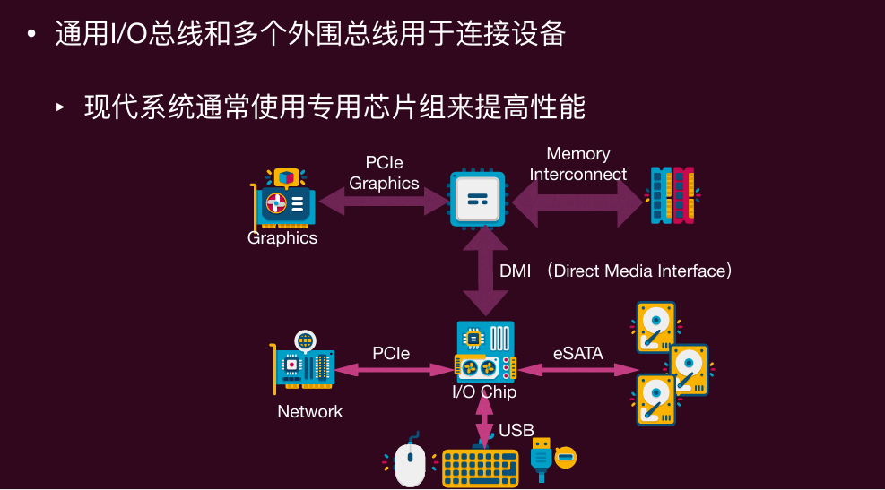

## 设备
设备大体可以分类为：
- 块设备（Block devices）：以**固定大小的块**存储信息，传输单位为整个块 
- 字符设备 (Character devices)：传递或接受**字符流**，**不可寻址**，没有任何寻址操作

一个设备有两个重要组成部分
- 它向系统其余部分呈现的硬件接口（允许操作系统控制其运行） 
- 它的内部结构（具体实现）
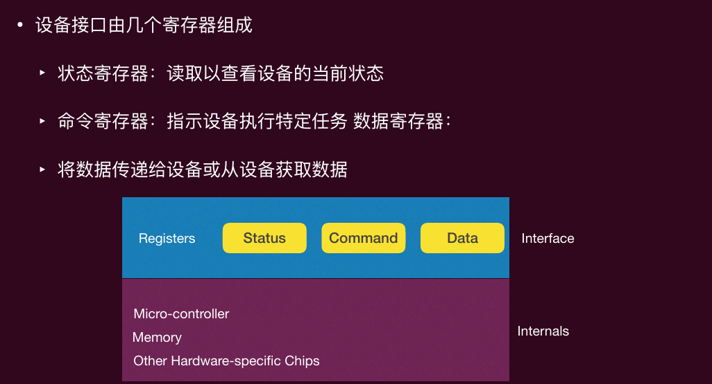

### CPU和设备的通信
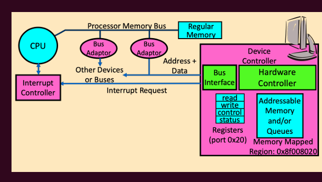
设备(比如硬盘、网卡、显示器)本身不直接跟 CPU 对话,而是通过一个控制器
CPU与设备交互，本质就是去读写控制器里面的寄存器
控制器除了一组可读写的寄存器外，可能包含用于请求队列等的内存
CPU以两种方式访问寄存器：
- 端口映射I/O
- 内存映射I/O

#### 端口映射
端口映射：提供额外的I/O指令
- 每个控制寄存器被分配一个I/O端口号 
- 使用特殊的I/O指令（在x86上为in和out）
- 这些指令通常是**特权指令**

#### 内存映射
内存映射I/O：
- 将所有控制寄存器映射到内存空间中 
- 每个控制寄存器被分配一个唯一的内存地址 
- 为了访问特定的寄存器，操作系统发出一个load指令（读取）或store指令（写入）该地址 
- 然后硬件将load/store指令指向到设备而不是主存储器
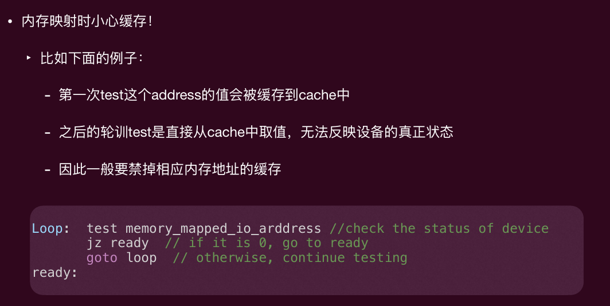

### 获知设备通信状态
在发出与设备通信的指令后，操作系统需要知道以下情况：
- I/O 设备已完成一个操作
- I/O 操作遇到了错误
有两种获知状态的方法，一般来说两种混合：
- 轮询(polling)：操作系统**定期检查**设备特定的状态寄存器，开销低（没有切换），但如果是低速的设备上会浪费CPU周期
- I/O 中断：设备在需要服务时生成**中断**，不会浪费CPU周期，但是开销高（伴随切换）

### 谁来控制数据传输命令
1. 由CPU来控制，也就是 Programmed I/O(PIO，程序控制 I/O)
每一个字节都由 CPU 执行一条指令搬过去。CPU 用上一张讲的两种访问方式中的指令:
- 端口映射的话用 in / out
- 内存映射的话用 load / store
优点:硬件简单,易于编程
但是消耗与数据大小成比例的**处理器周期**(因为每个数据的 in/out 都要一个指令)
此外,CPU 会一直接收到 interrupt,速度变慢，设备每准备好一个(或一小批)数据,就发一次中断叫 CPU 来搬。结果是中断**频繁触发**

2. 由DMA控制，也就是 Direct Memory Access(直接内存访问)
"给控制器访问内存和总线的权限"——平时只有 CPU 能当总线主控(bus master),DMA 让控制器也能临时接管总线、自己发地址读写内存。
CPU 只下一个"搬这一整块"的命令,具体的逐字节搬运由 DMA 干,而且是**整块(block)**地搬,不是一字节一指令。

### GPU加速
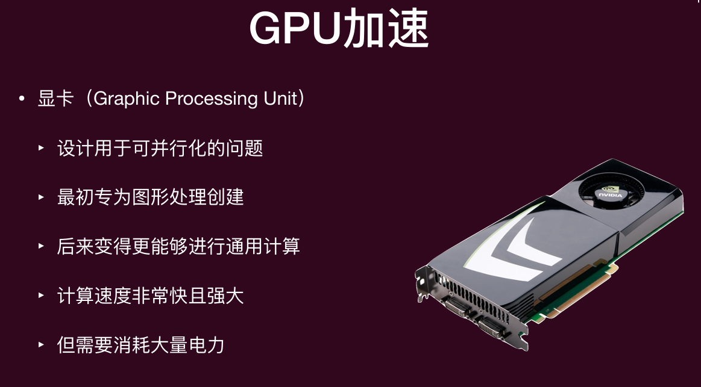
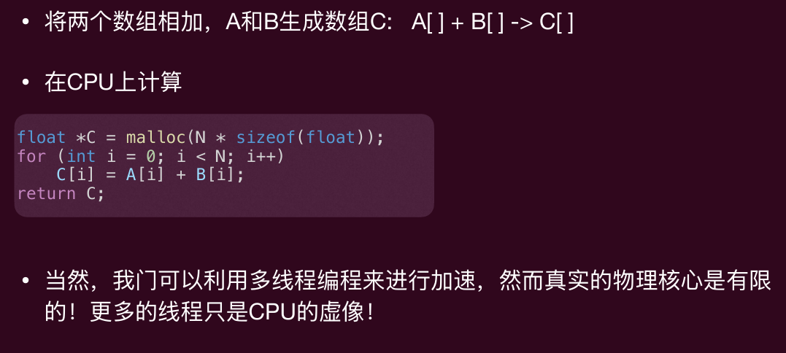
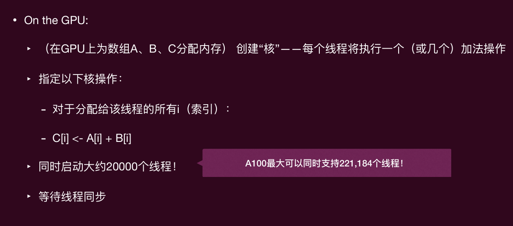
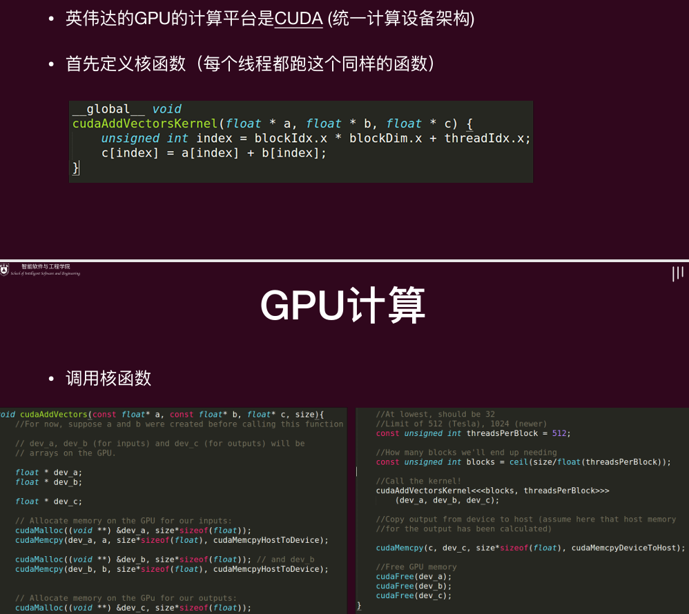

## 硬件抽象
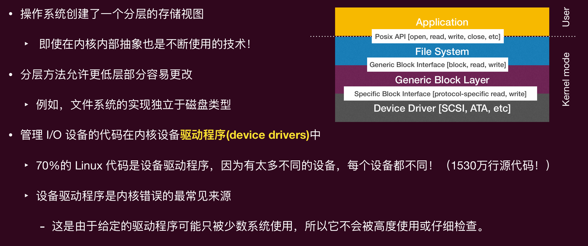
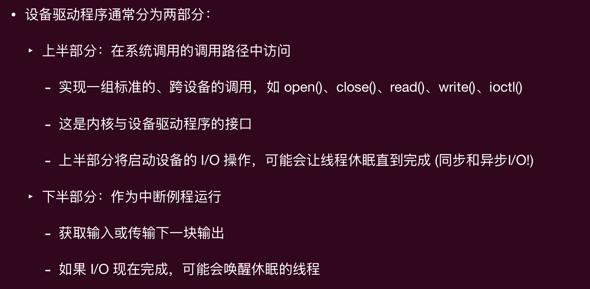
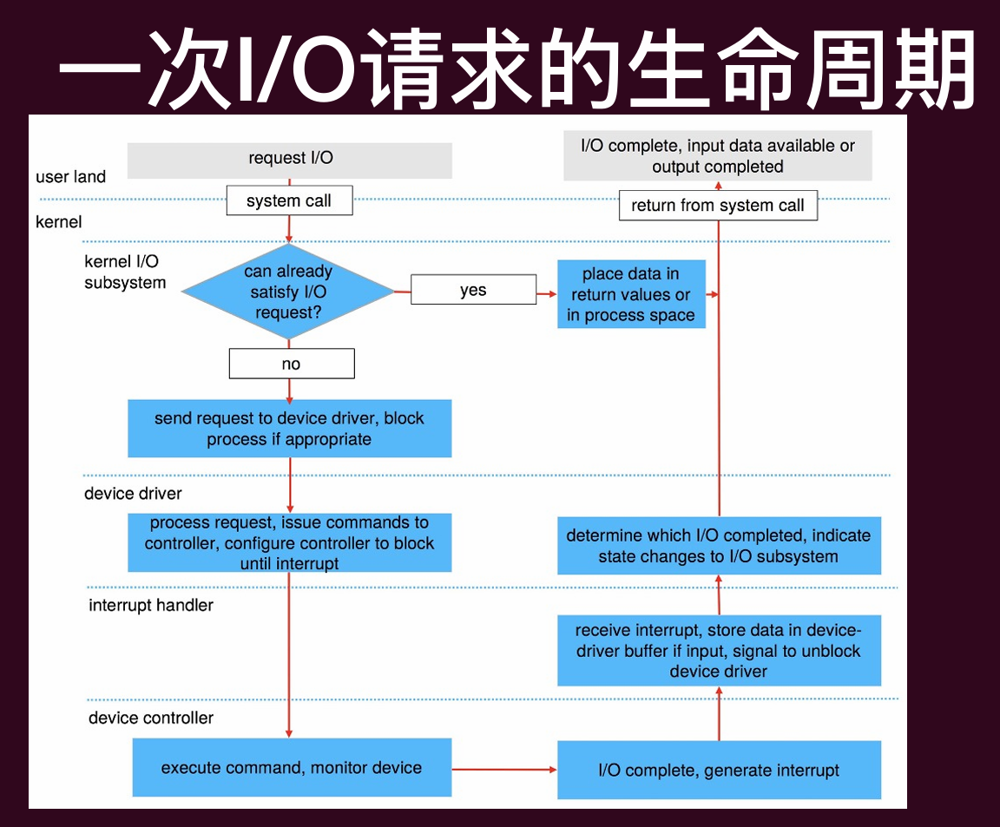

## 硬盘

### 磁头调度
由于 I/O 成本⾼，操作系统历来在决定发往磁盘的 I/O 顺序方面发挥了作用。
面对一组 I/O 请求，磁盘调度程序会检查这些请求并决定下一个调度哪个请求。
目标：通过磁头调度来最小化磁头移动，从而最⼤化磁盘 I/O 吞吐量

#### FCFS（First-Come, First-Served，先来先服务）

#### SSTF（Shortest Seek Time First，最短寻道时间优先）

#### 电梯算法

有多种变体可用：
- F-SCAN：在执行扫描时暂时冻结要处理的队列（避免远距离请求的饥饿）。
- C-SCAN：只从外轨到内轨扫描，然后重置到外轨重新开始。更平均的等待时间，即对内轨和外轨更公平

#### SPTF（Shortest Positioning Time First，最短定位时间优先）

过去的操作系统非常注重磁盘请求调度。
• 目前的做法是将许多请求发送到磁盘，让磁盘自行调度。如今的磁盘更智能，并且拥有较大的缓存。

### 固态硬盘(Solid State Drive, SSD)

