# Lec14: File System
磁盘中存储的数据
- 程序数据：可执行文件、动态链接库、应用数据
- 用户数据：文档、下载、截图
- 系统数据：配置文件 (/etc)

存储和读取本身没有问题，磁盘驱动器就是做这个的。但让应用程序直接通过驱动访问存储设备 (1950s)？
‣ 程序出bug了（不可避免），完全可能弄坏整块磁盘
‣ 连带着所有数据，包括操作系统都直接损坏
因此应用程序应该“有限制”地访问数据
1. 提供合理的 API 使多个应用程序能共享数据
2. 提供一定的隔离，使恶意/出错程序的伤害不能任意扩大

## 文件系统
文件系统是在操作系统内核中实现的**持久化存储抽象**。
- 用户程序通过系统调用(open/read/write)与文件系统进行交互。
- 文件系统负责维护路径、目录、inode、权限、空闲空间和文件到磁盘块的映射
- 设备驱动程序负责把文件系统发出的块读写请求转换为具体设备操作。
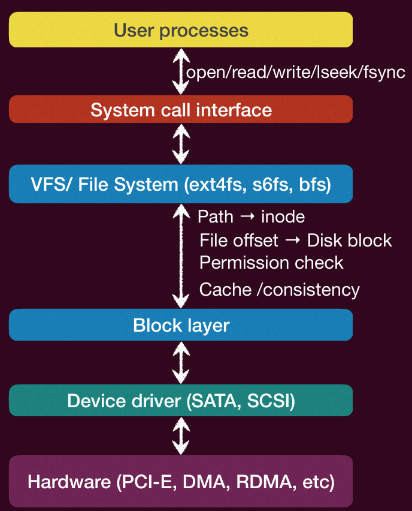
文件系统解决的四个问题：
- 持久性和**命名**数据：文件和目录（给人看的，所以命名，与内存不同，内存给进程看所以不需要命名）
    - 存储在系统中直到显式删除为止
    - 可以通过文件系统关联的可读标识符访问
- 访问和保护：提供打开、读取、写入和其他操作；调节不同用户对文件的访问。
- 磁盘空间管理：公平有效地利用磁盘空间
    - 分配空间给文件，并跟踪空闲空间
    - 快速访问文件
- 可靠性：不得丢失文件数据

### 文件
文件是操作系统创建的逻辑存储单元，用于存储信息
‣ 可以是数据库、音频、视频、网页等内容。
‣ 它是一组数据集合（类型由用户定义）
‣ 可以创建、读取、写入和删除
‣ 提供了一种在磁盘上存储信息并随后读取的**抽象机制**

#### 文件命名
**命名**是文件系统抽象的一个重要特征
‣ 提供人类可读的名称，用一个具有意义的单一名称来引用任意大小的数据
‣ 帮助用户组织大量的存储空间。
‣ 信息存储的细节（低级结构）以及磁盘的实际工作方式被屏蔽了。

文件的命名规则因系统而异
‣ 长度和特殊字符， 字母大小写
文件扩展名：例如.txt，.c
‣ 表示文件内容的某些类型，为应用程序或操作系统提供文件合理操作的提示

#### 文件类型
许多操作系统支持多种类型的文件
‣ 普通文件(‘-’)：bit流，用于存储实际的用户信息，如文本、源码、图像或可执行程序
‣ 目录(‘d’)：用于维护文件系统结构的系统文件
‣ 符号链接文件（‘l’） 
‣ 命名管道文件或简称管道文件（‘p’）
‣ 块文件（‘b’） 
‣ 字符设备文件（‘c’）
‣ 套接字文件（‘s’）

#### 文件元数据（属性）
除了文件的名称和数据外，操作系统还会保留文件的额外信息：
‣ 数据块位置（文件对应哪些磁盘块）
‣ 大小：文件的大小（当前大小或最大大小）
‣ 时间：文件的创建时间、最近访问时间和最近修改时间
‣ 所有者：文件的当前所有者
‣ 保护信息（权限）
‣ 链接信息
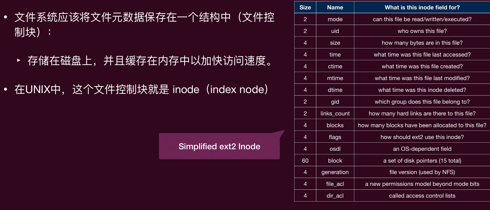
文件用inode的号来标识

#### 文件访问
顺序访问：按顺序读取或写入数据
‣ 读取下一个/写入下一个
‣ 最常见的访问模式（例如，复制文件，编译器读取和写入文件）
‣ 速度快（可以达到磁盘的峰值传输速率）
随机（直接）访问：随机寻址任意块
‣ 读取[n] 写入[n]  寻址[n]
‣ 文件操作包括块号作为参数
‣ 速度慢（寻址时间和旋转延迟）

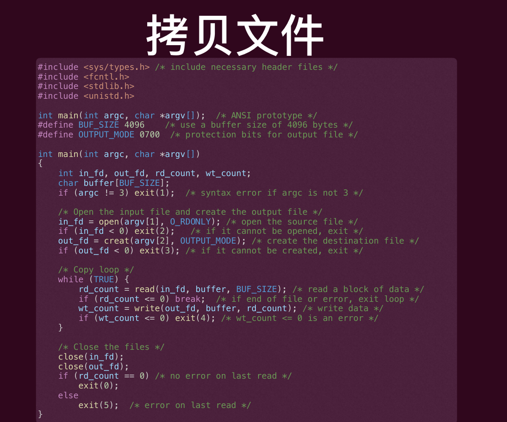

### 文件描述符
文件描述符（句柄）：操作系统分配给**一个进程**打开的文件的一个**唯一数字**（每个进程私有），用于引用该文件。
‣ 持有该文件描述符，才可以对对应的文件执行特定操作
‣ 避免在**每次访问**时解析文件名（在目录中搜索文件名）和检查权限
‣ 一个文件可以以不同方式多次打开
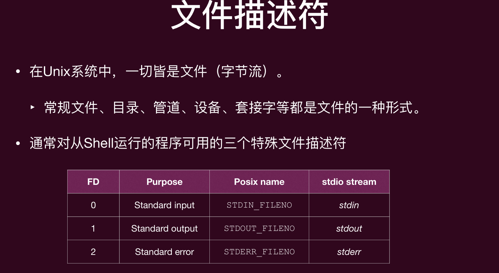
这3个是特殊的文件描述符。0和1可以重定向，比如1重定向到文件就可以把输出写到文件里了

### 文件偏移
对于进程打开的每个文件，操作系统都会跟踪一个**文件偏移量**，该偏移量决定下一次读取或写入将从何处开始。
- 隐式更新：当进行N字节的读取或写入时，N会被添加到当前偏移量。
- 显式更新：使用lseek()函数。

### 打开文件表
当进程打开一个文件时，操作系统应该创建一些额外的**数据结构**（在内存中），用于存储关于进程打开文件的信息。
每个进程都维护一个**打开文件表**
‣ 一个由文件描述符索引的**数组**
‣ 表中的每个条目跟踪文件描述符所引用的底层文件，当前偏移量以及其他相关细节（例如文件大小、位置、权限等）
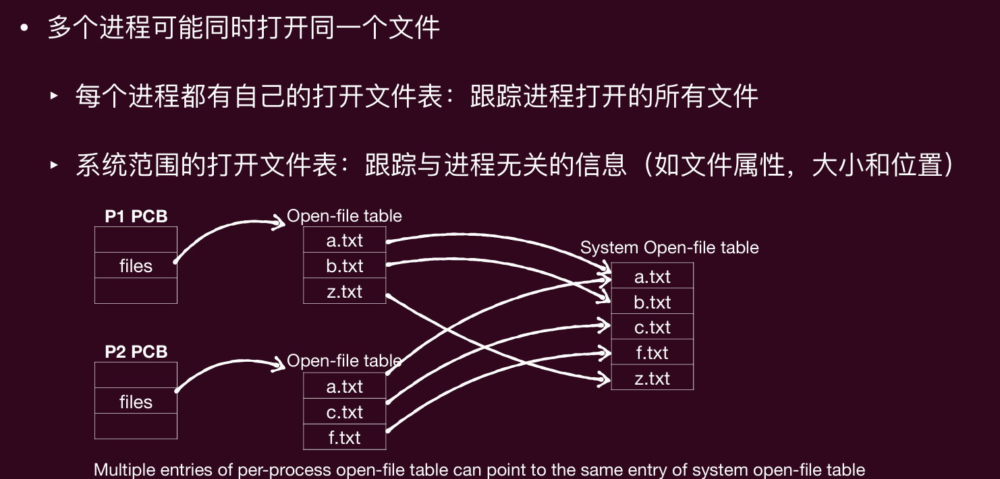

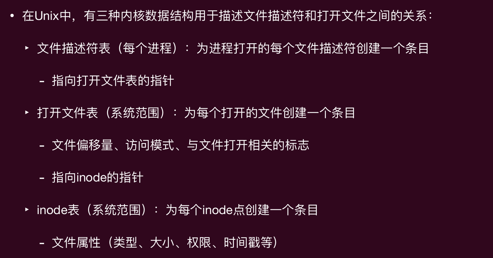
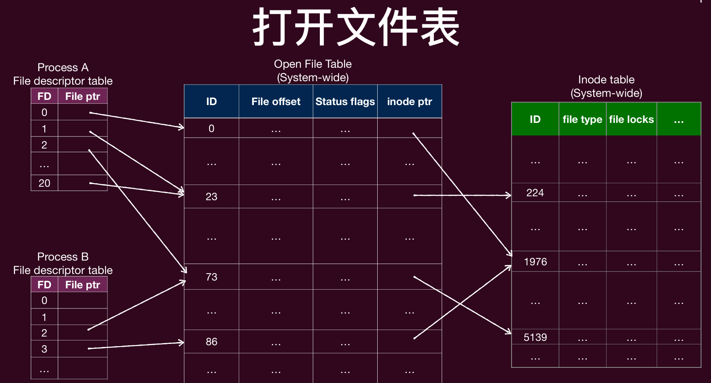
文件描述符对应的一个全局的文件打开表，里面有offset等信息，文件描述符表里存储了文件描述符和全局打开文件表的索引
比如这里0和86有不同的offset，他们指向同一个inode，说明是同一个文件被打开了两次
这个时候offset不会共享，除非对文件进行了写操作，否则两个不会互相影响
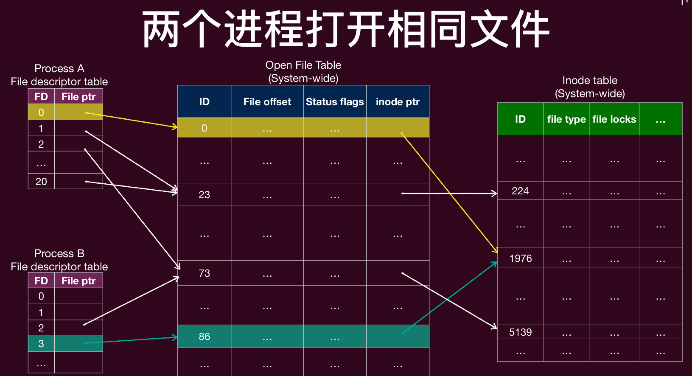
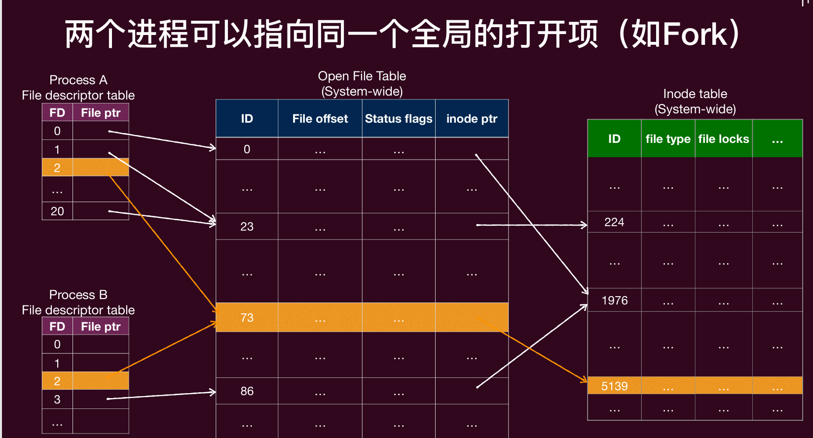
这种是fork，不一样，offset是共享的，会互相影响
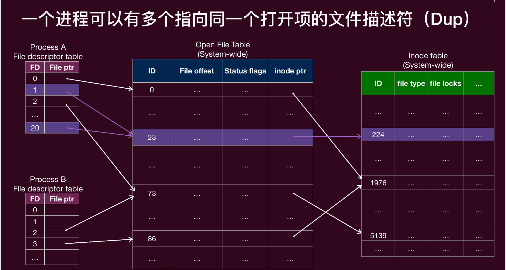
在同一个进程里面，与fork类似的是dup
offset也是共享的，会互相影响

## 目录
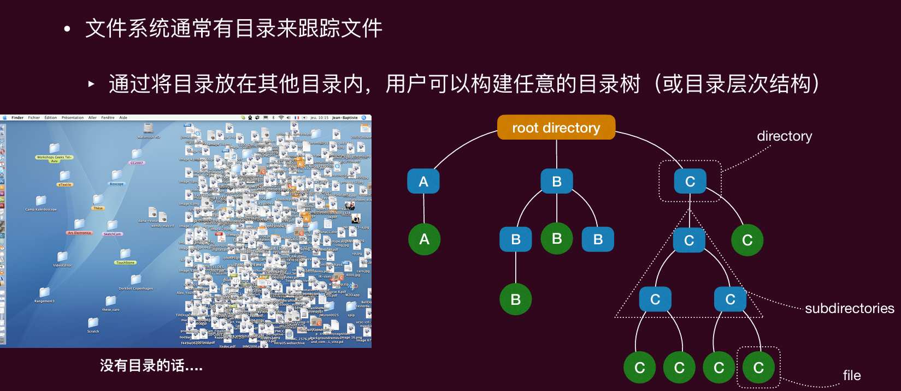
标识文件或目录的字符串称为**路径**
- 绝对路径：以根目录开始的完整路径
- 相对路径：相对于当前工作目录的路径
Unix中.表示当前目录，..表示父目录

实际上，目录存储了文件名与低级别结构（文件控制块inode）之间的**映射**
‣ 在 Unix 中，每个目录条目只是一个 <文件名，inode 号> 对
‣ 目录被存储为一个文件
‣ 要查找一个文件，需要找到包含该映射的目录
‣ 根目录是特别的：需要为根目录分配一个**固定**的 inode 号

要访问一个文件，最终目标就是得到他的inode号
比如/root/home/test.txt
- 首先访问根目录，得到根目录的inode号
- 通过根目录的inode号访问根目录文件，找到root的inode号
以此类推，最终得到test.txt的inode号
下面就是一个目录的样子，每个条目是一个<文件名，inode号>对
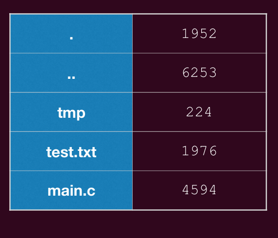
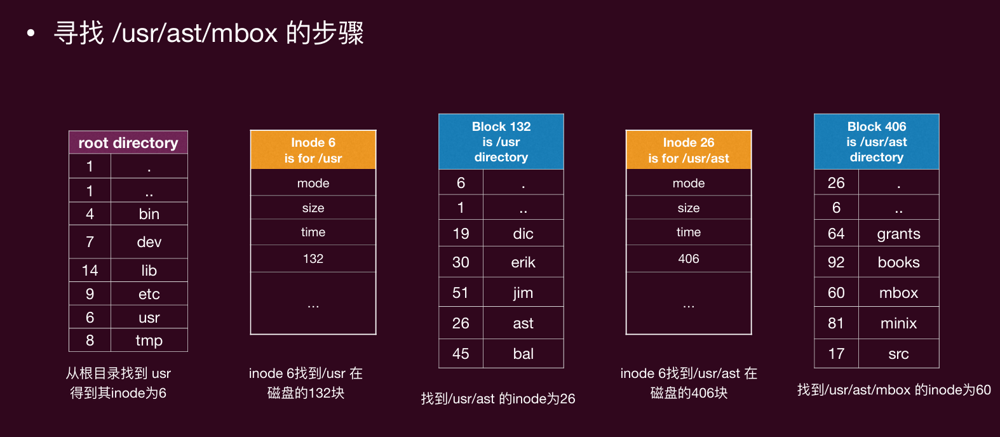

## 共享文件
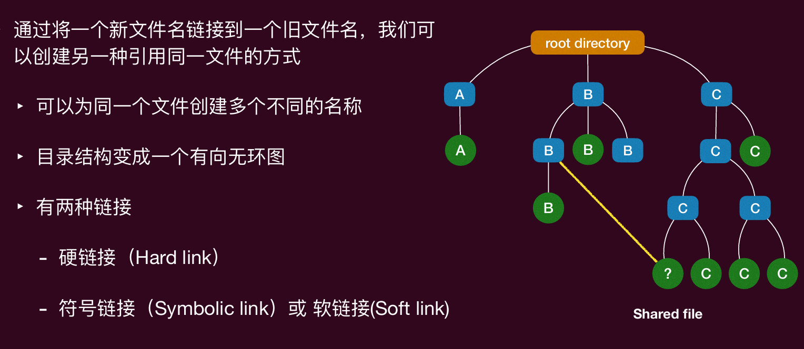

### 硬链接
