# Lec14: File System
磁盘中存储的数据
- 程序数据：可执行文件、动态链接库、应用数据
- 用户数据：文档、下载、截图
- 系统数据：配置文件 (/etc)

存储和读取本身没有问题，磁盘驱动器就是做这个的。但让应用程序直接通过驱动访问存储设备 (1950s)？
‣ 程序出bug了（不可避免），完全可能弄坏整块磁盘
‣ 连带着所有数据，包括操作系统都直接损坏
因此应用程序应该“有限制”地访问数据
1. 提供合理的 API 使多个应用程序能共享数据
2. 提供一定的隔离，使恶意/出错程序的伤害不能任意扩大

## 文件系统
文件系统是在操作系统内核中实现的**持久化存储抽象**。
- 用户程序通过系统调用(open/read/write)与文件系统进行交互。
- 文件系统负责维护路径、目录、inode、权限、空闲空间和文件到磁盘块的映射
- 设备驱动程序负责把文件系统发出的块读写请求转换为具体设备操作。

文件系统解决的四个问题：
- 持久性和**命名**数据：文件和目录（给人看的，所以命名，与内存不同，内存给进程看所以不需要命名）
    - 存储在系统中直到显式删除为止
    - 可以通过文件系统关联的可读标识符访问
- 访问和保护：提供打开、读取、写入和其他操作；调节不同用户对文件的访问。
- 磁盘空间管理：公平有效地利用磁盘空间
    - 分配空间给文件，并跟踪空闲空间
    - 快速访问文件
- 可靠性：不得丢失文件数据

### 文件
文件是操作系统创建的逻辑存储单元，用于存储信息
‣ 可以是数据库、音频、视频、网页等内容。
‣ 它是一组数据集合（类型由用户定义）
‣ 可以创建、读取、写入和删除
‣ 提供了一种在磁盘上存储信息并随后读取的**抽象机制**

#### 文件命名
**命名**是文件系统抽象的一个重要特征
‣ 提供人类可读的名称，用一个具有意义的单一名称来引用任意大小的数据
‣ 帮助用户组织大量的存储空间。
‣ 信息存储的细节（低级结构）以及磁盘的实际工作方式被屏蔽了。

文件的命名规则因系统而异
‣ 长度和特殊字符， 字母大小写
文件扩展名：例如.txt，.c
‣ 表示文件内容的某些类型，为应用程序或操作系统提供文件合理操作的提示

#### 文件类型
许多操作系统支持多种类型的文件
‣ 普通文件(‘-’)：bit流，用于存储实际的用户信息，如文本、源码、图像或可执行程序
‣ 目录(‘d’)：用于维护文件系统结构的系统文件
‣ 符号链接文件（‘l’） 
‣ 命名管道文件或简称管道文件（‘p’）
‣ 块文件（‘b’） 
‣ 字符设备文件（‘c’）
‣ 套接字文件（‘s’）

#### 文件元数据（属性）
除了文件的名称和数据外，操作系统还会保留文件的额外信息：
‣ 数据块位置（文件对应哪些磁盘块）
‣ 大小：文件的大小（当前大小或最大大小）
‣ 时间：文件的创建时间、最近访问时间和最近修改时间
‣ 所有者：文件的当前所有者
‣ 保护信息（权限）
‣ 链接信息

文件用inode的号来标识

#### 文件访问
顺序访问：按顺序读取或写入数据
‣ 读取下一个/写入下一个
‣ 最常见的访问模式（例如，复制文件，编译器读取和写入文件）
‣ 速度快（可以达到磁盘的峰值传输速率）
随机（直接）访问：随机寻址任意块
‣ 读取[n] 写入[n]  寻址[n]
‣ 文件操作包括块号作为参数
‣ 速度慢（寻址时间和旋转延迟）

### 文件描述符
文件描述符（句柄）：操作系统分配给**一个进程**打开的文件的一个**唯一数字**（每个进程私有），用于引用该文件。
‣ 持有该文件描述符，才可以对对应的文件执行特定操作
‣ 避免在**每次访问**时解析文件名（在目录中搜索文件名）和检查权限
‣ 一个文件可以以不同方式多次打开

这3个是特殊的文件描述符。0和1可以重定向，比如1重定向到文件就可以把输出写到文件里了

### 文件偏移
对于进程打开的每个文件，操作系统都会跟踪一个**文件偏移量**，该偏移量决定下一次读取或写入将从何处开始。
- 隐式更新：当进行N字节的读取或写入时，N会被添加到当前偏移量。
- 显式更新：使用lseek()函数。

### 打开文件表
当进程打开一个文件时，操作系统应该创建一些额外的**数据结构**（在内存中），用于存储关于进程打开文件的信息。
每个进程都维护一个**打开文件表**
‣ 一个由文件描述符索引的**数组**
‣ 表中的每个条目跟踪文件描述符所引用的底层文件，当前偏移量以及其他相关细节（例如文件大小、位置、权限等）

文件描述符对应的一个全局的文件打开表，里面有offset等信息，文件描述符表里存储了文件描述符和全局打开文件表的索引
比如这里0和86有不同的offset，他们指向同一个inode，说明是同一个文件被打开了两次
这个时候offset不会共享，除非对文件进行了写操作，否则两个不会互相影响

这种是fork，不一样，offset是共享的，会互相影响

在同一个进程里面，与fork类似的是dup
offset也是共享的，会互相影响

## 目录

标识文件或目录的字符串称为**路径**
- 绝对路径：以根目录开始的完整路径
- 相对路径：相对于当前工作目录的路径
Unix中.表示当前目录，..表示父目录

实际上，目录存储了文件名与低级别结构（文件控制块inode）之间的**映射**
‣ 在 Unix 中，每个目录条目只是一个 <文件名，inode 号> 对
‣ 目录被存储为一个文件
‣ 要查找一个文件，需要找到包含该映射的目录
‣ 根目录是特别的：需要为根目录分配一个**固定**的 inode 号

要访问一个文件，最终目标就是得到他的inode号
比如/root/home/test.txt
- 首先访问根目录，得到根目录的inode号
- 通过根目录的inode号访问根目录文件，找到root的inode号
以此类推，最终得到test.txt的inode号
下面就是一个目录的样子，每个条目是一个<文件名，inode号>对

## 共享文件

有了链接之后，就由树变成了有向无环图

### 硬链接
硬链接：在目录中创建另一个名称，并将其指向原始文件的相同 inode 号
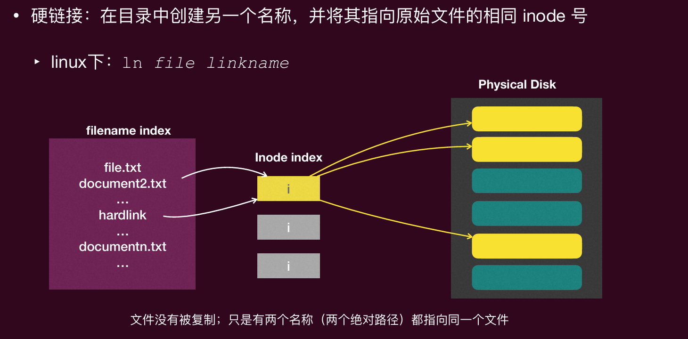
硬链接本质上是 inode 号的别名，因此，当创建一个文件时，
‣ 首先，创建一个结构（inode），该结构将跟踪关于文件的所有相关信息
‣ 其次，将一个人类可读的名称链接到该文件，并将该链接放入目录中
要从文件系统中删除文件，调用 unlink()
‣ 每个 inode 有一个引用计数（链接计数器）
‣ 删除链接时，引用计数减一；如果计数达到 0，目标文件将被删除

但不能链接到另一个文件系统上的文件，因为 inode 号只在一个文件系统内，是唯一的
不允许链接到目录（简化管理）
‣ 这防止了在目录层次结构中创建**循环**，避免有环图
‣ 避免了父目录的不明确性，比如如果多个父目录有指向同一子目录的链接，那么该目录中的 “..” 指向什么？

### 软链接
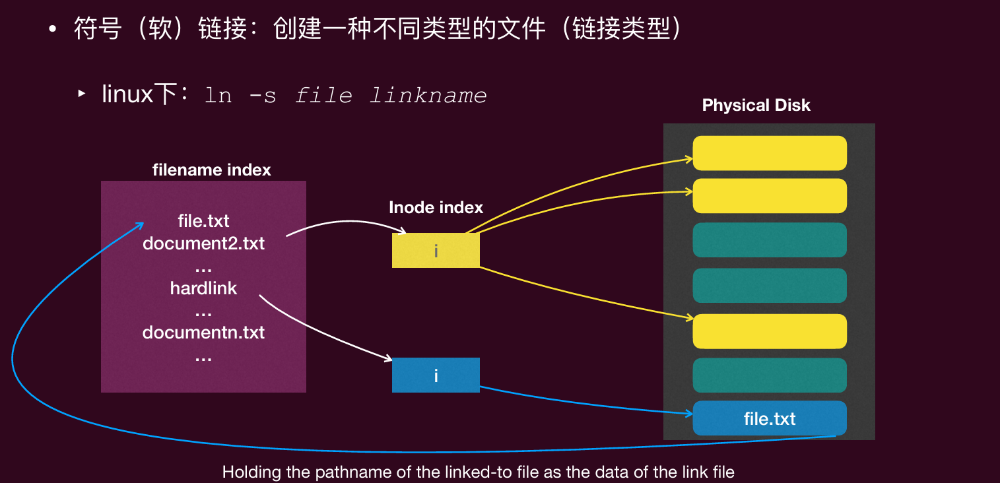
符号（软）链接是**路径名的别名**，因此可以链接到目录，或跨文件系统链接
当需要解析路径名时符号链接被**解析**
- 找到目标文件的名称，并使用新名称打开
- 目标可以是另一个符号链接（递归解析）
- 比硬链接效率低
当删除符号链接时，目标文件保持不变
当目标文件被删除时，产生**引用悬空**（dangling reference），该链接指向一个已不存在的路径

## 文件保护
文件保护是为了防止意外和恶意破坏行为
访问权限的类型
‣ 对于文件：read / write / execute
‣ 对于目录：list / modify / delete
‣ 对于访问权限本身：更改访问权限 / 给予某人访问权限 / 撤销某人的访问权限
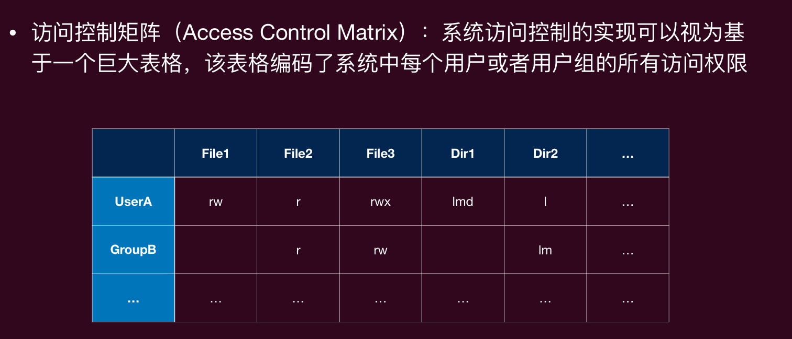
这个矩阵的方式比较古老 低效
Unix 文件系统使用**用户/组/其他人**权限模型
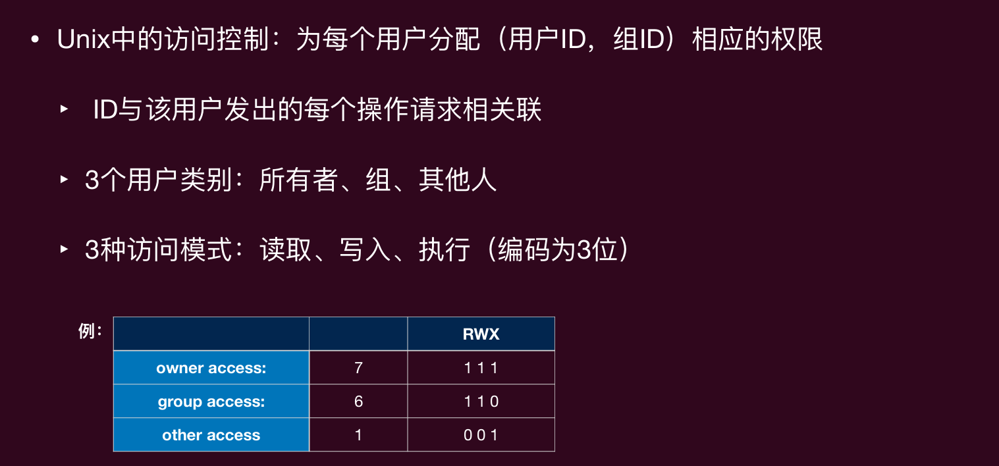

## 文件系统挂载(Mounting)
一个文件系统在能被访问之前，必须先进行**挂载**
‣ 从现有文件系统中的某个路径（挂载点）创建到挂载文件系统的根目录的映射，将多个文件系统统一到一棵树中
‣ 在 Linux 上，mkfs 命令可以在块设备上创建一个新的文件系统，mount 命令可以在当前文件系统中的某个目录下挂载一个文件系统。没有任何参数时，mount命令会显示当前的挂载点.
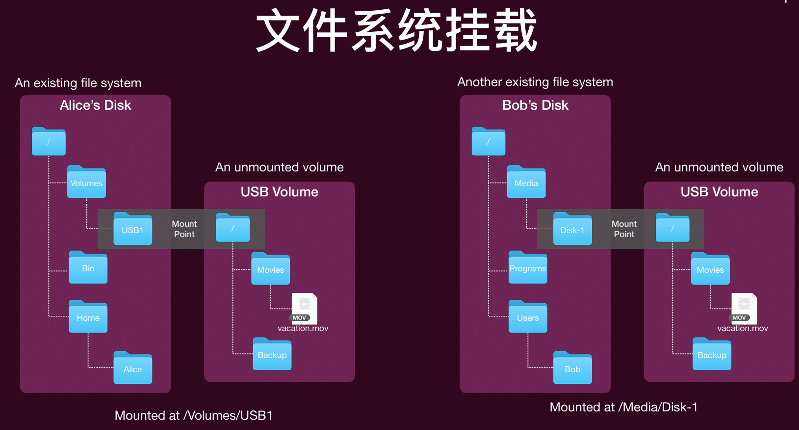
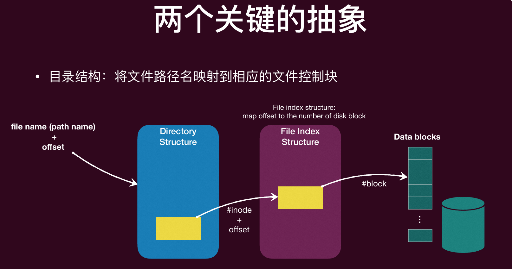
文件名+偏移，经过文件系统变成inode号和offset，然后在文件系统里找到对应的磁盘块号，最后通过设备驱动访问磁盘块

## 文件系统的实现
### 文件系统的布局
文件系统需要为需要存储的数据维护一个其在磁盘上的数据结构
磁盘被分割为等大小的块
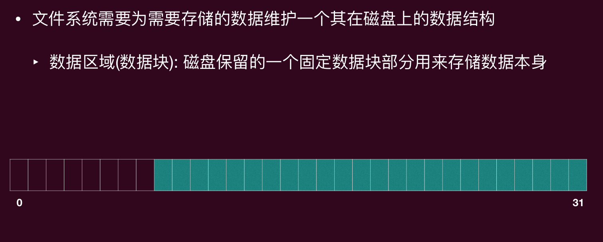
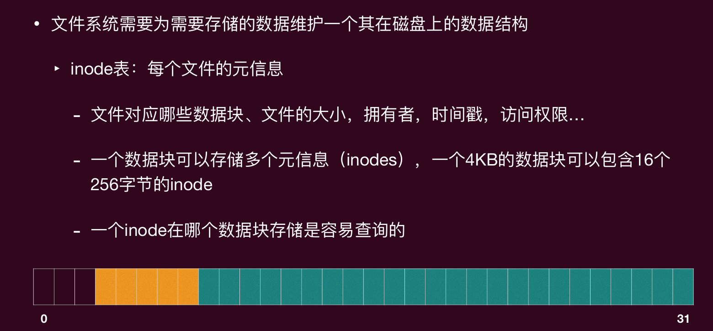
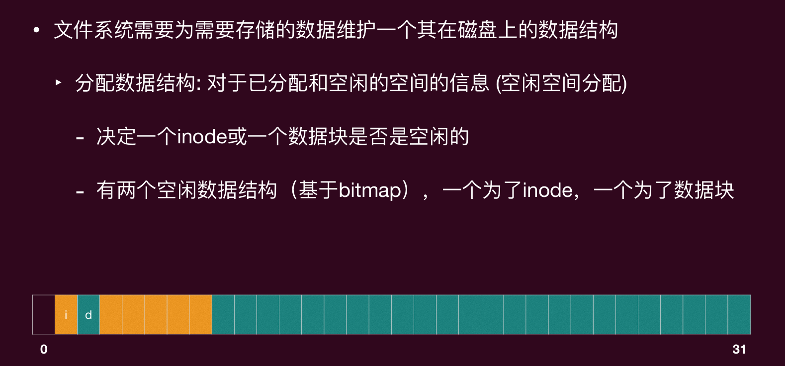
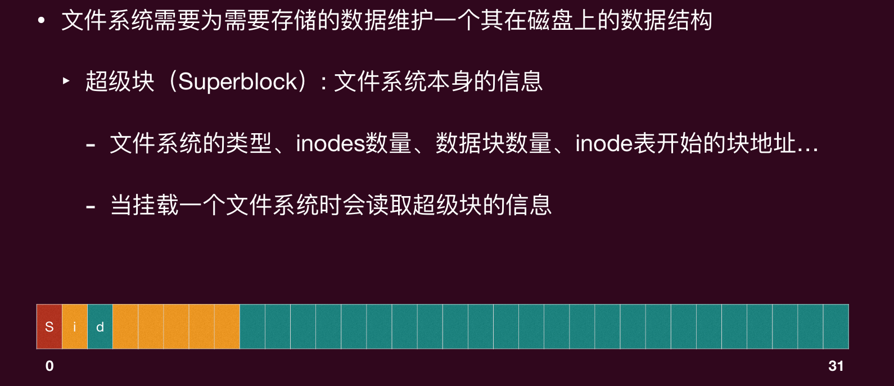
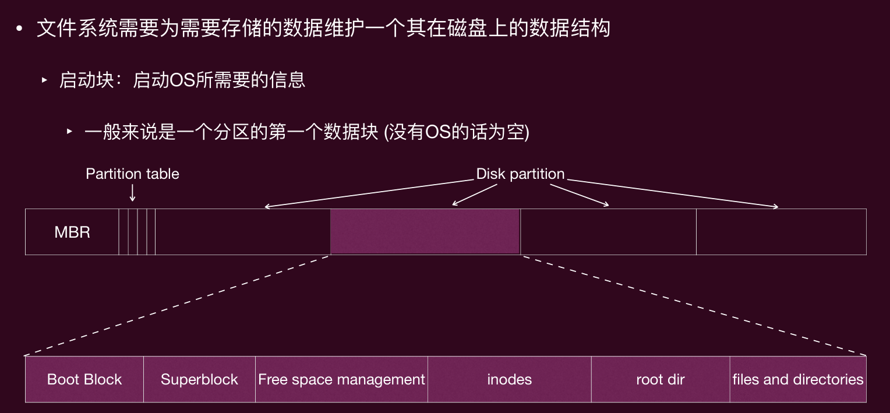
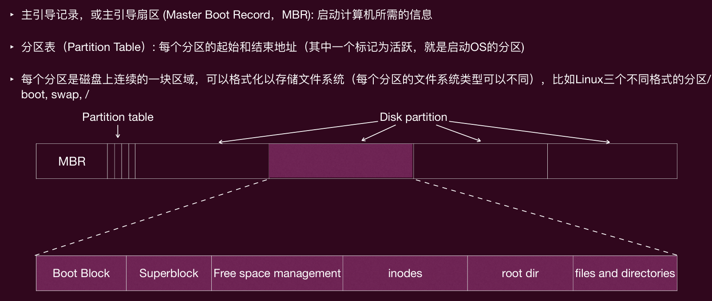
文件系统还需要在内存中维护相应的数据结构用来方便地对磁盘数据进行访问（用来反映和拓展磁盘中的结构）
- 挂载表（Mount table）:关于文件系统的挂载信息（挂载点、文件系统类型）
- 打开文件表: 系统范围的和每个进程的
- 目录结构：最近访问的目录信息
- I/O内存缓冲: 读写磁盘时需要处理主存和磁盘之间速度差异的“缓冲带”

### 文件组织
文件需要磁盘给定相应的数据块进行存储，此外还需要有一些数据结构来反映该文件使用的数据块在哪

#### 连续分配
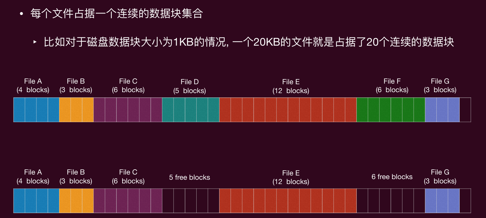
在连续分配下：
‣ 只有文件的第一个数据块的地址和需要的数据块总数需要记录
‣ 线性的访问是高效的
‣ 随机访问的数据地址也是容易计算的
但连续分配不够灵活：
- 在文件创建时就需要知道文件的大小，之后如何增加和减少文件的大小也是麻烦
- 有**外部碎片**：需要进行收缩操作（compaction）来减少这种碎片
但对于CD-ROM和DVD这样的介质是好的（烧录之后不再改变）
有些文件系统使用连续分配的一种变体：基于extent的连续分配
extent是一个连续块集合，一个文件包含了一系列的extents，extents之间不必相邻(以链表连接)，可以支持文件的增长和减少，比整体连续分配灵活一点，但还是存在碎片
追加的内容放到extent，然后链接

#### 基于链表的分配
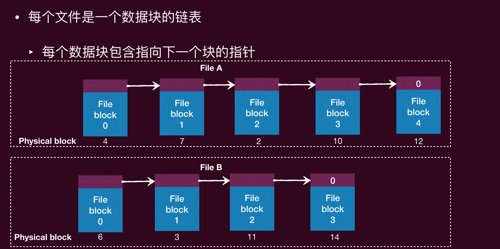

#### 文件分配表(File Allocation Table, FAT)
Windows早期的文件系统使用FAT
是基于链表分配的变种，把所有指针放到同一个表格里
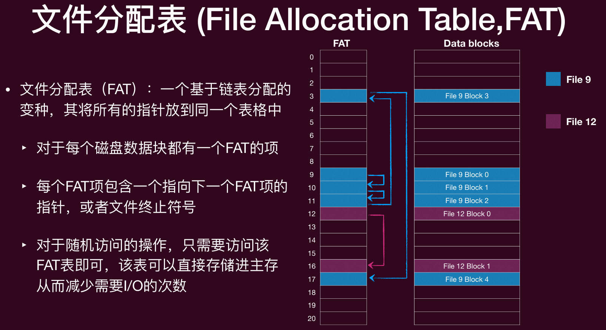
也就是把指针和数据分离出来，这样就不用每次访问都要访问磁盘了，访问FAT表就可以知道下一个块在哪里了
而且，FAT表可以存多个，如果一个坏了还有备份的，增加了可靠性
但FAT需要存储在主存中，这会带来**巨大的开销**

对于容量为一个1TB ($2^{40}$) 的和块大小为4KB ($2^{12}$) 的磁盘来说, 需要 $2^{28}$ 个表项; 
- 如果每个表项需要4个字节，那么一个FAT表格就需要1GB

#### 索引式分配
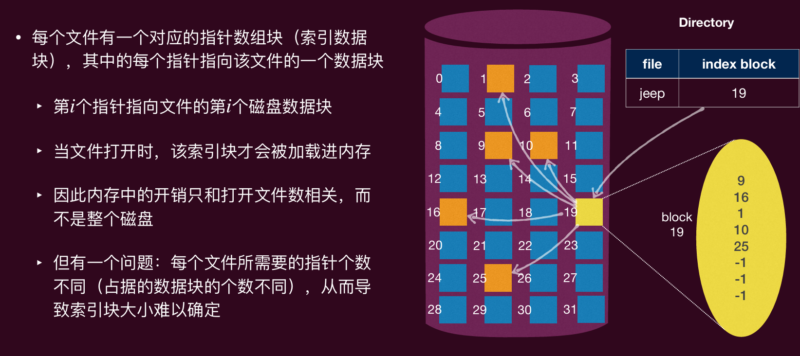
没必要像FAT一样把所有指针都读到内存
只读要读的文件的索引就可以
索引块：包含指向文件数据块的指针的块
每个文件都有一个索引块，索引块中存储了指向文件数据块的指针

由于索引块的大小难以确定，我们可以使用**多级索引**
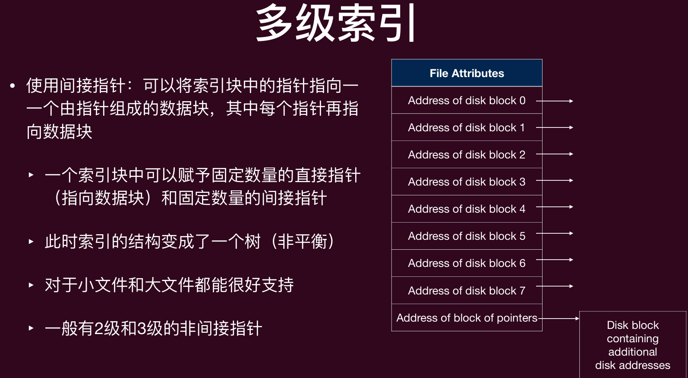
小文件：直接索引块
大文件：多级索引
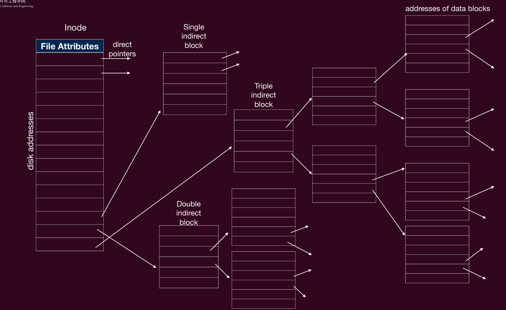
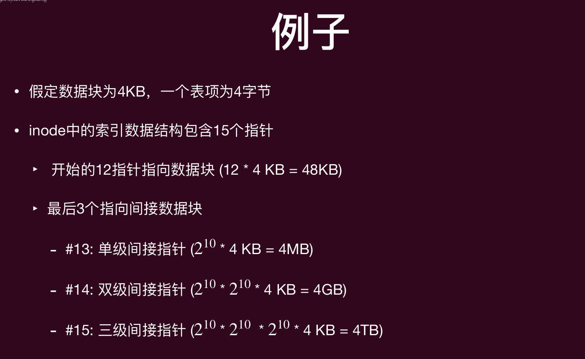
这个$2^{10}$是因为块大小是4KB，每个表项4字节，所以一个索引块可以存$2^{12}/2^2=2^{10}$个指针

### 目录组织
目录提供了找到文件名和其在磁盘上的数据块的**映射信息**⟨文件名, 文件索引⟩
- 当需要打开一个文件时，OS先找到路径名，并根据路径名找到磁盘上的目录项
- 目录项提供了该文件对应的磁盘数据块，可以是
    - 整个文件所在的磁盘地址
    - 第一个数据块的编号
    - 文件的元信息inode号
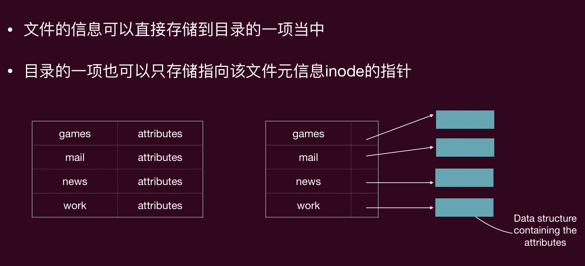
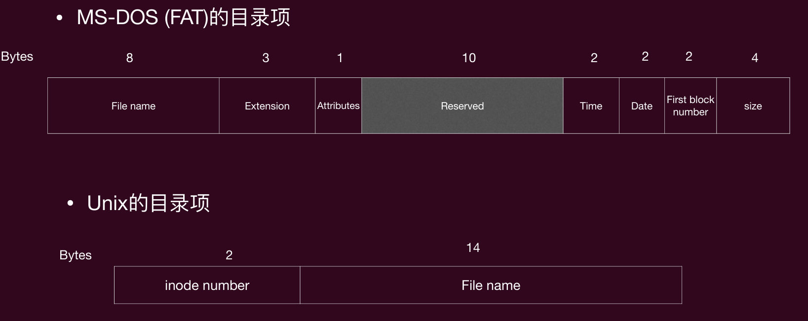
这是两种常见的组织形式
但是如果文件名的长度过于长？
‣ 给文件名的长度设置一个上限，使其最多含有N个字符，每个文件的文件名项都是一个固定大小的字符数组
‣ 简单，但是问题是，不是每个文件名都很长，对于那些大部分拥有短的名字的文件，会造成大量的浪费
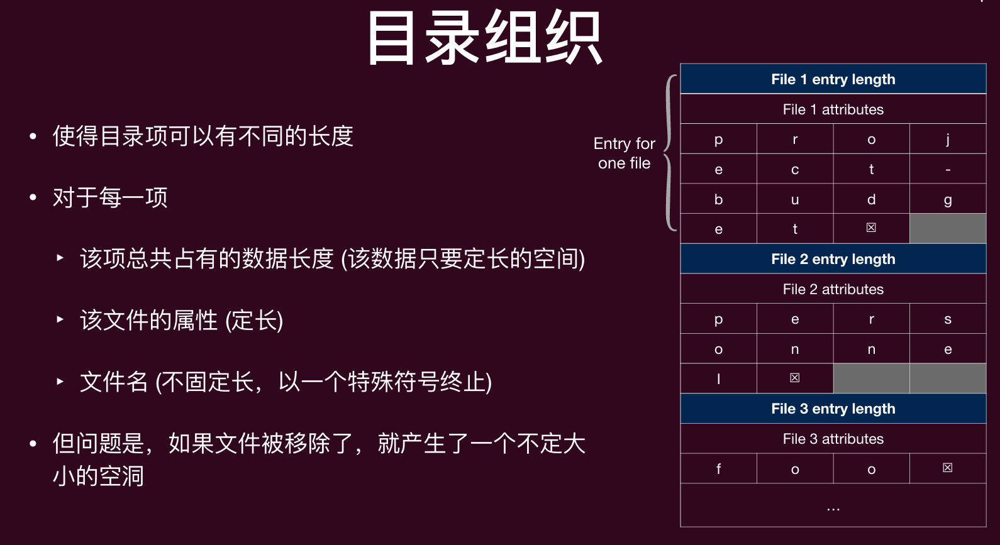
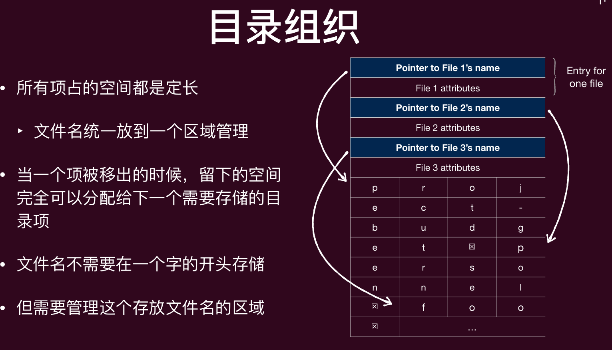
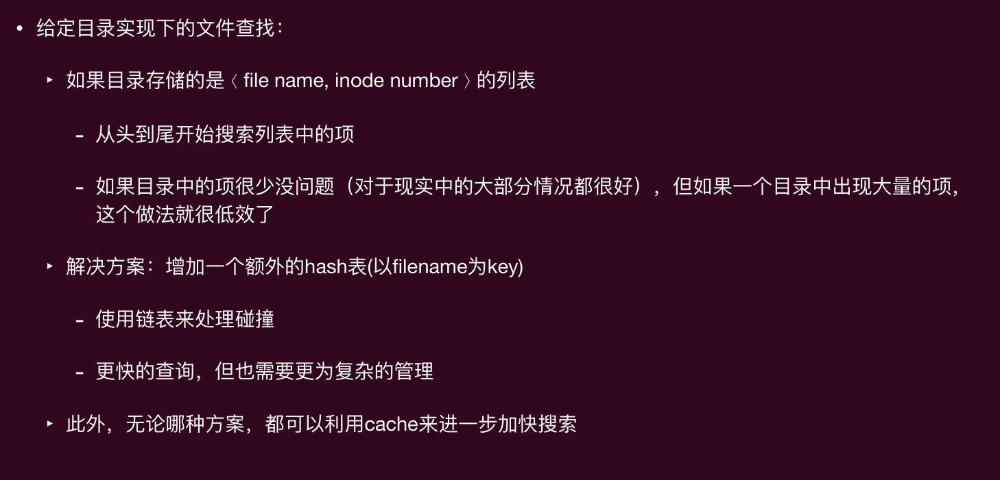
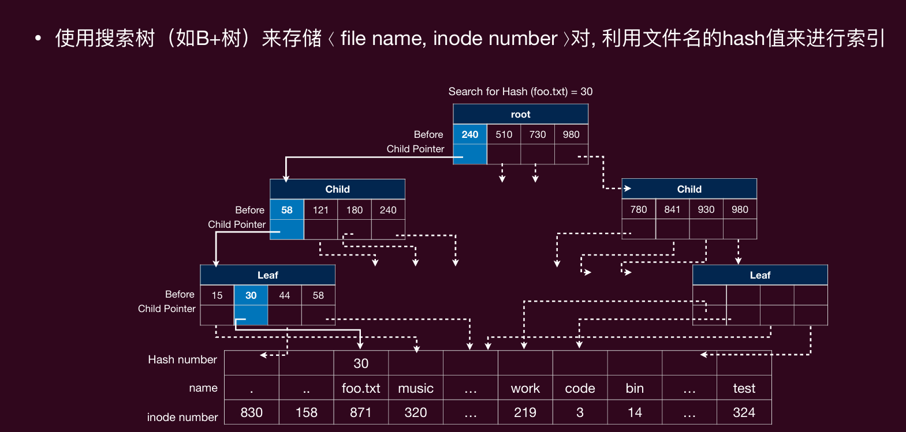

### 空闲空间管理
