# Lec2: Different Views of OS
操作系统十分复杂，代码量庞大。
操作系统有三条主线：
‣ “软件 (应⽤)”
‣ “硬件 (计算机)”
‣ “操作系统 (软件直接访问硬件带来麻烦太多⽽引⼊的中间件)”
• 想要理解操作系统，对操作系统的服务对象 (应⽤程序) 有精确的理解是必不可少的。

## 应用视角
### 什么是程序
IDE简单好用，但是它隐藏了很多细节。
程序到底是如何运行的？到底发生了什么？
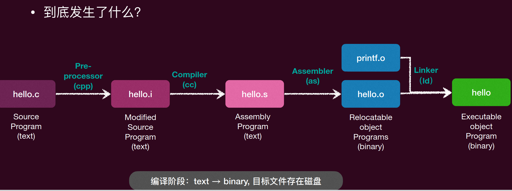
编译阶段，把源代码编译成可执行文件（二进制），然后放在磁盘上。
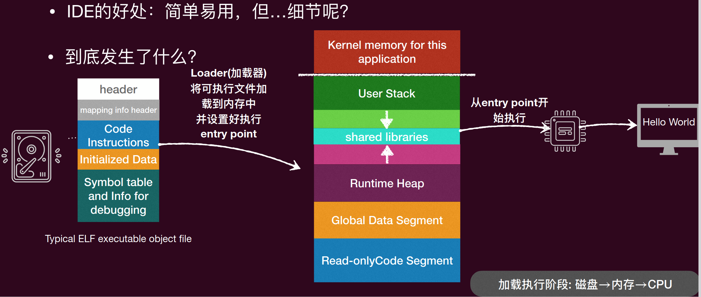
加载器把文件从磁盘加载到内存中，CPU从内存中取指令执行。
这个图片是linux下文件编译成可执行文件的过程，然后加载器把可执行文件加载到内存中，CPU从内存中取指令执行。

```c
#include <stdio.h>
int main() {
    printf("Hello, World!\n");
    return 0;
}
```
gcc 编译出来的⽂件⼀点也不⼩ (试试 gcc -static会更有惊喜)
• objdump ⼯具可以查看对应的汇编代码
• 但是⾥面似乎有太多我们“没想过的”东⻄？
• gcc到底做了啥？ --verbose选项

这么多东西，都是我们需要的吗？我们只需要打印一行helloworld就行了啊
gcc会链接一些库文件，来支持printf函数的实现，这些库文件包含了很多代码，所以编译出来的文件就很大了。

先删除printf，只留下int main() { }，编译出来的文件就小了很多。

可能会出现Segmentation fault(core dumped) 段错误的错误，访问了非法内存地址的时候就需要调试了。
调试工具 gdb 可以帮助我们调试程序，查看程序的运行状态，查看变量的值，查看函数调用栈等。

发现是pc=1的时候，出错了
为什么pc不能是1？
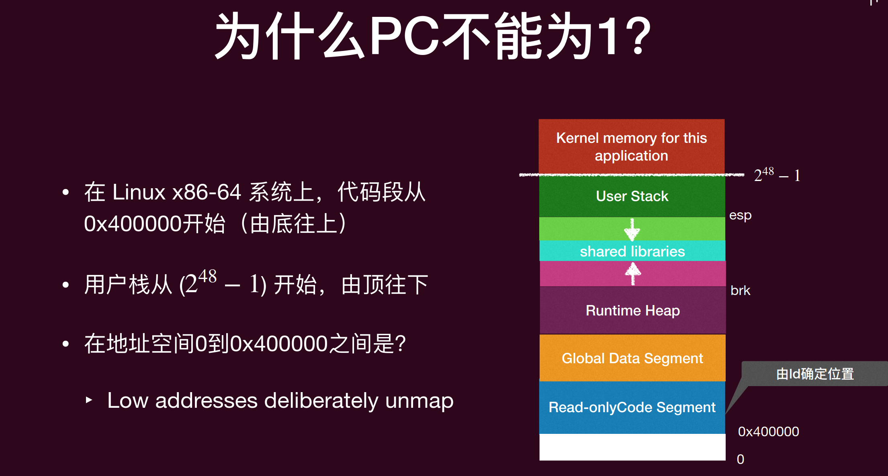
刻意留下来的地址，处理程序异常用的
所以从main函数直接return的话，程序就会跳转到这个地址，导致段错误。
只要不在main函数直接return，就不会出现这个问题了。
```c
int main(){
    while(1);
}
```
加入无限循环，就不会出现段错误了。

但是没办法结束程序了，必须强制结束。
如果没有操作系统，程序的指令只能作计算，没办法结束程序。

解决异常退出：交给操作系统来处理异常退出，操作系统会捕捉到程序的异常退出，进行相应的处理，比如释放资源，记录日志等。
调用syscall系统调用来结束程序，操作系统会捕捉到系统调用。
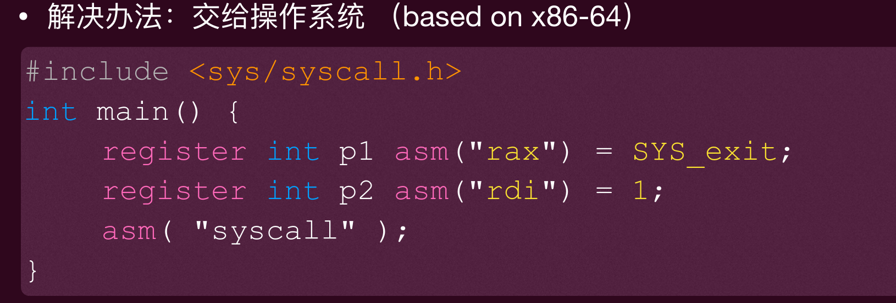
然后进入内核态，操作系统会进行相应的处理，比如释放资源，记录日志等，然后返回用户态，程序就结束了。

回到什么是程序这个问题。
程序就是状态机（图灵机），程序的状态由寄存器和内存中的数据决定，程序的行为由指令决定。
对于（二进制）程序而言，状态=寄存器状态(R)+内存状态(M)
初始状态=操作系统加载程序时设置的寄存器状态和内存状态
状态转移=执行一条指令

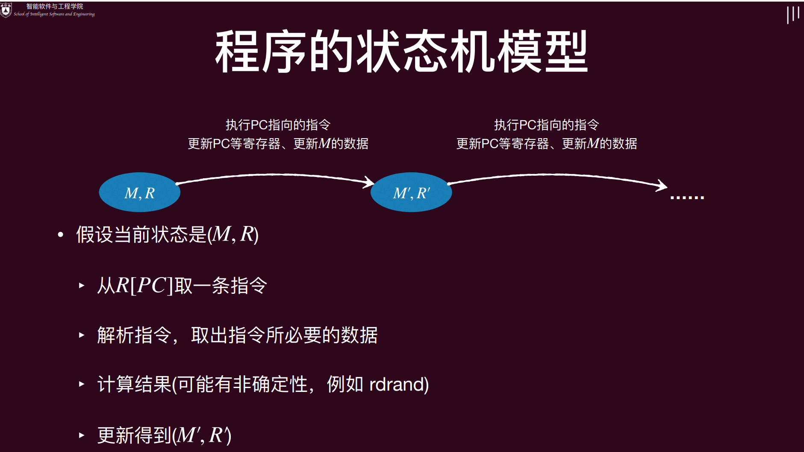

特殊的指令syscall：把(M,R)交给操作系统，任其修改
CPU发现是syscall指令的时候，进入内核态，运行操作系统写的代码，操作系统可以修改寄存器状态和内存状态，然后返回用户态继续执行程序.
可以实现与操作系统中的其他对象交互
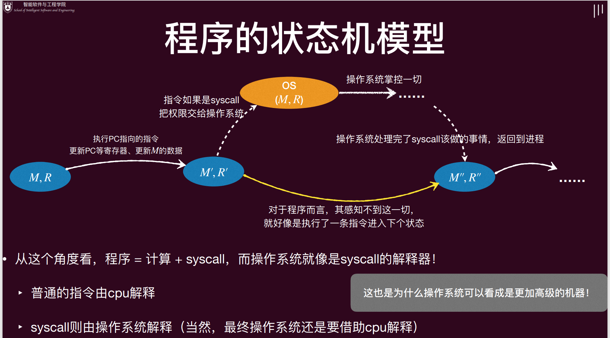
程序感知不到syscall的运行过程，只转接
这也是为什么操作系统可以看成是**更加高级的机器**

### 理解高级语言程序
高级语言本质上能描述的计算能力和汇编一致（都是人类能行计算，都逃不开图灵机的限制）
• 因此，事实上C语言写成的程序也可以看成是状态机模型
• 甚至不需要借助编译器，我们完全可以模仿汇编的单步执行
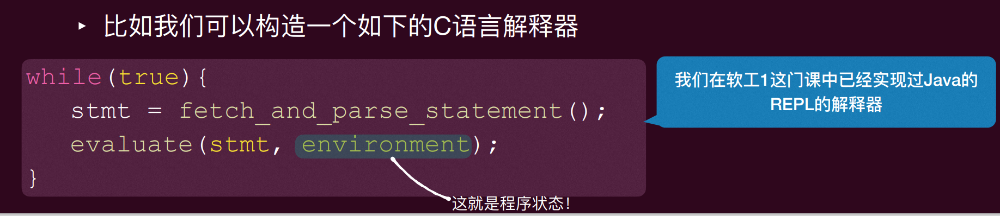

C程序的状态=堆+栈+全局变量，不需要深入到寄存器了
初始状态仅有一个frame 是main(argc, argv)，其他都是空的，全局变量为初始值
状态转移=执行一行C代码，执行当前调用栈栈顶的那个栈指针(frames.top.PC处)的简单语句
- 如果是函数调用的话，本质上就是压入一个新的栈帧(stack frame), 并设置这个新的frame.PC = 所调用函数的入口
- 函数返回 = pop frame

### 操作系统上的软件（应用程序）
• 可执行文件
‣ 与大家日常使用的文件 (hello.c, README.txt) 没有本质区别，都可以打开、读取、甚至改写
• 可执行文件的操作
‣ xxd 可以16进制数直接查看可执行文件
‣ vscode安装hex editor插件，可以直接编辑

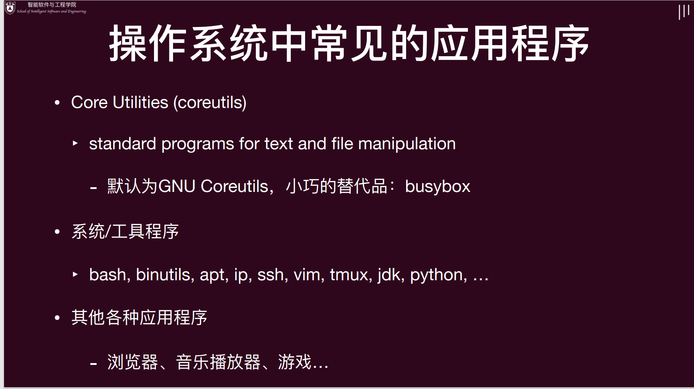

一个很重要的工具：strace
可以查看程序运行过程中调用了哪些系统调用(syscall)，以及系统调用的参数和返回值。
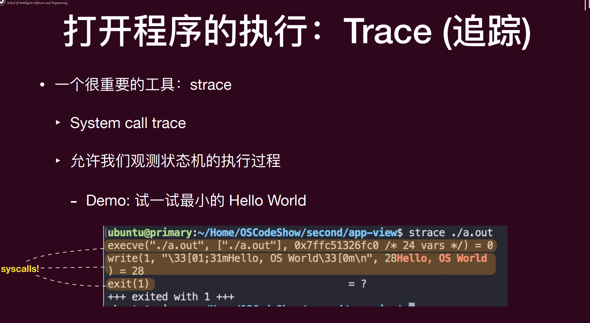

为什么我们能够“追踪”进程？因为所有进程都在“操作系统”的监控之下！
‣ 进程某种意义上是运行在“操作系统”这样的一个**虚拟机**中，而不是直面硬件，所以操作系统清楚进程的一切，也能修改其一切！
• 操作系统为进程提供了ptrace系统调用，其可以帮助一个进程去查看另外一个进程，甚至是修改另外进程的运行时的寄存器，以至于植入代码！
‣ Strace、GDB背后都是ptrace系统调用！
‣ 凭借这个系统调用，你们甚至可以实现自己的“动态”程序分析器！

### 操作系统中应用程序的“一生”
初始状态，执行execve系统调用，操作系统加载可执行文件到内存中，设置好寄存器状态和内存状态，然后进入用户态执行程序。
然后，状态机执行
- 进程管理：fork, execve, exit...
- 文件系统：open, read, write, close...
- 存储管理：mmap, munmap...
- exit退出

所有的这些程序都是在操作系统 API (syscall) 和操作系统中的对象上构建
‣ 本质都是**调用 syscall 的状态机**
‣ 对于这些应用而言，操作系统就是一个**帮助解释**这些syscall的存在而已，其和能够帮他们解释普通计算指令的CPU无异

## 硬件视角
硬件的核心是**数字电路**
状态=寄存器保存的值
初始状态=REST
迁移 = 组合逻辑电路(NAND, NOT, AND, OR, NOR…)计算寄存器下一时钟周期的值，每个时钟周期做一次迁移
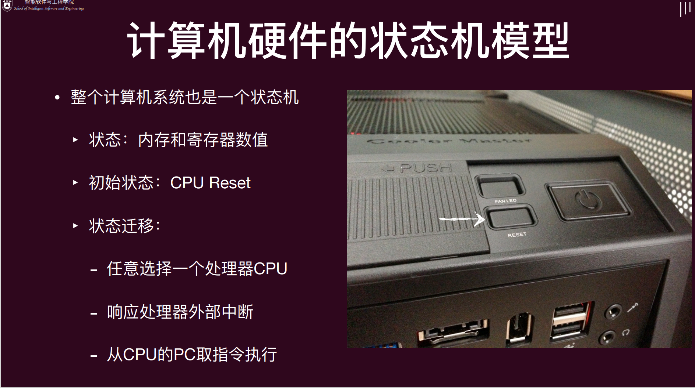

为了让 “操作系统” 这个程序能够正确启动，计算机硬件系统必定和程序员之间存在约定：
‣ 首先就是 Reset 的状态。
‣ 然后是 Reset 以后执行的程序应该做什么

### 硬件系统和程序员的约定
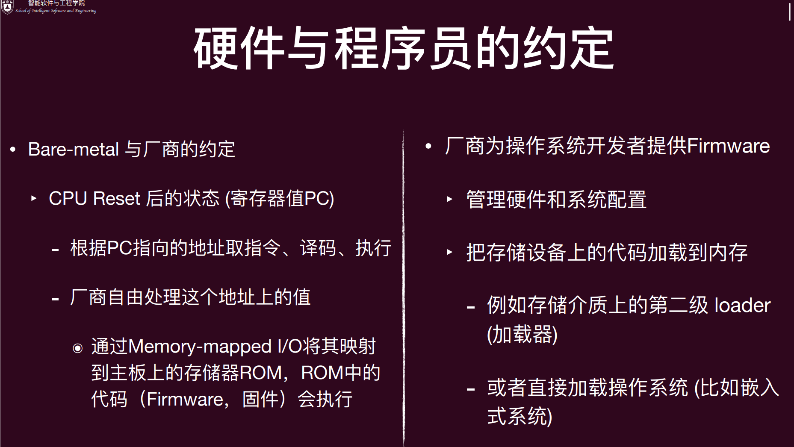
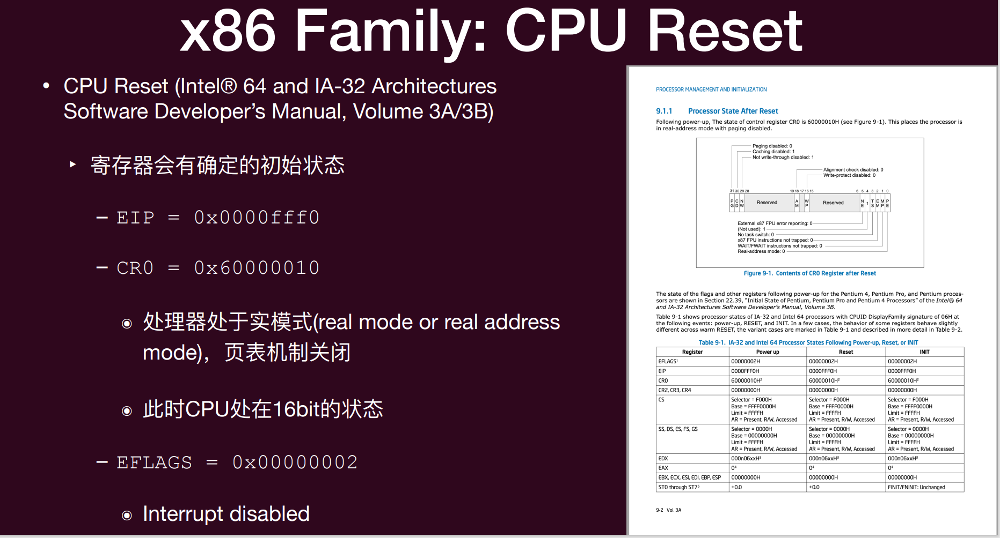
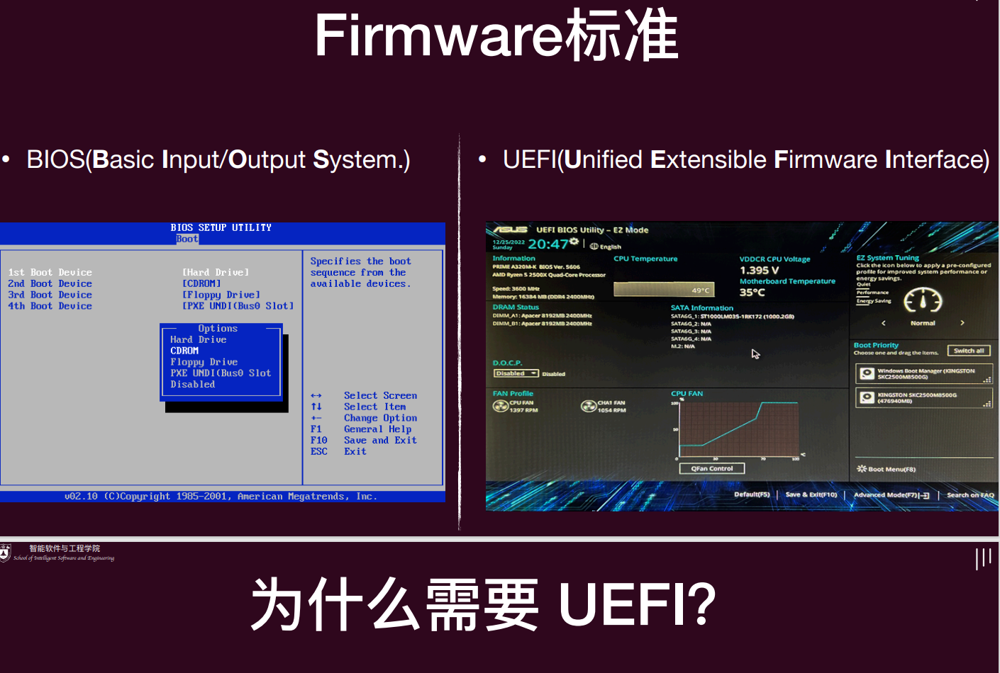
今天的 Firmware 面临麻烦得多的硬件： 指纹锁、USB 转接器上的 Linux-to-Go 优盘、USB 蓝牙转接器连接的蓝牙键盘、…
- 这些设备都需要 “驱动程序” 才能访问
- 而传统BIOS只能支持有限的硬件，因此需要UEFI来支持更多的硬件设备
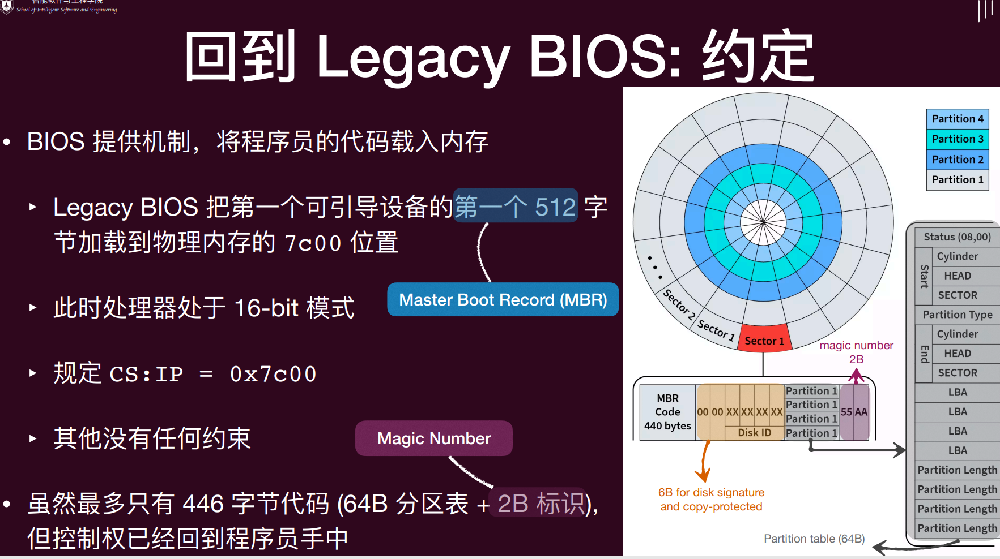
标准化的加载流程
‣ 磁盘必须按 GPT (GUID Partition Table) 方式格式化
‣ 预留一个 FAT32 分区 (可以用命令lsblk/fdisk 查看)
‣ Firmware 能够加载任意大小的 PE 可执行文件.efi
- EFI 应用可以再次返回 firmware

### CPU Reset后
CPU reset后，如何观察一个计算机系统的指令运行？
QEMU是一个开源的计算机模拟器，可以模拟各种计算机系统，包括x86、ARM、MIPS等。
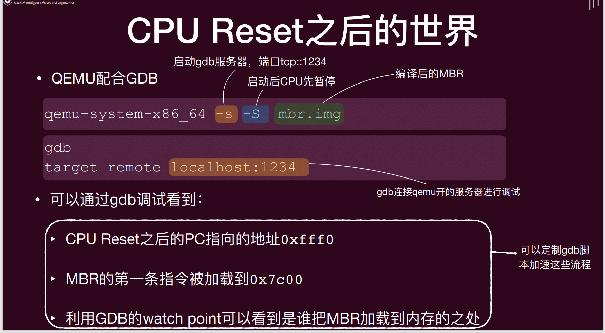
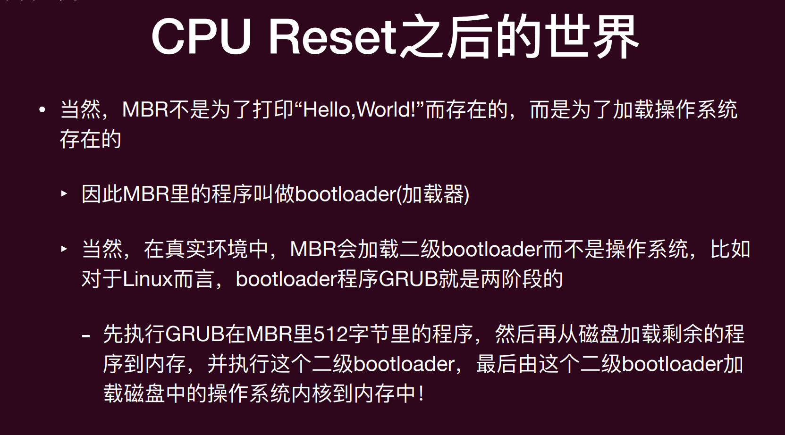


## 抽象视角
