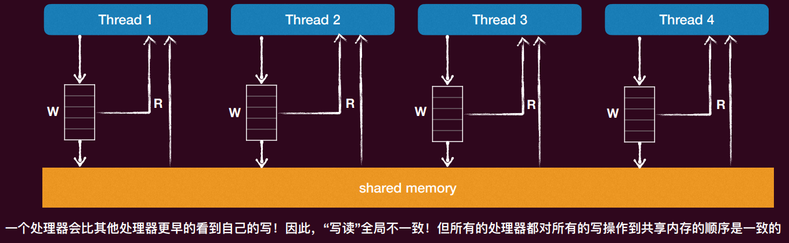
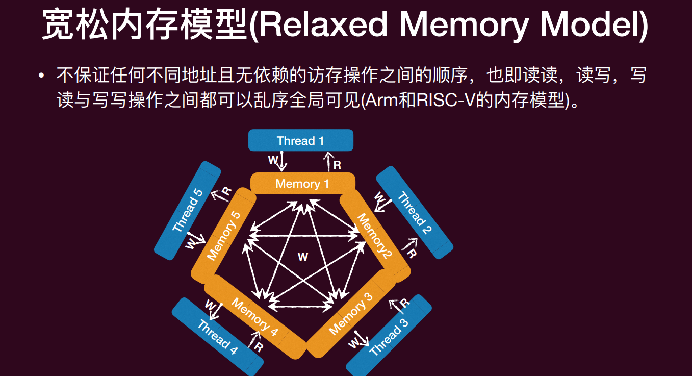
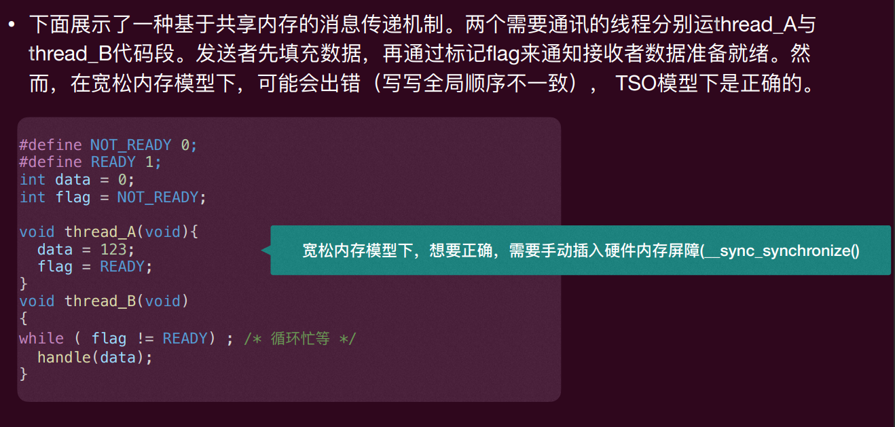

# Lec3: Multiprocessor Programming
## 为什么要在OS课上学习多处理器编程
“美好的”单处理器时代已经过去了，现在是“万恶的”多处理器时代.
在单处理（单核心）上，程序员是轻松愉快的，只要写一次程序，其他的交给“摩尔定律”就行了，随着处理器越来越快，他们的程序也会越来越快
如果核心的速度上不去，堆核心数，然后将代码并行化，是不是也能达到相同的效果？

根据Amdahl定律，即使有无限的CPU，受限于可以并行化的任务比例，也不可能无限加速

而且 代码的并行化和同步并不简单，容易出错

操作系统本身就是世界上第一个并发程序！**并发**就是操作系统的核心之一

## 多线程编程
### 线程
并发的基本单位是**线程(thread)**
**线程：共享内存的执行流**，拥有独立的上下文和栈帧列表，共享全局变量、堆空间

左边是共享的部分，包括Heap, Global variables, Code
**TCB**(Thread Control Block)维护着线程的状态，寄存器，堆栈等信息，此外还有一个栈，线程切换时需要保存和恢复这些信息
线程可以访问**shared state**里面的全局的堆、变量、代码段等
操作系统可以通过**TCB**来管理线程，调度线程的执行

从状态机的角度看，多个线程就是多个共享内存的状态机，线程切换就是状态机的切换
初始状态是线程创建时候的状态，状态迁移是调度器任意选择一个线程执行一步
因为有共享内存，所以线程之间的状态迁移是相互影响的，线程切换可能会导致共享内存的状态发生变化，导致其他线程的状态发生变化


### Posix基本线程API
几个最常用的函数
- pthread_create: 创建一个新的线程，并让它从 start_routine(arg) 开始执行
- pthread_exit(void *retval)：当前线程主动结束，并把返回值交给将来 pthread_join 它的人（线程函数 start_routine 直接 return 也会结束线程，效果类似）
- pthread_join(pthread_t thread, void **retval)：(阻塞自己)等待线程thread结束，并且把thread返回的值放到retval所指定的内存中
- pthread_yield：主动让出 CPU，让调度器先运行别的线程。这个接口基本被废弃，通常用 sched_yield()
- pthread_detach(pthread_t thread)：把线程设为“分离态”，该线程结束后资源由系统自动回收，不能再被其他线程join

### 线程的生存周期
经历初始化、就绪、运行、等待和结束的周期

### 例子
见Codes/lec3/thread.c 代码
这个程序会利用多处理器，操作系统会把线程放在不同的处理器上执行，输出的结果是无序的，因为线程的调度是由操作系统决定的，线程的执行顺序是不确定的，CPU使用率是100%，因为线程一直在执行

实际上我来运行这个程序的时候，输出的结果是有序的，可能原因是线程任务太短，或者输出本身有串行化，内部有锁

### GDB调试多线程
基本命令：
- info threads: 列出所有线程
- thread <id>: 切换到编号为<id>的线程
- break line thread <id>: 在指定编号为<id>的线程的指定行设置断点

## Heisenbug
Heisenbug：在多线程程序中，bug的出现和消失是随机的，无法重现的，这种bug被称为Heisenbug
不确定的**线程调度**（到底选哪一个线程进行下一步），以及可能“被迫”改变的线程状态（由于**共享内存**），会使得程序非常容易出现BUG，并且这些BUG往往很微妙、难以捉摸（不是每一次执行都能确定捕捉）

根因是以下三个挑战：原子性丧失、顺序化丧失和全局一致化丧失

### 原子性丧失
原子性：一个原子性的操作即是一个在其“更高”的层面上无法感知到它的实现是由多个部分组成的，一般来说，其具有**两个属性**：
- **All or nothing**: 一个原子性操作要么会按照预想那样一次全部执行完毕，要么一点也不做，不会给外界暴露**中间态**;
- **Isolation**: 一个原子性的操作在操作共享变量时**中途**不会被其他操作干扰，其他所有关于这个共享变量的操作要么在这个原子性操作之前，要么在其之后


在这个程序里面，线程1和线程2都执行sum++，sum++的操作不是原子性的
sum++的汇编代码如下：
```
mov $rax, [sum]  ; 将sum的值加载到rax寄存器中
add $rax, 1      ; 将rax寄存器的值加1
mov [sum], $rax  ; 将rax寄存器的值保存回sum变量
```
不同线程的$rax也是不同的，线程切换时会保存和恢复寄存器的值，所以每个线程都有自己的$rax寄存器状态，所以这样出来的结果就是错的，原子性丧失了
这样重复2N次，我们需要的是sum=2N，但是sum的最小值是2，原因如下


这样违反了All or nothing的属性，sum++的操作要么全部执行完毕，要么一点也不做，但是现在它暴露了中间态，sum++的操作被打断了，导致结果不正确

即使让sum++**变成原子性**的，变成一个单指令的一行代码，也不能保证正确，因为sum++的执行顺序可能会被打乱，导致结果不正确


类比流水线中的数据冒险，会产生数据竞争(data race)，指令重排可能会导致sum++的执行顺序被打乱，导致结果不正确，违背了Isolation的属性

实现原子性是重要主题，加锁。

### 顺序化丧失
顺序性：程序语句按照既定的顺序执行
然而，只要不影响语义，其实指令是否按照顺序执行并不重要
‣ 编译器就会通过**reorder instructions**来优化程序，因为编译器会优化程序的性能，**指令重排**是编译器优化的一种手段，可以让程序运行得更快
‣ 这些优化在单线程下往往没有问题，但一旦到了多线程，很多逻辑就错了
编译器是单线程的逻辑

#### 例子
对于代码
```c
#define N 1000000000
#define NUMBER_OF_THREADS 2
long sum = 0;

void *T_sum(void* nothing) {
    for (int i = 0; i < N; i++) {
        sum++; // 循环内对共享变量sum自增
    }
    return NULL;
}
```
如果打开-O1选项，编译器会把循环不变式外提，因为编译器发现sum是一个全局变量并且只有++这个操作，所以把sum++移出循环，原来的循环变成空的，函数部分的代码变成：
```c
void *T_sum(void* nothing) {
    sum += N; // 循环外对共享变量sum自增N次
    return NULL;
}
```
这样优化之后，确实结果是对的，但是顺序性丧失了，代码的语义发生了改变，原来的代码是每次循环都对sum进行自增，而现在的代码是直接对sum进行一次自增N次，这样就违反了顺序性的属性
是的，这样代码更正确，因为结果是对的，但是他违背了我本来想要的代码逻辑
保持顺序性，不是为了 “结果对”，而是为了代码的行为必须和我写的一致
这样的优化不是解决了并发问题，而是消灭了并发的行为
如果不保持顺序性，比如我要先检查状态是否ready，再进行下一步操作，如果编译器把这两步的顺序打乱了，那么就可能导致错误的结果，他可能先进行下一步操作，再检查状态是否ready，这样就违反了顺序性的属性

而且还违反了Isolation的属性，虽然每个线程只对这个共享变量写一次，竞争非常小，但是并发错误没有消失，两个线程还是可能会同时对sum进行写操作，依然是data race
#### 另一个例子

在这个程序里，我本来希望线程A看到done变成true了之后退出循环，线程2的作用就是把done设为true。
但是编译器把`while(!done)`的代码优化`if(!done) while(1)`，也就是把循环不变式外提了，这样线程A就永远看不到done变成true了，导致死循环了
这是一个典型的并发错误示意：数据竞争 + 编译器重排/优化，导致程序行为和期望不一致。

#### 如何控制执行顺序？
- 方法1: 在代码中插入 “优化不能穿越” 的 barrier
‣ asm volatile ("" ::: "memory");
Barrier 的含义是告诉编译器这里 “可以读写任何内存”，不要重排这条语句前后的内存读写
- 方法2: 使用volatile变量，标记其每次load/store为不可优化
‣ bool volatile flag;
每次读写这个volatile变量的时候都要真的去度内存，不能省略这个读写，不能优化为寄存器常量

当然，这些都不是操作系统课的推荐解决方案，这门课的解决方案是：锁

### 全局一致性丧失
#### 顺序一致性模型
顺序一致性模型提供了以下保证（规定）:
- 首先，不同核心看到的访存操作顺序**完全一致**，这个顺序称为**全局顺序**; 
- 其次，在这个全局顺序中，每个核心自己的读写操作可见顺序必须与其程序顺序保持一致（对某个核心自己写的代码来说，代码里先写的操作，在这条全局线里也必须先出现；后写的操作必须后出现）
程序顺序就是代码文本里的先后顺序，可见顺序是其他核心观察到这些代码的读写时候的先后顺序

这个shared memory就是一个时间线


对于这样的一个代码，只要对于每个线程保证他自己的读写操作的顺序和程序顺序一致，就可以，因此有多种可能的执行结果


16798 次输出 0 0
65322 次输出 0 1
17878 次输出 1 0
2 次输出 1 1
要支持顺序一致，很难，顺序一致性是一个理想化模型
那么能输出0,0吗？

#### TSO(Total Store Ordering)内存模型

这里在说明的是，在顺序一致的模型之下，输出0,0是完全不可能的，因为如果线程1先执行了x=1，那么线程2就一定会看到x=1
如果两边都读到了0，意味着，线程1读y发生在线程2写y之前，线程2读x发生在线程1写x之前，这样就违反了全局一致性的属性了

TSO 一致性模型中，其保证对不同地址且无依赖的“读读”、“读写”、“写写”操作之间的全局可见顺序，但不保证“写读”的全局可见顺序 （X86支持的就是这个模型）


#### 宽松内存模型

宽松内存模型（Relaxed Memory Model）的核心：不同地址、彼此没有依赖关系的访存操作，不保证顺序
图中，线程里的 W 是写，R 是读
图中不同的 Memory 1/2/3/4/5 表示不同内存位置
在这种模型下，线程对这些内存的读写，不一定按写代码的顺序对外可见
所以“先写 A 再写 B”不等于别的核心一定先看到 A 再看到 B

这是一个典型的消息传递的并发，线程 A 先写数据，再用 flag 通知线程 B；线程 B 先等 flag，再读数据。
然而，在宽松内存模型下，可能会出错（写写全局顺序不一致），TSO模型下是正确的。
A 里“写 data”和“写 flag”的可见顺序，可能对别的核心不一致，那么有可能B 已经看到 flag=READY，但 data 还没真正对它可见

要想在宽松内存模型下正确运行，需要在写 flag 之前插入一个 Store Barrier，确保数据写入的顺序对其他核心可见；在读 flag 之后插入一个 Load Barrier，确保读到 flag 的值后，能看到之前的数据写入。（内存屏障）