# Lec3: Multiprocessor Programming
## 为什么要在OS课上学习多处理器编程
“美好的”单处理器时代已经过去了，现在是“万恶的”多处理器时代.
在单处理（单核心）上，程序员是轻松愉快的，只要写一次程序，其他的交给“摩尔定律”就行了，随着处理器越来越快，他们的程序也会越来越快
如果核心的速度上不去，堆核心数，然后将代码并行化，是不是也能达到相同的效果？
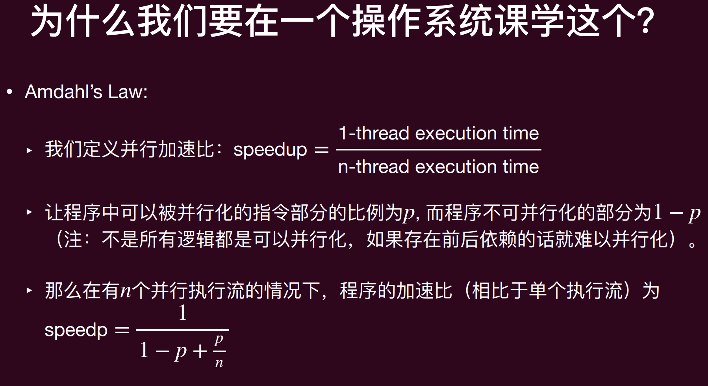
根据Amdahl定律，即使有无限的CPU，受限于可以并行化的任务比例，也不可能无限加速

而且 代码的并行化和同步并不简单，容易出错

操作系统本身就是世界上第一个并发程序！**并发**就是操作系统的核心之一

## 多线程编程
并发的基本单位是**线程(thread)**
线程：共享内存的执行流
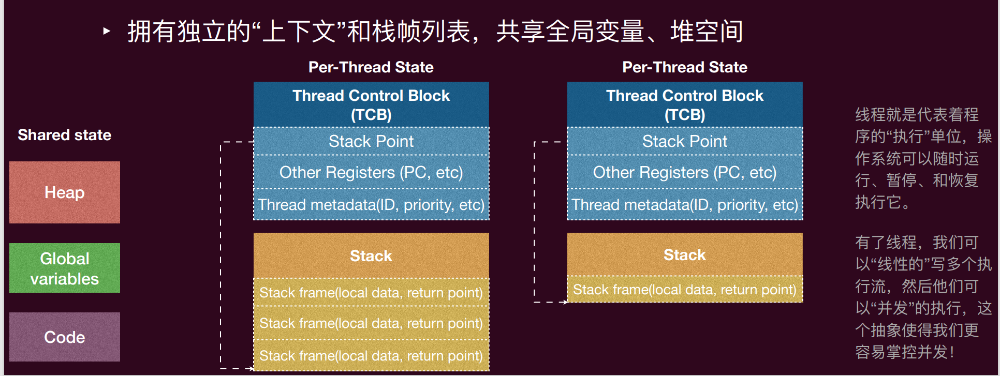
TCB维护着线程的状态，寄存器，堆栈等信息，此外还有一个栈，线程切换时需要保存和恢复这些信息
线程可以访问shared state里面的全局的堆、变量、代码段等
操作系统可以通过TCB来管理线程，调度线程的执行

从状态机的角度看，多个线程就是多个共享内存的状态机，线程切换就是状态机的切换
初始状态是线程创建时候的状态，状态迁移是调度器任意选择一个线程执行一步
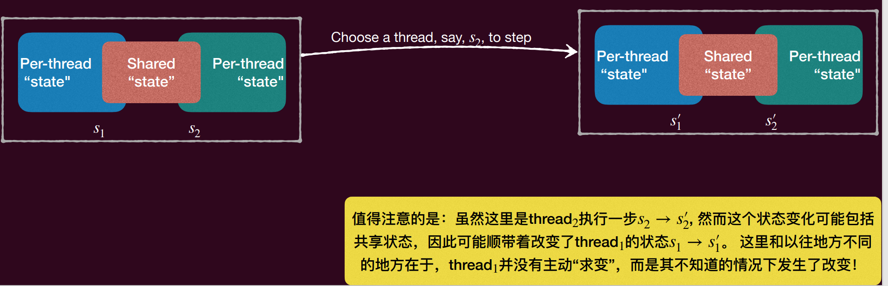

Posix基本线程API
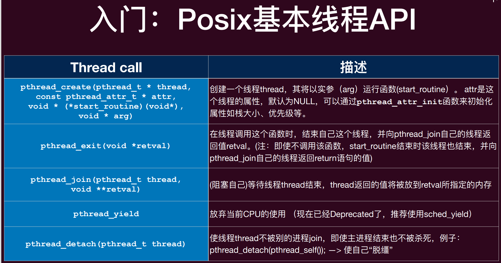

线程的生存周期
经历初始化、就绪、运行、等待和结束的周期
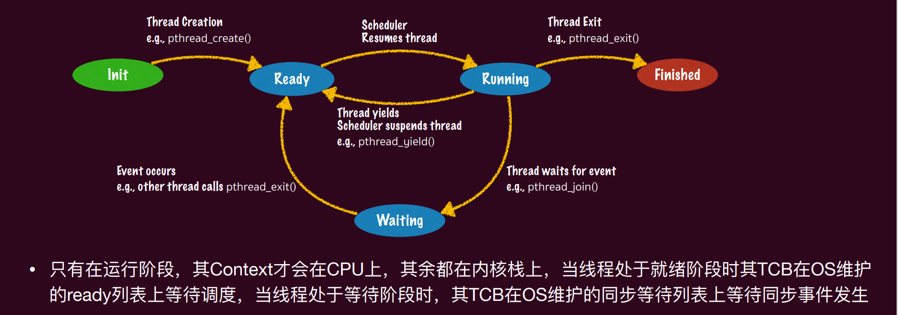
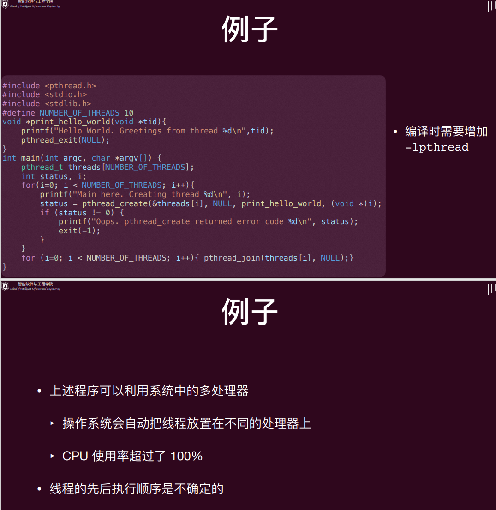

## Heisenbug
Heisenbug：在调试过程中，bug会消失或者改变行为的bug
根因是以下三个挑战：原子性丧失、顺序化丧失和全局一致化丧失

### 原子性丧失
原子性：一个原子性的操作即是一个在其“更高”的层面上无法感知到它的实现是由多个部分组成的，一般来说，其具有**两个属性**：
- All or nothing: 一个原子性操作要么会按照预想那样一次全部执行完毕，要么一点也不做，不会给外界暴露**中间态**;
- Isolation 一个原子性的操作共享变量时中途不会被其他操作干扰,其他所有关于这个共享变量的操作要么在这个原子性操作之前，要么在其之后
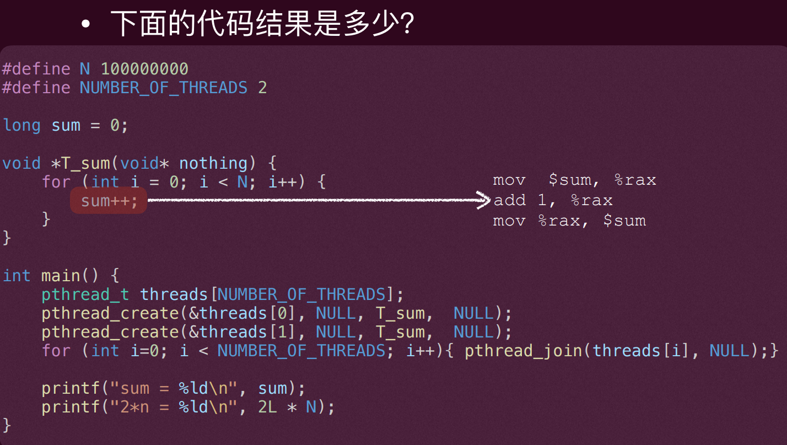
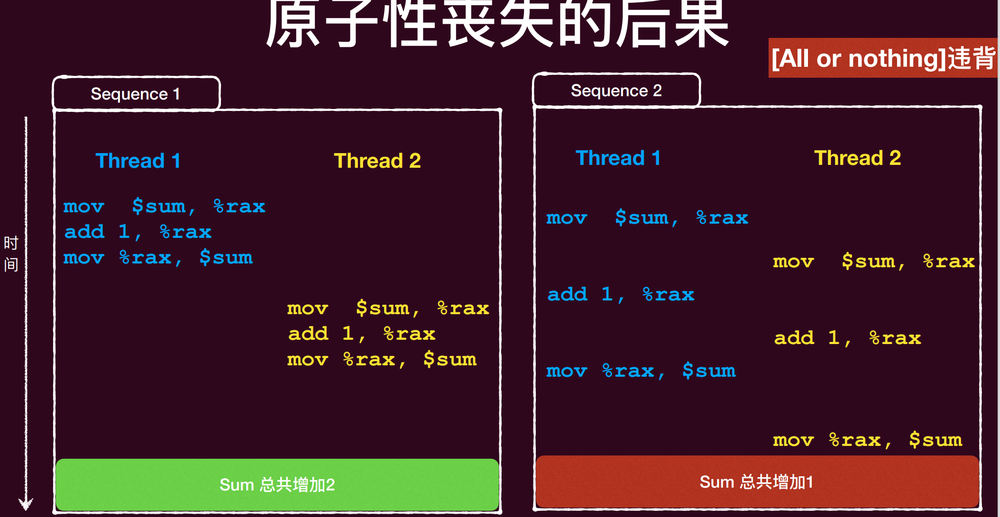
sum++ 不是原子的，sum++的汇编代码如下：
```
mov $rax, [sum]  ; 将sum的值加载到rax寄存器中
add $rax, 1      ; 将rax寄存器的值加1
mov [sum], $rax  ; 将rax寄存器的值保存回sum变量
```
不同线程的$rax也是不同的，线程切换时会保存和恢复寄存器的值，所以每个线程都有自己的寄存器状态，所以这样出来的结果就是错的，原子性丧失了
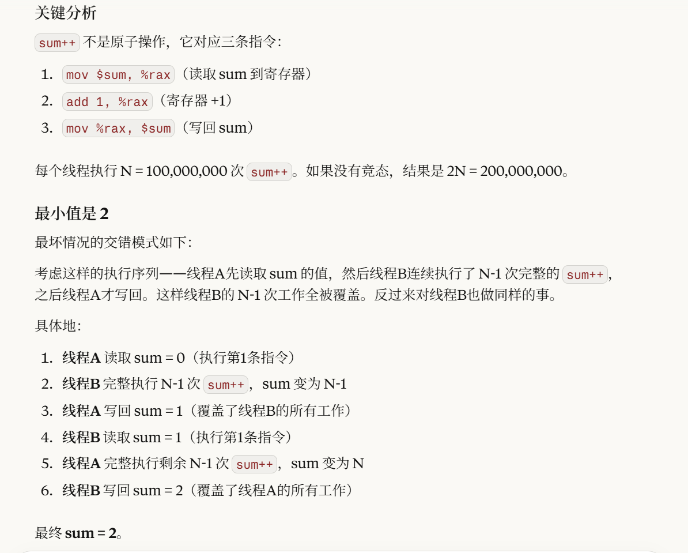

即使让sum++变成原子性的，也不能保证正确，因为sum++的执行顺序可能会被打乱，导致结果不正确
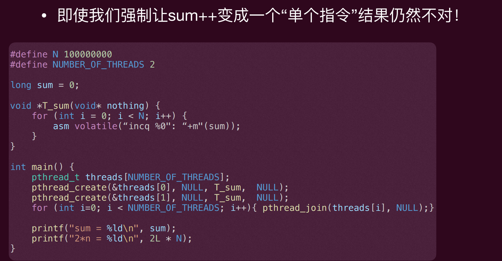
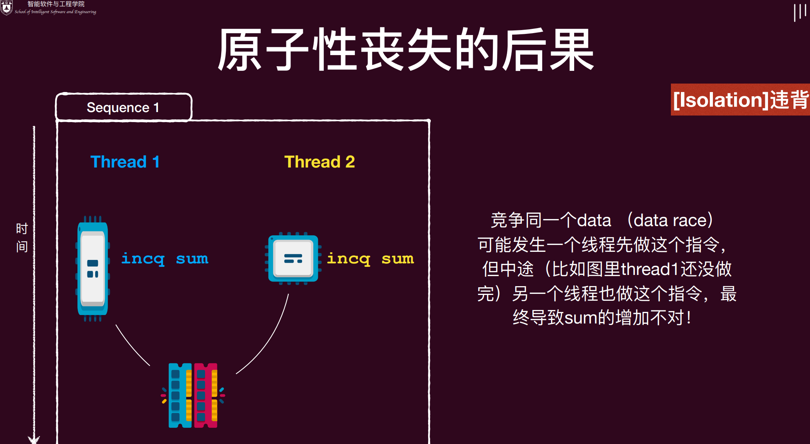
类比流水线中的数据冒险，指令重排可能会导致sum++的执行顺序被打乱，导致结果不正确

实现原子性是重要主题，加锁。

### 顺序化丧失
顺序性：程序语句按照既定的顺序执行
然而，只要不影响语义，其实指令是否按照顺序执行并不重要
‣ 编译器就会通过**reorder instructions**来优化程序，因为编译器会优化程序的性能，指令重排是编译器优化的一种手段，可以让程序运行得更快
‣ 这些优化在单线程下往往没有问题，但一旦到了多线程，很多逻辑就错了
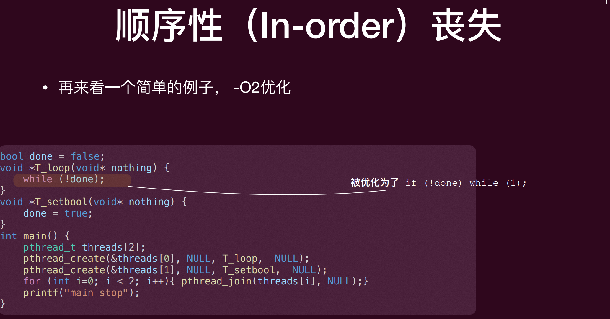

控制执行顺序：
- 方法1: 在代码中插入 “优化不能穿越” 的 barrier
‣ asm volatile ("" ::: "memory");
Barrier 的含义是告诉编译器这里 “可以读写任何内存”
- 方法2: 使用volatile变量，标记其每次load/store为不可优化
‣ bool volatile flag;
当然，这些都不是操作系统课的推荐解决方案，这门课的解决方案是：锁

### 全局一致化丧失
顺序一致性模型
顺序一致性模型提供了以下保证:
‣ 首先，不同核心看到的访存操作顺序完全一致，这个顺序称为全局顺序; 
‣ 其次，在这个全局顺序中，每个核心自己的读写操作可见顺序必须与其程序顺序保持一致
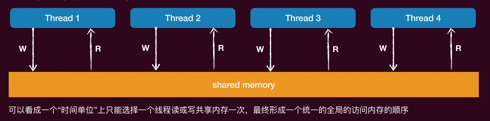
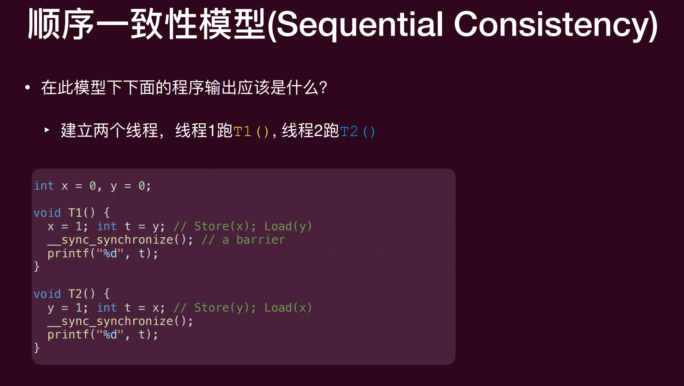
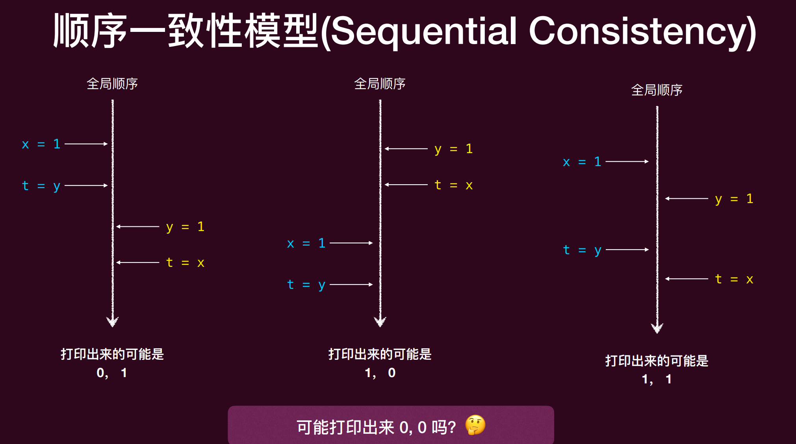
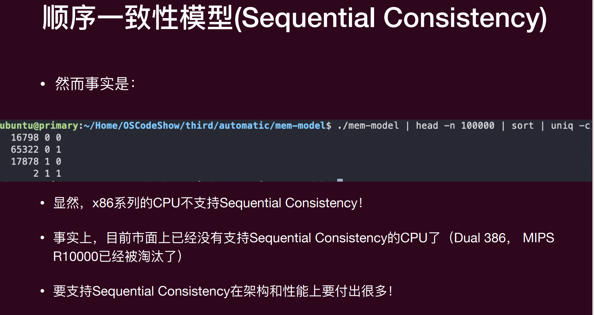
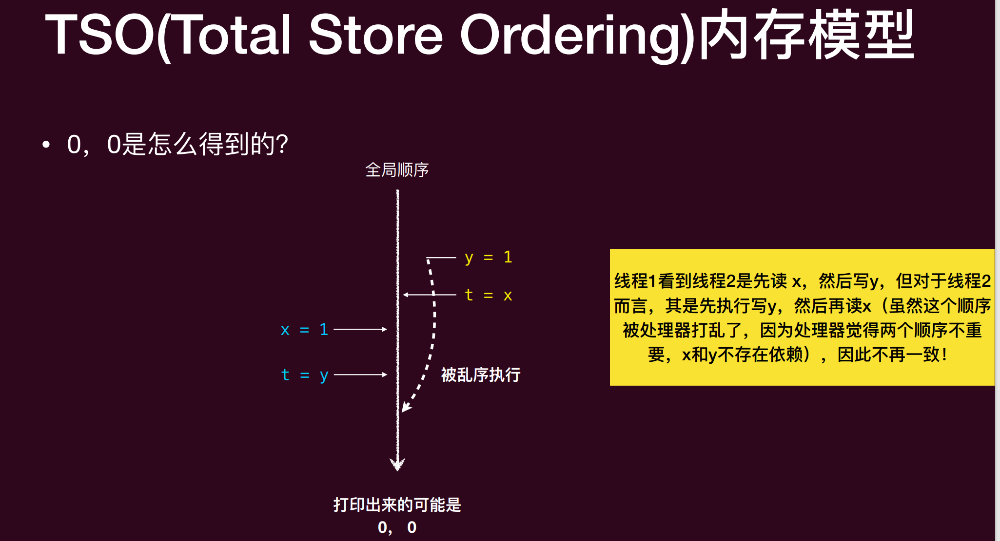
