# Lec4: 互斥
## 一些术语
临界区：访问共享资源的**代码段**
竞态条件：出现在多个执行线程大致同时进入临界区时，它们**都试图更新**共享的数据结构，导致非预期的结果
当一个程序有一个或者多个竞态条件，程序的输出会因运行而异，具体取决于哪些线程在何时运行，导致**不确定**的结果
如何设计机制使得临界区**避免出现竞态条件**是“并发”的重要主题

### 安全性和活性
安全性：没有坏事发生
安全性要求执行中的任何有限步骤内都保持这个性质

活性：最终会发生好事
活性要求只要在**最终**能满足要求即可，一个隐含的要求是执行中不能发生“不可挽回”的步骤！

### 临界区问题的解决方案需满足的条件

在并发系统中，多个进程/线程会共享数据或共享设备（比如内存变量、文件、打印机），而访问这些共享资源的那段代码叫临界区。
如果多个进程同时进入各自临界区，就可能导致数据不一致、结果错误，这就形成了“临界区问题”。

1. 互斥(Mutual Exclusion)：在任何时刻，最多只能有一个线程可以进入临界区(safety property)
2. 行进(Progress)：如果没有线程在临界区内，并且有一些线程想要进入临界区，那么只能允许那些线程中的一个进入临界区(liveness property)
3. 有界等待(bounded waiting): 如果某个线程想要进入临界区，那么其等待的**期限有限**（期间其他线程进入该临界区次数有上限），不可一直排队等待(Fairness/No starvation)
‣ 如果这个上限没有被指定，那么这就是一个`Liveness property`，其最终会进入！
‣ 如果这个上限被指定具体数字，那么这就是一个`Safety property`，因为任何一次执行的有限步骤内，其等待进入的次数只要超过这个上限就发生了“坏事”！

除此之外，还有一个临界区问题的解决方案所需要关心的，那就是性能（performance）
**进入和退出**该临界区的两个操作应该相对于在该临界区内做的计算而言尽可能的小

经验法则(Rule of thumb): 当设计并发算法时，优先考虑安全性！(but don't forget liveness and performance).

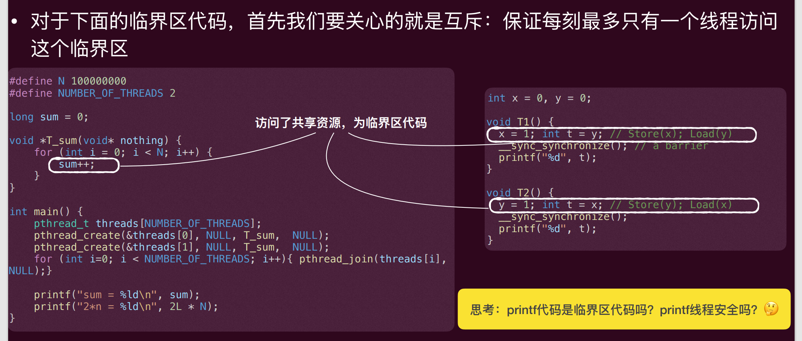
printf是临界区代码。

## 锁（Lock）
锁是一个**变量**，其保存了锁在某一时刻的状态。
它要么是**可用的**available，或unlocked，或free），表示没有线程持有锁，要么是**被占用的**（acquired，或locked，或held），表示有一个线程持有锁，**正处于临界区**

两个配对操作：
- lock()/acquire(): 如果没有其他线程持有锁，那么该线程获取锁，进入临界区。如果锁已经被占用，则调用线程会被阻塞，直到锁变为可用
- unlock()/release(): 释放锁，使其变为可用状态。如果有其他线程正在等待该锁，那么**其中一个线程**将被唤醒，获取锁并进入临界区

锁为程序员提供了最小程度的调度控制，通过给临界区加锁，保证临界区内**只有一个活跃变量**（互斥）

例子：
```c
long sum = 0; // 共享变量sum
void *T_sum(void* nothing) { 
 for (int i = 0; i < N; i++) { 
 lock(); // 进入临界区
 sum++; 
 unlock(); // 离开临界区
 } 
}
```
```c
int x = 0, y = 0; 
void T1() { 
 lock(); 
 x = 1; int t = y; // Store(x); Load(y) 
 unlock();
 __sync_synchronize(); // a barrier
 printf("%d", t); 
} 
void T2() { 
 lock();
 y = 1; int t = x; // Store(y); Load(x) 
 unlock();
 __sync_synchronize(); 
 printf("%d", t); 
}
// 共享变量是x和y，锁保护了对它们的访问
```
如何实现这样的锁？

### 尝试1：关中断
能否使当前程序状态机独占计算机系统？
‣ 单处理器系统中 “其他任何事”：仅有中断！
一条指令就可以实现原子性（lock() -> disable interrupt）
unlock()就是再次打开打开中断

但是这样有问题。
- 临界区的代码死循环了，会导致整个系统也卡死了
- 中断关闭时间过长会导致很多其他重要的外界响应丢失（比如错过了磁盘I/O的完成事件）
- 关中断是特权指令，用户态的应用是无法执行的，只有**操作系统**有这个权限！(x86可以看看cs寄存器的最低的两位)
- 多处理器系统中，中断是每个处理器内部状态，每个处理器有独立的寄存器组，关中断只能保证当前处理器上的线程独占计算机系统，但其他处理器上的线程仍然可以执行，无法实现互斥

### 尝试2: 通过软件(Lock标志)
一个简单的想法：使用一个标志flag来表达此时锁的状态，比如：为1就是已被占用，为0就是可用的。对应的lock() 和 unlock()
```c
int flag = 0; 
void lock(){ 
 while (flag == 1); //自旋的观测flag
 flag = 1; //设置
} 
void unlock(){ 
 flag = 0; 
}
```
这里必须假设读取一个变量并判断它的值是**原子的**
也就是像 if (flag == 1) 这种“先把 flag 读出来再判断”的过程
还有设置一个变量也是原子的
也就是像 flag = 1 或 flag = 0 这种赋值操作
但是在多处理器系统中，这些操作都不是原子的，可能会被打断，导致竞态条件的发生

这个方法不过是把共享变量存在的竞态条件转移到了锁的这个状态变量上而已
‣ 完全存在两个线程同时发现flag为0，然后都进入临界区的可能！ (not safe)

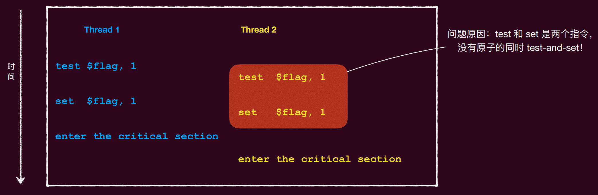
因为“先检查 flag==0，再把 flag=1”这两步不是一个不可分割的原子操作，两个线程可能出现这样的交错执行
- 线程 A 先读到 flag=0
- 线程 B 也在这时读到 flag=0
- A 认为锁空闲，进入临界区，并把 flag 设为 1
- B 也已经“以为”锁空闲了，于是同样进入临界区
结果就是：两个线程同时进入临界区，互斥失败

### 尝试3：互斥的test
如果每个线程都是采用同一个判定：test flag == 1，那么完全存在所有的线程都可能得到同样的True
那么如果每个线程都采用不同的判定，使得一个线程回答true的同时其他线程回答false，那么就可以保证互斥了
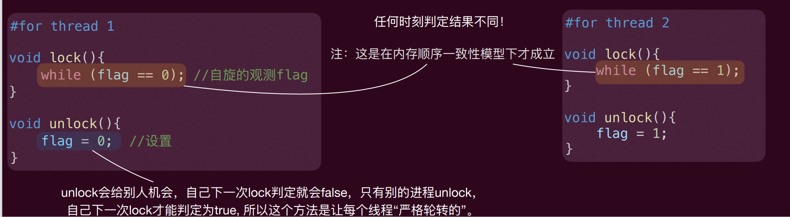
如果flag是这个线程unlock设置的值，那么就一直忙等

也就是说，当线程 A 退出临界区并执行 unlock 时，系统会把机会交给线程 B，A 下次再来申请 lock 时，条件通常不满足，所以会被挡住，只有 B 先进入、再退出，A 才有可能在之后变成“轮到自己了”

所以这个方法存在一个问题：一个线程能否得到一个锁完全依赖于另外一个线程是否先进入了临界区
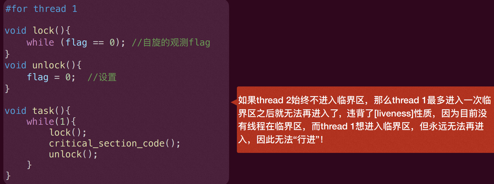

### Peterson算法
主要思想就是之前尝试3中的test的改进：除了测试flag之外，还看看是否有别的线程要进入临界区（这个部分可以避免之前尝试出现的可能没有“行进”问题）
- 因此，除了有一个全局变量来进行 flag == i 判定，还得有一个全局变量 intents 来记录是否有其他线程要进入临界区
- Peterson原始算法只能在两个线程上工作，不过该算法很容易拓展到N个线程上（当然，N必须提前知道）


一个尝试实现：
```c
int intents[2] = {0, 0}; //进入意图
int flag = 0; // 当前是谁可以获得锁 (thread 0 or 1)
int self = i; //当前的线程ID，0， 1中的一个
void lock() { 
 intents[self] = 1; // 标记自己想要进入临界区
 while ( (intents[(self + 1)%2] == 1) //别人想不想要进来
 && (flag == self) ); // 如果别人也想进来，就再看看是否当前“轮转”到自己了
} 
void unlock() { 
 intents[self] = 0; //标记自己不再想要进入临界区
 flag = self; //轮转到下一位，这里设置flag太晚了，所以会出错
}
```
但是这个是不对的！
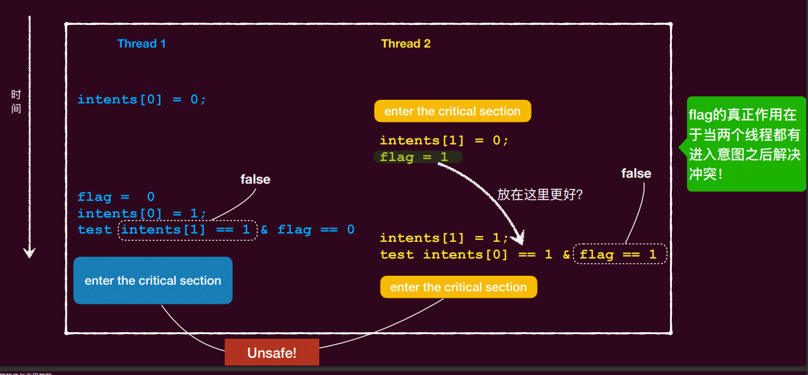
这种情况下，都不会出现等待，导致flag没办法控制线程的轮转，从而没办法保证互斥

下面是一个正确的实现：
```c
int intents[2] = {0, 0}; //进入意图
int flag = 0; // 当前是谁可以获得锁 (thread 0 or 1)
int self = i; //当前的线程ID，0， 1中的一个
void lock() { 
 intents[self] = 1; // 标记自己想要进入临界区
 flag = self; //轮转到下一位，提早设置flag，这样就能保证如果另一个线程也想进入了，那么它就会被挡住，直到当前线程进入并退出了临界区
 while ( (intents[(self + 1)%2] == 1) //别人想不想要进来
 && (flag == self) ); // 如果别人也想进来，就再看看是否当前“轮转”到自己了
} 
void unlock() { 
 intents[self] = 0; //标记自己不再想要进入临界区
}
```

#### 证明Peterson算法的正确性
Lemma 1: 当一个线程$T_i$在调用lock()后和在离开临界区之前: intents[self] = 1
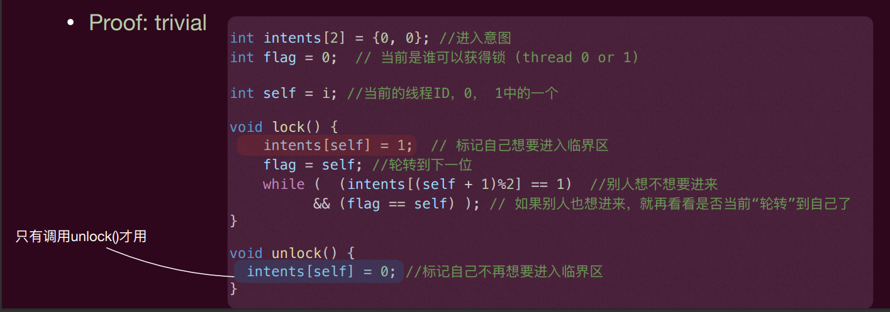
Lemma 2: [安全性]Peterson算法能够保持互斥性：
Proof: 为了方便起见，一个状态记为：$[t, h, k, f_0, f_1]$，其中：
‣ t是当前的flag的值
‣ h是当前线程 的语句的index
‣ k是当前线程 的语句的index
‣ $f_0$是intents[0]
‣ $f_1$是intents[1]
$T_i$工作流程：
```c
do{ 
 intents[i] = 1; 
 flag = i; 
 while ( (intents[(i + 1)%2] == 1)
 && (flag == i) ); 
 critical_section();
 intents[i] = 0; 
 reminder_section();
}while(1); 
```
为了具体证明，我们先假设坏事发生，也就是两个线程都在临界区内了，那么就有如下的状态：
[0, 4, 4, 1, 1]
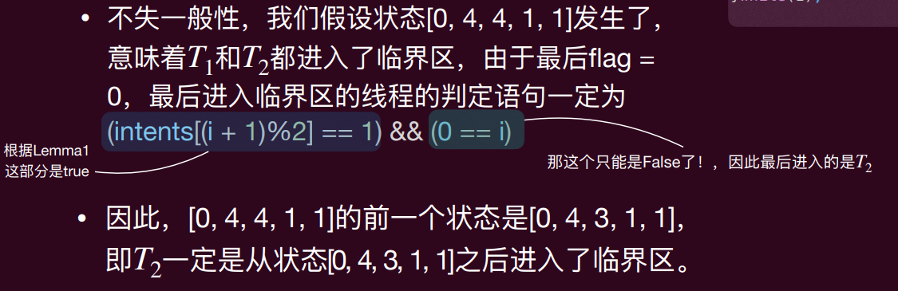
下面证明[0, 4, 4, 1, 1]的前驱也就是[0, 4, 3, 1, 1]是不可能到达的：
[0, 4, 3, 1, 1]有两种可能的前驱（线程1或线程2执行一步）：
- [0, 3, 3, 1, 1]（线程1执行一步），这是不可能的，因为这代表T1还在while忙等，但是这种情况下T1的while条件是假，不可能在循环体内
- [?, 4, 2, 1, 1]（线程2执行一步），这是不可能的，因为这代表T2正在执行 flag=1 那一步（语句2），执行后 flag 应变成 1，不可能走到下一步却还得到 flag=0。矛盾。
因此，[0, 4, 3, 1, 1]是不可达的，那么[0, 4, 4, 1, 1]也是不可达的，所以互斥性得以保证了

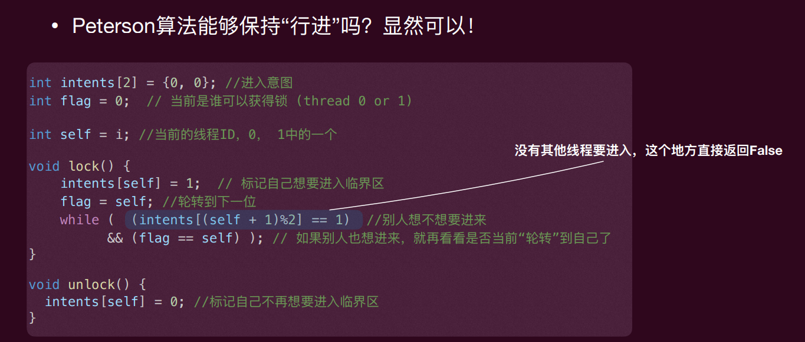
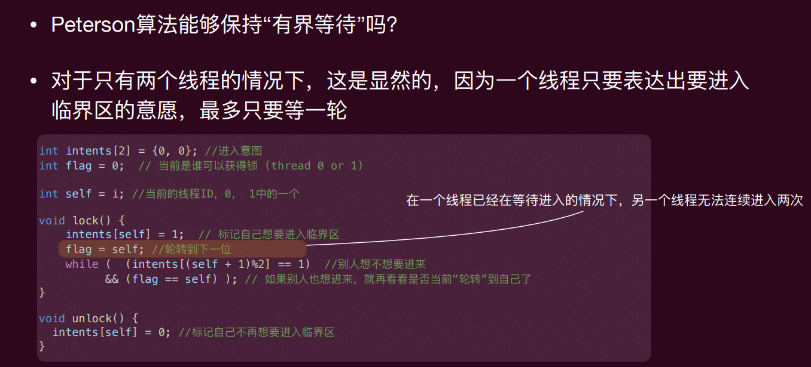

#### 如何写出正确的peterson
现实的load和store都不是原子的，甚至两个线程同一刻读的flag都不一致！因此现实架构上的peterson算法**其实是错误的**

在现代计算机体系架构下，由于多处理器以及乱序指令流的存在，需要硬件的支持，比如：内存屏障 (Memory Barrier)
gcc编译器可以将__sync_synchronize()编译为相应指令架构的内存屏障指令，来保证指令的顺序性，从而使得peterson算法在现代计算机体系架构下也能正确工作

## 硬件支持的锁
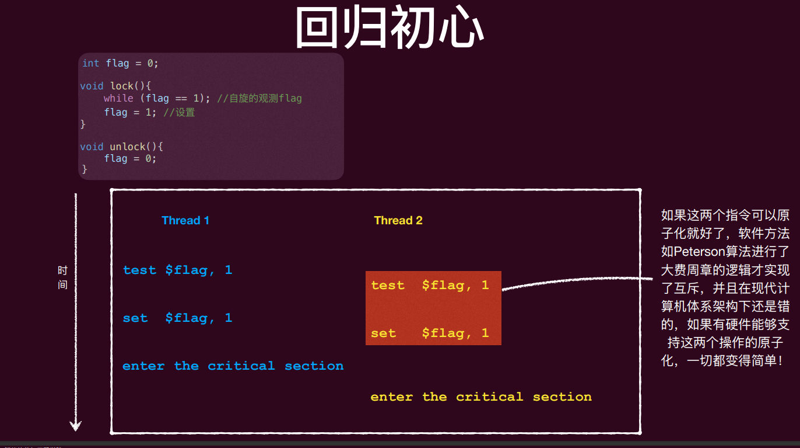

### 原子的Test-And-Set (TAS) 指令
很多硬件架构都提供了原子指令可以来实现Test-And-Set Lock (TSL)，比如X86平台下，利用lock前缀加上cmpxchg：
```c
int flag; // 需要被原子的test 和 set的flag 
int expected = 0; 
// expected = old value of flag, and, if flag != 0 then nothing else if flag == 0 then flag = 1 
// equal to expected = __sync_val_compare_and_swap(&flag, 0, 1); 
asm volatile ( 
    "lock cmpxchg %2, %1" // lock前缀保证了原子性，cmpxchg指令会比较eax寄存器的值和flag的值，如果相等就把1写入flag，否则把flag的值写入eax寄存器
    : "+a" (expected) //Value for comparison. x86 uses eax/rax. 加号表示它既是输入又是输出，输入时作为比较值，输出时可能被改成 flag 的旧值
    : "m" (flag), // Memory location, flag的内存地址
    "r" (1) // 常量1，放在一个寄存器里，作为要写入的值
    : "memory", "cc" //memory 表示这条指令会影响内存，编译器不要乱重排，cc 表示会改条件码寄存器
 );
```
有了这样TSA的硬件支持，我们的之前的锁可以实现为如下（x86）
```c
int flag = 0; // 锁一开始是空闲的
// lock()函数会不断地调用cmpxchg指令来尝试获取锁，直到成功为止
// 也就是不断尝试把flag从0原子地设置成1，如果成功了就进入临界区，否则继续尝试 这样就是原子化的Test-And-Set，就可以实现自旋锁
 void lock() { 
 int expected; 
 do { 
 expected = 0; // 我希望flag是0，如果是0就把它设置成1，如果不是0就把它的值读出来，继续循环
 asm volatile ( 
 "lock cmpxchg %2, %1"
 : "+a" (expected)
 : "m" (flag), 
 "r" (1) 
 : "memory", "cc"
 ); 
 } while (expected != 0); 
}
// 把flag设置成0就可以释放锁了
void unlock() { 
 asm volatile (
 "mov %1, %0"
 : "=m" (flag)
 : "r" (0)
 : "memory"
 ); 
 }
```
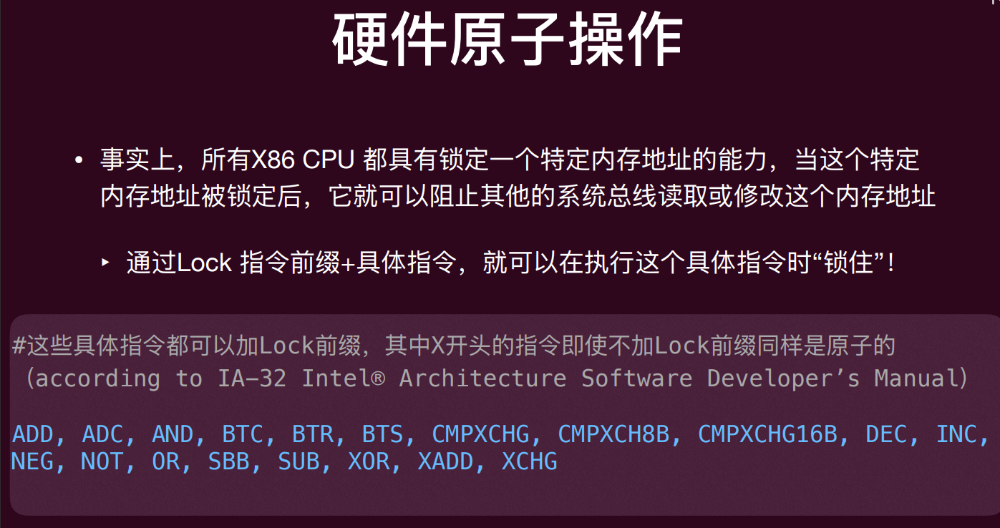
