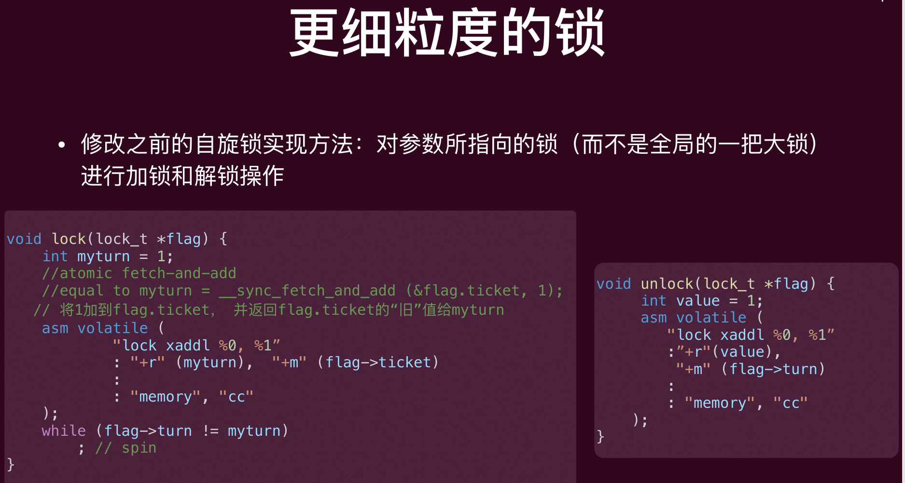
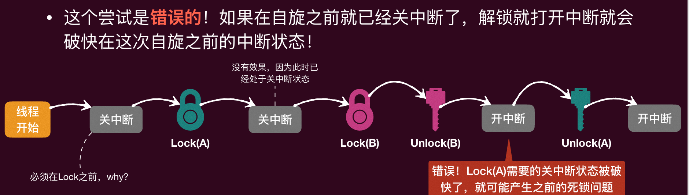
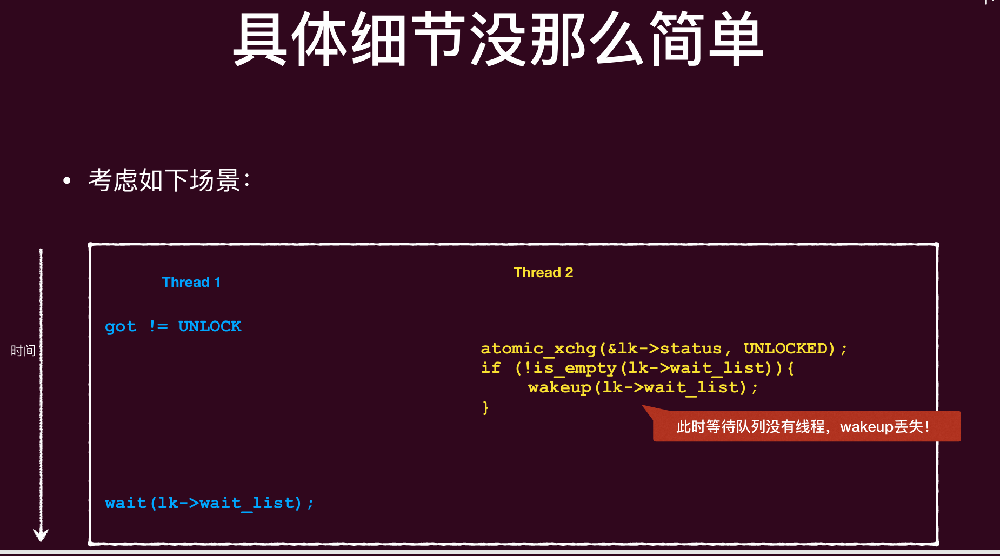
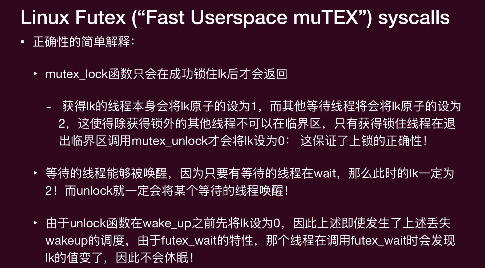
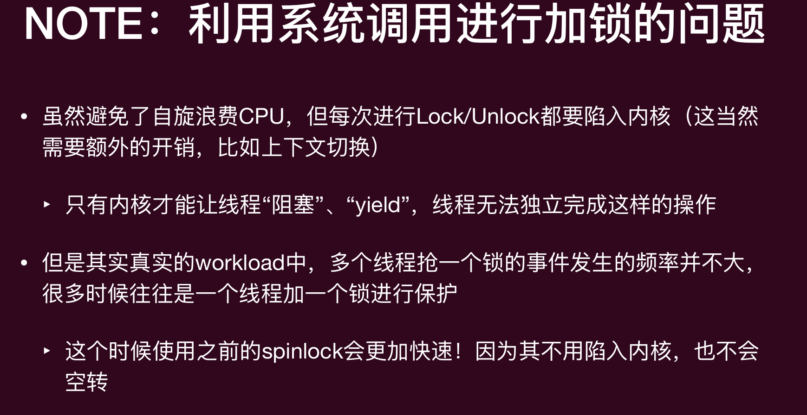
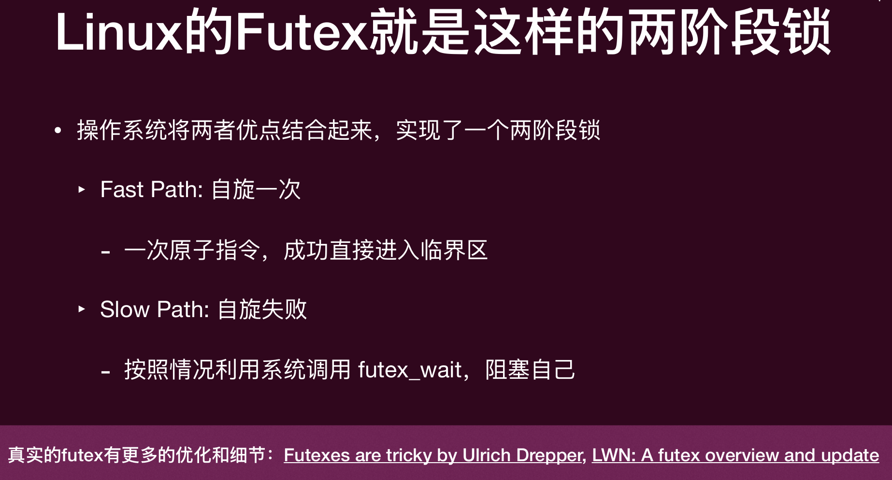
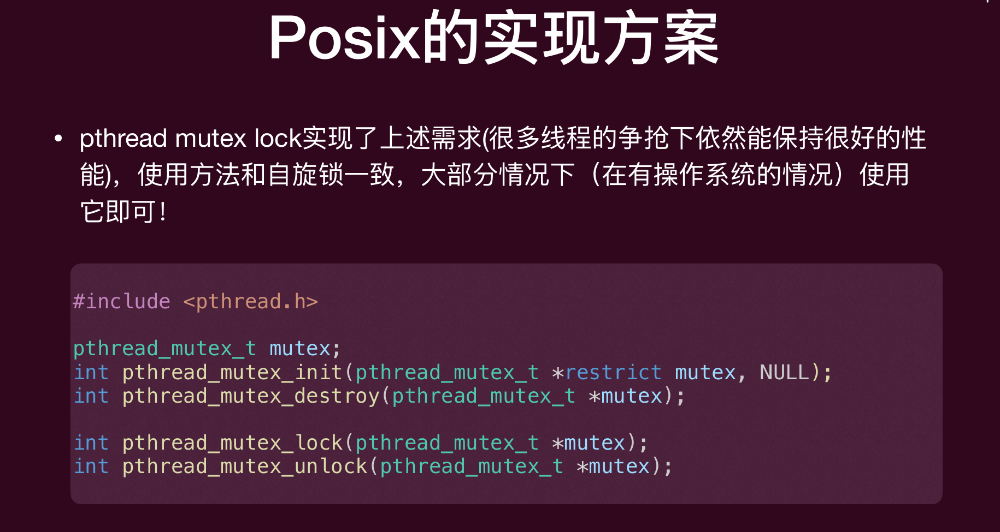
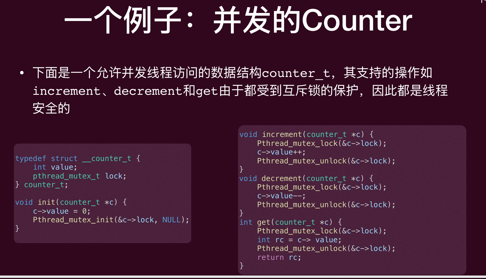
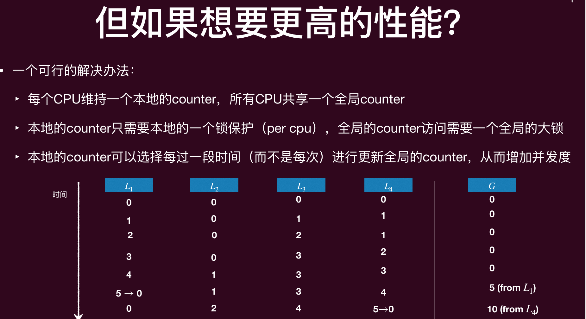
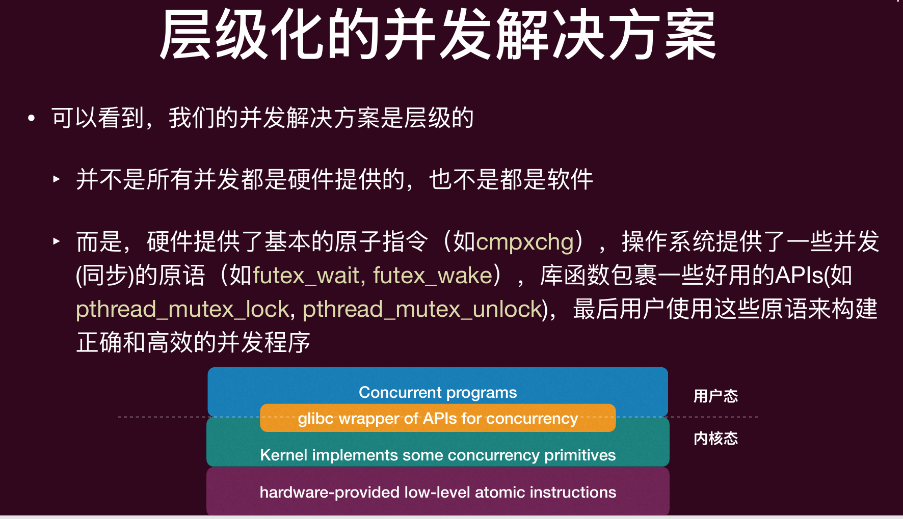

# Lec5: Mutual Exclusion (Mutex): Advances
## 自旋锁的一个改进
当一个线程在**自旋等待**（也叫忙等待，busy waiting）时，它一定能够最终进入临界区吗？
- 不一定，如果一直有其他线程要进入临界区，并且这些其他线程一直被优先调度进入临界区（我们不能假定调度策略），那这个线程就可能会一直等在那里（**违背了有界等待**）
- 解决⽅法也很简单：排队

每次尝试进入临界区就拿一个“号”（下一个尝试的“号”加一），等待“叫号”
```c
typedef struct  lock_ticket { 
int ticket; //当前发放的最⼤票号 
int turn;   //当前应该进入的票号 
} lock_t; 
lock_t flag; 
void lock_init() { 
flag.ticket = 0; 
flag.turn   = 0; 
}
```
排号自旋锁（Tick Lock）的加锁和解锁, 通过原⼦的 “fetch_and_add”实现
ticket：发号器，记录“下一个可分配的号”
turn：叫号器，记录“当前轮到哪个号进入临界区”
```c
void lock() { 
int myturn = 1; // 表示我要将ticket加1，然后flag.ticket的旧值就是我这个线程的号
//atomic fetch-and-add 
//equal to myturn = __sync_fetch_and_add (&flag.ticket, 1); 
   // 等价于 flag.ticket += 1，并返回flag.ticket的“旧”值给myturn 
asm volatile ( 
            "lock xaddl %0, %1"
            : "+r" (myturn),  "+m" (flag.ticket)             
            :                            
            : "memory", "cc" 
    ); 
while (flag.turn != myturn); // 如果还没叫到我的号，就一直spin
}
void unlock() { 
int value = 1; 
asm volatile ( 
        "lock xaddl %0, %1" // 等价于 flag.turn += 1
        :"+r"(value), 
        "+m" (flag.turn) 
        :                         
        : "memory", "cc" 
    ); 
}
// 这样更新了flag.turn，就可以叫新的号
```

并不是所有线程都“彼此”需要互斥，我们应该给需要彼此互斥的线程集他们独有的“锁”,  更加“细粒度”的锁可以提⾼并发性能！


lock和unlock没有“真正”意义上的保护临界区的共享资源
‣ 互斥锁的正确性依赖于你是“理智”的合作者，lock和unlock必须要按照正确⽅式才能形成保护！
```c
T1: spin_lock(&lk); sum++; spin_unlock(&lk); 
T2: spin_lock(&lk); sum++; spin_unlock(&lk); 
T3: sum++;
```
这样T3里面一个不正确的访问整个逻辑就错了

## 在内核中实现⾃旋锁的问题
内核的实现中会出现很多需要访问共享资源的情况（毕竟，操作系统就是资源的管理者！）
• 因此内核中使用**互斥锁**的情况非常普遍
‣ ⽐如线程利用系统调用访问共享的终端输出时(write)，OS会用锁来互斥各个线程
• 内核可能会在各个部分用到⾃旋锁，除了系统调用程序外，还有中断处理程序中也可能用到(用户程序没有这个部分)，如果临界区非常短，直接睡眠再唤醒反而更慢

互斥锁的特点是，线程拿不到锁会**被阻塞**，交出 CPU，等锁可用时再**被唤醒**。它适合锁持有时间较长、竞争可能较多的场景，因为不会白白消耗 CPU。

自旋锁的特点是，线程拿不到锁就**一直循环检查**，原地等待，不会睡眠。它适合锁持有时间很短、上下文切换代价比等待更高的场景，因为避免了睡眠和唤醒的开销。

互斥锁：等不到就睡觉
自旋锁：等不到就一直转

在内核里用自旋锁时，如果处理中断不当，会出现“永远转圈”的死锁。考虑如下情况：
- 一个线程利用系统调用访问一个共享变量，kernel在访问这个共享变量时上了锁
- 此时一个中断发生了，CPU强制转向**中断处理程序**，这个中断处理程序也需要访问这个共享变量，因此尝试获得锁，但是发现这个锁已经被持有了，因此**自旋等待**
- 中断处理程序的优先级一般很⾼，要⾼过系统调用
- 因此该中断处理程序就会一直等待一个不再可能发生的事情，产生死锁

**解决方法：**
### 一个尝试：在⾃旋锁之前关中断，在解锁之后开中断

但是这个尝试是错误的。如果在自旋之前就已经关中断了，解锁就打开中断就会破坏在这次自旋之前的中断状态！

如果有两个lock，先关了中断，拿了第一个锁，接着又拿了第二个锁，这时如果解锁的时候开中断，就会破坏之前的中断状态，导致系统出现问题。
如果先 Lock，再关中断在这两步之间有空档。
就在这个空档里一旦来了中断，中断处理函数可能也去抢同一把锁。

### xv6⾥⾃旋锁的实现
因此我们需要保存⾃旋之前的中断状态（打开或关闭），然后在解锁时恢复这个状态.
• xv6是MIT 开发的一个教学用的完整的类Unix 操作系统给出了很好的实现
```c
typedef struct { 
const char *name; 
int status; 
struct cpu *cpu; 
} spinlock_t;

void spin_lock(spinlock_t *lk) { 
// Disable interrupts to avoid deadlock. 关闭中断以避免死锁
push_off(); // 记录之前的中断状态，并且关闭中断
if (holding(lk)) { 
panic("acquire %s", lk->name); // 如果已经持有这个锁了，就panic
    } 
// This our main body of spin lock. 
int got; 
do { 
got = atomic_xchg(&lk->status, LOCKED); // 原子交换，尝试获得锁，如果之前是UNLOCKED就成功了，got会是UNLOCKED，否则got会是LOCKED
    } 
while (got != UNLOCKED); // 如果之前是LOCKED，就一直自旋等待
lk->cpu = mycpu; // 记录是哪个CPU持有这个锁
}
void spin_unlock(spinlock_t *lk) { 
if (!holding(lk)) { 
panic("release %s", lk->name); // 如果当前CPU没有持有这个锁，就panic
    } 
lk->cpu = NULL; // 释放锁之前先把cpu字段清空
atomic_xchg(&lk->status, UNLOCKED); // 释放锁
pop_off(); // 恢复之前的中断状态
}
```
xv6这个实现⾥，push_off()记录中断关闭的次数，pop_off()记录想要打开中断的次数（只有当该次数等于中断关闭的次数才能真正去打开中断）
```c
// it takes two pop_off()s to undo two  
//push_off()s. 
void push_off(void) { 
    //record previous state of interrupt  
    int old = ienabled(); // 记录之前的中断状态
    struct cpu *c = mycpu; 
    iset(false); //disable the interrupt
    if (c->noff == 0) { 
    c->intena = old; // 如果这是本 CPU 第一次进入“关中断区”（noff == 0），就把之前状态保存到 intena
    } 
    c->noff += 1; // 记录关中断的次数
}
void pop_off(void) { 
    struct cpu *c = mycpu; 
    // Never enable interrupt when holding a lock. 
    if (ienabled()) { 
    panic("pop_off - interruptible"); // 如果当前中断是打开的，就panic，因为我们不应该在持有锁的时候打开中断
        } 
    if (c->noff < 1) { 
    panic("pop_off"); // 如果当前 CPU 的 noff 小于 1，就panic，因为这说明 pop_off 的调用次数超过了 push_off 的调用次数
        } 
    c->noff -= 1; // 记录想要打开中断的次数
    if (c->noff == 0 && c->intena) { 
    iset(true); // 如果当前 CPU 的 noff 减到 0，并且之前的中断状态是打开的，就真正去打开中断
    } 
}
```

## 应用程序里的使用互斥锁问题
内核中的临界区一般都为“短”临界区

自旋锁本身的问题：
除了进入临界区的线程，其他处理器上的线程都在空转，浪费CPU资源
如果临界区执行时间过长（用户线程的常态），其他线程浪费的CPU很多
此外，如果发生**中断**将临界区的线程切出去了，计算资源浪费更加严重，然而用户态无法通过关闭中断来解决问题

⼀个简单解决⽅案：yield
利用系统调用sched_yield()直接让出cpu，让其他线程获得CPU使用
```c
void yield_lock(spinlock_t *lk) { 
    // xchg是一个原子操作，尝试用xchg拿锁，如果拿不到就一直循环
    while (xchg(&lk->locked, 1)) { // 尝试用xchg拿锁，如果拿不到就一直循环
        //a wrapper of sched_yield() 
        syscall(SYS_yield); // yield() on AbstractMachine
        // 因为拿不到锁，所以让出CPU，等其他线程运行完了之后再来尝试拿锁，这样就不会一直空转了 
  } 
} 
void yield_unlock(spinlock_t *lk) { 
xchg(&lk->locked, 0);  // 释放锁
}
```
但是这样还是有问题。yield只是暂时让出CPU，该线程还处在"ready"的阶段，随时可以被再次调度。
在获得锁之前，反复的"被调度—>让出CPU"会带来大量的不必要的context switches
也就是他会反复尝试拿锁，拿不到就yield，yield之后又被调度回来继续尝试拿锁，这样就会有大量的上下文切换，虽然比纯自旋要好，但是还是不够好。

**解决方案**
用户使用和释放锁应该和OS调度程序配合：
- mutex_lock(&lk): 试图获得lk，如果失败(lk已被持有)，利用系统调用**阻塞**该线程（此时不是就绪态了，无法被调度），让出CPU并将其加入**等待锁的队列**之中。否则，成功获得锁进入临界区。
- mutex_unlock(&lk): 释放锁，如果等待该锁的队列里有线程就利用系统调用选择⼀个唤醒，使其变成**就绪态**（ready），从这个等待队列删除，并进入就绪的队列，可以被再次调度。
- 操作系统需要对⼀个锁维持⼀个与其相关的**队列**

没那么简单。
看下面的实现有没有问题
```c
void mutex_lock(spinlock_t *lk) {
    int got;
    do {
        got = atomic_xchg(lk->status, LOCKED);
        if (got != UNLOCK) {
            // 将当前线程加⼊等待队列，并标记为阻塞, 释放cpu
            wait(lk->wait_list);
        } else {
            break;
        }
    }
}
void mutex_unlock(spinlock_t *lk) {
    atomic_xchg(lk->status, UNLOCKED);
    if (!is_empty(lk->wait_list)) {
        // 等待队列中的⼀个线程移出队列，标记为就绪
        wakeup(lk->wait_list);
    }
}
```

Thread 1 发现锁不是 UNLOCK，准备去等待队列睡眠。
但它还没真正进入等待队列时，Thread 2 执行了解锁：先把锁状态改成 UNLOCKED，检查等待队列是否为空，如果不空就 wakeup
Thread 2 检查时，等待队列“此刻是空的”，所以没有唤醒任何线程。
随后 Thread 1 才执行 wait(...) 进入睡眠。
结果：这次唤醒机会已经错过了，Thread 1 可能一直睡下去。

我们可以利用Linux Futex (“Fast Userspace muTEX”) syscalls来实现互斥锁
- `futex_wait(int *addr, int expected)`: 如果*addr == expected，就阻塞等待被唤醒，否则⽴即返回给⽤户线程，使其可以⽴⻢再次尝试lock
- `futex_wake(int *addr, int num)`: 唤醒⼀个等待address指向的锁的线程

```c
#define UNLOCK    0 // 锁空闲
#define ONE_HOLD  1 // 锁被持有，无等待者
#define WAITERS   2 // 锁被持有，而且已经有等待线程

void mutex_unlock(spinlock_t *lk) {
    // state can only be ONE_HOLD or WAITERS
    if (atomic_dec(lk) != ONE_HOLD) {
        // 如果返回值不是 ONE_HOLD，说明除了当前持有者之外还有等待者
        lk = UNLOCK; // 把状态设为 UNLOCK
        futex_wake(lk); // 调用 futex_wake 唤醒等待线程
    } else {
        // 说明没人等
        return;  // the fast path unlock
    }
}

void mutex_lock(spinlock_t *lk) {
    // Return old value of state;
    // if lk == UNLOCK, set state = ONE_HOLD (uncontested).
    int c = cmpxchg(lk, UNLOCK, ONE_HOLD);

    if (c != UNLOCK) {
        // Previous state is either ONE_HOLD or WAITERS. 进入循环处理竞争
        do {
            if (c == WAITERS ||
                // If previous state is ONE_HOLD,
                // now it has one more waiter.
                // And it is possible the lock is released now.
                cmpxchg(lk, ONE_HOLD, WAITERS) != 0) {
                futex_wait(lk, WAITERS); // 只有当当前值仍等于 WAITERS 才睡眠，否则立刻返回
            }
            // Repeat checking whether the lock is released.
        } while ((c = cmpxchg(lk, UNLOCK, WAITERS)) != 0);
    } else {
        return;  // the fast path lock，直接拿到锁
    }
}
```






## 并发数据结构

线程安全的数据结构指的⼀个数据结构可以被多个线程并发的访问
‣ 也被称为并发数据结构

要达成这样的数据结构⼀般我们需要在访问和更新该数据结构时上锁（⼀把或多把）
最简单的做法：⼀把⼤锁（One Big Lock）！所有访问都串⾏化（实际上，早期的Linux就是这么做的，Big Kernel Lock（BKL），简单，正确！）
‣ 但在多处理器时代，可能会造成性能瓶颈



