# Lec6: Synchronization Basics

## 受控制的线程：同步
并发的困难：“未来”可能性太多，并发程序的语句执行顺序是不确定的
为了达成/避免⼀些状态，我们需要线程受控制，其往往需要：
- 不能太快（比某些线程快）到达某个状态 （比如在某个线程出临界区之前不能提前进入临界区这个状态）
- 不能太慢（比如某个状态达成了，就得行进下去）

同步：控制并发，使得两个或两个以上随时间变化的量在变化过程中保持一定的**相对关系**
互斥也是一种同步

简单的互斥（加锁、解锁）并不能控制线程的执行顺序！

## 生产者-消费者问题
• 一个或多个线程**共享**一个数据缓冲区问题，该缓冲区**容量有上限**（有界缓冲区）
• 线程分为两类：一类生产数据（**生产者**），一类消费数据（**消费者**）
• 该问题由Dijkstra首先给出，可以代表绝大部分并发问题
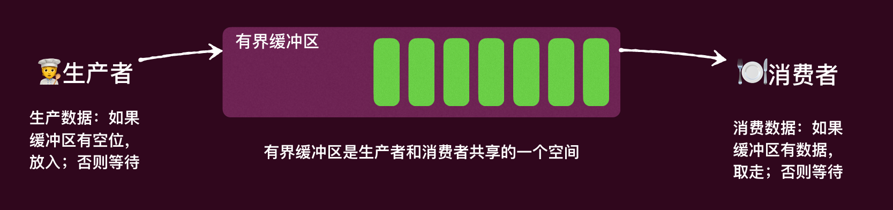

一个简化版问题（打印括号）：
生产=打印左括号，消费=打印右括号，缓冲区=括号的嵌套深度
比如： 
- `(((`  意味着在缓冲区生产了三个未被消费的括号
- `((())((`  也意味缓冲区生产了三个未被消费的括号：⼀开始生产了3个，然后被消费了两
个，接着又生产了2个
```c
void produce() { printf("("); } 
void consume() { printf(")"); }
```

然而：不是所有的打印括号序列都是合法的，比如在缓冲区容量为3的前提下： 
`(()))`是非法的，此时缓冲区没有数据了，无法消费 
`(((())))` 也是非法的，生产了超过缓冲区容量的数据

我们要实现同步，其实就是需要生产者和消费者不能不受控制的打印括号，而是在某些“条件”满足的情况下才能允许打印：**受控的线程**
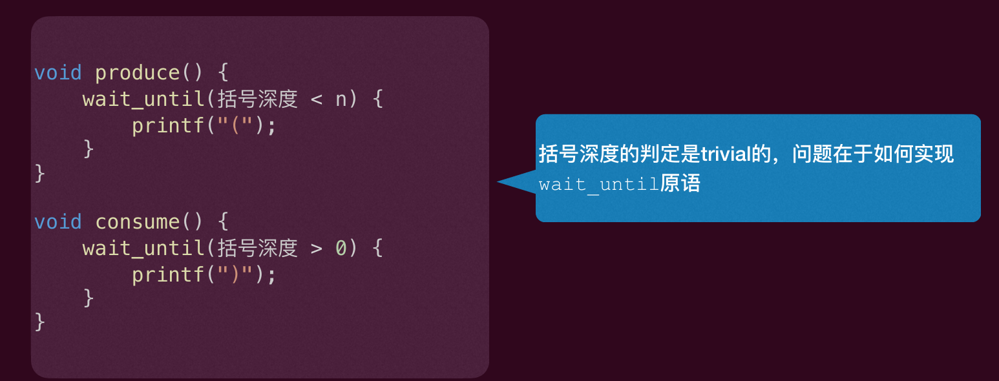
判断括号的深度很简单：每打印一个左括号，深度加1；每打印一个右括号，深度减1
真正难的是如何实现wait_until(condition)这个函数

### 没学过并发编程的尝试
- 生产者直接判断depth < n，为真意味着缓冲区有空间，打印`(`，并标记使用缓冲区的数量增加1，否则什么都不做然后自旋等待
- 消费者直接判断depth > 0,  为真意味着缓冲区有数据，打印`)`，并标记使用缓冲区的数量减少1，否则什么都不做然后自旋等待

这样显然是不对的，因为对共享变量depth的访问没有互斥，可能会出现竞态条件，违背安全性

### 解决尝试1
使用互斥锁保护depth变量
```c
void produce() { 
    while(1) { 
    retry:  
        mutex_lock(&lk); 
        int ready = (depth < n);  
        mutex_unlock(&lk); 
        if (!ready) goto retry; 
        mutex_lock(&lk); 
        printf(“(”); 
        depth++;  
        mutex_unlock(&lk); 
    } 
}
void consume(){ 
    while(1){ 
    retry: 
        mutex_lock(&lk); 
        int ready = (depth > 0); 
        mutex_unlock(&lk); 
        if (!ready) goto retry; 
        mutex_lock(&lk); 
        printf(")"); 
        depth--; 
        mutex_unlock(&lk); 
    } 
}
```
在produce里面，当我算出ready是true的时候，ready不会改了，但是注意第54和55行代码之间，depth可能会被别的线程修改了，所以ready可能不再是true了，导致produce错误地打印了一个`(`

在consume函数里面是一样的逻辑。

### 解决尝试2
之前的问题在于unlock和再次判断可能被打扰，那么我们直接把unlock推迟？
‣ 虽然正确，但是会有性能问题

```c
void produce() {
    while (1) {
    retry:
        mutex_lock(&lk);
        int ready = (depth < n);
        if (!ready) { // 自旋忙等，有性能问题
            mutex_unlock(&lk);
            goto retry;
        }
        printf("("); // printf在锁内，可能比较慢，会导致别的线程无法获得锁，性能问题
        depth++;
        mutex_unlock(&lk);
    }
}

void consume() {
    while (1) {
    retry:
        mutex_lock(&lk);
        int ready = (depth > 0);
        if (!ready) { // 自旋忙等，有性能问题
            mutex_unlock(&lk);
            goto retry;
        }
        printf(")"); // printf在锁内，可能比较慢，会导致别的线程无法获得锁，性能问题
        depth--;
        mutex_unlock(&lk);
    }
}
```

### 解决尝试3
解决这个性能问题的方法我们也已经知晓：利用操作系统的调度进行阻塞(wait)和唤醒(wakeup)
以produce为例
```c
void produce() { 
    while(1) { 
    retry:  
        mutex_lock(&lk); 
        int ready = (depth < n);  
        if (!ready){ 
            mutex_unlock(&lk); 
            wait(&producer_waiting_list); 
            goto retry; 
        } 
        printf(“(”); 
        depth++;  
        wakeup(&consumer_waiting_list); 
        mutex_unlock(&lk); 
    } 
}
```
但是有唤醒丢失的老问题。
- 线程A检查条件不满足，准备等待。
- A先解锁。
- 在A还没进入等待队列前，线程B把条件改成满足，并发出唤醒。
- 由于此时等待队列里还没有A，这次唤醒等于打空。
- A进入等待队列，等待被唤醒，但B已经发出唤醒了，所以A永远等下去。

### 解决尝试4
采用futex解决唤醒丢失问题
```c
int cnd1 = 0;  //类比版本号
int cnd2 = 0;
void produce() { 
    while(1) { 
    retry:  
        mutex_lock(&lk); 
        int ready = (depth < n);  
        if (!ready){ 
            int val = cnd1; // 先记下当前条件的值，再解锁
            mutex_unlock(&lk); 
            futex_wait(&cnd1, val); // 如果在wait之前cnd1的值被consume函数修改，那么wait就会失败，直接返回，不会进入睡眠状态，避免了唤醒丢失问题
            // 只有&cnd1==val时才会进入睡眠状态，是原子的
            goto retry; 
        } 
        printf(“(”); 
        depth++;  
        atomic_add(&cnd2, 1); 
        futex_wake(&cnd2); 
        mutex_unlock(&lk); 
    } 
}
```

### 条件变量
这样，我们就实现了条件变量。
条件变量：用于标记某个用于**同步条件**的变量，其有两个相关的操作
- cond_wait(cond_t *cv, mutex_t *lk)
    - 调用之前调用线程必须先lock(lk)
    - 调用之后原子地阻塞线程和释放锁，必须让出锁
    - 被唤醒时重新acquire the lk

- cond_signal(cond_t *cv)
    - 唤醒一个等在条件变量cv上的一个阻塞线程
    - 如果没有线程阻塞在这个条件变量上，什么也不做

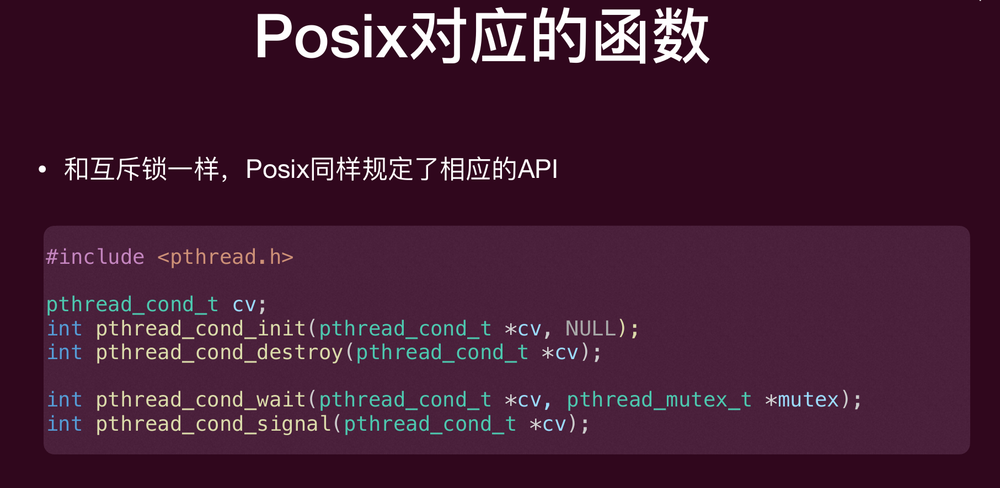
```c
typedef struct condtional_varaible { 
unsigned value; 
}cond_t; // 条件变量的实现可能会比较复杂，这是一个简化的版本
void cond_wait(cond_t *cv, mutex_t *lk) 
{ 
    int val = atomic_load(&cv->value); 
    mutex_unlock(lk); // 先解锁，如果在持有锁的情况下睡眠，会导致死锁，因为其他线程无法获得锁来修改条件变量的值并唤醒这个线程。只有其他线程能够获得锁并修改条件变量的值，才能唤醒这个线程继续执行。
    futex_wait(&cv->value, val); 
    mutex_lock(lk); // 被唤醒时重新acquire the lk，如果不重新acquire the lk，那么这个线程就不会获得锁，这可能会导致竞态条件和数据不一致的问题。
}
void cond_signal(cond_t *cv) 
{ 
    atomic_fetch_add(&cv->value, 1); // 这里存在一个微妙的可能错误（包括之前的解决方案4）：整数会溢出，因此实际实现更加复杂

    futex_wake(&cv->value); 
}
```

### 用条件变量解决生产者-消费者问题
以produce函数为例：（consume函数类似）
```c
cond_t cv_p = COND_INIT();
cond_t cv_c = COND_INIT();
mutex_t lk = MUTEX_INIT();

void produce() {
    while (1) {
        mutex_lock(&lk);// 互斥锁
        if (!(depth < n)) {// 条件: depth < n
            cond_wait(&cv_p, &lk);// 如果条件不满足，等待在cv_p上，并释放锁，wait
        }
        // 条件满足，继续执行
        printf("(");
        depth++;
        cond_signal(&cv_c);// 唤醒一个在cv_c上等待的线程（如果有的话）
        mutex_unlock(&lk);// 解锁
    }
}

```
尽管该实现看上去十分正确，但是存在问题。
考虑如下情况：一个生产者，两个消费者 $C_1$ 和 $C_2$ ，首先消费者 $C_1$ 等待一个空的buffer，然后生产者生产一个数据，调用signal函数唤醒 $C_1$，但此时如果 $C_2$ 抢先一步进入临界区（在C1拿到锁之前先抢到锁），并消费掉了数据后返回，然后 $C_1$ 才被真正唤醒进入临界区，
但此时，临界区已经没有数据可以消费了，错误！

产生的上述问题的原因是由于调用Signal通知某个线程，和那个线程wait被唤醒**不是原子**的，这就是Hansen (or Mesa) 语义
**Hansen语义**：
当一个线程A调用signal函数时，操作系统会选择一个等待在条件变量上的线程B进行唤醒，A不会立即把执行权交给等待线程 B。
B 只是从阻塞态变成“可运行态”，之后还要重新竞争锁，这就可能导致其他线程抢先一步进入临界区，修改了条件变量的状态，从而导致被唤醒的线程B在继续执行时发现条件不满足，出现错误。

与之相对的，Tony Hoare提出了另一种语义，即cond_signal和cond_wait之间是原⼦的，
cond_signal程序将互斥锁转移到被唤醒的程序，并阻塞自己（只有等被唤醒的程序返回或者再次阻塞才会返回该signal线程，当然互斥锁也需要一并转移回它），因此其他线程无法再进⼊临界区
‣ 这保证了被唤醒线程所等待的那个条件是保持的！

### Hansen/Mesa  VS  Hoare
在 **Hoare 语义**下，signal 的那一刻会“立刻把锁和执行权交给被唤醒线程”，这个交接是原子的。
所以被唤醒线程一恢复执行时，它之前等待的条件仍然成立，不会被其他线程趁机改掉。
也就是因为这个原因，在Hoare语义下其实之前的解决方案是正确的，在 Hoare 语义里，被唤醒后通常可以直接往下执行，不需要再次检查条件是否满足了。

因此Hoare语义下很多程序性质非常容易证明，深受program language研究人士欢迎，但不受操作系统业界人士欢迎，因为要实现Hoare语义是复杂的
• 相应的Hansen/Mesa虽然不保证安全性，但是实现简单
• 因此Hansen/Mesa是目前大部分系统的默认实现

### Hansen语义下的正确解决方案
在 Hansen/Mesa 语义下，“被唤醒”不等于“条件仍然成立”，因此我们需要在被唤醒后再次检查条件是否满足，如果不满足就继续等待，这样就避免了之前的错误。
**唤醒后重新尝试**判断条件是否满足

用 if 的问题：
线程**只在进入等待前**检查一次条件。
被 signal 唤醒后，线程会直接往下执行，不再确认条件，因为不是一个循环。
也就是，被signal唤醒之后，线程会从 cond_wait 调用返回之后的下一条语句继续运行
因此如果用while，会回到while循环体的判断条件中再执行一次判断条件是否成立

因此我们只要在判定条件那里使用**while**，而不是if，就可以正确地处理被唤醒后条件不满足的情况了。

```c
void produce() { 
    while(1) { 
    mutex_lock(&lk); 
    while(!(depth < n)){ // 使用while来使得唤醒之后依旧会检查条件是否满足
        cond_wait(&cv_p, &lk); 
    }

    printf("("); 
    depth++;  
    cond_signal(&cv_c); 
    mutex_unlock(&lk); 
    } 
}
void consume() { 
    while(1) { 
        mutex_lock(&lk); 
        while(!(depth > 0)){ 
            cond_wait(&cv_c, &lk); 
        } 
        printf(")"); 
        depth--;  
        cond_signal(&cv_p); 
        mutex_unlock(&lk); 
    } 
}
```

### 一定要用两个条件变量吗？
两个函数用到了两个条件变量，分别是cv_p和cv_c，分别用于生产者和消费者的等待和唤醒
如果我只用一个条件变量cv呢？ 

考虑如下情形：
- 有三个线程：消费者 $C_1$、$C_2$ 和生产者 $P_1$，此时 $C_1$、$C_2$ 首先依次进入临界区，发现数据为空，都阻塞等待
- 然后 $P_1$ 进入临界区，生产一个item之后唤醒一个线程，比如 $C_1$，在 $C_1$ 唤醒之前，$P_1$再次抢先一步进入临界区（hansen语义，抢到了锁），发现没有空间（假设缓冲区为1），阻塞自己
- $C_1$ 此时醒了并进入临界区，消费了这个数据之后，试图唤醒其他线程，但唤醒谁是**没有保障**的（因为都是同一个条件变量）
- 如果唤醒的是 $C_2$，那么 $C_2$ 进入临界区，发现数据为空，阻塞等待，然后 $C_1$ 也尝试进入临界区，阻塞等待, 而 $P_2$ 没有人唤醒它，也处于阻塞等待状态
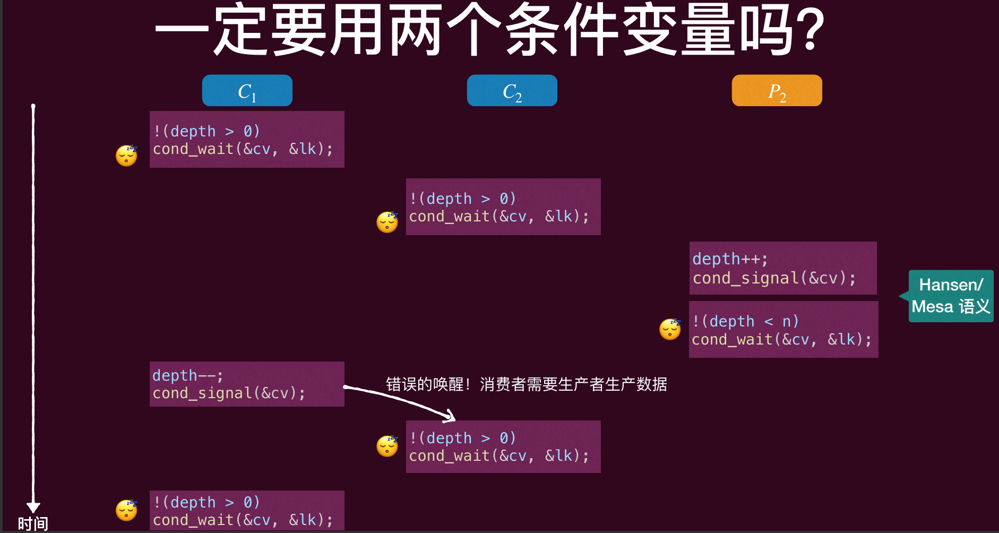

多个条件变量可以解决这个问题，但是设计上较为复杂，而单个条件变量逻辑上又会出错，有没有比较好的办法？

使用 `broadcast`（条件覆盖）来唤醒所有等待的线程，力大砖飞

一次唤醒所有线程即可，那些需要被正确唤醒的自然会醒来做相应的事
情，而那些不该唤醒的，反正需要while循环一次在此判定是否符合条
件，不符合条件就再“睡”即可，因此不会影响正确性

### 条件覆盖（broadcast）解决生产者消费者问题
```c
void produce() { 
    while(1) { 
        mutex_lock(&lk); 
        while(!(depth < n)){ 
            cond_wait(&cv, &lk); 
        } 
        printf("("); 
        depth++;  
        cond_broadcast(&cv); 
        mutex_unlock(&lk); 
    } 
}
```
但是性能上会有问题

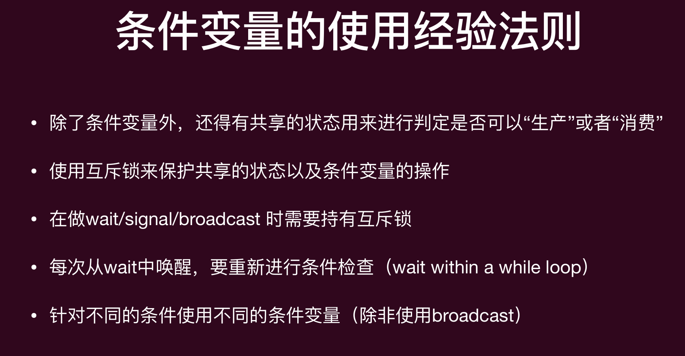

## 条件变量的应用

### 找到计算中的依赖关系
wait和signal的并发原语是非常强大的，只要你找到程序算法中的**计算依赖图**，你就可以利用wait和signal来将算法进行并行化！

把一个程序里的“步骤/操作”当作点，把“必须先做 A 才能做 B”的关系当作有向边，画出来的图。
对计算图$G=(V, E)$，V是计算步骤的集合，E是依赖关系的集合。
$(u,v)\in E$ 表示必须先完成u才能完成v，即v需要用到u的计算结果，只能串行执行

v节点能进行计算的wait里面的条件：对于所有$(u,v)\in E$，u节点的计算已经完成了
u节点计算完成后，signal所有$(u,v)\in E$的v节点，或者更简单的用broadcast唤醒所有节点，让它们自己判断是否满足上面的wait条件
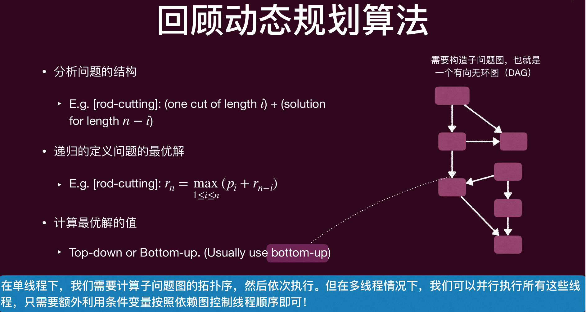
动态规划问题就可以转化成一个子问题的DAG，每个子问题是一个节点，子问题之间的依赖关系是有向边。我们可以利用条件变量来实现动态规划的并行化。
在单线程下，我们需要计算子问题图的拓扑序，然后依次执行。但在多线程情况下，我们可以**并行执行**所有这些线程，只需要额外利用**条件变量**按照依赖图控制线程顺序即可

一个比较通用的并发算法设计框架
• （生产者）可以把调度的事情全部分给一个线程，而不是一次性把所有线程都直接放进内存，这个调度线程维护一个计算图，每次都会根据当前已经做完的计算机点，和依赖关系，调度可以运行的线程，把他们放进ready列表准备运⾏（这就是线程池）
• （消费者）被调度的运行的线程就执行计算，计算结束后通知调度线程，告知条件可能发生变化，可以重新计算下一批就可以计算的线程


## 信号量Semaphore
条件变量是无记忆的，signal不会累计，因此需要程序员手动进行额外的条件判定
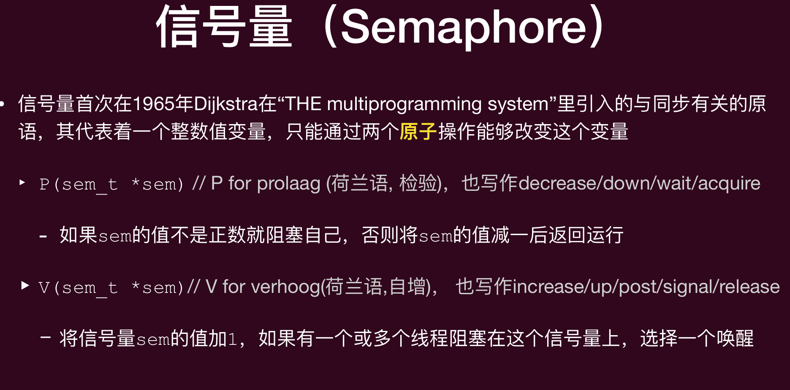
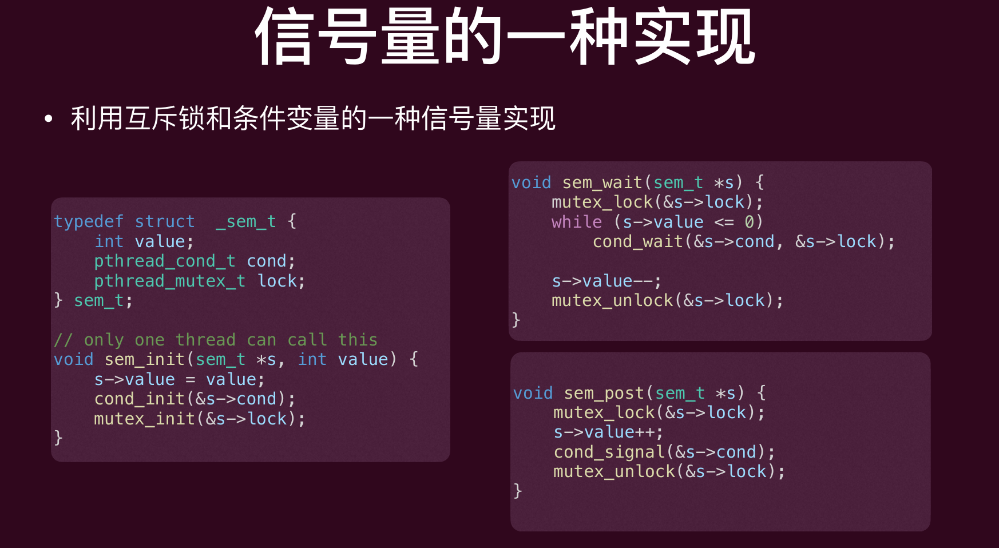
如果没有线程在等，sem_post 仍然会把 value 加一，这个唤醒的信号会被记下来，尽管可能没有线程真正醒来。
以后线程调用 sem_wait 会直接通过并 value--。
对比条件变量本身：signal 没人等就丢了，不会累计。
这里靠 value 把历史 post 记住了。

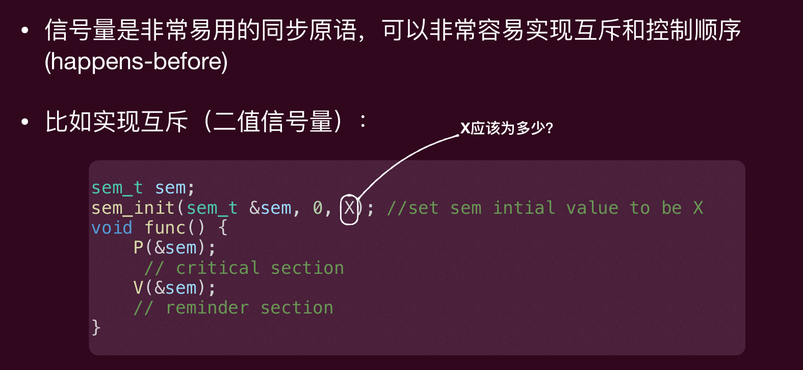
X应该是1，初始值必须要有1个许可，第一个进入的线程就可以直接执行，不用wait

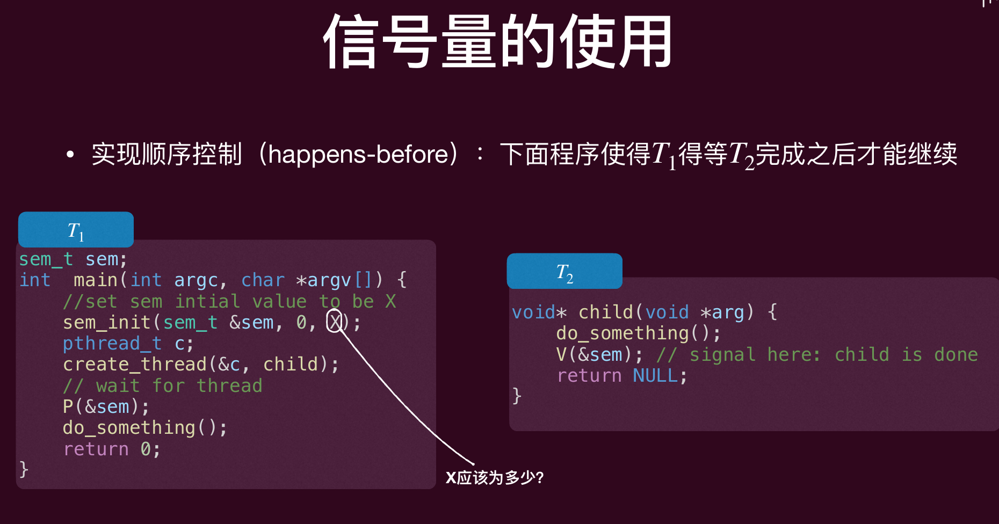
X应该是0，因为在T1里面init这个信号量，要让T2先执行，所以先不给T1许可

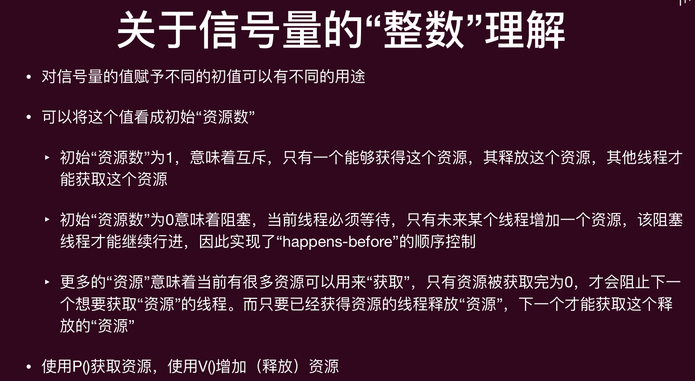
也就是理解成许可数

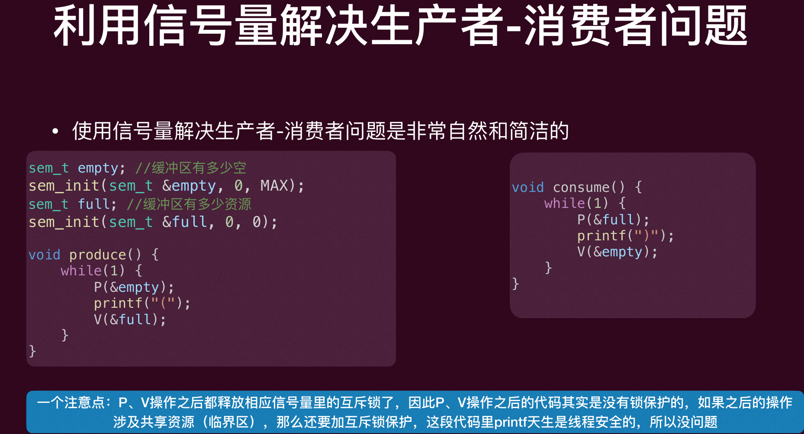
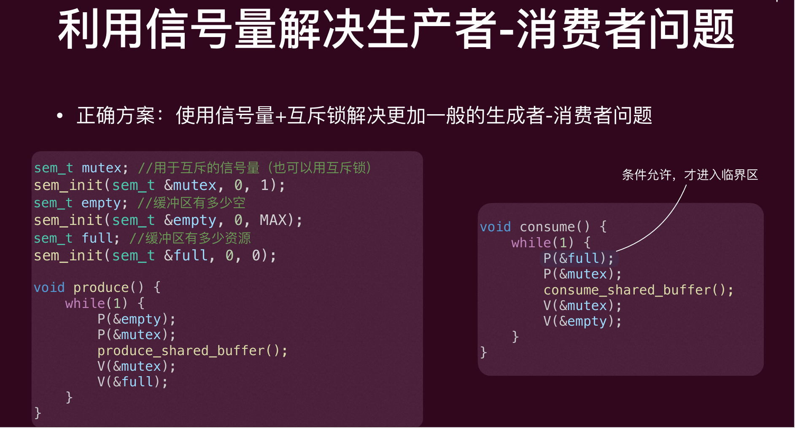