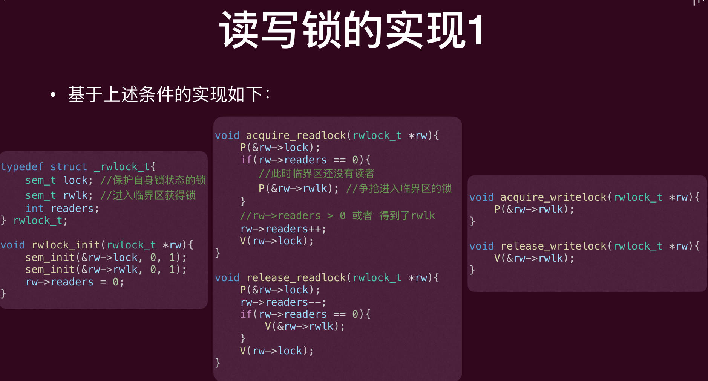
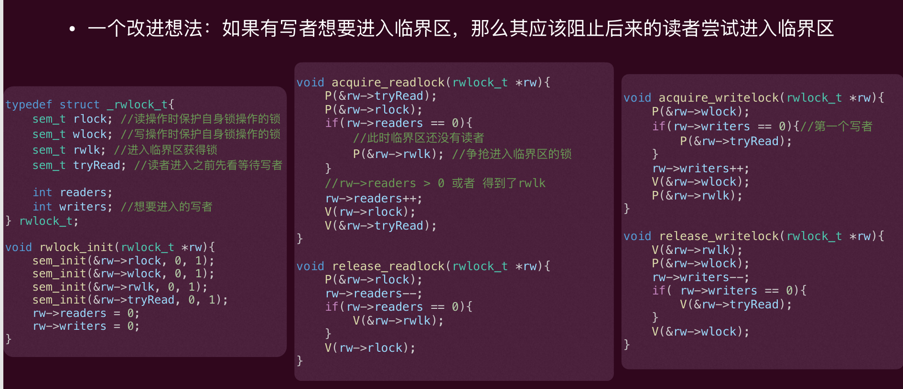
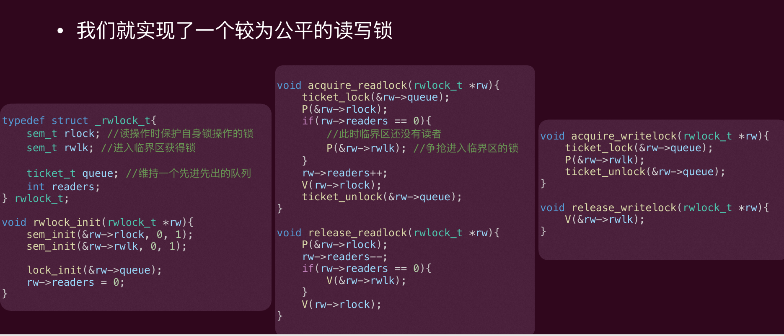

# Lec7: 同步：进阶
## 读者-写者(Readers–writers)问题
多个线程想要读取某个数据，有一个或多个线程需要写某个数据
与之前简单的将所有线程全部互斥不同，读者-写者问题会对读者的同步放宽要求（因为“读”操作不会改变共享数据）
‣ 任何数量的读者都可以同时进行“读”操作（读-读不需要互斥）
‣ 但一次只能有一个写者进行“写”操作 （写-写互斥）
‣ 一旦有写者在写，读者必须等待，不能同时读（写-读互斥）

当然对所有线程进行互斥是最简单的解决方案，但效率很低，因为读者直接无需互斥

为此，我们需要实现一个新的锁———“读写锁”（readers/writers lock）来保护共享数据
‣ 其可以允许多个“读者”同时访问共享数据，只要他们中没有人修改该数据
‣ 一次只能有一个“写者”可以持有读写锁进入临界区，因此可以安全的读和写数据

### 读写锁的实现1
读者-写者的问题本质上就是分别给出当前读者和写者是否可以进入临界区的条件
‣ 对于读者而言，如果临界区为空或者临界区有其他读者，那么就可进入
‣ 对于写者而言，只有临界区为空才可进入
因此要实现上述条件，需要记录当前临界区的**读者数量**

lock保护readers这个计数器的访问，确保其正确性
rwlk控制进入临界区的权限
在acquire_readlock里面，如果readers=0，说明这是第一个读者，那么就抢占rwlk，进入临界区，阻止写者；如果readers>0，说明已经有读者在临界区了，那么就readers++，释放lock，允许其他读者修改readers计数器
在release_readlock里面，先给readers上锁，然后readers--，如果readers=0，说明这是最后一个读者，那么就释放rwlk，允许写者进入；如果readers>0，说明还有其他读者在临界区了，那么释放lock，允许其他读者修改readers计数器

这个实现有一个重大问题是：写者可能会被**饿死**（starvation）
只有最后一个读者离开临界区时，写者才有机会进入，如果读者源源不断地到来，那么写者就永远无法进入临界区
这个实现也被称为**读者优先**(Reader Preference), 显然对写不友好

### 读写锁的实现2
一个改进想法：如果有写者想要进入临界区，那么其应该阻止后来的读者尝试进入临界区

上述实现中，如果一直有写者想要进入临界区，那么读者就会进入不了临界区，从而饿死(starvation)
只有等只有最后一个写者退出临界区，其才会释放tryRead，后续读者才能进入临界区
这个实现也被称为**写者优先**(Writer Preference), 显然对读不友好

### 读写锁的实现3
应该给线程排队！排在前面的优先尝试进入临界区
‣ 如何排队？可以使用一个**ticket lock**来实现排队机制

用这个票号来实现一个queue，保证线程按照到达的顺序进入临界区
这个ticketlock在acquire的时候给线程发一个ticket（ticket值每次递增），线程需要等到自己的ticket被服务了才可以进入临界区，否则自旋等待
在release的时候，ticketlock会将当前服务的turn值递增，服务下一个ticket

## 哲学家就餐问题
五位哲学家围坐在一张**圆形餐桌**旁，做以下两件事情之一：吃饭或者思考。
• 每位哲学家之间各有一只筷子。哲学家必须**同时得到左右手**的筷子才能吃东西。
• 哲学家们怎么办才能比较合理的吃到饭？不会死锁、没有饿死、并发度高？

### 解决方案1（错误方案）
每个哲学家都先拿起自己左边的筷子，然后再拿起右边的筷子，然后吃！
死锁了，所有人都在等待右边的筷子，永远无法吃到饭
```c
#define N 5 
sem_t forks[N]; 
int left(int i){ return i;} 
int right(int i){ return (i+1)%N;} 
void philosopher(int i){ 
while(1){ 
    think(); 
    P(forks[left(i)]);// Pick up left fork 
    P(forks[right(i)]);//Pick up right fork; 
    eat(); 
    V(forks[left(i)]);// Put down left fork 
    V(forks[right(i)]);//Put down right fork; 
  } 
}
```

### 解决方案2
问题在于自己拿不到筷子还不断持有筷子，尝试拿不到时放下筷子
```c
int tryP(sem_t *s) {
  // sem_wait的非阻塞版本, 如果返回0，说明正常等到条件
  // 否则不会阻塞，而是返回-1
  return sem_trywait(s);
}

void philosopher(int i) {
  while (1) {
    think();
    while (1) {
      P(forks[left(i)]); // Pick up left fork
      int ret = tryP(forks[right(i)]); // Try to pick up right fork
      if (ret != 0) { // 说明没有拿到右边的筷子
        V(forks[left(i)]); // Put down left fork
        sleep(sometime);
      } else {
        break;
      }
    }
    eat();
    V(forks[left(i)]); // Put down left fork
    V(forks[right(i)]); // Put down right fork
  }
}
```
但是有可能运气不好，所有人都拿到左边的筷子了，尝试拿右边的筷子都失败了，然后都放下左边的筷子了，进入死循环了

死锁(Deadlock)和饿死(starvation)都关乎活性(liveness) — 死锁和饿死并没有违背安全性
饿死即为一个线程在**有限时间内无法行进**
死锁是一类特殊的“饿死”，其达成的条件是多个线程形成一个**等待环**，一个线程的行进需要环内的另外一个线程做某个动作：显然环状意味着这个等待条件永远无法发生

方案2的改进：每个线程睡眠的**时间随机**
```c
void philosopher(int i) {
  while (1) {
    think();
    while (1) {
      P(forks[left(i)]); // Pick up left fork
      int ret = tryP(forks[right(i)]); // Try to pick up right fork
      if (ret != 0) {
        V(forks[left(i)]); // Put down left fork
        sleep(randomtime);
      } else {
        break;
      }
    }
    eat();
    V(forks[left(i)]); // Put down left fork
    V(forks[right(i)]); // Put down right fork
  }
}
```
已经可以说解决问题了！但是在某些特别安全攸关的场景可能不那么可靠

### 解决方案3
哲学家拿起筷子就已经发生数据竞争了，不如一开始就上锁！
```c
ticket_t turn;
lock_init(&turn);

void philosopher(int i) {
    while (1) {
        think();
        ticket_lock(&turn);
        P(forks[left(i)]); // Pick up left fork
        P(forks[right(i)]); // Pick up right fork
        eat();
        V(forks[left(i)]); // Put down left fork
        V(forks[right(i)]); // Put down right fork
        ticket_unlock(&turn);
    }
}
```
但是一次只有一个哲学家能吃饭了，效率太低了，并发度不够高

改进：每次就一个人并发度不够，每次5个人会死锁，那么每次 5 - 1个人？根据鸽巢原理，一定会有一个人拿到两个筷子，那么就不可能出现死锁了
```c
#define N 5
sem_t capacity = N - 1;

void philosopher(int i) {
    while (1) {
        think();
        P(capacity);
        P(forks[left(i)]); // Pick up left fork
        P(forks[right(i)]); // Pick up right fork
        eat();
        V(forks[left(i)]); // Put down left fork
        V(forks[right(i)]); // Put down right fork
        V(capacity);
    }
}
```

### 解决方案4
更加简单的方案（无需额外互斥锁）：给筷子编号！总是先拿编号小的
```c
void philosopher(int i){ 
    while(1){ 
    think(); 
    if (left(i) < right(i)){  
        P(forks[left(i)]);// Pick up left fork 
        P(forks[right(i)]);//Pick up right fork; 
    } 
    else{ 
        P(forks[right(i)]);// Pick up right fork 
        P(forks[left(i)]);//Pick up left fork; 
    } 
    eat(); 
    V(forks[left(i)]);// Put down left fork 
    V(forks[right(i)]);//Put down right fork; 
    } // 筷子的编号对应着哲学家编号i
}
```