# Lec8: Concurrency Problems
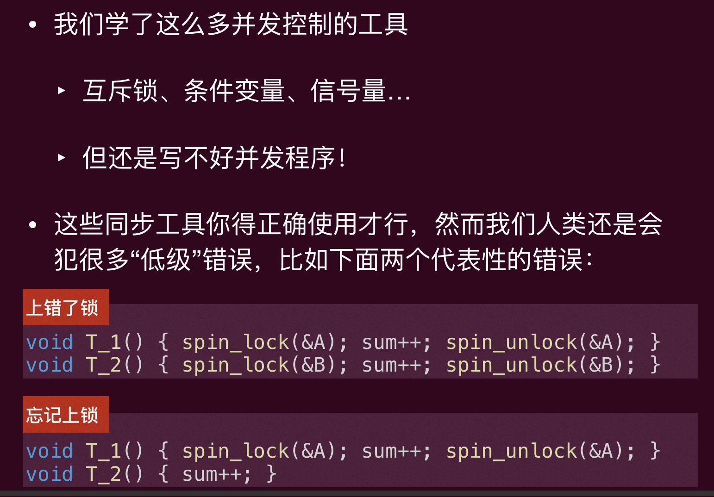
这里用了A和B两把锁，对同一个共享变量sum进行++，这样是不能互斥的，临界区没有被同一个锁保护。
```c
void T_1() { spin_lock(&L); sum++; spin_unlock(&L); }
void T_2() { spin_lock(&L); sum++; spin_unlock(&L); }
```
这样是对的。

## 原子性和顺序性bug
除了死锁之外，我们犯的大部分并发错误都可归类为如下两种：
- 原子性违背(Atomicity Violation, AV)，比如忘记上锁
- 顺序性违背(Order Violation, OV)，比如忘记同步，或者同步条件写错

### 原子性bug
“ABA”：代码被别人 “强势插入”
有时即使你意识到了需要上锁，并且也加锁了，也会犯错
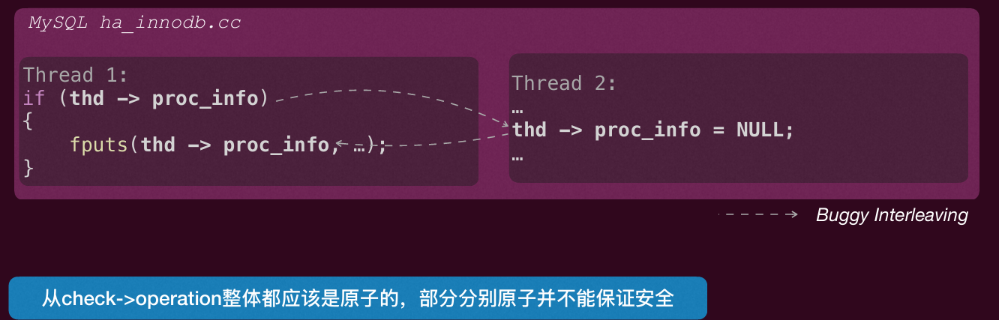
ABA问题：线程 A 读到共享变量是 A（状态 A），准备执行；线程 B 在中间把它改成 B，结果线程 A 再检查时还是看到 A，就误以为“没变过”，从而做出错误判断。
比如这个图片里面，线程1要先check，在check之后，线程2把值改成了null从而导致条件不成立，但是线程1以为仍然成立，继续执行，结果就出问题了。

也就是说线程1check了之后到operation之间并不是原子的，这段代码就有原子性违背的bug。

### 顺序性bug
“BA”: 事件未按预定的顺序发生
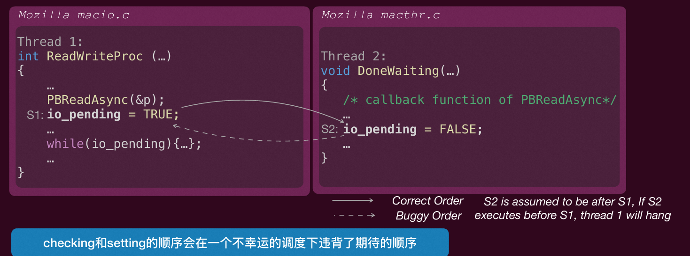
线程2改变了io_pending从而导致while循环无法退出

## 死锁
在并发计算中，死锁是指某个小组中的成员因为每个成员都在等待另一个成员
（包括自己）采取行动，如发送消息或释放锁，因此无法继续执行的状态。

### Self-deadlock（A-A型死锁）
一个线程在已经持有一把锁的情况下再次尝试获得这把锁
```c
void foo(){ 
lock(); 
foo(); 
unlock();  
} 
foo();
```
解决方案：xv6防御性编程
在内核里对锁的使用做运行时检查，一旦发现同一线程/CPU重复获取同一把锁这种自死锁情况，就立刻触发 panic 或报错中止，而不是让系统卡死
```c
// Acquire the lock. 
void acquire(struct spinlock *lk){ 
    ... 
    if(holding(lk)) 
    panic(“acquire”); // 锁已经被当前线程持有，触发 panic，终止运行并且报告错误
    ...
}
```

### 更一般的死锁
一个涉及多个线程以及多个锁的情形，每个线程都在等待其他线程所持有的锁，从而没有一个可以行进

典型案例是ABBA型死锁
线程1拿到了锁A，需要锁B，线程2拿到了锁B，需要锁A，这时两个线程都无法行进
比如哲学家就餐问题的第一个版本就有这个问题

条件变量和锁的使用也会产生死锁 —> 等待某个条件变量看成是等待某个资源，而释放的那个线程看成是持有某个资源
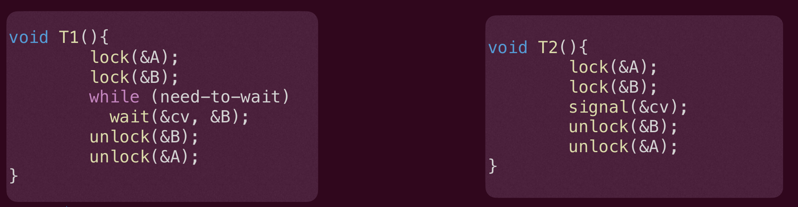
比如这个图里面，T1唤醒T2的时候，T1还持有锁A，T2被唤醒后需要获取锁A才能继续执行，但此时锁L被T1持有，所以T2无法继续执行，而T1又在等待T2的某个条件变量，这就形成了死锁。
修改后，T1在唤醒T2之前先释放锁A，这样T2就可以获取锁A继续执行了。
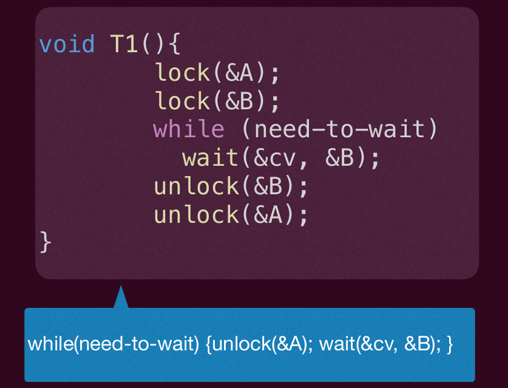

### 死锁产生的必要条件
四个必要条件
- Mutual Exclusion（互斥条件）：所需要的资源是互斥的，即同一时间只能被一个线程占用
- Hold and Wait（占有并等待条件）：线程已经持有至少一个资源，并等待获取其他资源
- No Preemption（不可剥夺条件）：资源不能被强制剥夺，只能等待释放
- Circular Wait（循环等待条件）：形成一个循环等待的环

注意这是必要条件，达成条件也不一定就一定死锁
环之外的线程可以释放资源解开这个环等待状态

### 处理死锁

#### 忽略死锁问题
在问题的发生频率很低且发生后代价很小（重启大法）的时候，直接忽略死锁问题

#### 死锁避免
破坏四个必要条件之一，就可以避免死锁

##### 互斥破坏
不是很容易，互斥是并发能够保证安全性的重要机制
但是也可以用一些无锁算法
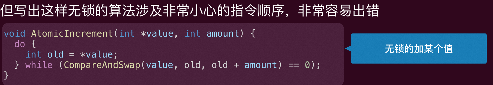

##### 持有并等待的破坏
1.要么能一次得到所有锁，要么什么锁也不获取
这样不现实，因为这需要线程提前就知道需要哪些锁，如果是后面系统根据需要才新建⼀些锁，那么其难以提前获知
此外，这也减少了一些并发度，因为如果程序在运行中的很长时间其实不太需要某些锁（只有在中间某段很短的时间内才需要某个锁），那么一开始就持有这把锁会限制其他线程得到这把锁并运行

2.如果此刻无法获得想要的锁，就释放其所有持有的锁
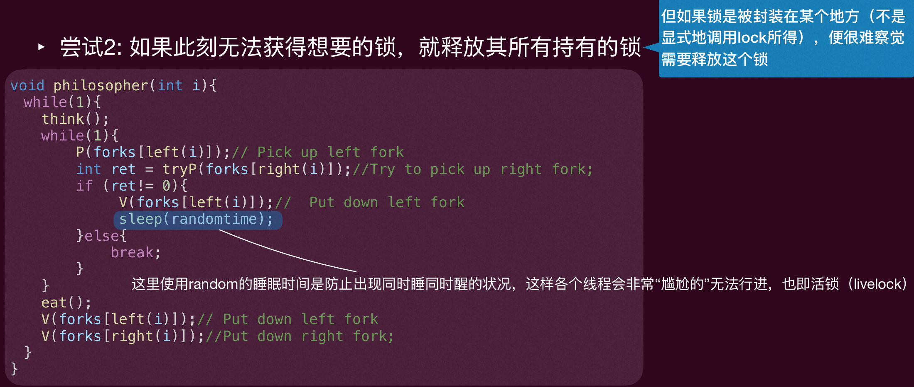

##### 非抢占性的破坏
允许系统直接去“抢”别的线程所持有的资源
- 比如说一个线程需要更多的内存，但此时没有更多free的内存了，那么它可以去“抢”别的的线程的内存：将别的线程先暂时移出内存到磁盘上，然后再去得到这些内存
- 比如CPU的使用也是可以被抢占（利用context-switch机制）
问题是不是每种资源都可以直接“抢”的
- 比如打印机资源，如过一个打印机正在打印，那么现在直接去抢？
- 一个合理的“抢”需要被抢走资源的线程能够恢复到被抢前的状态

##### 环形等待条件破坏
强制在锁在申请时按照规定的顺序来（Lock ordering）
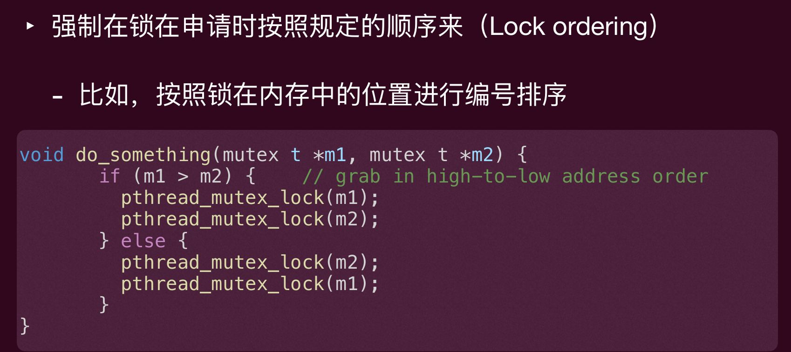
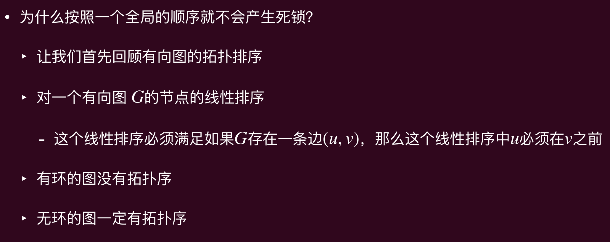
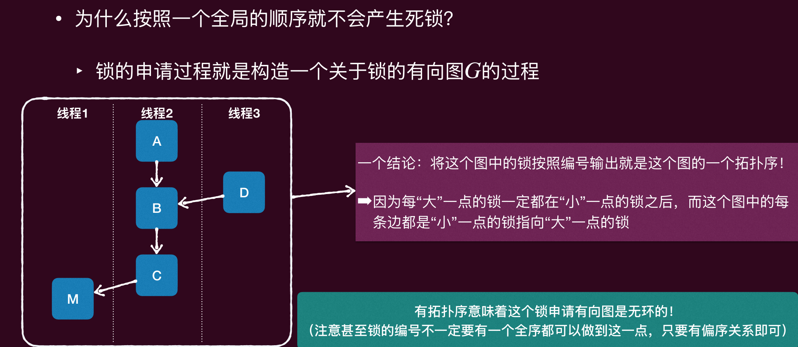
锁顺序（lock ordering）有局限
书上说“所有锁按固定顺序获取就不会死锁”，但在真实大型系统里锁很多（上千个），新增一把锁时很难判断它在整个锁层次里该排在哪个位置，规则难以维护、难以扩展，所以“理论上对，工程上不一定好用”。

更好的方式是**把锁封装起来**
理想做法是：锁不要暴露给外部（不写在头文件里），也不要在持锁时调用外部复杂函数；这样锁只在本文件/模块内部使用，不会和其他锁交叉，自然就不容易死锁。使用这个模块的人甚至不知道内部用了锁。

#### 避免陷入不可挽回状态
什么是不可挽回事件？
有两个线程A和B，每个线程都需要用到需要如下的两个互斥的资源：打
印机和绘图仪

- 线程A从指令 I1 到 I3 之间需要打印机, 从指令 I5 到 I7 之间需要绘图仪

- 线程B从指令 I2 到 I4 之间需要绘图仪, 从指令 I6 到 I8 之间需要打印机
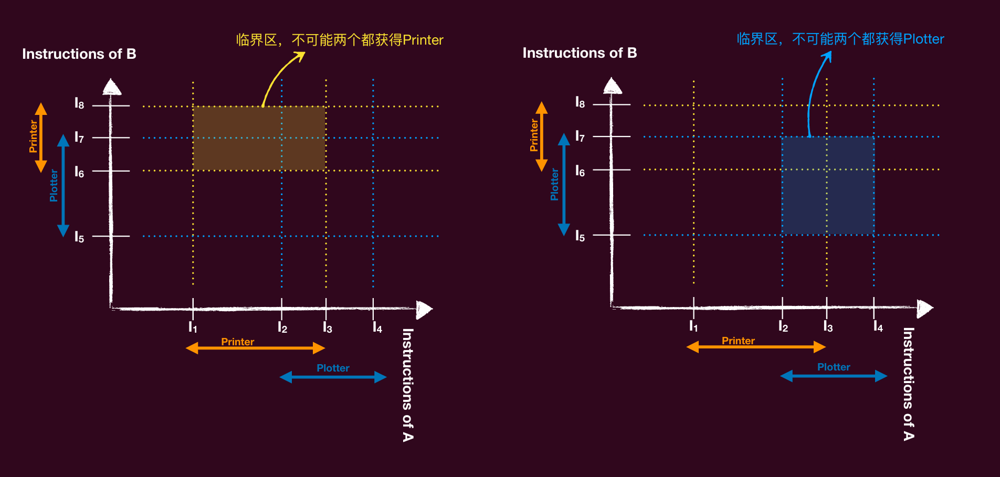
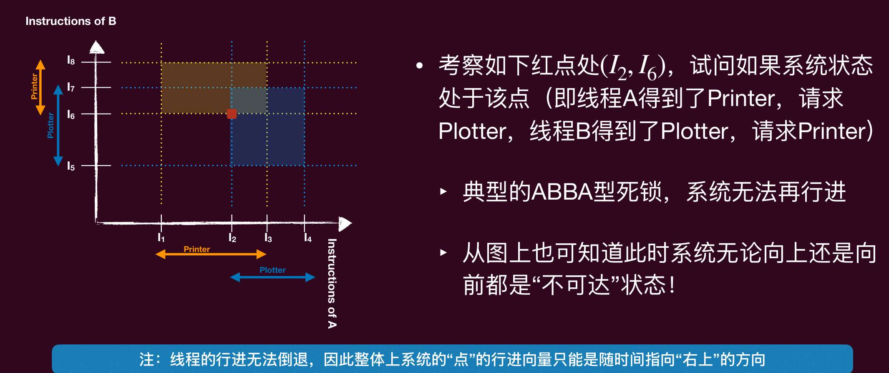
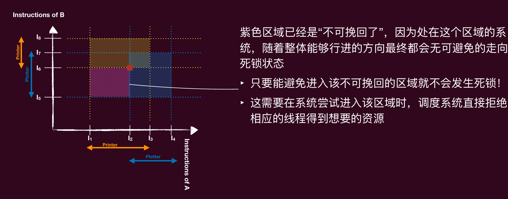
如果要按照上述的情形来给出不可挽回区域，你必须提前知道每个线程在未来哪段指令间需要什么锁或其他互斥资源
这**显然是不现实**的

我们将条件稍稍放宽，假设我们能够知道每个线程在其整个执行期间（而不是具体到哪个指令段）需要哪些互斥资源
更一般地，假设资源数不只为1（信号量），我们假设能够知道每个线程在其执行期间需要哪些互斥资源的**最大数量**，即每个线程有一个最大需求向量 $M_i$，因为可能有多种资源类型所以是一个向量
所有线程的最大需求向量形成一个最大需求矩阵$M$

此外，相应地，我们也可以刻画当前系统状态的互斥资源的线程持有状态。每个线程有一个**当前持有资源** $C_i$，所有线程的当前持有资源为矩阵 $C$。也就是已经被占用的资源

系统初始每个资源数向量 E

系统的行进伴随着线程对互斥资源的申请和释放，释放资源是平凡的事件，因为释放资源不会让系统进入不可挽回状态，但**申请资源会**
每个线程有一个当前资源**申请**向量 $R_i$，所有线程的当前申请资源为矩阵 $R$

#### 银行家算法
什么样的资源申请矩阵会导致系统进入“不可挽回”的状态呢
- 如果接受了这个申请，导致无法满足未来的“最大”申请，即不可挽回
- 即目前虽然没有死锁，可以满足，但既定的未来不可满足
- 这个“不可挽回”状态也有人称为“不安全”状态
正确的决策（银行家算法）：如果当前申请矩阵会导致系统进入“不可挽回”状态，拒绝，否则接受申请，更新系统状态

银行家算法的关键：判断未来是否可以满足所有线程的最大需求
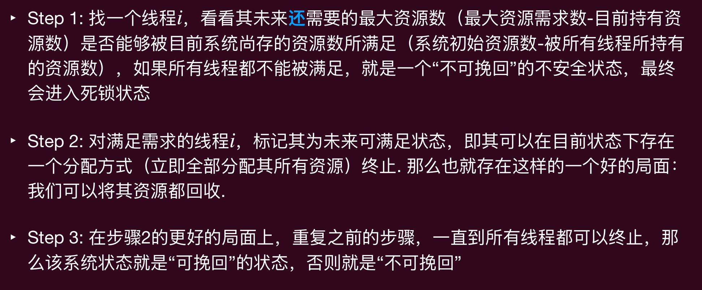

**银行家算法的问题样例1**
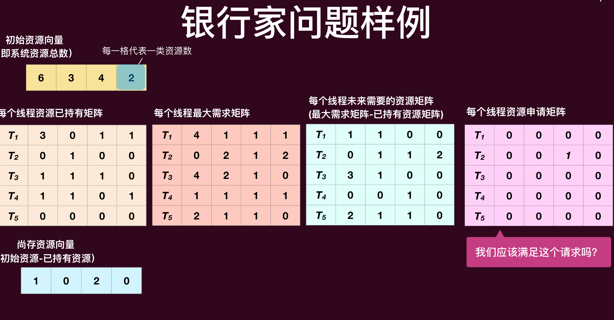
现在T2先申请一个第三个资源，**假定**我们同意这个申请
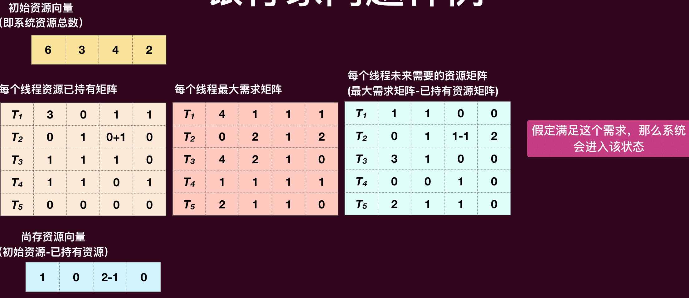
现在变成了一个新状态，在这个新的状态下，逐个检查线程剩余需求是否能够满足（先找到一个就行）

然后我们找到T4是可以满足的，于是释放他的资源，然后回收
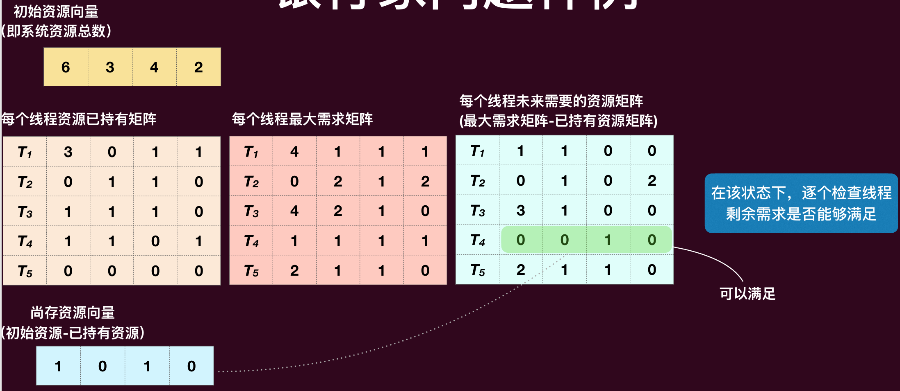
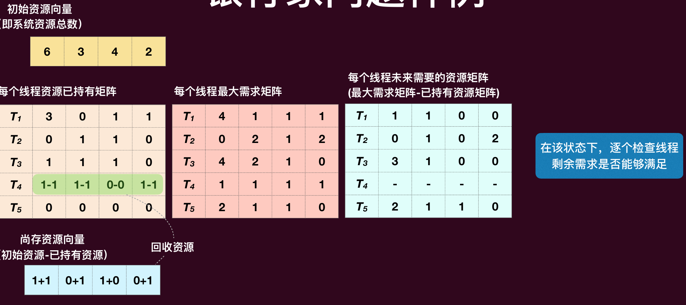
然后重复寻找满足的线程、释放等等过程
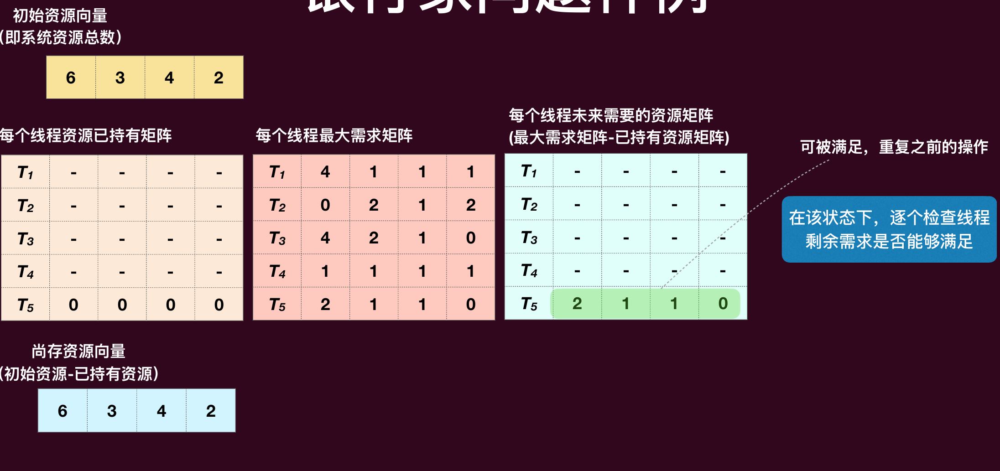
一直到最后一个线程，也能够被满足
因此接受该资源申请后，存在一个方案使得所有线程都满足未来申请需求，因此该申请可以被接受！

**银行家算法的问题样例2**
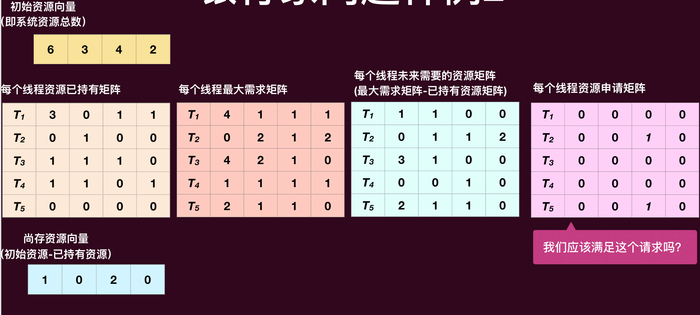
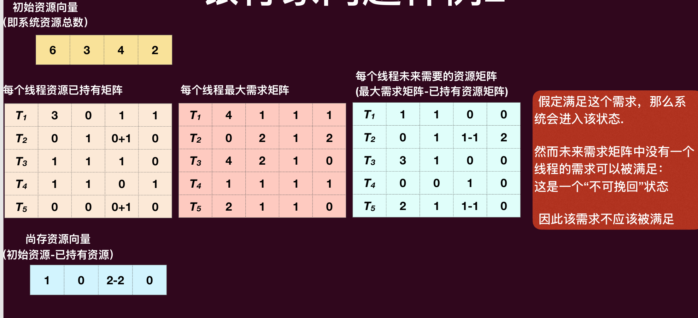

银行家算法是不实用的。一方面我们一般没法知道“最大”需求矩阵，另一方面系统的资源是动态变化的，线程数和资源数会变化

#### 死锁检测并处理
让死锁发生吧！然后再去检测和处理
死锁是由于多个线程形成一个等待环，一个线程的行进需要环内的另外一个线程所持有的锁，从而所有线程都无法行进
因此，核心就是检测**锁申请环**！

##### 死锁的动态侦测
如何检测环？
- 锁的持有和申请就是一个**有向图**
- 有向图的环检测：深度优先算法，出现**回边**就是出现了环
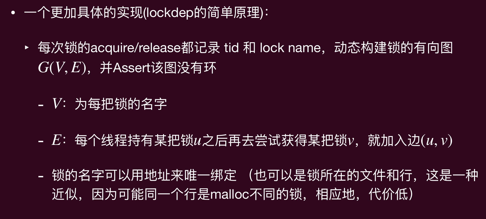
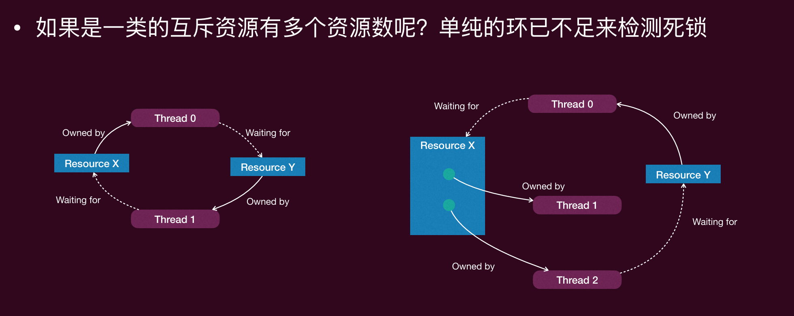
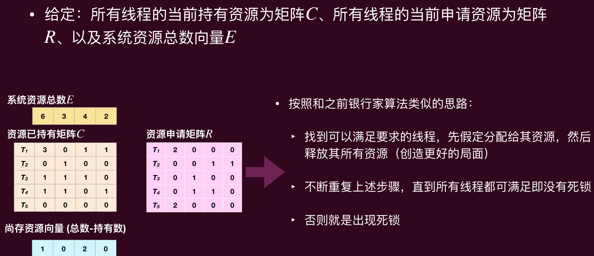

## 并发bugs的一些动态分析方法
### 动态分析
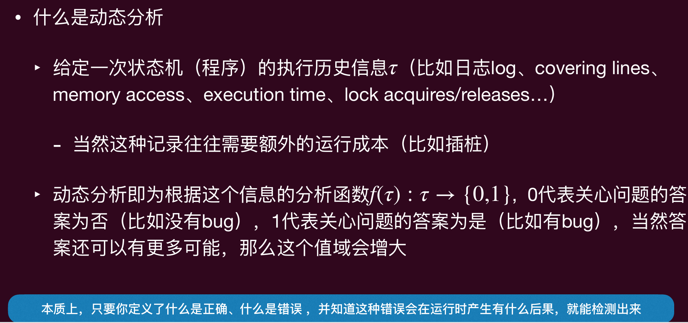
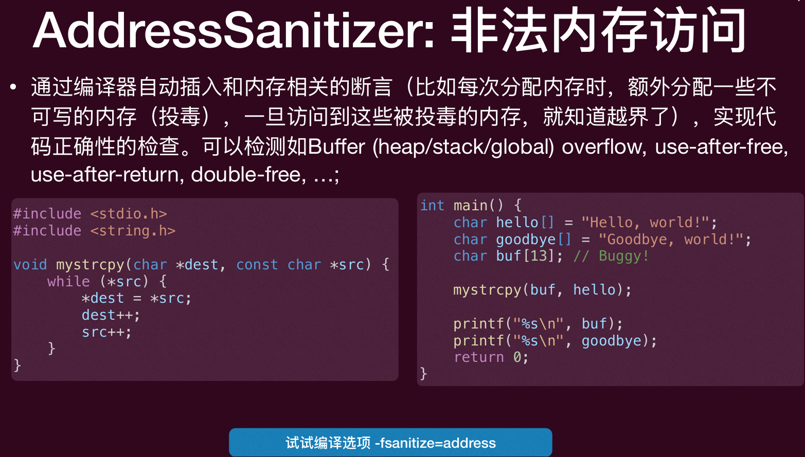

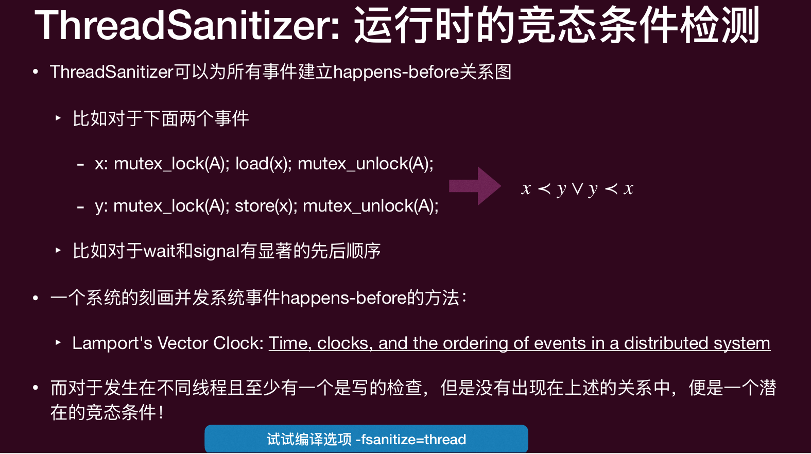
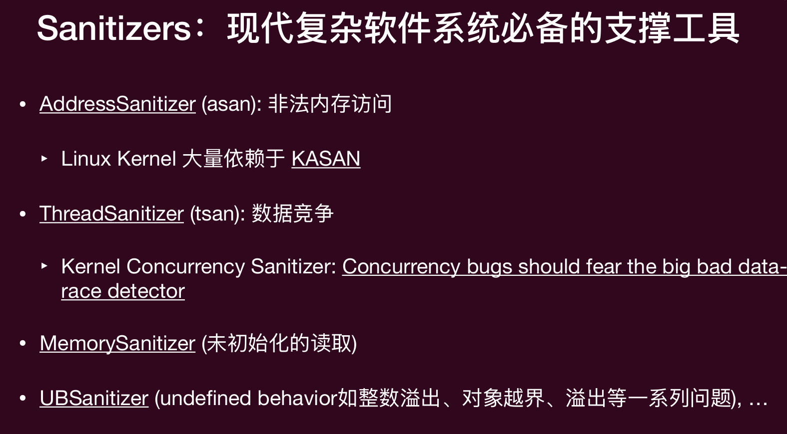
