# Lec9: Process Management
## 进程
拥有独立地址空间的运行实体， 可以包含一个或多个线程
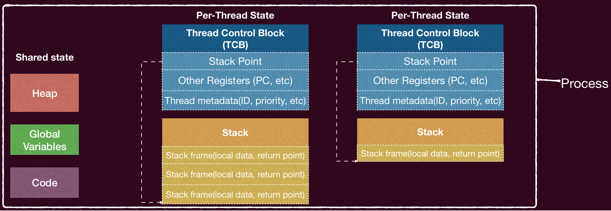
与线程的线程控制块（Thread Control Block, TCB）一样，进程也需要一些元信息，用来描述（抽象）进程，方便操作系统管理，即进程控制块（Process Control Block）PCB
PCB、TCB都存储在内核空间，由内核维护
Linux系统的实现中并不刻意区分进程和线程，而是将其统一存储在被称作task_struct的数据结构中。当两个task_struct**共享同一个地址空间**时，它们就是同一个进程的两个线程。
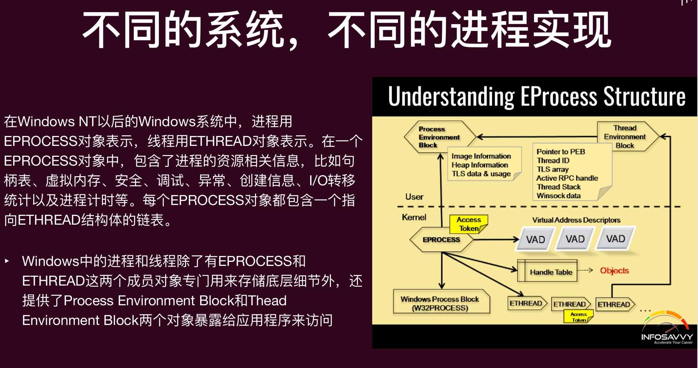

### 进程树
一个进程是被某个进程所创建的，一个进程也可以创建多个进程
- 因此操作系统的进程可以构成一个进程树（Process Tree），其中父进程节点指向其所创建的子进程
- linux下可以通过命令pstree得到当前进程树
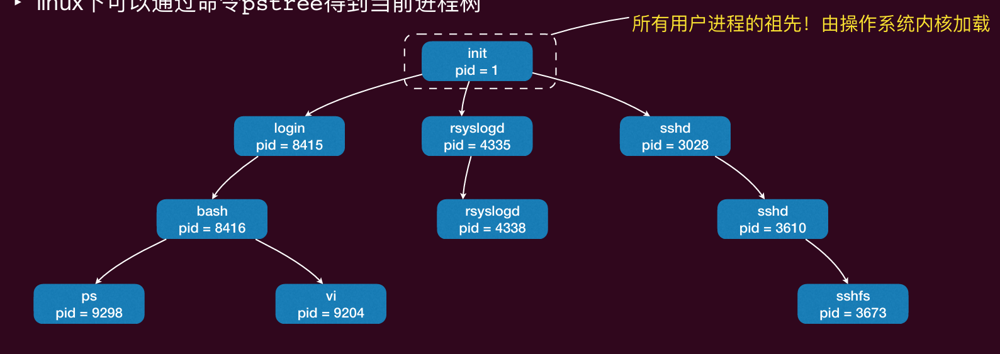
第一个进程init
CPU reset → Firmware代码执行 → 加载操作系统并初始化 → 加载第一个进程

init进程加载完之后，操作系统已经完成了所需要资源的管理，并“躺”在后台等待用户命令（syscall）或者中断的发生，来调度进程的执行

### 进程的生命周期
进程创建之后就开始了其运行，直到终止，其生命周期可以描述为如下几个状态(和线程类似)
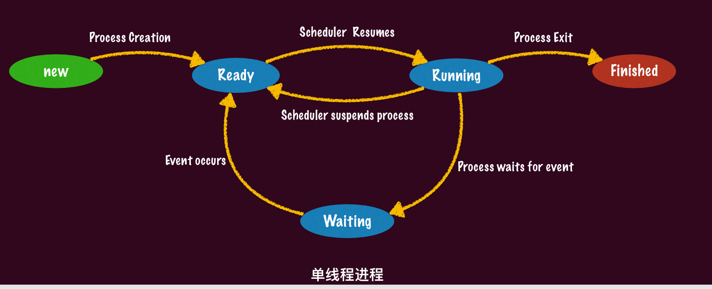
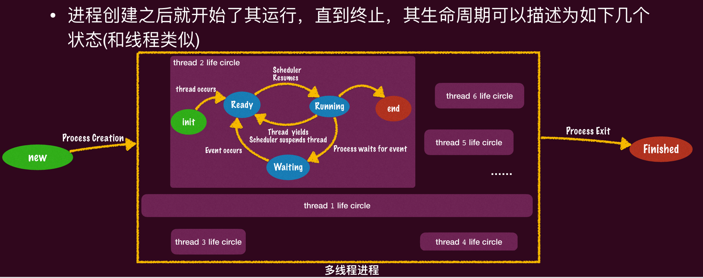
终止之后的进程的“资源”会被操作系统回收，并通知其父进程其终止状态
为什么要通知？
- 父进程PCB中有指针指向子进程PCB，如果终止之后PCB被回收，指针就指向一个已经被释放的内存
- 已终止但其PCB信息还没被回收的进程被称为“僵尸进程”
- 父进程调用wait系统调用会得到子进程的退出通知（子进程退出前会阻塞父进程）和其退出状态，同时移除该子进程的PCB

但并不是每个父进程都老老实实的wait子进程的，其完全可能在子进程终止前就终止了：这时的子进程是没有父进程的！
‣ 该状态下（没有父进程）的进程被称为“孤儿进程”（Orphan Process）
‣ linux会让init进程重新接管这些孤儿进程，从而能够在这些孤儿进程终止时回收PCB资源

## 进程最重要的三个系统调用
### fork
创建一个新的（子）进程
‣ 通过做一份当前进程完整的复制 (内存、寄存器现场)
‣ 子进程和父进程会各自独立地继续执行fork之后的指令
如何区分父子进程？
‣ fork的返回值不同: 子进程返回 0,  父进程返回子进程的process ID, 
‣ fork出错返回-1，errno 会返回错误原因 (man fork)
```c
#include <unistd.h>
pid_t fork(void);
```
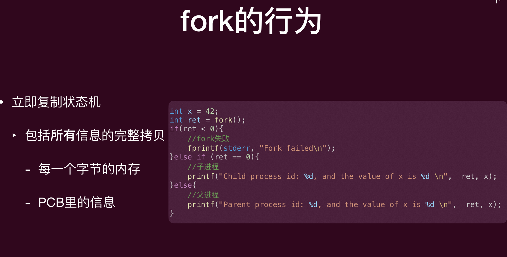
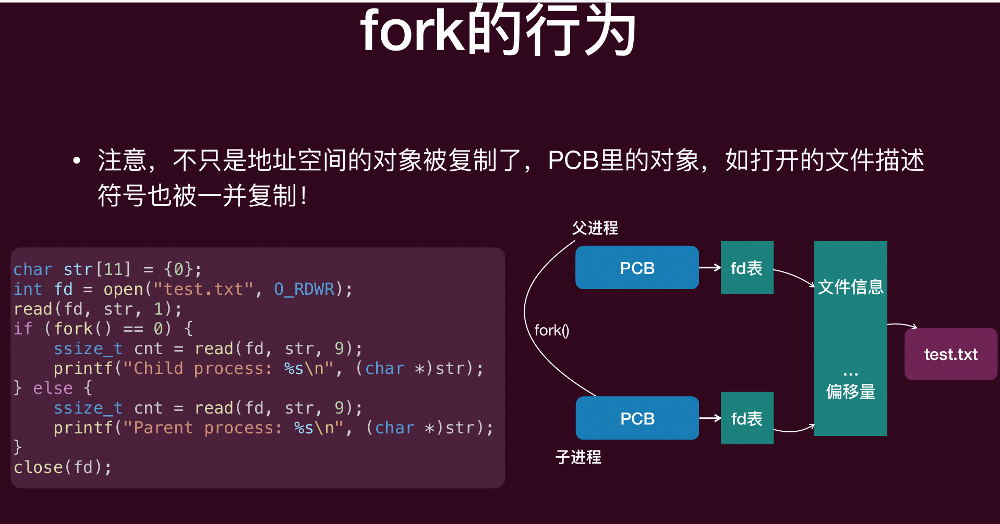
文件描述符是一个指向操作系统内部对象的指针，比如PCB/TCB、文件对象、socket对象等
对象只能通过操作系统允许的方式访问
‣ 从 0 开始编号 (0, 1, 2 分别是 stdin, stdout, stderr)
‣ 可以通过 open 取得；close 释放； dup 复制；
‣ 对于数据文件，文件描述符会 “记住” 上次访问文件的位置
需要及时关闭不再使用的文件描述符，否则会造成**资源泄漏**
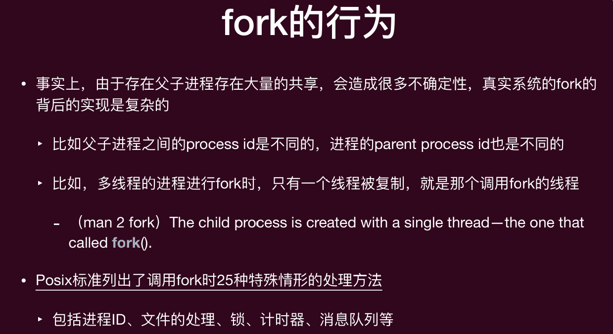
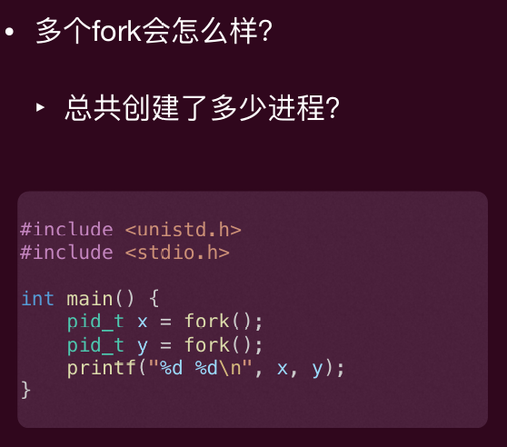
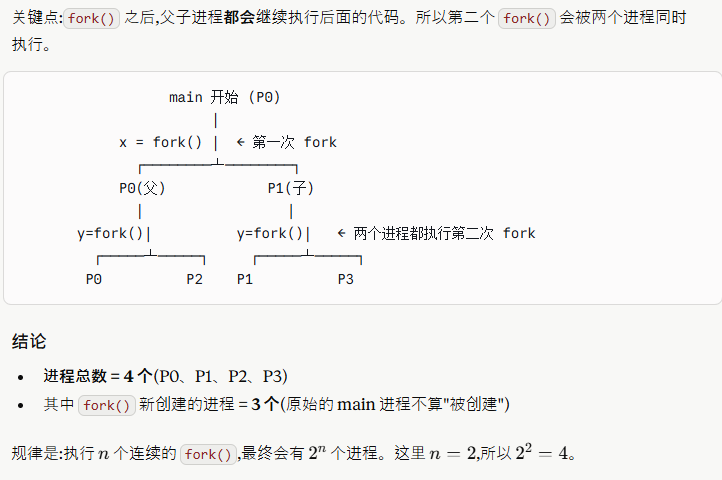
fork 会连缓冲区一起复制,而缓冲方式不同导致结果不同
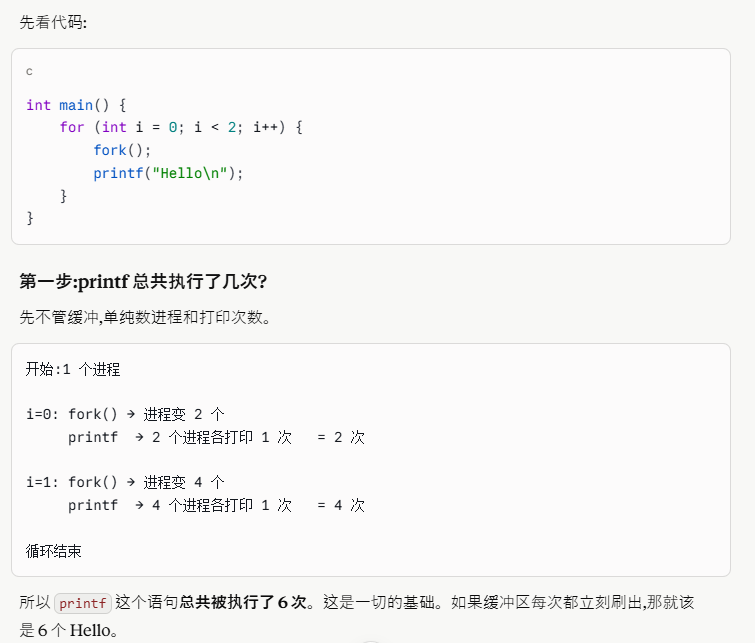
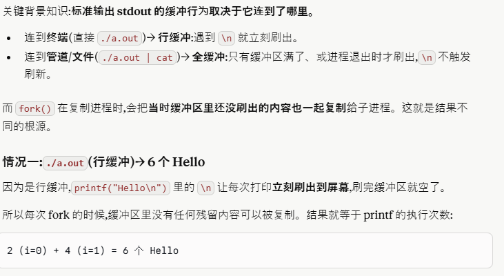
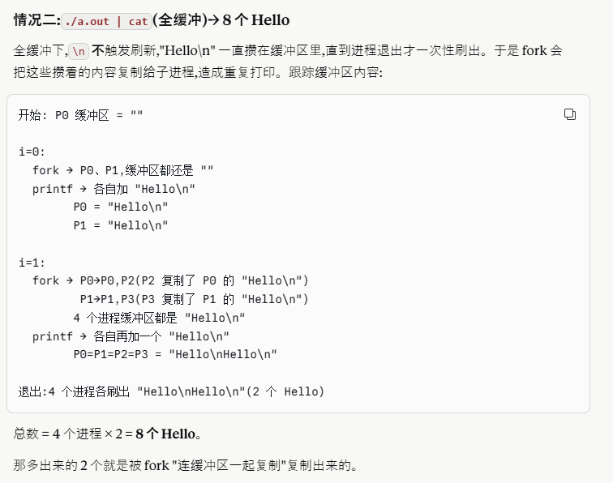
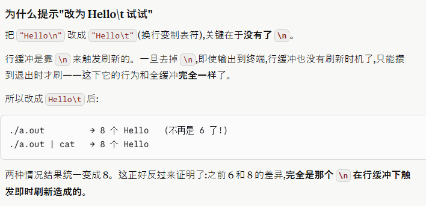
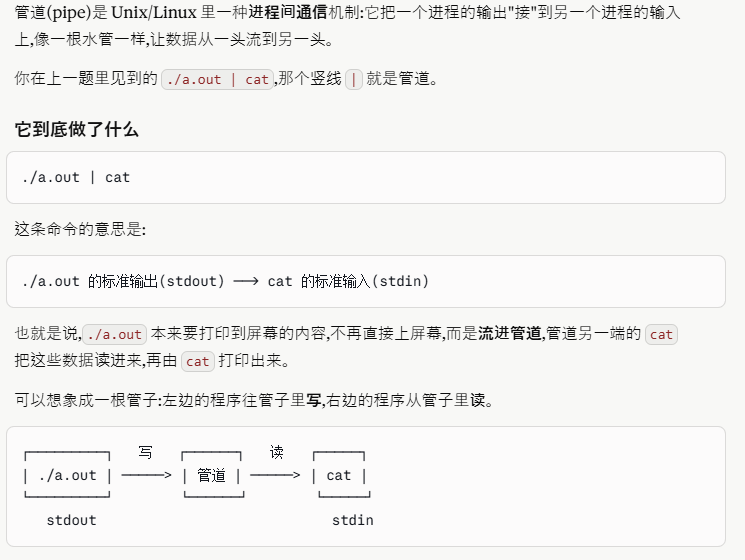
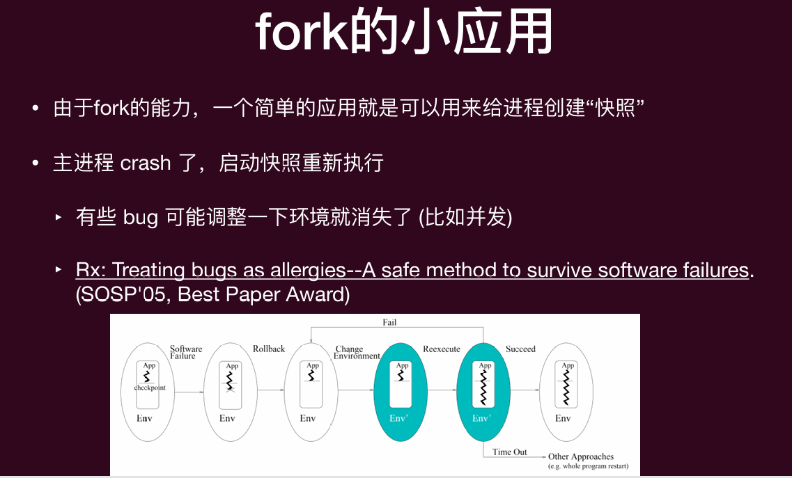

### execve
很多时候，父子进程并不是同样的逻辑，子进程有自己的逻辑，比如shell创建进程并不是为了子进程来作为一个shell，而是“加载”某个可执行文件进行运行，变成另一个程序
```c
#include <unistd.h>  
int execve(const char *pathname, char *const argv[], char *const envp[]);
```
execve系统调用会用pathname指定的可执行文件替换当前进程的内存空间（代码段、数据段、堆栈等），并从该可执行文件的入口点开始执行
- pathname: 可执行文件的路径
- argv: 可执行文件的命令行参数
- envp: 可执行文件的环境变量

execve语义：将当前进程重置成一个可执行文件描述状态机的初始状态
- 加载pathname指定的可执行文件（数据段、代码段）
- 重新初始化堆和栈
- PCB中相应的memory mappings也会改变
- 将PC寄存器设置到可执行文件代码段定义的入口点，该入口点最终会调用main函数
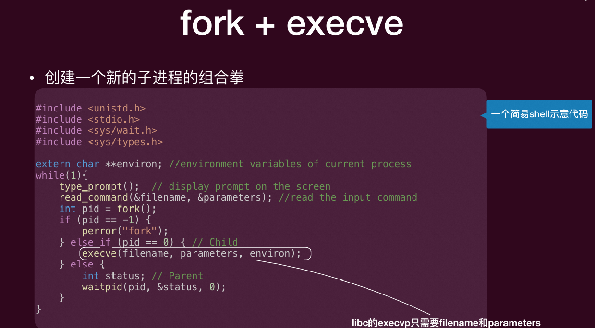

execve不会改变PCB中的文件描述符，那些打开的文件描述符还会保持打开
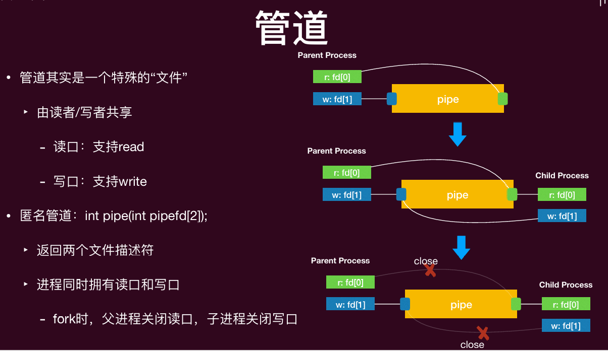
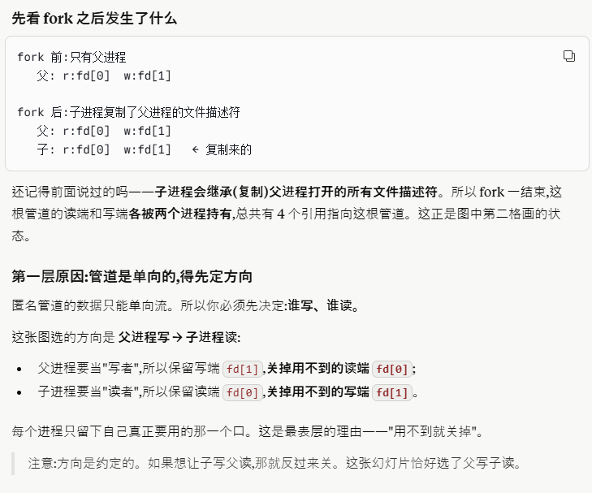
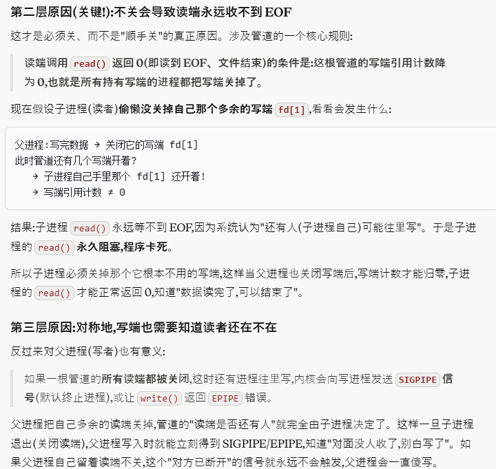

所以在这个pipe创建之后，把父进程的读端关闭，子进程的写端关闭

但如果是父进程打开了一个普通文件，在地址空间里有一个相应的file变量索引，但你的子进程重置了整个地址空间，因此那个文件描述符对应的file变量也没有了，此时你无法close这个文件了！
这会造成资源的泄漏，当然这些资源（PCB）都会随着进程的终止而最终被回收，但在运行期间还是有一些资源的损耗
"文件句柄"(file handle)是一个泛指的概念:它是程序用来"抓住"一个已打开文件的凭据
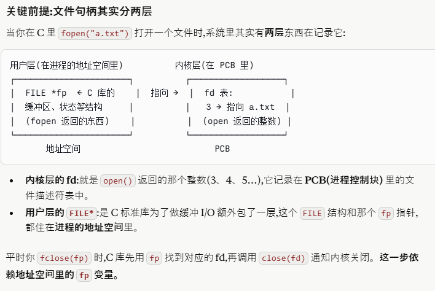
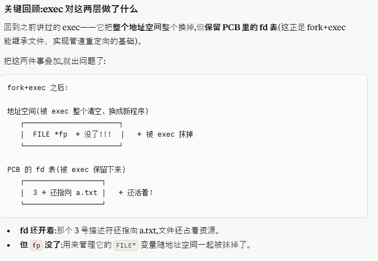
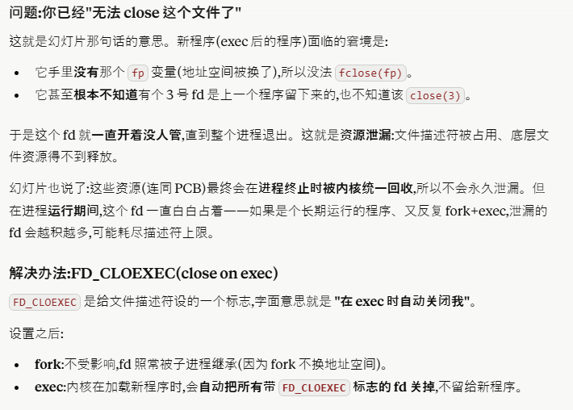
```c
// 方式一:open 时直接带上 O_CLOEXEC 标志
int fd = open("a.txt", O_RDONLY | O_CLOEXEC);

// 方式二:打开后用 fcntl 设置
fcntl(fd, F_SETFD, FD_CLOEXEC);
```

环境变量：应用程序执行的环境，可以使用env命令查看当前环境变量
export可以给当前shell设置环境变量，export VAR=value

**写时复制(Copy-On-Write, COW)**
fork后面往往跟着execve来加载子进程，那么fork的过程还必要吗？
早期的操作系统在fork时会复制父进程的整个地址空间，**效率非常低下**
- 有些内存是只读的(read-only)，⽐如代码段、共享代码库(libc)，这些没必要复制
- 此外，⽴即执行execve会加载新的可执行文件，重置地址空间，因此，之前的内存拷贝完全没有意义

对于那些可以改变的内存，人们给出了一个聪明的设计：写时拷贝
- 即两个进程共享**同一份物理内存**
- 只有当一个进程尝试去写这个物理内存时才会真正在物理内存中复制一份副本用来给这个进程去写

问题是，写自己的内存是一个“用户态”事件，内核又怎么知道呢？
标记这个共享的内存为“只读”，一旦发生“写”操作会发生权限错误**陷入内核**，操作系统获知这是一个**COW事件**，复制内存！
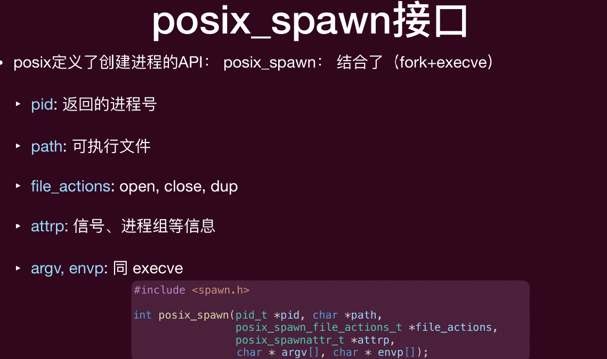

### exit
除了创建进程外，进程也需要能够终止：清理其所占内存空间（包括代码区、堆、栈），这个过程需要系统调用来做
Linux中，进程一般有5种退出机制

#### exit()
```c
void exit(int status);
```
是C标准库函数，也是最常用的进程退出函数
- 调用atexit()注册的函数；使得我们可以指定在程序终止时执行自己的清理动作。(atexit()最多可以注册32个函数，调用顺序与注册顺序相反)
- 关闭所有打开的流(stdio)，这将导致写所有被缓冲的输出
- 移除所有的临时文件
- 最后调用_exit()函数终止进程
所以exit函数永远不会返回，而是直接终止进程

#### return from main()
从main函数返回是最常见的终止方式
main函数的返回值和调用exit()的传入参数int status是同样的语义
0是函数是符合预期终止，非0是函数出现了错误终止
在很多编译器中，用下面的方式实现
```c
void _start(void) { 
  /* ... */ 
exit(main(argc, argv)); 
}
```
因为_start 才是程序真正的入口点(entry point)，而不是main。_start 在做完一些准备工作后,调用你的 main 函数,并把命令行参数 argc、argv 传进去。运行完之后，拿到main的返回值，调用exit来终止进程

#### _exit()
- 所有属于这个进程的文件描述符都会被关闭
- 所有该进程的子进程都会被init进程接管
- 向该进程的父进程发送SIGCHLD信号，通知该父进程其已经终止
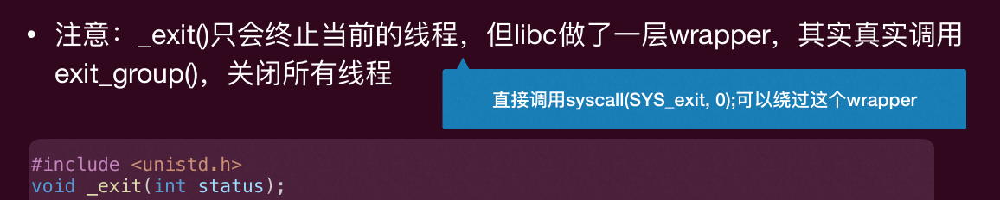

#### 异常退出
abort()系统调用会导致系统异常终止
- atexit注册的函数不会调用
- io流不会关闭
- 其行为就是产生一个SIGABRT信号发送给调用abort()的进程，然后该进程就会异常终止
- 不会被ignore掉

## 信号(Signal)
Linux操作系统提供了一种可以通知进程发生了某个事件的机制：信号（Signal），注：**不要和并发的singal原语混淆，也不要和“信号量”（Semaphore）混淆**
其本质上是对中断的模拟, 命令kill -l 可以查看有多少信号， man 7 signal查看信号的具体信息
发生某个中断事件之后，用户程序也想获知并处理（而不只是在内核态由操作系统透明的处理）

```c
#include <signal.h>
signal(SIGNAL_NUMBER, handler);
```

signal函数可以注册信号处理函数，只要传入相应的信号和函数名即可
handler设为SIG_IGN时表示忽略这个信号，比如signal(SIGCHLD,SIG_IGN) 就表示忽略掉子进程的终止信号，此时子进程结束会直接被内核完全清除（而不必先变为僵尸进程，然后再被回收）
handler设为SIG_DFL时表示采用linux默认的处理函数

有了信号机制，可以完成很多异步的操作：
- 比如signal(SIGCHLD， handler)，可以在handler里进行wait，而不是在main函数里wait/waitpid从而阻塞父进程
- 比如signal(SIGIO, handler)可以不用等待I/O完成，可以先做其他事情，如果文件描述符所指向的数据传输完成，会产生SIGIO的事件，就可以通过回调函数handler来处理